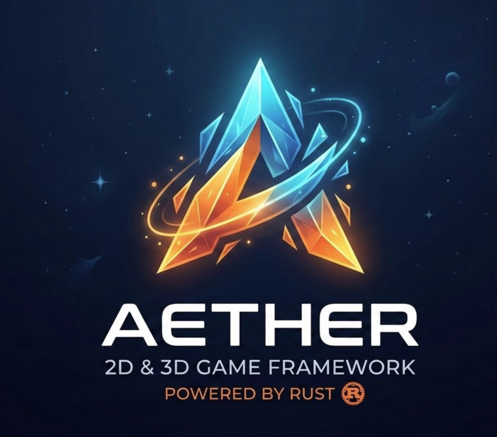
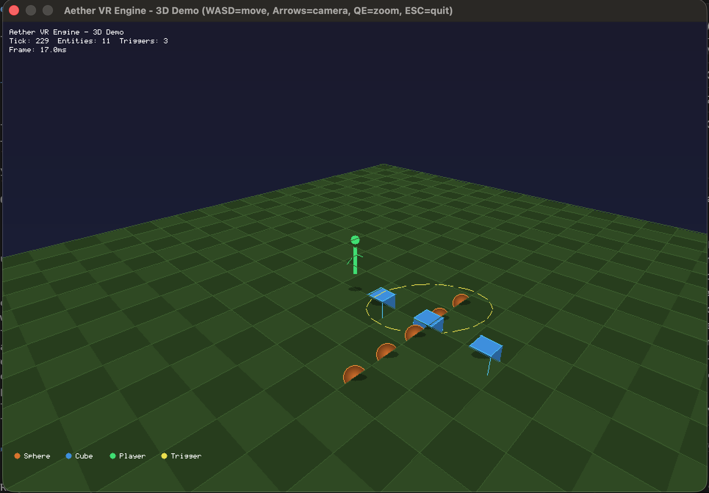

<p align="center">
  
</p>

<h1 align="center">Aether</h1>

[](LICENSE)
[](https://www.rust-lang.org/)
[]()
[]()

A modular, open-source VR engine built in Rust for creating immersive virtual worlds.

> **Status:** Early development (v0.1.0). APIs are unstable and subject to change.

## Why Aether?

Building virtual worlds today means stitching together dozens of disparate libraries, dealing with C++ interop, and fighting runtime crashes. Aether takes a different approach:

- **Rust-native from day one** — Memory safety, fearless concurrency, and zero-cost abstractions without sacrificing performance.
- **Modular by design** — 26 crates, each a self-contained subsystem. Use only what you need, swap out what you don't.
- **Built for multiplayer** — Networking, state synchronization, and server-side validation are first-class citizens.
- **Social VR focus** — Avatars, social graphs, economies, and user-generated content are part of the core engine, not plugins.

## Architecture

Aether is organized as a Rust workspace with 26 crates spanning six domains:

```
aether/
├── crates/
│   ├── Core Engine ──── aether-ecs, aether-physics, aether-renderer, aether-audio, aether-input
│   ├── Scripting ────── aether-scripting
│   ├── World ────────── aether-world-runtime, aether-network, aether-zoning, aether-federation
│   ├── Social ───────── aether-avatar, aether-social, aether-economy, aether-ugc
│   ├── Platform ─────── aether-gateway, aether-registry, aether-asset-pipeline, aether-platform
│   └── Safety ───────── aether-security, aether-trust-safety, aether-compliance,
│                        aether-content-moderation, aether-deploy, aether-persistence
├── examples/
│   ├── 3d-demo ──────── Interactive 3D scene with software renderer
│   ├── vr-emulator-demo  PC-based VR emulator with stereo rendering
│   └── quest-debug ───── Quest 3 debug overlay (in-VR metrics panel)
└── docs/design/ ─────── 64 design documents
```

## Features

### Core Engine

| Crate | Description |
|-------|-------------|
| **aether-ecs** | Archetype-based ECS with parallel queries, event bus, and network-aware components |
| **aether-physics** | Rapier3D integration with rigid bodies, joints, triggers, collision layers, and VR interaction physics (grab, throw, hand collision, haptics) |
| **aether-renderer** | Rendering pipeline with GPU scheduling, foveated rendering, frame budgeting, and a software rasterizer for prototyping |
| **aether-audio** | Spatial audio with HRTF, Opus codec, acoustic zones, attenuation models, and audio capture |
| **aether-input** | VR input abstraction with OpenXR session/tracking/haptics, desktop fallback, locomotion comfort policies, and action mapping |

### Scripting

| Crate | Description |
|-------|-------------|
| **aether-scripting** | WASM script runtime with per-script resource caps, rate limiting, priority scheduling, and world-level orchestration |
| **aether-creator-studio** | Creator tools: terrain/prop/lighting editors, undo/redo, and a visual scripting editor with node graph, type system, validation, and IR compiler |

### World & Networking

| Crate | Description |
|-------|-------------|
| **aether-world-runtime** | World lifecycle, chunk-based streaming with LOD, manifest loading, tick scheduling, input buffering, and client-side prediction |
| **aether-network** | QUIC transport, delta compression, interest management, voice channels, client-side prediction, and server reconciliation |
| **aether-zoning** | Spatial load balancing with zone split/merge, cross-zone ghost entities, portal system with aether:// URLs, and session handoff |
| **aether-federation** | Cross-instance interoperability with handshake protocol, server registry, asset transfer, and federated auth |

### Social & Economy

| Crate | Description |
|-------|-------------|
| **aether-avatar** | Avatar system with skeletal animation, FABRIK IK, blend shapes, lip-sync, LOD, GPU skinning, and performance rating |
| **aether-social** | Social graph with friends, blocking, groups, presence, real-time chat, and horizontal sharding |
| **aether-economy** | Double-entry ledger, wallet management, fraud detection, transaction processing, and settlement/payout |
| **aether-ugc** | User-generated content pipeline: upload, scanning, approval workflow, artifact storage, and moderation integration |
| **aether-asset-pipeline** | Asset import (glTF), processing, compression, hashing, and bundle packaging |

### Platform & Safety

| Crate | Description |
|-------|-------------|
| **aether-gateway** | API gateway with auth middleware, rate limiting, geo routing, health checks, and voice relay |
| **aether-registry** | World discovery, search, ranking, matchmaking, analytics, and portal registration |
| **aether-security** | Anti-cheat (movement validation, teleport detection, hit validation), JWT auth, encryption, and action rate limiting |
| **aether-trust-safety** | Runtime safety controls: personal space bubbles, safety zones, visibility filtering, parental controls, and block enforcement |
| **aether-content-moderation** | Automated scanning (text/image/WASM), human review queue, severity classification, and report system |
| **aether-compliance** | GDPR data deletion/export, pseudonymization, retention scheduling, and legal hold management |
| **aether-platform** | Multi-platform client support with capability detection, quality profiles, and platform-specific builds |
| **aether-build** | Cross-platform build system — Quest 3 APK packaging, Android NDK toolchain, `aether build` CLI command |
| **aether-openxr** | OpenXR runtime integration — instance, session, swapchain, input actions, frame loop |
| **aether-vr-overlay** | Platform-agnostic VR debug overlay — bitmap font renderer, real-time metrics panel (FPS, tracking, controllers) |
| **aether-deploy** | Kubernetes deployment, autoscaling, health probes, failover, and region-aware topology |
| **aether-persistence** | WAL-backed durable state with PostgreSQL/Redis/NATS backends and ephemeral checkpointing |

## Quick Start

### Option A: Pre-built Binaries (no Rust required)

Download the latest release for your platform from [GitHub Releases](../../releases), or install with:

```bash
curl -fsSL https://raw.githubusercontent.com/<org>/aether/main/install.sh | sh
```

Then run:

```bash
aether run --list        # See available examples
aether run 3d-demo       # Launch the 3D demo
```

### Option B: Build from Source

**Prerequisites:** [Rust](https://www.rust-lang.org/tools/install) (stable toolchain)

```bash
cargo build
cargo test
```

### Quest 3 Development (Optional)

To build and deploy to Meta Quest 3, install the Android SDK command-line tools — **Android Studio is not required**.

**Prerequisites:**

| Tool | Install | Purpose |
|------|---------|---------|
| Android SDK command-line tools | `brew install --cask android-commandlinetools` | sdkmanager CLI |
| SDK build-tools | `sdkmanager "build-tools;34.0.0"` | aapt2, zipalign, apksigner |
| SDK platform-tools | `sdkmanager "platform-tools"` | adb (device install) |
| SDK platform | `sdkmanager "platforms;android-32"` | android.jar for manifest |
| Android NDK | `sdkmanager "ndk;27.0.12077973"` | clang cross-compiler |
| Rust Android target | `rustup target add aarch64-linux-android` | Cross-compilation |
| JDK (for debug signing) | `brew install openjdk` | keytool (debug keystore) |

**Environment variables** (add to `~/.zshrc`):

```bash
# If installed via Homebrew:
export ANDROID_HOME="/opt/homebrew/share/android-commandlinetools"
# If installed via Android Studio:
# export ANDROID_HOME="$HOME/Library/Android/sdk"
export ANDROID_NDK_HOME="$ANDROID_HOME/ndk/27.0.12077973"
```

**Build and deploy:**

```bash
aether build --target quest              # Build debug APK
aether build --target quest --release    # Build release APK
aether build --target quest --install    # Build + install to connected Quest
```

Output: `target/aether-build/quest/<app-name>-debug.apk`

### Examples

#### 3D Demo

Interactive scene with software renderer, physics, and keyboard controls:

```bash
aether run 3d-demo            # using pre-built binary
cargo run -p aether-3d-demo   # from source
```

<p align="center">
  
</p>

| Key | Action |
|-----|--------|
| `W` `A` `S` `D` | Move |
| Arrow keys | Orbit camera |
| `Q` / `E` | Zoom in / out |
| `ESC` | Quit |

#### Visual Scripting Editor

A web-based node editor for building game logic visually:

```bash
aether run visual-editor                    # using pre-built binary
cargo run -p aether-visual-scripting-demo   # from source
```

The visual editor supports 33 node types across 6 categories (events, flow control, actions, math, logic, variables), type-safe connections, graph validation, cycle detection, and compilation to an IR instruction set. Drag nodes from the sidebar, connect ports, and click Compile to see the generated output.

#### GPU Rendering Demo

PBR scene rendered with wgpu (shadows, MSAA, metallic-roughness materials):

```bash
cargo run -p gpu-demo
```

#### Multiplayer Demo

Server-authoritative multiplayer with QUIC transport and avatar sync:

```bash
cargo run -p multiplayer-demo --bin mp-server   # Terminal 1: start server
cargo run -p multiplayer-demo --bin mp-client   # Terminal 2: connect client
```

#### Quest 3 Debug Overlay

Live debug panel rendered inside VR on Meta Quest 3 — shows FPS, head tracking, controller positions, and session state:

```bash
aether build --target quest --install   # Build APK + deploy to Quest
```

Toggle the debug panel with the menu button on the left controller. The panel floats 1.5m in front of you as a 0.8m x 0.4m billboard.

#### Single-World Integrated Demo

The Phase 1 milestone demo — ties together GPU rendering, physics, multiplayer networking, visual scripting, and asset hot-reloading through the ECS:

```bash
cargo run -p single-world-demo
```

| Key | Action |
|-----|--------|
| `W` `A` `S` `D` | Move camera |
| Arrow keys | Rotate camera |
| `Space` / `Shift` | Move up / down |
| `ESC` | Quit |

## Documentation

Design documentation lives in [`docs/design/`](docs/design/) with 62 documents covering architecture decisions, data models, and implementation plans for every subsystem. Key documents:

- [ECS Core Architecture](docs/design/ecs-core-architecture.md)
- [Visual Scripting Editor](docs/design/visual-scripting-editor.md)
- [Multiplayer Runtime](docs/design/multiplayer-runtime.md)
- [WASM Scripting Runtime](docs/design/wasm-scripting-runtime-implementation.md)
- [Federation Protocol](docs/design/federation-protocol-implementation.md)
- [Portal System](docs/design/portal-system.md)

## Roadmap

- [x] Archetype-based ECS with parallel queries
- [x] Rapier3D physics integration
- [x] Software renderer and interactive 3D demo
- [x] Input handling with OpenXR integration
- [x] Visual scripting editor (node graph + IR compiler)
- [x] VR interaction physics (grab, throw, haptics)
- [x] Avatar rendering pipeline (skinning, blend shapes, LOD)
- [x] Anti-cheat server-side validation
- [x] World chunk streaming system
- [x] Portal system with cross-world navigation
- [x] Server-side WASM runtime with hot-reload
- [x] GPU-accelerated rendering (wgpu)
- [x] Networked multiplayer prototype
- [x] Visual script runtime execution
- [x] Asset hot-reloading
- [x] Quest 3 build pipeline (`aether build --target quest`)
- [x] VR debug overlay (in-headset metrics panel)
- [ ] First public release

## Contributing

Contributions are welcome! Whether it's a bug report, feature request, or pull request — all forms of participation are appreciated.

Please see [CONTRIBUTING.md](CONTRIBUTING.md) for development setup, coding guidelines, and the PR process.

## Community

- **Issues** — [GitHub Issues](../../issues) for bug reports and feature requests
- **Discussions** — [GitHub Discussions](../../discussions) for questions and ideas

## License

Aether is licensed under the [Apache License, Version 2.0](LICENSE).

Unless you explicitly state otherwise, any contribution intentionally submitted for inclusion in this project by you shall be licensed under Apache-2.0, without any additional terms or conditions.
