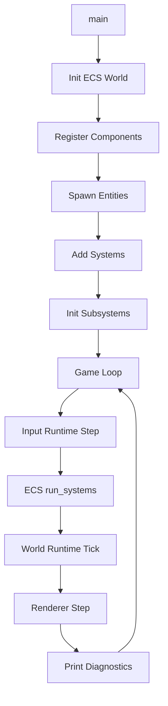

# 3D Example - Design Document

## Background

Aether is a modular VR engine with ECS, physics, renderer, input, and world runtime subsystems. This document describes the `examples/3d-demo` binary, which demonstrates how these systems integrate end-to-end.

## Why

Provide a concrete, working 3D example that showcases the engine's core APIs: entity spawning, component management, system scheduling, physics simulation, renderer frame stepping, input processing, and world lifecycle management.

## What

A standalone binary example (`examples/3d-demo`) that simulates a 3D VR world with:

- A ground plane (static rigid body)
- Dynamic objects (spheres, cubes) affected by gravity
- A player avatar with input handling
- Trigger zones that detect entity enter/exit
- Renderer frame stepping with LOD and batching
- World runtime boot and tick loop
- System schedule with proper stage ordering

## How

### Architecture

### Systems (by stage)

| Stage | System | Description |
|-------|--------|-------------|
| Input | `input_system` | Polls input runtime for player intents |
| PrePhysics | `gravity_system` | Applies gravity to dynamic bodies |
| Physics | `physics_step_system` | Integrates velocity into position |
| PostPhysics | `trigger_system` | Detects trigger zone enter/exit events |
| PreRender | `lod_system` | Selects LOD levels based on camera distance |
| Render | `render_submit_system` | Submits batch requests to renderer |
| NetworkSync | `network_sync_system` | Logs replicated component state |

### Entity Setup

- **Ground**: Transform + RigidBodyComponent(fixed) + ColliderComponent(cuboid) + CollisionLayers(terrain)
- **Spheres**: Transform + Velocity + RigidBodyComponent(dynamic) + ColliderComponent(sphere) + CollisionLayers(prop)
- **Cubes**: Transform + Velocity + RigidBodyComponent(dynamic) + ColliderComponent(cuboid) + CollisionLayers(prop)
- **Player**: Transform + Velocity + NetworkIdentity + ColliderComponent(capsule) + CollisionLayers(player)
- **TriggerZone**: Transform + ColliderComponent(sphere).sensor() + CollisionLayers(trigger)

### Dependencies

- `aether-ecs` - ECS core
- `aether-physics` - Transform, Velocity, RigidBody, Collider, CollisionLayers, Triggers
- `aether-renderer` - FrameRuntime, batching, streaming
- `aether-input` - InputRuntime, OpenXrAdapter
- `aether-world-runtime` - WorldRuntime, manifest, lifecycle
