# Aether Engine Design Document

**Project**: Aether — An Open, Massively Scalable Virtual Reality Engine
**Version**: 0.1 (Draft)
**Date**: 2026-03-07
**Status**: Design Phase

---

## Table of Contents

1. [Vision & Goals](#1-vision--goals)
2. [Architecture Overview](#2-architecture-overview)
3. [Core Engine Subsystems](#3-core-engine-subsystems)
4. [Backend Infrastructure](#4-backend-infrastructure)
5. [Content Creation Pipeline](#5-content-creation-pipeline)
6. [Security & Trust](#6-security--trust)
7. [Performance Targets](#7-performance-targets)
8. [Technology Stack](#8-technology-stack)
9. [Development Roadmap](#9-development-roadmap)

---

## 1. Vision & Goals

### 1.1 Vision

Build an open, massively scalable virtual reality engine that enables the creation of a persistent, interconnected universe of user-generated worlds — a platform where millions of people can simultaneously inhabit, create, socialize, and build economies within shared virtual spaces.

Inspired by the OASIS from *Ready Player One*, Aether is not just a game engine — it is a **platform engine** designed from the ground up for:

- **Massive concurrency**: Millions of simultaneous users across interconnected worlds
- **Full immersion**: Stereo rendering, spatial audio, haptic feedback, body tracking
- **User-generated content**: Anyone can create worlds, assets, and experiences
- **Persistent universe**: A living world that exists and evolves whether you're logged in or not
- **Open ecosystem**: Open protocols, interoperable standards, extensible architecture

### 1.2 Design Principles

| Principle | Description |
|---|---|
| **Performance First** | Every architectural decision is measured against VR's unforgiving latency budget (< 20ms motion-to-photon) |
| **Data-Oriented Design** | Cache-friendly, parallelizable data layouts using ECS architecture |
| **Server-Authoritative** | All game state is validated server-side to prevent cheating at scale |
| **Sandboxed Extensibility** | User code runs in WASM sandboxes with strict resource limits |
| **Progressive Fidelity** | Graceful degradation from high-end PC VR to standalone headsets to flat-screen |
| **Federated by Design** | Worlds can be self-hosted or platform-hosted; interoperability is a protocol, not a product (see [6.4 Federation Model](#64-federation-model) for scope and limitations) |

### 1.3 Non-Goals (v1)

- Blockchain/NFT-based economy (we use a centralized auditable ledger)
- Brain-computer interface support
- Full haptic body suit integration (will support basic haptic controllers)
- AR/MR passthrough mode (future version)

---

## 2. Architecture Overview

### 2.1 High-Level Architecture

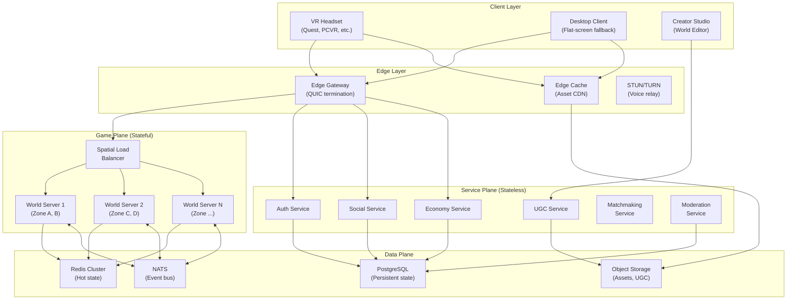

### 2.2 Client Architecture

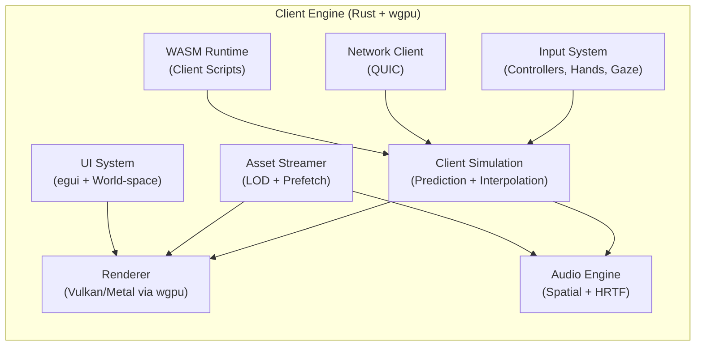

### 2.3 World Server Architecture

Each world is divided into spatial zones. Each zone is managed by a **World Server** process. Zones can be dynamically split or merged based on player density.

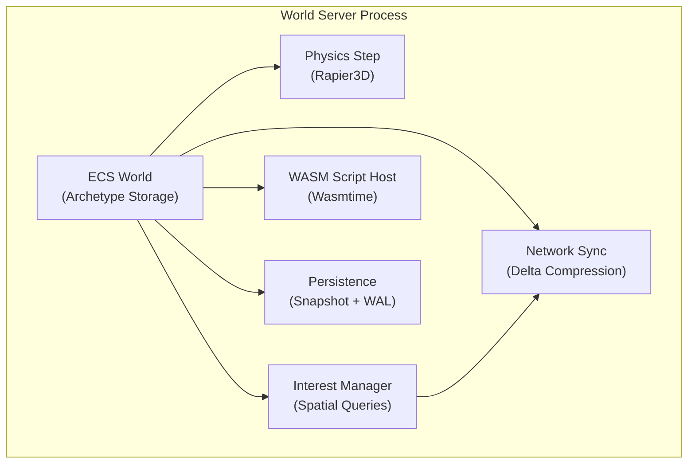

---

## 3. Core Engine Subsystems

### 3.1 Entity Component System (ECS)

The ECS is the backbone of Aether. All game objects — avatars, props, terrain, particles, UI elements — are entities composed of data components processed by systems.

**Architecture**: Archetype-based ECS (inspired by Bevy ECS / flecs)

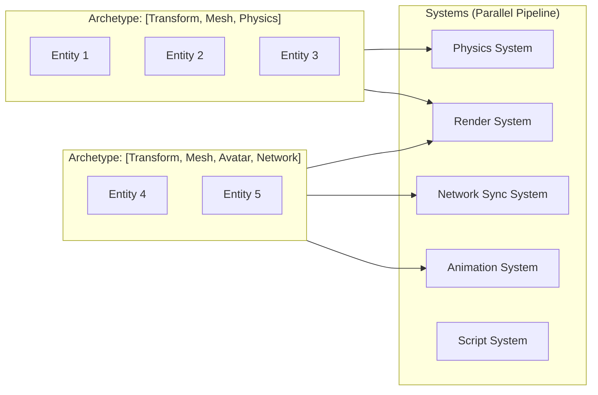

**Key Components**:

| Component | Description | Replication |
|---|---|---|
| `Transform` | Position, rotation, scale | Replicated |
| `RigidBody` | Physics body type, velocity, forces | Server-only |
| `MeshRenderer` | Mesh handle, material, LOD level | Replicated |
| `Avatar` | Player ID, appearance, animation state | Replicated |
| `NetworkIdentity` | Entity ownership, authority, sync priority | Replicated |
| `Collider` | Shape, layer, trigger flag | Server-only |
| `AudioSource` | Clip, volume, spatial params | Replicated |
| `ScriptHost` | WASM module handle, state | Server-only |
| `InterestGroup` | Visibility group, priority | Server-only |

**System Scheduling**: Systems are organized into stages with explicit dependency graphs, enabling maximum parallelism:

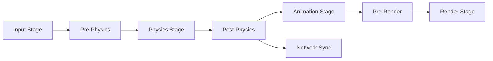

### 3.2 Rendering Engine

Aether uses a **Forward+ rendering pipeline** optimized for VR, built on `wgpu` (abstracting Vulkan, Metal, DX12).

#### 3.2.1 VR Rendering Pipeline

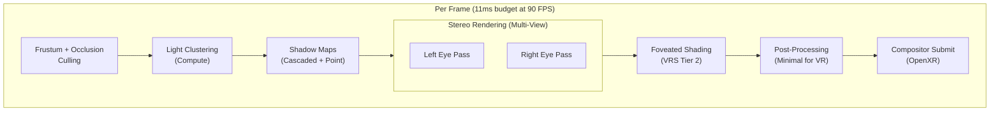

#### 3.2.2 Key Rendering Features

| Feature | Technique | Purpose |
|---|---|---|
| **Stereo Rendering** | Multi-view extensions (VK_KHR_multiview) | Single draw call for both eyes |
| **Foveated Rendering** | Variable Rate Shading (VRS Tier 2) + eye tracking | 40-60% pixel shading reduction |
| **LOD System** | Automatic mesh LOD (Meshoptimizer) + impostor billboards | Render 1000+ avatars |
| **Global Illumination** | Baked light probes + screen-space GI | Quality lighting at VR framerates |
| **Anti-Aliasing** | MSAA 4x (primary) + TAA (optional) | Reduce shimmer in VR |
| **Async Compute** | Shadow maps + light clustering on async queue | Fill GPU bubbles |
| **Draw Call Batching** | GPU-driven rendering with indirect draws | Minimize CPU overhead |
| **Asset Streaming** | Virtual texturing + mesh streaming | Infinite world detail |

#### 3.2.3 Avatar Rendering Pipeline

Avatars are the most important visual element. A dedicated pipeline handles avatar-specific rendering:

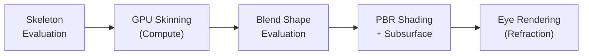

- **Near avatars** (< 5m): Full mesh, blend shapes, subsurface scattering, eye refraction
- **Mid avatars** (5-30m): Simplified mesh, no blend shapes, basic PBR
- **Far avatars** (30-100m): Billboard impostors with baked animation
- **Distant avatars** (100m+): Dot indicators or hidden

### 3.3 Physics Engine

Aether integrates **Rapier3D** (Rust) as the physics backend, with a configurable abstraction layer allowing per-world physics customization.

#### 3.3.1 Physics Configuration Per World

Each world can define its own physics profile:

```rust
struct WorldPhysicsConfig {
    gravity: Vec3,              // Default: (0, -9.81, 0)
    time_step: f32,             // Default: 1/60
    max_velocity: f32,          // Clamp for stability
    collision_layers: u32,      // Custom collision matrix
    enable_ccd: bool,           // Continuous collision detection
    solver_iterations: u8,      // Quality vs performance
}
```

- **Earth-like**: Standard gravity, realistic friction
- **Space**: Zero-G, momentum-based movement
- **Underwater**: Buoyancy, drag forces
- **Fantasy**: Low gravity, custom forces
- **Puzzle**: Grid-snapped physics, deterministic mode

#### 3.3.2 VR Interaction Physics

Special physics subsystem for hand interactions:

- **Grab system**: Configurable joint-based grabbing (fixed, spring, hinge)
- **Hand collision**: Continuous collision detection for fast hand movements
- **Haptic feedback**: Physics events trigger controller haptics (collision force → vibration intensity)
- **Throw detection**: Velocity tracking over last N frames for natural throwing

### 3.4 Audio Engine

Fully spatial audio engine with real-time acoustic simulation.

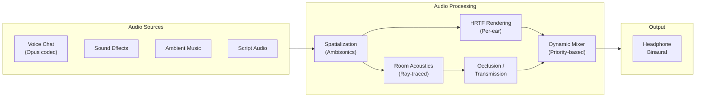

**Key Features**:
- **Ambisonics** (3rd order) for spatial encoding/decoding
- **HRTF** with personalization (head size, ear shape presets)
- **Acoustic raytracing** for early reflections (simplified geometry)
- **Voice zones**: Per-area voice channels (room-based, proximity-based, broadcast)
- **Audio LOD**: Full processing for near sources, simplified for distant
- **Lip sync**: Real-time phoneme extraction from voice for avatar mouth animation

### 3.5 Networking System

The networking system is the most critical and complex subsystem, designed for OASIS-scale concurrency.

#### 3.5.1 Protocol Stack

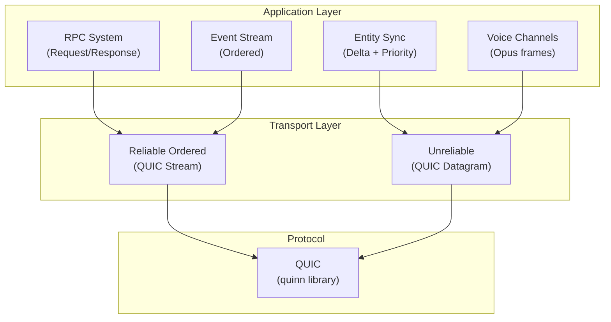

**Transport semantics**:

- **Reliable Ordered (QUIC Streams)**: Used for RPCs and event streams where delivery and order matter. Each logical channel maps to a separate QUIC stream to avoid head-of-line blocking.
- **Unreliable (QUIC Datagrams)**: Used for entity state sync and voice. Stale data is worse than missing data — late position updates or voice frames are discarded, not retransmitted.

**Voice QoS**: Voice uses unreliable QUIC datagrams (not streams) because retransmitting a stale audio frame adds latency without benefit. To handle packet loss, Opus is configured with in-band FEC (Forward Error Correction) and the client uses a jitter buffer (default 40ms, adaptive 20-80ms). At typical 1-3% packet loss, FEC recovers most frames without retransmission. Above 10% loss, the system gracefully degrades (lower bitrate, wider FEC window) rather than introducing retransmission delay.

#### 3.5.2 Interest Management

Not every player needs updates about every entity. The **Interest Manager** determines what each client sees:

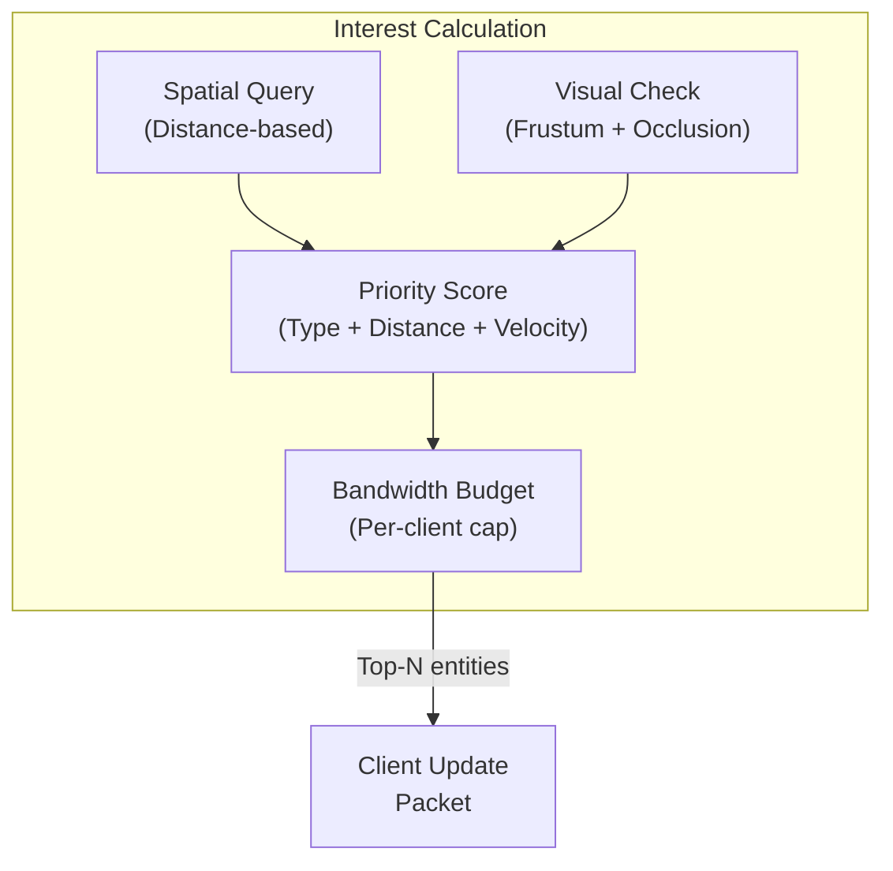

**Interest Tiers**:

| Tier | Range | Update Rate | Data |
|---|---|---|---|
| **Critical** | 0-5m | 60 Hz | Full state, inputs |
| **High** | 5-20m | 30 Hz | Position, rotation, animation |
| **Medium** | 20-50m | 15 Hz | Position, rotation |
| **Low** | 50-200m | 5 Hz | Position only |
| **Dormant** | 200m+ | 1 Hz | Existence only |

#### 3.5.3 State Synchronization

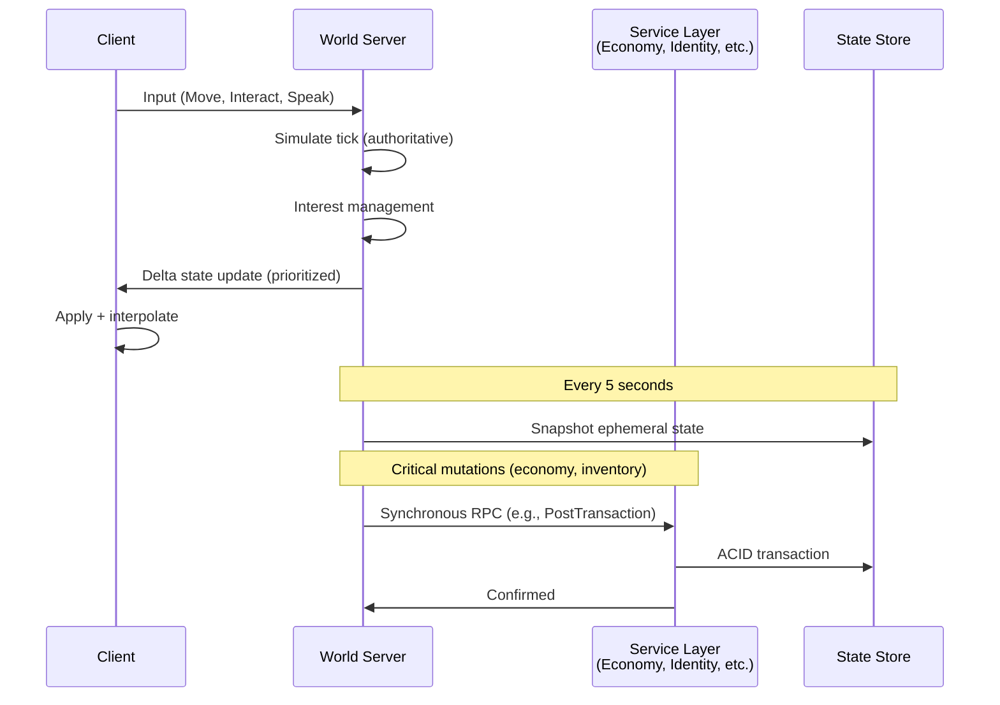

- **Client-side prediction**: Client predicts local player movement; server reconciles
- **Entity interpolation**: Remote entities are rendered at `t - buffer_time` for smooth display
- **Delta compression**: Only changed component fields are sent, using xor-based diffing
- **Quantization**: Positions quantized to 1mm precision, rotations to smallest-3 quaternion (10 bits per component)

#### 3.5.3.1 Persistence Consistency Model

State is classified into two categories with different durability guarantees:

**Critical state** (transactionally persisted, zero tolerance for loss):
- Economy: currency transfers, purchases, trades — routed through Economy Service as synchronous RPCs with ACID transactions
- Inventory: item acquisition, destruction, trade — same transactional path
- Identity: avatar changes, social actions (friend/block) — via Identity/Social Service
- World ownership: permission changes, world settings — via World Registry Service

Critical mutations **never** flow through the snapshot path. They are externalized to the responsible service via RPC at the moment they occur, and the world server does not confirm the action to the client until the service acknowledges persistence.

**Ephemeral state** (snapshot-persisted, tolerates bounded loss):
- Entity positions, rotations, velocities
- World-script key-value storage (non-economic)
- Prop placement, terrain modifications
- Player session state (current zone, last position)

Ephemeral state is captured in periodic snapshots (default every 5s). On crash, up to 5 seconds of ephemeral state may be lost. This is acceptable — players reappear at their last snapshot position, and non-critical world state is reconstructed from the most recent snapshot.

**Write-Ahead Log (WAL)** for high-value ephemeral state: World creators can flag specific script storage keys as `durable`, which causes writes to be appended to a WAL that is fsynced before acknowledgment. On crash recovery, the WAL is replayed on top of the last snapshot, reducing effective loss to near-zero for flagged state.

**WAL storage on Kubernetes**: World server pods that host worlds with `durable` script state are scheduled on nodes with **PersistentVolumeClaims (PVCs)** backed by network-attached block storage (e.g., EBS, Persistent Disk, Azure Disk). The WAL is written to the PVC, not to the pod's ephemeral filesystem. This ensures WAL survives pod restarts and node failures. The PVC is mounted at `/data/wal/` and is provisioned via a `StatefulSet` (not a `Deployment`) so that each world server pod has a stable identity and persistent storage binding. On pod reschedule, the replacement pod reattaches the same PVC and replays the WAL.

Worlds without `durable` script state run on stateless `Deployment` pods (no PVC required), keeping the common case lightweight. The Session Manager routes worlds to StatefulSet pods or Deployment pods based on their manifest's durability requirements.

#### 3.5.4 Spatial Load Balancing

When a zone becomes too crowded, it splits dynamically:

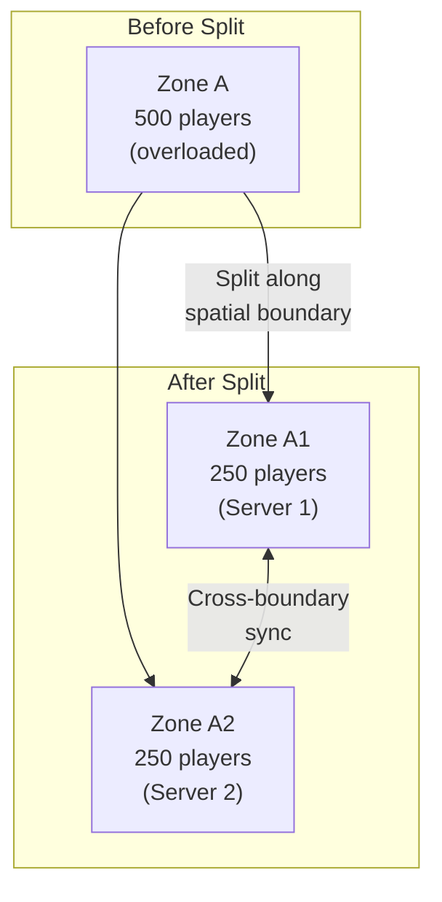

- Zones split using k-d tree partitioning along the axis of greatest player spread
- Zones merge back when population drops below threshold

#### 3.5.4.1 Cross-Zone Authority Model

Every entity has exactly **one authoritative server** at any point in time (single-writer principle). There is no shared-write or dual-authority state.

**Entity ownership**: Each entity's `NetworkIdentity` component contains an `authority_zone` field. The server managing that zone is the sole writer for that entity's state. All other servers that replicate the entity (as a ghost) treat it as read-only.

**Ghost entities**: When an entity is within a configurable boundary margin (default 10m) of a zone edge, the authoritative server publishes its state to the adjacent zone server via NATS. The adjacent server creates a **ghost entity** — a read-only replica used for rendering, collision queries, and interest management. Ghosts cannot be mutated by the receiving server.

**Player handoff protocol**:

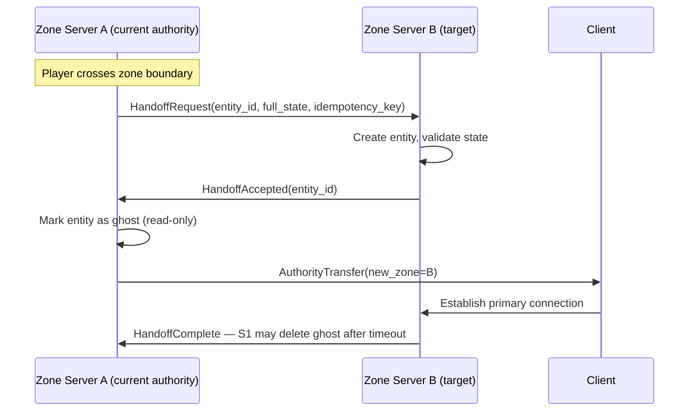

- The handoff is atomic from the client's perspective: the client buffers inputs during transfer (typically < 50ms) and replays them to the new authority
- If `HandoffAccepted` is not received within 200ms, the entity remains on S1 (fail-safe: no authority gap)
- The `idempotency_key` prevents duplicate entity creation if the handoff message is retransmitted

**Cross-zone physics**: Physics interactions between entities on different servers are resolved by the **server that owns the initiating entity**. Example: if Player A (Zone A) throws an object that hits Player B (Zone B), Zone A's server performs the collision detection against B's ghost, computes the result, and sends an `InteractionEvent` to Zone B. Zone B validates the event (timestamp, proximity, velocity plausibility) and applies the effect to Player B. This adds one network hop of latency to cross-zone interactions, which is acceptable given the 10m boundary margin.

**Cross-zone combat/interaction arbitration**: For competitive interactions (damage, item theft), the target's authoritative server has **final say**. The initiator sends an `InteractionRequest`; the target server validates timing, range, and game rules, then either applies or rejects. This prevents a compromised or lagging zone server from unilaterally affecting entities it doesn't own.

**Event ordering during handoff**: The handoff protocol uses a **sequence fence**: S1 assigns a monotonic sequence number to the last state update before handoff. S2 does not accept client inputs for the entity until it has received and applied state up to that sequence number. This prevents stale-state application.

### 3.6 Avatar System

#### 3.6.1 Avatar Architecture

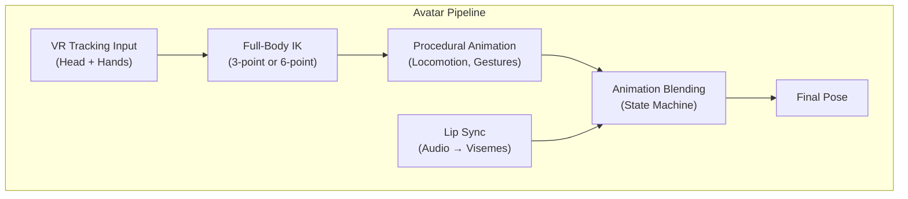

#### 3.6.2 Avatar Specification

Avatars follow the **Aether Avatar Standard** (inspired by VRM, extended):

```
AetherAvatar {
    metadata: {
        name, author, version, license
        thumbnail: Image
        performance_rating: S | A | B | C  // polygon/material budget
    }
    skeleton: StandardBoneHierarchy  // 65 bones standard
    mesh: {
        body: SkinnedMesh[]
        blend_shapes: BlendShape[]   // 52 ARKit-compatible + custom
    }
    materials: PBRMaterial[]
    physics: {
        colliders: Collider[]         // simplified collision
        spring_bones: SpringBone[]    // hair, cloth physics
    }
    expressions: {
        presets: [happy, sad, angry, surprised, neutral]
        custom: Expression[]
    }
    first_person: {
        head_hidden: bool             // hide head mesh in first person
        render_layers: per-mesh       // what to show in mirrors vs first person
    }
}
```

**Performance Ratings** (enforced per-world):

| Rating | Polygons | Materials | Bones | Blend Shapes |
|---|---|---|---|---|
| S (Excellent) | < 10,000 | ≤ 2 | ≤ 65 | ≤ 20 |
| A (Good) | < 25,000 | ≤ 4 | ≤ 128 | ≤ 52 |
| B (Medium) | < 50,000 | ≤ 8 | ≤ 256 | ≤ 100 |
| C (Poor) | < 100,000 | ≤ 16 | ≤ 512 | unlimited |

Worlds can set a minimum performance rating. Avatars exceeding the budget are replaced with a fallback mesh.

#### 3.6.3 Inverse Kinematics

- **3-point IK** (standard): Head + 2 hands → estimate full body
- **6-point IK** (full body): Head + 2 hands + hip + 2 feet
- **Calibration**: T-pose calibration for body proportions
- **Algorithm**: FABRIK with constraints (joint angle limits, twist limits)
- **Locomotion**: Procedural foot placement with ground detection

### 3.7 World System

#### 3.7.1 Universe Hierarchy

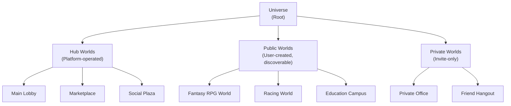

#### 3.7.2 World Manifest

Every world is defined by a manifest:

```yaml
# world.aether-world
name: "Crystal Caverns"
author: "creator_id_123"
version: "1.2.0"
description: "An underground world of bioluminescent crystals"

settings:
  max_players: 200
  avatar_rating_minimum: B
  physics:
    gravity: [0, -4.9, 0]  # low gravity
    water_level: -10.0
  lighting:
    ambient_color: [0.1, 0.05, 0.2]
    fog_density: 0.02
  audio:
    reverb_preset: "cave_large"
  network:
    tick_rate: 30
    interest_radius: 150.0

assets:
  terrain: "assets/terrain.aemesh"
  skybox: "assets/skybox.aeenv"
  props: "assets/props/"
  scripts: "scripts/"

spawn_points:
  - position: [0, 5, 0]
    rotation: [0, 0, 0]

portals:
  - target: "aether://worlds/main-lobby"
    position: [100, 0, 50]
    label: "Return to Lobby"
```

#### 3.7.3 World Streaming

Worlds are streamed in chunks as the player moves:

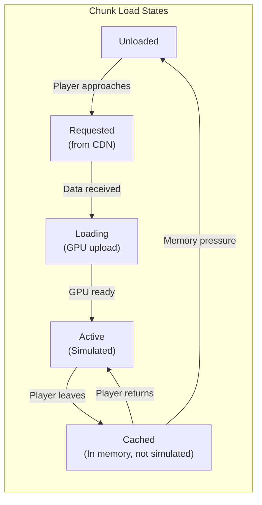

- **Prefetch ring**: 2 chunks ahead of player movement direction
- **LOD terrain**: Clipmap-based terrain LOD (detail near camera, coarse far)
- **Occlusion portals**: Interior spaces only stream when player is inside
- **Asset deduplication**: Shared assets across worlds are cached globally

### 3.8 Scripting System

#### 3.8.1 WASM Sandbox Architecture

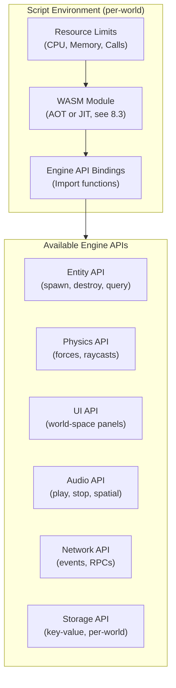

#### 3.8.2 Scripting Language Support

WASM target languages (all compile to WASM):

| Language | Use Case | Tooling |
|---|---|---|
| **Rust** | High-performance world logic | First-class SDK |
| **TypeScript** | General scripting (via AssemblyScript) | Easiest onboarding |
| **C/C++** | Porting existing game logic | Emscripten |
| **Go (TinyGo)** | Backend-familiar developers | Experimental |

#### 3.8.3 Visual Scripting

For non-programmers, a node-based visual scripting editor:

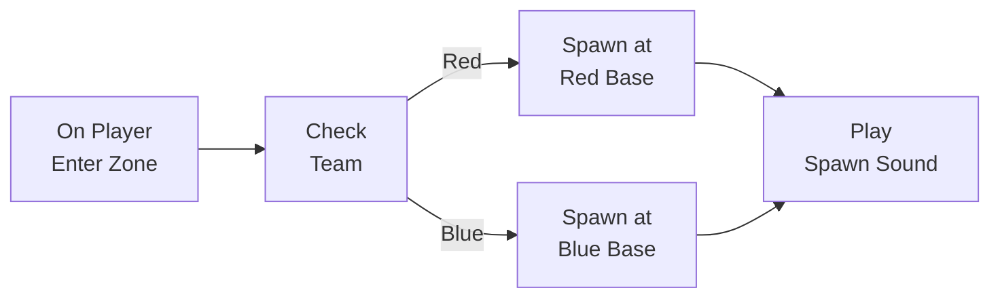

Visual scripts compile to WASM for uniform execution.

#### 3.8.4 Resource Limits

**Per-script limits**:

| Resource | Limit per Script | Purpose |
|---|---|---|
| CPU time | 5ms per tick | Prevent any single script from lagging |
| Memory | 64 MB | Prevent OOM |
| Entity spawns | 100 per second | Prevent spam |
| Network RPCs | 50 per second | Prevent flooding |
| Storage writes | 10 per second | Prevent DB abuse |

**World-level execution budget**:

Per-script limits are necessary but not sufficient — a world with 50 scripts each using 4ms would consume 200ms, far exceeding a 16ms tick at 60 Hz. The **Script Scheduler** enforces a world-level budget:

| Resource | World Budget | Behavior on Exceeded |
|---|---|---|
| Total script CPU per tick | 8ms (configurable, max 50% of tick) | Lower-priority scripts deferred to next tick |
| Total script memory | 512 MB | New script loads rejected until memory freed |
| Total entity count (scripted) | 10,000 | Spawn calls return error |

**Scheduling policy**: Scripts are assigned a priority (0-255, default 128). Each tick, the scheduler runs scripts in priority order until the world CPU budget is exhausted. Remaining scripts are deferred and get priority boost next tick (aging) to prevent starvation. World owners configure script priorities and can see per-script CPU/memory usage in a diagnostics dashboard.

**Overload response**: If a world consistently exceeds its script budget for > 10 consecutive seconds, the server logs a warning and the lowest-priority scripts are force-suspended. World owners receive a notification with the offending scripts identified.

---

## 4. Backend Infrastructure

### 4.1 Service Architecture

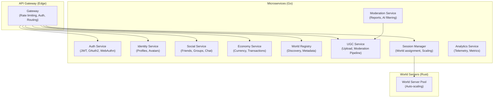

### 4.2 Data Architecture

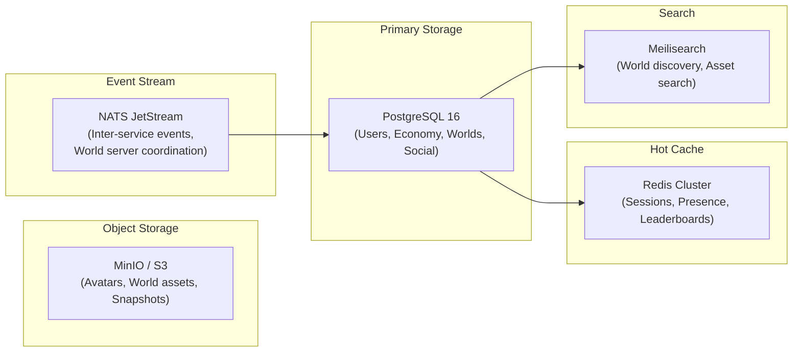

**Key Data Models**:

- **User**: auth credentials, profile, settings, friends list, inventory
- **Avatar**: mesh data reference, metadata, performance rating
- **World**: manifest, asset references, access control, analytics
- **Economy**: wallet balances, transaction log (double-entry bookkeeping)
- **Social**: friend relationships, group memberships, chat history

### 4.3 Deployment Architecture

```mermaid
graph TB
    subgraph Regions["Global Regions"]
        subgraph USWest["US-West"]
            K8s1["K8s Cluster"]
            WS1["World Servers"]
        end
        subgraph EU["EU-Central"]
            K8s2["K8s Cluster"]
            WS2["World Servers"]
        end
        subgraph Asia["Asia-East"]
            K8s3["K8s Cluster"]
            WS3["World Servers"]
        end
    end

    subgraph CDN["Global CDN"]
        Edge1["Edge PoP × 50+"]
    end

    subgraph Central["Central Services"]
        GlobalDB["Global DB<br/>(PostgreSQL + Citus)"]
        GlobalNATS["NATS Supercluster"]
    end

    K8s1 --> GlobalDB
    K8s2 --> GlobalDB
    K8s3 --> GlobalDB
    K8s1 <--> GlobalNATS
    K8s2 <--> GlobalNATS
    K8s3 <--> GlobalNATS
    Edge1 --> K8s1
    Edge1 --> K8s2
    Edge1 --> K8s3
```

- **World server placement**: Players connect to the nearest region; worlds are instantiated where most players are
- **Cross-region play**: Players in different regions can be in the same world (with higher latency warning)
- **Auto-scaling**: World servers scale based on player count and CPU utilization (custom HPA)

#### 4.3.1 Multi-Region Database Consistency Model

The global PostgreSQL + Citus deployment uses a **single-primary topology for economy data** to guarantee ACID consistency for financial transactions:

| Data Domain | Topology | Consistency | Rationale |
|---|---|---|---|
| **Economy (wallets, transactions)** | Single-primary region (US-West), synchronous standby in US-East | Strong consistency (linearizable) | Financial correctness requires single-writer ACID. Cross-region economy RPCs route to primary (adds ~80ms for EU/Asia players on purchase). |
| **Identity / Auth** | Single-primary, async replicas in all regions | Read-after-write in primary region, eventual in others | Token validation uses local read replica (fast); profile updates go to primary. |
| **Social (friends, groups)** | Citus-sharded by user_id, distributed across regions | Eventual consistency (< 1s replication lag) | Social mutations are low-frequency and tolerance for brief inconsistency is acceptable. |
| **World Registry** | Citus-sharded, read replicas in all regions | Eventual consistency | World metadata is read-heavy, write-rare. |
| **Telemetry / Analytics** | Region-local write, async aggregation | Eventual | No correctness requirement. |

**Failover**: The economy primary has a synchronous standby. On primary failure, automatic promotion occurs via Patroni (< 30s failover). During failover, economy writes are unavailable — world servers queue transaction RPCs and retry with the same idempotency key once the new primary is reachable. No double-posting risk due to the idempotency contract.

**Why not multi-primary**: Multi-primary (CockroachDB-style) was considered but rejected for economy data. The complexity of distributed transactions, conflict resolution, and the risk of split-brain balance corruption outweigh the latency benefit. The ~80ms cross-region penalty for purchases is acceptable — players experience it as a brief "processing" animation.

### 4.4 Economy System

```mermaid
graph LR
    subgraph Wallets["Wallets"]
        PlayerWallet["Player Wallet"]
        CreatorWallet["Creator Wallet"]
        PlatformWallet["Platform Wallet"]
    end

    subgraph Actions["Economic Actions"]
        Purchase["Asset Purchase"]
        Tip["Tip / Donation"]
        WorldEntry["World Entry Fee"]
        Trade["Player Trade"]
    end

    subgraph Ledger["Double-Entry Ledger"]
        TX["Transaction Log<br/>(Immutable, Auditable)"]
    end

    Purchase --> TX
    Tip --> TX
    WorldEntry --> TX
    Trade --> TX
    TX --> PlayerWallet
    TX --> CreatorWallet
    TX --> PlatformWallet
```

- **Currency**: AEC (Aether Credits) — platform currency, purchasable with real money, earnable in-world
- **Creator payouts**: Creators earn AEC from asset sales, world entry fees, tips. Convertible to real currency above threshold.
- **Transaction model**: Double-entry bookkeeping. Every transaction debits one account and credits another. Full audit trail.
- **Anti-fraud**: Velocity checks, anomaly detection, manual review for large transactions
- **No blockchain**: Centralized ledger is simpler, faster, and reversible (for fraud recovery). Publicly auditable summaries published periodically.

#### 4.4.1 Transaction Posting Contract (Exactly-Once Semantics)

NATS JetStream provides at-least-once delivery, which means economy consumers can receive duplicate messages. The ledger must guarantee **exactly-once posting** despite this.

**Defense in depth — two layers of dedup**:

The system does NOT rely solely on caller behavior. Exactly-once posting is enforced by **server-side constraints** regardless of caller compliance:

**Layer 1 — Server-side structural dedup (the hard guarantee)**:
Every transaction request carries an **idempotency key**. The Economy Service enforces uniqueness via a `UNIQUE` constraint on `idempotency_key` in the PostgreSQL transaction table. This is the authoritative dedup mechanism — it works regardless of caller behavior, SDK usage, or crash timing. Even if a caller generates a new key by mistake, the damage is bounded: the CHECK constraint on wallet balances prevents overdraft, and velocity/anomaly detection flags unusual patterns.

**Layer 2 — Caller key management (prevents accidental new keys)**:

The idempotency key is a **UUID v7** generated once per logical operation and **persisted by the caller before the first attempt**:

1. World server generates `idempotency_key = UUIDv7()` for the operation
2. World server writes `(idempotency_key, operation_details, status=PENDING)` to its local pending-transactions table (on the PVC-backed WAL volume for durable worlds, or in-memory for stateless worlds)
3. World server sends the RPC to Economy Service with the key
4. On success: mark local record as `COMPLETED`, confirm to client
5. On timeout/failure: retry with the **same key** (read from local record)
6. On world server crash/restart: scan pending-transactions for `PENDING` records and retry each with its persisted key

This ensures crash recovery always reuses the original key. For stateless worlds (no PVC), in-memory pending records are lost on crash — but since the Economy Service has the UNIQUE constraint, the worst case is a transaction that was actually committed but the client doesn't get confirmation. The client sees a timeout, and the Economy Service SDK provides a `get_transaction(idempotency_key)` query to check outcome after recovery.

**Collision prevention**: UUID v7 keys have 122 bits of entropy, making collisions astronomically unlikely (~10^-18 probability per billion transactions). Unlike deterministic derivation, distinct transactions always get distinct keys regardless of timing or parameters.

**Caller retry contract**:
- On timeout or ambiguous failure, callers MUST retry with the **same UUID** (read from their persisted pending-transaction record)
- The Economy Service SDK manages this lifecycle automatically via `begin_transaction()` → `commit_transaction()` with built-in retry
- Non-compliant callers (generating new keys on retry) cannot cause overdraft (balance CHECK constraint) and are detected by anomaly monitoring

**Path A — Synchronous RPC (player-facing transactions: purchases, trades, tips)**:

```mermaid
sequenceDiagram
    participant WS as World Server
    participant ES as Economy Service
    participant DB as PostgreSQL

    WS->>ES: RPC: PostTransaction(idempotency_key, debit=A, credit=B, amount=100)
    ES->>DB: BEGIN
    ES->>DB: INSERT INTO transactions (idempotency_key, ...) — UNIQUE constraint
    ES->>DB: UPDATE wallets SET balance = balance - 100 WHERE id = A
    ES->>DB: UPDATE wallets SET balance = balance + 100 WHERE id = B
    ES->>DB: COMMIT
    ES->>WS: OK (transaction_id)

    Note over WS,ES: On timeout/failure, WS retries with same idempotency_key:
    WS->>ES: RPC: PostTransaction(same idempotency_key, ...)
    ES->>DB: INSERT → UNIQUE violation
    ES->>DB: ROLLBACK (no-op)
    ES->>WS: OK (idempotent — returns original transaction_id)
```

**Path B — Async via NATS JetStream (settlement: creator payouts, platform fees)**:

```mermaid
sequenceDiagram
    participant ES as Economy Service
    participant MQ as NATS JetStream
    participant Settle as Settlement Worker
    participant DB as PostgreSQL

    ES->>MQ: Publish: SettlementEvent(idempotency_key, creator=C, amount=15)
    MQ->>Settle: Deliver (at-least-once)
    Settle->>DB: BEGIN + INSERT (UNIQUE on idempotency_key) + UPDATE + COMMIT
    Settle->>MQ: ACK

    Note over MQ,Settle: If redelivered:
    MQ->>Settle: Same message again
    Settle->>DB: INSERT → UNIQUE violation → ROLLBACK
    Settle->>MQ: ACK (no-op)
```

Player-facing transactions always use Path A (synchronous RPC) for immediate confirmation. Path B is used only for deferred settlement where slight delay is acceptable.

**Key properties**:
- The debit, credit, and balance update are in a **single PostgreSQL transaction** — no partial application
- The `idempotency_key` unique constraint makes duplicate delivery a harmless no-op (INSERT conflict → rollback → ACK)
- Wallet balance columns use `CHECK (balance >= 0)` to prevent overdraft at the database level
- Idempotency keys are **never deleted** from the uniqueness index for the lifetime of the transaction row (7 years). The `idempotency_key` column is the primary dedup mechanism and shares the transaction row's retention lifecycle. After 7 years, the transaction row (and its key) are permanently deleted together — at that point, no system can produce a valid replay of a 7-year-old transaction. For storage efficiency, keys older than 90 days are moved from the hot transaction table to a compressed archive table, but the `UNIQUE` constraint spans both tables via a check-on-insert trigger
- **Synchronous path for critical mutations**: World servers calling the Economy Service for player-facing transactions (purchases, trades) use synchronous RPC, not the event bus. The event bus is used for asynchronous settlement (creator payouts, platform fee distribution) where slight delay is acceptable

---

## 5. Content Creation Pipeline

### 5.1 Creator Studio

A standalone application (and in-VR mode) for building worlds:

```mermaid
graph TB
    subgraph CreatorStudio["Creator Studio"]
        TerrainEditor["Terrain Editor<br/>(Sculpt, Paint, Vegetation)"]
        PropPlacer["Prop Placer<br/>(Drag & Drop, Snap)"]
        LightEditor["Lighting Editor<br/>(Bake, Probes)"]
        ScriptEditor["Script Editor<br/>(Code + Visual)"]
        AvatarEditor["Avatar Creator<br/>(Customization)"]
        MaterialEditor["Material Editor<br/>(PBR Node Graph)"]
    end

    subgraph Pipeline["Asset Pipeline"]
        Import["Import<br/>(glTF, FBX, OBJ, PNG, WAV)"]
        Process["Process<br/>(Optimize, LOD gen, Compress)"]
        Validate["Validate<br/>(Budget checks, Safety scan)"]
        Package["Package<br/>(VRE asset bundle)"]
        Upload["Upload<br/>(CDN distribution)"]
    end

    CreatorStudio --> Import
    Import --> Process
    Process --> Validate
    Validate --> Package
    Package --> Upload
```

### 5.2 Asset Format

**Aether Asset Bundle** (`.aether`):

```
aether-bundle/
├── manifest.json          # metadata, dependencies, LOD chain
├── meshes/
│   ├── mesh_0.aemesh      # custom binary mesh format (optimized)
│   ├── mesh_0_lod1.aemesh
│   └── mesh_0_lod2.aemesh
├── textures/
│   ├── albedo.basis       # Basis Universal compressed
│   ├── normal.basis
│   └── orm.basis          # Occlusion/Roughness/Metallic packed
├── audio/
│   └── ambient.opus
├── scripts/
│   └── interact.wasm
└── thumbnail.webp
```

- **Mesh format**: Custom binary (vertex positions, normals, tangents, UVs, bone weights — quantized and compressed with Meshoptimizer)
- **Texture compression**: Basis Universal (transcodes to BC7/ASTC/ETC2 on target platform)
- **Audio**: Opus for voice/sfx, Vorbis for music
- **Scripts**: Pre-compiled WASM (AOT compiled on server for target platform)

### 5.3 Moderation Pipeline

All user-generated content passes through automated + human review:

```mermaid
graph LR
    Upload["Asset Upload"] --> AutoScan["Auto Scan<br/>(AI Content Check)"]
    AutoScan --> |"Pass"| Available["Available<br/>(Unlisted)"]
    AutoScan --> |"Flag"| HumanReview["Human Review<br/>Queue"]
    Available --> |"Reports"| HumanReview
    HumanReview --> |"Approve"| Published["Published<br/>(Discoverable)"]
    HumanReview --> |"Reject"| Rejected["Rejected<br/>(Reason provided)"]
```

---

## 6. Security & Trust

### 6.1 Security Architecture

```mermaid
graph TB
    subgraph ClientSecurity["Client-Side"]
        AntiTamper["Client Integrity<br/>Checks"]
        InputValidation["Input Validation<br/>(Rate limits, Range checks)"]
    end

    subgraph ServerSecurity["Server-Side (Authoritative)"]
        StateValidation["State Validation<br/>(All mutations verified)"]
        SpeedCheck["Movement Speed<br/>Checks"]
        CollisionAuth["Collision Authority<br/>(Server physics)"]
        ScriptSandbox["WASM Sandbox<br/>(No system access)"]
    end

    subgraph InfraSecurity["Infrastructure"]
        DDoS["DDoS Protection<br/>(Edge filtering)"]
        TLS["TLS 1.3 Everywhere"]
        AuthN["AuthN: OAuth2 + WebAuthn"]
        AuthZ["AuthZ: RBAC + ABAC"]
        Audit["Audit Logging<br/>(All admin actions)"]
    end

    subgraph TrustSafety["Trust & Safety"]
        Report["Report System"]
        AIModeration["AI Content<br/>Moderation"]
        PersonalSpace["Personal Space<br/>Bubble (enforced)"]
        Blocking["User Blocking<br/>(Mutual invisibility)"]
        ParentalControls["Parental Controls<br/>(Age-gated worlds)"]
    end
```

### 6.2 Anti-Cheat Strategy

Since the engine is server-authoritative, most cheats are structurally impossible:

| Cheat Type | Mitigation |
|---|---|
| Speed hacking | Server validates all movement; exceeding max velocity resets position |
| Teleportation | Server rejects position jumps exceeding threshold |
| Wall hacking | Server controls visibility via interest management; hidden entities aren't sent |
| Item duplication | Server-authoritative inventory; all transactions are atomic |
| Fly hacking | Server physics determines grounded state; unauthorized flight rejected |
| Aimbotting | For competitive worlds: server-side hit validation with tolerance window |
| Script injection | WASM sandbox prevents access to anything outside defined API |

### 6.3 Privacy Controls

- **Personal space bubble**: Configurable radius (default 0.5m) — other avatars are pushed back
- **Visibility modes**: Visible / Friends-only / Invisible
- **Voice privacy**: Push-to-talk default, per-world voice zones
- **Data rights**: Export all personal data, delete account with pseudonymization (see below)
- **Anonymous mode**: Temporary avatar, no persistent identity

#### 6.3.1 Account Deletion vs Audit Ledger (GDPR/CCPA Compliance)

The immutable transaction ledger and the right to erasure create a tension. Aether resolves this with **pseudonymization**, not full deletion of ledger rows:

**On account deletion request**:

| Data Category | Action | Rationale |
|---|---|---|
| Profile (name, email, avatar, bio) | **Deleted** | Pure personal data, no retention need |
| Social graph (friends, groups, blocks) | **Deleted** | Relational personal data |
| Chat history | **Deleted** | Communication data |
| World creations (if requested) | **Deleted or transferred** | Creator chooses: delete worlds or transfer ownership |
| Session logs, telemetry | **Deleted** | Behavioral data |
| Transaction ledger rows | **Pseudonymized** | See below |

**Ledger pseudonymization**: Transaction rows are retained for financial compliance (AML, tax, fraud) but the `user_id` field is replaced with a **pseudonym token** (`SHA-256(user_id + deletion_salt)`). The process has two modes depending on legal hold status:

**Default path (no legal hold)**: The deletion salt is stored in a separate **Compliance Keystore** (encrypted, access-controlled, audit-logged), NOT discarded. This allows authorized re-identification under legal compulsion (court order, regulatory investigation) while keeping ledger rows non-identifiable for all normal operations.

**GDPR legal basis**: Because the salt enables re-identification, the pseudonymized ledger rows remain personal data under GDPR. Retention is justified under **Article 17(3)(b)** — the right to erasure does not apply where processing is necessary for compliance with a legal obligation. Specifically:
- Anti-Money Laundering Directive (AMLD 5/6) requires retention of financial transaction records for 5 years
- National tax laws in operating jurisdictions require 6-7 year retention
- These legal obligations override the right to erasure for the financial ledger specifically

The Compliance Keystore is subject to strict access controls:
- Access requires dual-approval from Compliance Officer + Legal Counsel
- Every access is audit-logged with justification and legal basis citation
- The salt is auto-deleted after 7 years (matching ledger retention), simultaneously with the ledger rows themselves (see retention schedule below)

**Legal hold path**: If the account is under active legal hold (ongoing investigation, litigation, regulatory inquiry), deletion is deferred. The user is notified that deletion is paused due to legal obligation (without disclosing investigation details, per applicable law). Once the hold is lifted, the default pseudonymization path executes.

**Retention schedule**: After 7 years, pseudonymized ledger rows and their corresponding salts are **both permanently deleted** in the same batch operation. There is no intermediate "anonymized but retained" state — once the legal retention obligation expires, the data is destroyed entirely. This is simpler and more privacy-protective than attempting to retain anonymized rows indefinitely.

**Export**: Before deletion, users can export all their data (GDPR Article 20) including a full transaction history with readable details. This export is generated before pseudonymization begins.

### 6.4 Federation Model

"Federated by Design" is a core principle, but federation has a well-defined scope and clear boundaries in v1.

**What is federated (v1)**:
- **World hosting**: Anyone can run an Aether World Server on their own infrastructure. The world server binary is open-source and self-hostable.
- **World discovery**: Self-hosted worlds register with the platform's World Registry via an open API, making them discoverable alongside platform-hosted worlds.
- **Portal interoperability**: Players can portal (`aether://`) between platform-hosted and self-hosted worlds seamlessly.
- **Asset serving**: Self-hosted worlds serve their own assets from their own origin, but all assets are **content-addressed and integrity-verified** (see below).

**What is centralized (v1)**:
- **Identity / Auth**: A single identity provider (the Aether platform) issues and validates player identity. Self-hosted worlds verify player tokens against the central auth service. This is a deliberate choice — federated identity (like ActivityPub webfinger) introduces trust complexity that is deferred.
- **Economy**: All AEC transactions go through the central Economy Service. Self-hosted worlds can trigger transactions (e.g., entry fees, item purchases) via the Economy API, but the ledger is centralized. This ensures auditability and fraud recovery.
- **Moderation**: Content moderation policies are enforced centrally. Self-hosted worlds that are discoverable via the platform registry must comply with platform moderation standards. Worlds can opt out of the registry and operate independently (but lose discoverability and economy integration).

**Federated asset integrity**:

Self-hosted worlds can serve assets from arbitrary origins, which creates a supply-chain risk: assets could be modified after moderation approval. Aether mitigates this with **content-addressed asset references**:

- Every asset in a world manifest is referenced by its **content hash** (SHA-256), not just a URL. Example: `terrain: { url: "https://my-server.com/terrain.aemesh", sha256: "a1b2c3..." }`
- When the client downloads an asset, it verifies the content hash before loading. Hash mismatch → asset rejected, fallback placeholder rendered, incident reported to Moderation Service.
- When a world is submitted to the World Registry (for discoverability), the platform's UGC Service downloads all assets, runs the moderation scan, and records the content hashes. These hashes are stored in the registry as the **approved manifest**.
- If a self-hosted world operator updates an asset, the content hash changes, breaking the manifest's integrity. The world is automatically flagged as "modified since approval" in the registry and must be re-submitted for moderation review before regaining "approved" status.
- WASM scripts have an additional requirement: the platform AOT-compiles scripts at submission time and stores the compiled artifact. Self-hosted worlds serve the platform-compiled artifact, not their own compilation. On **constrained platforms** (Quest, visionOS, console), the client verifies the platform's Ed25519 code signature on the AOT artifact before loading. On **PC/Desktop**, the client verifies the content hash (SHA-256) of the raw `.wasm` file against the approved manifest — signature verification is not required because the JIT path loads the canonical bytecode, not a platform-compiled artifact. This distinction is consistent with the WASM runtime model in Section 8.3.

This ensures that moderation approval is binding — approved content cannot be silently swapped.

**Federation roadmap (post-v1)**:
- **Federated identity**: Support for external identity providers (OpenID Connect federation) so players from other platforms can join Aether worlds with their existing identity. Defined in Open Question #5.
- **Decentralized economy**: Allow self-hosted world clusters to run independent economies with exchange protocols to the main AEC ledger.
- **Trust protocol**: A reputation/attestation system where world operators build trust scores based on uptime, moderation compliance, and player feedback.

---

## 7. Performance Targets

### 7.1 Client Performance

| Metric | Target (PC VR) | Target (Standalone) |
|---|---|---|
| Frame rate | 90 FPS sustained | 72 FPS sustained |
| Motion-to-photon latency | < 20ms | < 20ms |
| Draw calls per frame | < 500 | < 200 |
| Triangle budget | 2M per eye | 500K per eye |
| Texture memory | < 2 GB | < 512 MB |
| World load time | < 5 seconds | < 8 seconds |
| Client binary size | < 500 MB | < 200 MB |

### 7.2 Server Performance

| Metric | Target |
|---|---|
| Players per world server | 200-500 (depending on world complexity) |
| Server tick rate | 30-60 Hz (configurable per world) |
| State snapshot interval | 5 seconds |
| Network bandwidth per player | < 100 KB/s downstream, < 20 KB/s upstream |
| Zone handoff latency | < 100ms (seamless) |
| World server boot time | < 3 seconds |

### 7.3 Infrastructure

| Metric | Target |
|---|---|
| API response time (p99) | < 100ms |
| Asset CDN cache hit rate | > 95% |
| World server availability | 99.9% |
| Data durability | 99.999999999% (11 nines) |
| Cross-region latency | < 150ms (with warning) |

---

## 8. Technology Stack

### 8.1 Overview

```mermaid
graph TB
    subgraph ClientStack["Client Stack"]
        Rust1["Rust<br/>(Core engine)"]
        wgpu["wgpu<br/>(Vulkan/Metal/DX12)"]
        OpenXR["OpenXR<br/>(VR runtime)"]
        Rapier["Rapier3D<br/>(Physics)"]
        Wasmtime1["Wasmtime<br/>(Client scripts)"]
        egui["egui<br/>(Debug UI)"]
    end

    subgraph ServerStack["Server Stack"]
        Rust2["Rust<br/>(World servers)"]
        Go["Go<br/>(Microservices)"]
        Wasmtime2["Wasmtime<br/>(Server scripts)"]
        Quinn["Quinn<br/>(QUIC)"]
    end

    subgraph Infra["Infrastructure"]
        K8s["Kubernetes"]
        PG["PostgreSQL 16"]
        RedisStack["Redis 7"]
        NATSStack["NATS JetStream"]
        MinioStack["MinIO"]
        Prometheus["Prometheus + Grafana"]
    end

    subgraph BuildStack["Build & Tools"]
        Cargo["Cargo<br/>(Rust build)"]
        GoBuild["Go toolchain"]
        Docker["Docker<br/>(Containerization)"]
        CI["GitHub Actions<br/>(CI/CD)"]
    end
```

### 8.2 Key Technology Choices

| Component | Technology | Rationale |
|---|---|---|
| **Engine language** | Rust | Memory safety without GC pauses; fearless concurrency; zero-cost abstractions |
| **Graphics API** | wgpu (Vulkan/Metal/DX12) | Cross-platform; modern GPU features; Rust-native |
| **VR Runtime** | OpenXR | Industry standard; supports all major headsets |
| **Physics** | Rapier3D | Rust-native; deterministic mode; excellent performance |
| **Scripting Runtime** | Wasmtime | Fastest WASM runtime; AOT compilation; robust sandboxing |
| **Network Protocol** | QUIC (quinn) | Multiplexed streams; 0-RTT reconnect; built-in encryption |
| **Backend Services** | Go | Fast development; excellent concurrency; proven at scale |
| **Primary Database** | PostgreSQL + Citus | ACID transactions for economy; JSONB for flexible schemas; Citus for multi-region horizontal sharding |
| **Cache** | Redis | Sub-millisecond reads; pub/sub for presence; sorted sets for leaderboards |
| **Message Bus** | NATS JetStream | Lightweight; at-least-once delivery; clustering |
| **Object Storage** | MinIO (self-hosted) / S3 | Scalable blob storage for assets |
| **Texture Compression** | Basis Universal | GPU-compressed; transcodes to any target format |
| **Audio Codec** | Opus | Best-in-class for voice; low latency; royalty-free |
| **Mesh Optimization** | Meshoptimizer | Industry-standard mesh compression and LOD generation |
| **Container Orchestration** | Kubernetes | Auto-scaling; self-healing; declarative infrastructure |

### 8.3 Client Platform Support

| Platform | Status | Script Execution | Notes |
|---|---|---|---|
| PC VR (SteamVR/Oculus) | Primary | Client + Server WASM (JIT) | Full quality, full scripting |
| Meta Quest (standalone) | Primary | Server-only WASM; client AOT only | Android forbids JIT in some contexts; ship AOT-compiled trusted scripts only. Untrusted scripts execute server-side with results streamed to client. |
| Desktop (flat-screen) | Secondary | Client + Server WASM (JIT) | Mouse/keyboard, spectator mode |
| Apple Vision Pro | Planned | Server-only WASM; client AOT signed | visionOS prohibits JIT; all client WASM must be AOT-compiled and code-signed as part of the app bundle |
| PlayStation VR2 | Planned | Server-only WASM | Console policy prohibits runtime code generation; all scripts server-authoritative |

**Canonical WASM runtime model per environment**:

| Environment | Compilation Mode | Runtime | Rationale |
|---|---|---|---|
| **World Server** (all platforms) | AOT (Cranelift, ahead of upload) | Wasmtime | Scripts are AOT-compiled when uploaded to UGC service. Servers load pre-compiled native code — zero JIT overhead at runtime. This is the canonical execution path; all scripts run here. |
| **Client: PC / Desktop** | JIT (Cranelift, on first load) | Wasmtime | Client-side scripts (UI, visual effects, input helpers) are JIT-compiled on first load, then cached. JIT is permitted on these platforms. |
| **Client: Quest** | AOT only (pre-compiled into app or downloaded as native module) | Wasmtime (AOT mode) | Android SELinux policies restrict JIT in W^X contexts. Only engine-provided scripts (AOT-compiled into the binary) run client-side. User scripts run server-side. |
| **Client: visionOS** | AOT only (code-signed into app bundle) | Wasmtime (AOT mode) | visionOS prohibits runtime code generation. Same model as Quest — engine scripts AOT, user scripts server-side. |
| **Client: Console** | AOT only | Wasmtime (AOT mode) | Console platform policies prohibit JIT. Server-authoritative for all user scripts. |

The scripting architecture diagram (Section 3.8.1) labels modules as "AOT or JIT" — the actual mode is determined by the table above based on deployment target. The server always runs AOT. The client runs JIT where permitted, AOT where required, and falls back to server-side execution for user scripts on constrained platforms.

#### 8.3.1 WASM Multi-Architecture AOT Artifact Strategy

AOT compilation produces **platform-specific native code**. The UGC Service compiles each uploaded WASM module for all supported target architectures at upload time:

| Target | Architecture | AOT Output | Distribution |
|---|---|---|---|
| World Server (Linux) | x86_64 | `.cwasm` (Cranelift compiled module) | Stored in object storage, loaded by server at world boot |
| World Server (Linux) | aarch64 | `.cwasm` | Same, for ARM-based server nodes |
| Client: PC (Windows/Linux) | x86_64 | Not pre-compiled (JIT at runtime) | Raw `.wasm` served, client JIT-compiles and caches locally |
| Client: Quest (Android) | aarch64 | `.cwasm` + platform signature | Signed by platform key; client verifies signature before loading |
| Client: visionOS | aarch64 | `.cwasm` embedded in app bundle | Bundled into signed app update (requires app store review cycle for engine scripts) |
| Client: Console | platform-specific | `.cwasm` | Bundled into platform-certified build |

**Artifact storage**: Each WASM module in object storage is stored as a manifest pointing to per-architecture artifacts:
```
scripts/interact/
├── module.wasm           # canonical WASM bytecode (source of truth)
├── module.x86_64.cwasm   # server AOT (x86_64)
├── module.aarch64.cwasm  # server AOT + Quest client AOT
└── manifest.json         # maps target → artifact + SHA-256 hash
```

**Signing**: All AOT artifacts for constrained platforms (Quest, visionOS, console) are signed with the platform's Ed25519 code-signing key. The client embeds the corresponding public key and verifies the signature before loading. Unsigned or incorrectly signed modules are rejected.

**Rebuild policy**: When Wasmtime is upgraded (new Cranelift codegen), all AOT artifacts are bulk-recompiled from the canonical `.wasm` source. The canonical WASM bytecode is the permanent source of truth; AOT artifacts are derived and replaceable.

---

## 9. Development Roadmap

### 9.1 Phase Overview

```mermaid
gantt
    title Aether Development Roadmap
    dateFormat YYYY-Q
    axisFormat %Y-Q%q

    section Phase 1: Foundation
    ECS Core + Renderer           :p1a, 2026-Q2, 2026-Q3
    Physics + Input               :p1b, 2026-Q2, 2026-Q3
    Basic Networking (Single Server) :p1c, 2026-Q3, 2026-Q4
    OpenXR Integration            :p1d, 2026-Q3, 2026-Q4
    Milestone: Single-world VR Demo :milestone, m1, 2026-Q4, 0d

    section Phase 2: Multiplayer
    Multi-server Architecture     :p2a, 2027-Q1, 2027-Q2
    Interest Management           :p2b, 2027-Q1, 2027-Q2
    Avatar System + IK            :p2c, 2027-Q1, 2027-Q2
    Spatial Audio                 :p2d, 2027-Q2, 2027-Q3
    Milestone: 100-player VR World :milestone, m2, 2027-Q3, 0d

    section Phase 3: Platform
    WASM Scripting                :p3a, 2027-Q3, 2027-Q4
    Creator Studio (Desktop)      :p3b, 2027-Q3, 2028-Q1
    UGC Pipeline + Moderation     :p3c, 2027-Q4, 2028-Q1
    Economy System                :p3d, 2028-Q1, 2028-Q2
    Milestone: Public Alpha       :milestone, m3, 2028-Q2, 0d

    section Phase 4: Scale
    Global Infrastructure         :p4a, 2028-Q2, 2028-Q3
    Spatial Load Balancing         :p4b, 2028-Q2, 2028-Q3
    Quest Standalone Client        :p4c, 2028-Q3, 2028-Q4
    Portal System (World Links)    :p4d, 2028-Q3, 2028-Q4
    Milestone: Public Beta        :milestone, m4, 2028-Q4, 0d
```

### 9.2 Phase 1: Foundation (Q2-Q4 2026)

**Goal**: A single-world VR experience with basic rendering and physics.

Deliverables:
- Archetype-based ECS with parallel system scheduling
- Forward+ renderer with wgpu (stereo rendering, PBR materials, basic shadows)
- Rapier3D physics integration (rigid bodies, colliders, raycasts)
- OpenXR integration (head tracking, controller input, hand tracking)
- VR interaction system (grab, throw, UI interaction)
- Single-server networking (one world, < 20 players)
- Basic avatar (head + floating hands, synced over network)

### 9.3 Phase 2: Multiplayer (Q1-Q3 2027)

**Goal**: A social VR world with 100+ players, full-body avatars, and spatial audio.

Deliverables:
- Multi-server world architecture with zone partitioning
- Interest management and delta state sync
- Full-body IK avatar system (3-point and 6-point)
- Avatar specification and loading (Aether Avatar Standard v1)
- Spatial audio engine with HRTF and voice chat
- Client-side prediction and entity interpolation
- Basic world loading (terrain, props, lighting)

### 9.4 Phase 3: Platform (Q3 2027 - Q2 2028)

**Goal**: Enable user-generated worlds with scripting, a creator studio, and basic economy.

Deliverables:
- WASM scripting runtime with engine API bindings
- Visual scripting editor
- Creator Studio desktop application (terrain, props, lighting, scripts)
- Asset pipeline (import, optimize, validate, upload)
- UGC moderation pipeline (AI scan + human review)
- Economy system (wallets, transactions, marketplace)
- World discovery (search, categories, featured worlds)
- Backend microservices (auth, social, economy, UGC)

### 9.5 Phase 4: Scale (Q2-Q4 2028)

**Goal**: Global deployment, massive concurrency, cross-platform.

Deliverables:
- Global infrastructure (multi-region Kubernetes, CDN, geo-routing)
- Dynamic spatial load balancing (zone splitting/merging)
- Meta Quest standalone client (mobile-optimized renderer)
- Portal system (cross-world teleportation via URLs)
- Advanced moderation tools (world-owner controls, AI behavior detection)
- Performance optimization pass (profiling, LOD tuning, bandwidth reduction)

---

## Appendix A: Comparison with Existing Engines

| Feature | Aether | Unity | Unreal Engine | Godot | VRChat |
|---|---|---|---|---|---|
| **Primary Focus** | VR Metaverse Platform | General game engine | AAA game engine | Open-source game engine | Social VR app |
| **VR-First Design** | Yes | Addon | Addon | Addon | Yes |
| **Massive Multiplayer** | Built-in (1000+) | Third-party | Third-party | Third-party | ~80 per instance |
| **User-Generated Worlds** | Core feature | Not built-in | Not built-in | Not built-in | Yes (Unity SDK) |
| **Server-Authoritative** | Yes | Manual | Manual | Manual | Partial |
| **Scripting Sandbox** | WASM (secure) | C# (full access) | C++ (full access) | GDScript (full access) | Udon (limited) |
| **Economy System** | Built-in | No | No | No | No |
| **Open Source** | Yes (planned) | No | Source available | Yes | No |
| **Language** | Rust | C++ / C# | C++ | C++ / GDScript | C# / C++ |

## Appendix B: Key Open Questions

| # | Question | Options | Impact |
|---|---|---|---|
| 1 | Should the engine be fully open-source from day 1? | Open-source / Source-available / Proprietary core | Community, adoption, monetization |
| 2 | Build custom renderer vs use existing (Bevy renderer)? | Custom / Bevy / rend3 | Development speed vs control |
| 3 | Audio engine: build vs integrate? | Custom / Steam Audio / Resonance Audio | Quality vs effort |
| 4 | ~~Global DB~~ **Resolved**: PostgreSQL + Citus for horizontal scaling. PG ecosystem familiarity, ACID for economy, Citus for multi-region sharding. | PostgreSQL + Citus | — |
| 5 | Federation protocol: custom vs ActivityPub-inspired? | Custom / ActivityPub-based / Matrix-based | Interoperability vs simplicity |
| 6 | Mobile (phone/tablet) client support? | Yes / No / Later | Reach vs quality |
| 7 | AI NPC system: built-in LLM integration? | Yes / Plugin / No | Innovation vs scope |

## Appendix C: Glossary

| Term | Definition |
|---|---|
| **ECS** | Entity Component System — data-oriented architecture separating data (components) from logic (systems) |
| **HRTF** | Head-Related Transfer Function — models how ears perceive sound from different directions |
| **Interest Management** | Server-side system that determines which entities each client needs to know about |
| **LOD** | Level of Detail — using simpler models/textures for distant objects |
| **QUIC** | A UDP-based transport protocol with built-in encryption and multiplexing |
| **VRS** | Variable Rate Shading — rendering peripheral pixels at lower resolution |
| **WASM** | WebAssembly — portable binary instruction format for sandboxed execution |
| **Forward+** | Rendering technique combining forward rendering with light clustering for many lights |
| **Foveated Rendering** | Rendering the center of vision at full resolution and the periphery at lower resolution |
| **OpenXR** | Khronos standard API for VR/AR device access |

---

*This document is a living design specification. It will be updated as architectural decisions are made and implementation experience is gained.*
