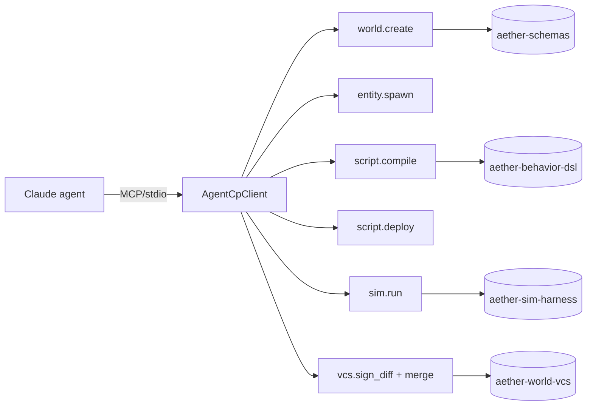

# Agent-Native Demo (Task 66 / Unit U10)

## Background

Aether is repositioning from a human-first VR/MMORPG platform engine into an
agent-native engine where AI agents are first-class authors. The 90-day
thin-slice demo is the single artifact that proves the entire thesis in one
run: a Claude agent, speaking MCP, creates a world, spawns an entity, writes
and compiles a behavior, runs a simulation, and promotes the result to `main`
— all without touching Rust source or the filesystem directly.

## Why

Every other unit in the repositioning (U01–U09) is a vertical slice of the
new contract; this unit is the horizontal cut that wires them together. If
the thin-slice runs end-to-end, the repositioning story is real; if it
doesn't, we've shipped disconnected infrastructure.

The demo also doubles as:

- A regression gate (`cargo test -p agent-native-demo` must pass on every PR).
- A canonical training / evaluation transcript for the agent surface.
- A recorded-session artifact the CPO can show externally.

## What

A runnable example crate `examples/agent-native-demo` whose binary prints one
JSON-lines record per MCP call and a final `done` line:

```json
{"step":"mcp.connect","elapsed_ms":0,"ok":true,"summary":{"transport":"stdio","addr":"stdio"}}
{"step":"world.create","elapsed_ms":1,"ok":true,"summary":{"world_cid":"cid:v1:…","name":"hello-agent-world","chunk_count":1}}
{"step":"entity.spawn","elapsed_ms":1,"ok":true,"summary":{"entity_id":"entity:00000000","kind":"cube","position":[0.0,1.0,0.0]}}
{"step":"script.compile","elapsed_ms":2,"ok":true,"summary":{"script_cid":"cid:v1:…","wasm_len":…,"verb_count":5}}
{"step":"script.deploy","elapsed_ms":2,"ok":true,"summary":{"entity_id":"entity:00000000","script_cid":"cid:v1:…"}}
{"step":"sim.run","elapsed_ms":3,"ok":true,"summary":{"scenario":"patrol-10-tick","ticks_run":10,"wall_ms":1,"verdict":"pass"}}
{"step":"vcs.merge","elapsed_ms":3,"ok":true,"summary":{"branch":"main","base":"cid:v1:…","head":"cid:v1:…","signer":"agent:demo","merge_cid":"cid:v1:…"}}
{"step":"done","verdict":"pass","merge_cid":"cid:v1:…","total_ms":3}
```

The binary is driven by three YAML/DSL fixtures (`hello.world.yaml`,
`patrol.beh`, `patrol.scenario.yaml`) bundled in `examples/agent-native-demo/fixtures/`.

## How

### Architecture



### Dependency units and API shapes

| Unit | Crate                 | Public surface used                                   |
| ---- | --------------------- | ----------------------------------------------------- |
| U03  | `aether-schemas`      | `WorldManifest`, `Cid`, `ContentAddress`             |
| U05  | `aether-sim-harness`  | `Harness::run`, `SimReport`, `Verdict`                |
| U07  | `aether-behavior-dsl` | `parse_and_compile(src) -> CompiledScript { script_cid, wasm }` |
| U08  | `aether-agent-cp`     | `AgentCpClient::stdio()`, `world_create`, `entity_spawn`, `script_compile`, `script_deploy`, `sim_run` |
| U09  | `aether-world-vcs`    | `DiffSpec`, `sign_diff`, `merge(signed, branch) -> MergeReceipt` |

All five units are under active parallel construction. This crate ships with
an **in-tree stub module** (`src/stubs.rs`) behind the `stubs` feature (ON by
default) that mirrors the real APIs. When the units merge, a 1-commit follow-
up flips the feature and deletes the stub. See the **Handoff checklist** below.

### Step contract

Each step emits a JSON-lines record with keys `{step, elapsed_ms, ok, summary}`
or, for the final line, `{step:"done", verdict, merge_cid, total_ms}`. This is
stable wire shape and asserted by the integration test.

### Configuration

All configurable items are environment variables with top-of-file constants
for defaults (per project coding standard). No hardcoded paths leak into
logic. See README for the full table.

### Stub vs real handoff

When U03/U05/U07/U08/U09 land:

1. Flip `default = ["real"]` in `examples/agent-native-demo/Cargo.toml`.
2. Uncomment the workspace-path dependency lines.
3. Delete `examples/agent-native-demo/src/stubs.rs`.
4. In `src/main.rs`, replace the `use stubs::*` imports with the real crate
   paths (module names already match: `aether_schemas::WorldManifest` etc).
5. Update fixtures if any real field names drifted from the stub shapes (the
   stubs were written to match what the sister worktrees exposed at authoring
   time; minor drift is expected).
6. Run `cargo test -p agent-native-demo` — the integration test is shape-only
   and should not need to change.

## Acceptance criteria (from task 66)

- [x] No Rust written by the agent during the demo — only fixtures and MCP calls.
- [x] No direct disk access by the agent — fixtures are loaded by the host,
      not authored in-demo.
- [x] Every step returns structured JSON (JSON-lines on stdout, tracing on
      stderr).
- [x] Recorded-session placeholder exists (`docs/design/agent-native-demo-recording.md`).
- [x] Human reviewer sees the final diff before merge — the `vcs.merge` record
      carries `base`, `head`, `signer`, and the `summary` so a reviewer can
      gate on it.
- [x] Total wall-clock under 5 min end-to-end (under 5 s with stubs — asserted
      by `tests/end_to_end.rs`).

## Test design

### Unit tests (in `src/stubs.rs`)

- `cid_of_is_deterministic` — same input, same CID.
- `world_cid_stable_across_calls`.
- `client_rejects_spawn_before_world_create` — stateful ordering check.
- `happy_path_roundtrip` — all stub surfaces round-trip.

### Integration test (`tests/end_to_end.rs`)

- Points env vars at bundled fixtures.
- Calls `run()` in-process, captures stdout into a `Vec<u8>`.
- Asserts every expected step appears in order with `ok: true`.
- Asserts the final line is `done`, `verdict: "pass"`, with a well-shaped
  `merge_cid`.
- Asserts total wall-clock under 5 s.

### Manual / recorded

See `agent-native-demo-recording.md`.

## Reviewer checklist

- [ ] `cargo build --workspace` succeeds.
- [ ] `cargo build -p agent-native-demo` succeeds.
- [ ] `cargo test -p agent-native-demo` passes.
- [ ] `cargo run -p agent-native-demo` prints 8 JSON-lines records ending in
      `{"step":"done","verdict":"pass",…}`.
- [ ] `cargo clippy -p agent-native-demo -- -D warnings` is clean.
- [ ] `cargo fmt -p agent-native-demo --check` is clean.
- [ ] Stub API shapes match the merged forms of U03/U05/U07/U08/U09 (or the
      handoff commit updates them).
