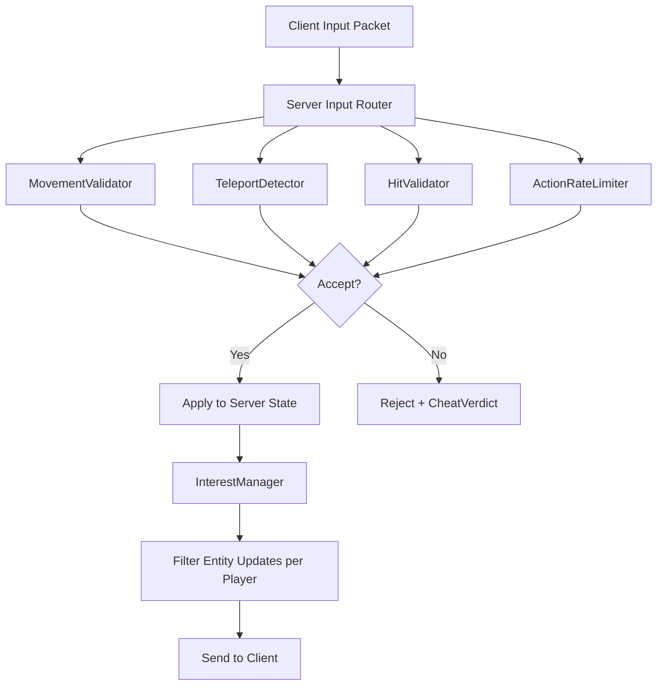

# Anti-Cheat & Server Validation Design (task-016)

## Background

The `aether-security` crate currently defines signal/descriptor types for anti-cheat
(`CheatSignal`, `InputPlausibility`, `CheatVerdict`) and rate limiting (`RateLimit`,
`RateLimitBucket`), but has no enforcement logic. Clients can still send arbitrary
state to the server without server-side validation. This task adds the actual
validation engine that runs on the authoritative server to detect and reject
cheating.

## Why

A VR metaverse with competitive worlds requires server-authoritative validation to
prevent:
- Speed hacking (players exceeding physics-allowed velocity)
- Teleportation exploits (impossible position jumps between frames)
- Client-side physics overrides (clients injecting false positions)
- Information leaks (hidden entities sent to unauthorized clients)
- Hit registration exploits (impossible hit claims)
- Action flooding (spamming actions faster than allowed cooldowns)
- WASM sandbox escapes (scripts requesting disallowed capabilities)

## What

Add five new modules to `aether-security`:

| Module | Responsibility |
|---|---|
| `movement_validator` | Validates per-tick velocity/acceleration against physics limits |
| `teleport_detection` | Detects impossible position jumps between server ticks |
| `interest_management` | Controls which entities are visible to which players |
| `hit_validation` | Server-side hit registration verification |
| `action_rate_limiter` | Token-bucket rate limiter with per-action cooldowns |

## How

### Architecture

All validators are pure functions or lightweight structs with no external I/O.
They receive server-authoritative state and client-claimed state, returning a
typed result (accept/reject with reason). This makes them easily testable and
composable.

### Module Details

#### movement_validator

- `MovementConfig`: max speed, max acceleration, tolerance factor (all configurable)
- `MovementValidator::validate(prev_pos, new_pos, dt, config) -> ValidationResult`
- Computes velocity = distance / dt, rejects if > max_speed * tolerance
- Computes acceleration from velocity delta, rejects if > max_acceleration * tolerance

#### teleport_detection

- `TeleportDetector`: stateful per-entity tracker holding last known position + timestamp
- `TeleportDetector::check(entity_id, new_pos, timestamp) -> TeleportResult`
- Flags if distance between consecutive positions exceeds physically possible displacement
- Supports configurable max displacement per tick

#### interest_management

- `InterestZone`: defines a spatial region (sphere) with an access-control list
- `InterestManager`: holds zones, determines entity visibility per player
- `InterestManager::visible_entities(player_id, player_pos, all_entities) -> Vec<EntityId>`
- Entities outside the player's interest radius are culled
- Hidden entities (e.g., invisible players) are filtered unless the viewer has permission

#### hit_validation

- `HitClaim`: client-submitted hit data (attacker, target, weapon, timestamp, positions)
- `HitValidator::validate(claim, server_state) -> HitResult`
- Checks: weapon range, line-of-sight plausibility, timing window, target alive

#### action_rate_limiter

- Token-bucket algorithm per (player, action) pair
- `ActionRateLimiter::try_consume(player_id, action, now) -> RateLimitResult`
- Configurable tokens_per_second and burst_capacity per action type
- Returns remaining tokens or rejection with retry-after duration

### Constants

All default limits are defined as constants at file top, overridable via
environment variables at service startup:
- `DEFAULT_MAX_SPEED`: 20.0 m/s
- `DEFAULT_MAX_ACCELERATION`: 50.0 m/s^2
- `DEFAULT_SPEED_TOLERANCE`: 1.1 (10% tolerance)
- `DEFAULT_MAX_TELEPORT_DISTANCE`: 100.0 m
- `DEFAULT_INTEREST_RADIUS`: 200.0 m
- `DEFAULT_MAX_HIT_RANGE`: 100.0 m
- `DEFAULT_HIT_TIMING_WINDOW_MS`: 500
- `DEFAULT_RATE_LIMIT_BURST`: 10 tokens

### Test Design

Each module has comprehensive unit tests covering:
- Normal valid input (accept)
- Boundary values (exactly at limit)
- Clear violations (reject)
- Edge cases (zero delta time, zero distance, entity not found)
- Multiple sequential checks (stateful modules)

Tests are written first in each module's `#[cfg(test)]` block before implementation.

### API Design

All public types derive `Debug, Clone` for ergonomics. Error types implement
`Display` and `Error`. Results use dedicated enums rather than `Result<(), E>`
to carry structured accept/reject information.
