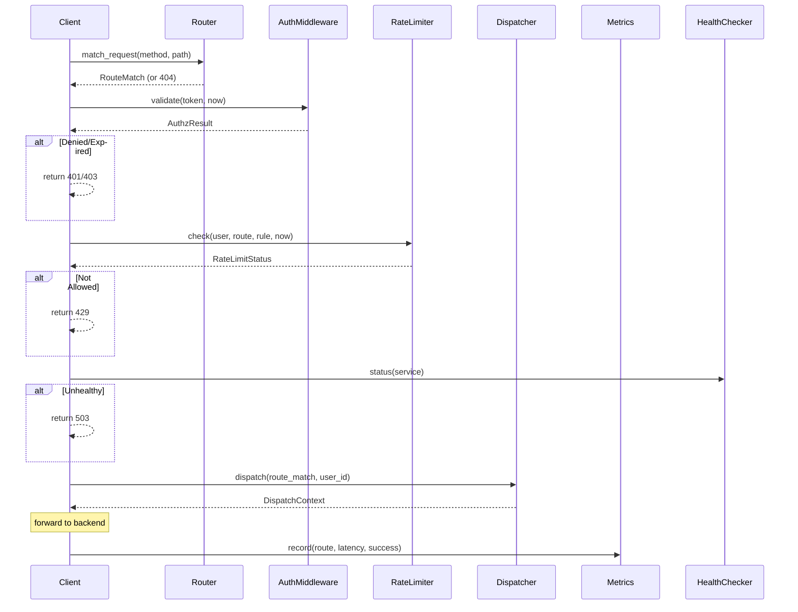

# API Gateway & Edge Routing Design

## Background

The `aether-gateway` crate currently defines data contracts for auth validation, rate limiting, geo-routing, and relay sessions, plus a large `BackendRuntime` that orchestrates cross-service workflows. However, it lacks an actual HTTP routing runtime: there is no request router, no auth middleware pipeline, no per-user rate limiter, no service dispatch layer, no health-check system, and no request metrics.

## Why

Every multiplayer request (world join, chat, economy, UGC upload, social) enters through the API gateway. Without a routing runtime the gateway cannot:

- Match incoming HTTP requests to backend services.
- Enforce authentication before requests reach services.
- Protect services from abuse via rate limiting.
- Monitor downstream service availability.
- Collect latency and error metrics for observability.

## What

Add five new modules to `aether-gateway`:

| Module | Responsibility |
|---|---|
| `router.rs` | Path/method matching, route table, wildcard & parameterised segments |
| `middleware.rs` | Auth validation pipeline, rate-limit enforcement |
| `dispatch.rs` | Resolve a matched route to a `ServiceTarget`, build dispatch context |
| `health.rs` | Track per-service health state, transition logic |
| `metrics.rs` | Request counters, latency histograms, error-rate tracking |

## How

### Architecture

```
Incoming Request
       |
       v
  +---------+     +------------+     +----------+     +---------+
  | Router  | --> | Middleware  | --> | Dispatch | --> | Backend |
  +---------+     | (auth,     |     +----------+     | Service |
                  |  rate-limit)|                      +---------+
                  +------------+
                        |
                  +----------+
                  | Metrics  |
                  +----------+
                        |
                  +----------+
                  | Health   |
                  +----------+
```

### Router (`router.rs`)

Matches requests against a table of `Route` entries.

```rust
pub struct Route {
    pub path_pattern: String,      // "/api/v1/worlds/:id"
    pub method: HttpMethod,
    pub service: ServiceTarget,
    pub auth_required: bool,
    pub rate_limit: Option<RateLimitRule>,
}
```

Path matching supports:
- Exact match: `/api/v1/health`
- Parameterised: `/api/v1/worlds/:world_id`
- Wildcard: `/api/v1/ugc/*`

The router tries routes in registration order and returns the first match plus extracted path parameters.

### Middleware (`middleware.rs`)

Two middleware functions run in sequence:

1. **Auth middleware** - If `route.auth_required`, validates the `Token` against an `AuthValidationPolicy`. Checks expiry, issuer whitelist, and signature flag. Returns `AuthzResult`.

2. **Rate-limit middleware** - Uses a token-bucket algorithm per (user, route) pair. Each bucket tracks remaining tokens and last refill time. Returns `RateLimitStatus`.

### Dispatch (`dispatch.rs`)

Maps a matched route to a `ServiceTarget` enum variant and builds a `DispatchContext` containing extracted path params, authenticated user, and target service.

```rust
pub enum ServiceTarget {
    WorldServer { zone_id: String },
    AuthService,
    SocialService,
    EconomyService,
    UgcService,
    RegistryService,
}
```

### Health (`health.rs`)

Tracks per-service health with a state machine:

```
Healthy --> Degraded --> Unhealthy --> Healthy
```

Each service has a `ServiceHealth` with consecutive-failure count, last-check timestamp, and current state. Configurable thresholds control transitions.

### Metrics (`metrics.rs`)

In-memory counters for:
- Total requests per route
- Error count per route
- Latency samples (min, max, sum, count for average computation)
- Active request gauge

No external dependencies; just plain Rust data structures.

## Database Design

Not applicable. All state is in-memory and ephemeral. Persistent metrics and health history are out of scope for this phase.

## API Design

All types are library-level Rust APIs. No HTTP server is started; the routing logic is abstract so it can be plugged into axum, actix, or any other framework.

Key public API:

```rust
// Router
Router::new() -> Router
Router::add_route(route: Route) -> &mut Self
Router::match_request(method, path) -> Option<RouteMatch>

// Middleware
AuthMiddleware::new(policy: AuthValidationPolicy) -> Self
AuthMiddleware::validate(token: &Token, now_ms: u64) -> AuthzResult

RateLimiter::new() -> Self
RateLimiter::check(user_id: u64, route_id: &str, rule: &RateLimitRule, now_ms: u64) -> RateLimitStatus

// Dispatch
Dispatcher::new() -> Self
Dispatcher::dispatch(route_match: &RouteMatch, user_id: Option<u64>) -> DispatchContext

// Health
HealthChecker::new(config: HealthCheckConfig) -> Self
HealthChecker::report_success(service: &str, now_ms: u64)
HealthChecker::report_failure(service: &str, now_ms: u64)
HealthChecker::status(service: &str) -> ServiceHealthState

// Metrics
RequestMetrics::new() -> Self
RequestMetrics::record(route: &str, latency_ms: u64, success: bool)
RequestMetrics::snapshot(route: &str) -> Option<RouteMetricsSnapshot>
```

## Test Design

All tests are in-memory with no external dependencies.

| Area | Test Cases |
|---|---|
| Router | Exact match, param extraction, wildcard, method mismatch, no match, multiple routes priority |
| Auth | Valid token, expired token, unknown issuer, signature-required flag |
| Rate limit | Within limit, burst, exceeded, refill over time |
| Dispatch | Each service target variant, param forwarding |
| Health | Healthy-to-degraded, degraded-to-unhealthy, recovery, threshold config |
| Metrics | Record and snapshot, multiple routes, error counting |

## Workflow


