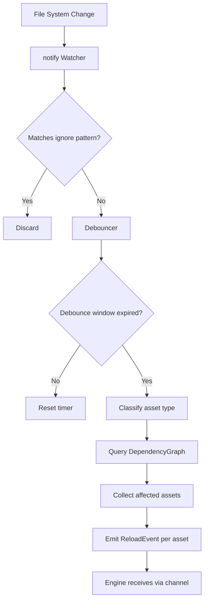

# Asset Hot-Reloading System

## Background

The `aether-asset-pipeline` crate handles asset import (glTF), processing, compression, hashing, and bundle packaging. During development, artists and developers frequently modify assets (meshes, textures, materials, scripts, audio). Without hot-reloading, every change requires a manual re-import and engine restart, severely impacting iteration speed.

## Why

- Reduce asset iteration time from minutes to seconds
- Enable live preview of asset changes in the VR editor and runtime
- Eliminate manual re-import steps during development
- Support dependency-aware reloading (e.g., material references a texture; changing the texture reloads the material)

## What

A `hot_reload` module within `aether-asset-pipeline` that:

1. Watches configured asset directories for file system changes
2. Debounces rapid changes to avoid redundant reprocessing
3. Identifies asset types from file extensions
4. Triggers re-import/re-processing of changed assets
5. Tracks asset dependencies via a DAG and cascades reloads
6. Notifies the engine of reloaded assets via a channel-based event system

## How

### Architecture

```
File System
    |
    v
[notify crate Watcher] -- raw FS events -->
[Debouncer] -- debounced events -->
[AssetTypeClassifier] -- typed change -->
[DependencyGraph (DAG)] -- cascade resolution -->
[ReloadEvent channel] -- events to engine
```

### Module Structure

```
hot_reload/
  mod.rs        - public API, HotReloadWatcher, config
  asset_type.rs - AssetType enum, extension classification
  debouncer.rs  - change debouncing logic
  dependency.rs - DAG-based dependency tracking
  events.rs     - ReloadEvent, ChangeKind enums
```

### Configuration (Environment Variables)

| Variable | Default | Description |
|---|---|---|
| AETHER_HOT_RELOAD_ENABLED | "true" | Enable/disable hot reload |
| AETHER_HOT_RELOAD_DEBOUNCE_MS | "300" | Debounce window in ms |
| AETHER_HOT_RELOAD_WATCH_PATHS | "./assets" | Comma-separated watch paths |
| AETHER_HOT_RELOAD_IGNORE_PATTERNS | "*.tmp,*.swp,*~" | Comma-separated ignore globs |

### Key Types

```rust
enum AssetType { Mesh, Texture, Script, Material, Audio, Unknown }
enum ChangeKind { Created, Modified, Deleted }
struct ReloadEvent { path, asset_type, change_kind, affected_dependents }
struct HotReloadConfig { enabled, debounce_ms, watch_paths, ignore_patterns }
struct DependencyGraph { edges: HashMap<PathBuf, HashSet<PathBuf>> }
struct HotReloadWatcher { watcher, config, dependency_graph, event_rx }
```

### Workflow



### Dependency Graph

A directed acyclic graph where an edge `A -> B` means "A depends on B". When B changes, all ancestors of B (assets that depend on B) are also marked for reload. This is a simple BFS/DFS traversal of reverse edges.

Example: `material.toml` references `diffuse.png`. Edge: `material.toml -> diffuse.png`. When `diffuse.png` changes, both `diffuse.png` and `material.toml` are reloaded.

## Test Design

1. **AssetType classification** - verify all supported extensions map correctly
2. **Debouncer** - verify rapid events within window are coalesced; events after window expire
3. **Ignore patterns** - verify glob matching for tmp/swp/~ files
4. **DependencyGraph** - add/remove edges, query dependents, cascade detection, cycle prevention
5. **ReloadEvent construction** - correct fields populated
6. **HotReloadConfig** - env var parsing, defaults
7. **Integration** - file watcher detects real file changes (uses temp directories)
