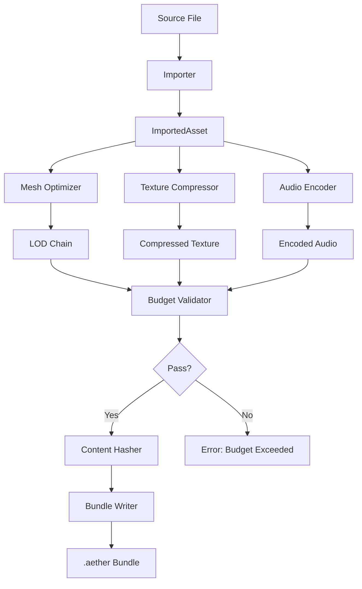

# Asset Pipeline Processing Design

## Background

The `aether-asset-pipeline` crate currently defines type-level contracts (BundleFormat, LodDefinition, CompressionFormat, ImportTask) but contains no actual processing logic. Assets cannot be imported, optimized, compressed, bundled, or validated.

## Why

A VR engine requires a complete asset pipeline to:
- Import 3D models from standard formats (glTF 2.0)
- Generate level-of-detail meshes for performance scaling
- Compress textures for GPU-efficient formats (BC7/ASTC/ETC2)
- Encode audio efficiently (Opus)
- Package assets into distributable bundles with integrity verification
- Enforce budgets to prevent oversized assets from degrading performance

## What

Implement seven processing modules:

1. **glTF Import** (`gltf.rs`) - Parse glTF 2.0, extract mesh/material/texture data
2. **Mesh Optimization** (`mesh.rs`) - LOD generation via vertex decimation
3. **Texture Compression** (`texture.rs`) - Basis Universal transcoding abstraction
4. **Audio Encoding** (`audio.rs`) - WAV-to-Opus conversion abstraction
5. **Bundle Packaging** (`bundle_writer.rs`) - .aether bundle format with manifest
6. **Content Hashing** (`hash.rs`) - SHA-256 content-addressed storage
7. **Budget Validation** (`budget.rs`) - Polygon/material/texture memory limits

## How

### Architecture



### Module Design

#### 1. glTF Import (`gltf.rs`)

Uses the `gltf` crate to parse glTF 2.0 files (both `.gltf` and `.glb`).

**Key types:**
- `GltfImporter` - Main importer struct
- `ImportedScene` - Collection of meshes, materials, textures
- `ImportedMesh` - Vertex/index data with name
- `Vertex` - Position, normal, UV
- `ImportedMaterial` - PBR material properties
- `ImportedTexture` - Raw image data with dimensions

**Flow:** `gltf bytes -> gltf::Gltf parse -> extract buffers -> iterate meshes -> build ImportedScene`

#### 2. Mesh Optimization (`mesh.rs`)

LOD generation via quadric error metric decimation (trait-abstracted).

**Key types:**
- `MeshOptimizer` trait - Abstraction for decimation backends
- `SimpleMeshOptimizer` - Basic uniform decimation (built-in)
- `LodChain` - Vec of meshes at decreasing detail levels
- `LodLevel` - Mesh data + target ratio

**Algorithm:** For each LOD level, apply the target ratio to reduce triangle count. The built-in optimizer uses a simple every-Nth-triangle removal; real backends (meshoptimizer) can be feature-gated.

#### 3. Texture Compression (`texture.rs`)

Trait-based texture compression abstraction.

**Key types:**
- `TextureCompressor` trait - Abstraction for compression backends
- `CompressedTexture` - Compressed data + format tag
- `TextureInput` - Raw RGBA pixels + dimensions

The built-in implementation stores raw data with a format tag. Actual Basis Universal compression is behind a feature gate.

#### 4. Audio Encoding (`audio.rs`)

WAV-to-Opus encoding abstraction.

**Key types:**
- `AudioEncoder` trait - Abstraction for encoding backends
- `AudioInput` - PCM samples + sample rate + channels
- `EncodedAudio` - Compressed bytes + codec tag
- `AudioCodec` enum - Opus, Vorbis, Pcm

#### 5. Bundle Packaging (`bundle_writer.rs`)

Packages processed assets into the `.aether` bundle format.

**Bundle format (binary):**
```
[4 bytes: magic "AETH"]
[4 bytes: version u32 LE]
[4 bytes: manifest_length u32 LE]
[manifest_length bytes: JSON manifest]
[entry data...]
```

**Key types:**
- `BundleWriter` - Builds bundle from entries
- `BundleEntry` - Named data blob with content hash
- `AssetBundle` - Complete bundle (manifest + entries)
- `WrittenBundle` - Serialized bundle bytes

#### 6. Content Hashing (`hash.rs`)

SHA-256 hashing for content-addressed storage and integrity verification.

**Key types:**
- `ContentHasher` - Computes SHA-256 hex digests
- `HashedAsset` - Asset data paired with its hash

#### 7. Budget Validation (`budget.rs`)

Enforces asset budgets to prevent oversized content.

**Key types:**
- `AssetBudget` - Configurable limits (polygons, materials, texture memory, total size)
- `BudgetReport` - Validation result with per-check details
- `BudgetViolation` - Describes which limit was exceeded

**Defaults from environment variables:**
- `AETHER_MAX_POLYGONS` (default: 500,000)
- `AETHER_MAX_MATERIALS` (default: 32)
- `AETHER_MAX_TEXTURE_MEMORY` (default: 256 MB)
- `AETHER_MAX_TOTAL_SIZE` (default: 512 MB)

### Test Design

All tests use programmatic test data (no external files):

- **glTF**: Construct minimal glTF JSON + binary buffer in-memory
- **Mesh**: Create simple triangle/quad meshes, verify LOD reduces vertex count
- **Texture**: Create small RGBA buffers, verify compression round-trip
- **Audio**: Create PCM sample buffers, verify encoding
- **Bundle**: Build bundle from entries, verify magic bytes and manifest parsing
- **Hash**: Hash known data, verify against precomputed SHA-256
- **Budget**: Test within-limits and exceeding-limits scenarios

### Dependencies

```toml
gltf = "1"
sha2 = "0.10"
serde = { version = "1", features = ["derive"] }
serde_json = "1"
```

Heavy native dependencies (meshoptimizer, basis_universal, opus) are behind feature gates with trait abstractions for testability.
