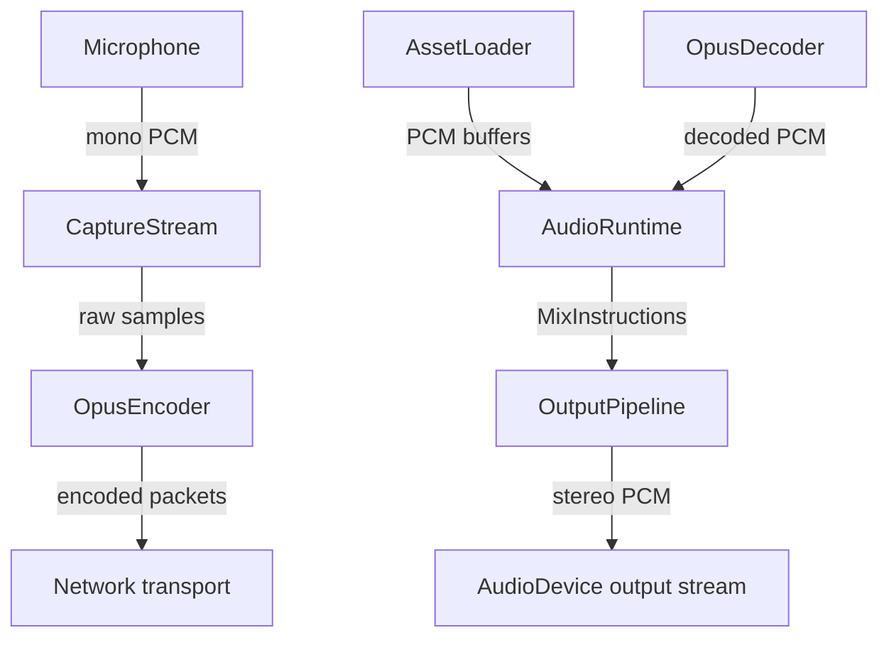

# Audio Playback Backend Design

## Background

The `aether-audio` crate contains spatial audio policy and routing primitives: HRTF profiles, attenuation models, room acoustics, Opus codec configuration, and voice channel management. An `AudioRuntime` produces mix instructions and placeholder Opus packets, but no actual audio I/O exists. Sound never plays, microphones never capture, and no codec actually runs.

## Why

Without an audio I/O backend, the spatial audio system is purely a scheduling/policy engine. To deliver a working VR audio experience, we need:
- Real-time audio output so users hear spatialized sound
- Microphone capture for voice chat
- Codec encode/decode for network voice transport
- Asset loading for sound effects (WAV, OGG)
- A mixing pipeline that connects the existing `AudioRuntime` to actual hardware

## What

Five new modules in `crates/aether-audio/src/`:

| Module | Purpose |
|--------|---------|
| `device.rs` | Audio device enumeration and stream management via `cpal` |
| `codec.rs` | Opus encode/decode abstraction with trait + stub implementation |
| `capture.rs` | Microphone input capture pipeline |
| `loader.rs` | WAV/OGG file loading into PCM sample buffers |
| `output.rs` | Output pipeline connecting AudioRuntime mixer to device output |

## How

### Architecture



### Module Details

#### device.rs - Audio Device Management
- Wraps `cpal` for host/device enumeration
- `AudioDeviceManager`: enumerates input/output devices, opens streams
- `OutputHandle`: holds a `cpal::Stream` for output playback
- `InputHandle`: holds a `cpal::Stream` for microphone capture
- Configuration via env vars: `AETHER_AUDIO_SAMPLE_RATE`, `AETHER_AUDIO_BUFFER_SIZE`
- Constants: `DEFAULT_SAMPLE_RATE = 48000`, `DEFAULT_BUFFER_SIZE = 1024`, `DEFAULT_CHANNELS = 2`

#### codec.rs - Opus Codec Abstraction
- `trait AudioCodec`: `encode(&mut self, pcm: &[f32]) -> Result<Vec<u8>>`, `decode(&mut self, data: &[u8]) -> Result<Vec<f32>>`
- `StubCodec`: passthrough implementation for testing (converts f32 <-> bytes)
- `OpusCodecWrapper`: real implementation (behind feature flag if native deps are problematic)
- Uses existing `OpusConfig` for settings

#### capture.rs - Microphone Capture
- `CaptureConfig`: sample rate, channels, buffer size
- `CaptureStream`: manages a `cpal` input stream, collects samples into a ring buffer
- `CaptureCallback`: processes input data from cpal callback
- Thread-safe sample retrieval via `Arc<Mutex<VecDeque<f32>>>`

#### loader.rs - Asset Loading
- `AudioAsset`: holds PCM data + metadata (sample rate, channels, duration)
- `load_wav(path) -> Result<AudioAsset>` using `hound`
- `load_ogg(path) -> Result<AudioAsset>` using `lewton`
- `load_auto(path) -> Result<AudioAsset>` dispatches by extension
- Resampling utility if asset sample rate differs from device rate

#### output.rs - Output Pipeline
- `OutputPipeline`: connects `AudioRuntime` mix instructions to device output
- `SpatialRenderer`: applies HRTF parameters to produce stereo output
- Ring buffer for feeding samples to cpal output callback
- Gain application and stereo panning from `AudioMixInstruction`

### Configuration (Environment Variables)
- `AETHER_AUDIO_SAMPLE_RATE` - Output sample rate (default: 48000)
- `AETHER_AUDIO_BUFFER_SIZE` - Audio buffer size in frames (default: 1024)
- `AETHER_AUDIO_INPUT_CHANNELS` - Capture channel count (default: 1)
- `AETHER_AUDIO_OUTPUT_CHANNELS` - Output channel count (default: 2)

### Dependencies
```toml
cpal = "0.15"
hound = "3.5"
lewton = "0.10"
```

Opus is handled via a trait abstraction with a stub implementation. Real Opus can be added later behind a feature flag when `audiopus` native library availability is confirmed.

## Test Design

### Unit Tests (no hardware required)
- **codec.rs**: Encode/decode round-trip with stub codec; verify data integrity
- **loader.rs**: Load WAV from in-memory bytes; verify sample count, channels, sample rate. Load OGG similarly.
- **output.rs**: SpatialRenderer applies HRTF gain/panning correctly; verify stereo output from mono input
- **device.rs**: DeviceConfig construction, default values, env var overrides
- **capture.rs**: CaptureConfig construction, ring buffer behavior

### Integration Tests (require hardware, marked `#[ignore]`)
- Device enumeration returns at least one output device
- Open and close an output stream without panic
- Open and close an input stream without panic
- Full pipeline: load WAV -> mix -> output (short duration)

All hardware-dependent tests are gated with `#[ignore]` so `cargo test` passes in CI without audio hardware.
