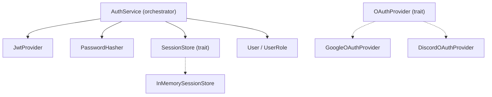

# Auth Service Implementation Design Document

**Task**: task-009
**Date**: 2026-03-08
**Status**: Implementation
**Crate**: `aether-security`

---

## Background

The `aether-security` crate currently provides anti-cheat, rate limiting, transport hardening, and encryption primitives. The `aether-gateway` crate defines auth validation hooks (`Token`, `AuthValidationPolicy`, `AuthzResult`) but there is no actual authentication implementation. The identity-auth-service design doc (task-011) outlines a full Go-based microservice, but the Rust security crate needs in-process auth primitives for JWT handling, password hashing, OAuth2 configuration, and session management.

## Why

- World servers and gateway need to validate JWTs in-process without calling an external service for every request
- Password hashing must use a modern KDF (argon2) for user credential storage
- OAuth2 provider configuration needs a trait-based extensible design
- Session management with refresh token rotation prevents token theft
- All auth config must be driven by environment variables (no hardcoded secrets)

## What

Add the following modules to `aether-security`:

1. **`jwt`** - JWT token issuance and validation using HMAC-SHA256
2. **`oauth`** - OAuth2 provider trait and concrete Google/Discord configs
3. **`password`** - Argon2id password hashing and verification
4. **`session`** - In-memory session store with expiry and refresh token rotation
5. **`user`** - User model with UUID, email, roles
6. **`auth`** - Orchestration service tying JWT + password + session together

## How

### Architecture



### Module Design

#### `user.rs`
- `User` struct: id (Uuid), email, display_name, role, password_hash (Option), created_at
- `UserRole` enum: User, Moderator, Admin with Display/FromStr

#### `jwt.rs`
- `JwtConfig` loaded from env vars (`JWT_SECRET`, `JWT_EXPIRY_SECS`, `JWT_REFRESH_EXPIRY_SECS`)
- `Claims` struct with sub, role, exp, iat, jti fields
- `JwtProvider` with `create_access_token`, `create_refresh_token`, `validate_token`, `decode_claims`
- Uses `jsonwebtoken` crate with HS256 algorithm

#### `password.rs`
- `PasswordConfig` loaded from env vars (`PASSWORD_HASH_MEMORY_KB`, `PASSWORD_HASH_ITERATIONS`)
- `PasswordHasher` with `hash_password` and `verify_password`
- Uses `argon2` crate with Argon2id variant

#### `session.rs`
- `Session` struct: id, user_id, refresh_token_hash, expires_at, created_at
- `SessionStore` trait with create, find, revoke, revoke_all_for_user
- `InMemorySessionStore` implementation for testing and single-node use
- Refresh token rotation: old session revoked, new session created

#### `oauth.rs`
- `OAuthProvider` trait: provider_name, auth_url, token_url, client_id, client_secret, scopes
- `OAuthConfig` struct with client_id, client_secret, redirect_uri
- `GoogleOAuthProvider` and `DiscordOAuthProvider` implementations
- Loaded from env vars (`OAUTH_GOOGLE_CLIENT_ID`, etc.)

#### `auth.rs`
- `AuthService` orchestrator holding JwtProvider, PasswordHasher, SessionStore
- `register` - hash password, return User
- `login` - verify password, create session, return TokenPair
- `refresh` - validate refresh token, rotate session, return new TokenPair
- `logout` - revoke session
- `validate` - decode and validate access token claims

### Environment Variables

| Variable | Description | Default |
|---|---|---|
| `JWT_SECRET` | HMAC secret for JWT signing | `dev-secret-do-not-use-in-production` |
| `JWT_EXPIRY_SECS` | Access token TTL in seconds | `3600` |
| `JWT_REFRESH_EXPIRY_SECS` | Refresh token TTL in seconds | `604800` |
| `OAUTH_GOOGLE_CLIENT_ID` | Google OAuth2 client ID | empty |
| `OAUTH_GOOGLE_CLIENT_SECRET` | Google OAuth2 client secret | empty |
| `OAUTH_DISCORD_CLIENT_ID` | Discord OAuth2 client ID | empty |
| `OAUTH_DISCORD_CLIENT_SECRET` | Discord OAuth2 client secret | empty |
| `PASSWORD_HASH_MEMORY_KB` | Argon2 memory cost (KB) | `65536` |
| `PASSWORD_HASH_ITERATIONS` | Argon2 time cost (iterations) | `3` |

### Dependencies

```toml
jsonwebtoken = "9"
argon2 = "0.5"
rand = "0.8"
serde = { version = "1", features = ["derive"] }
serde_json = "1"
chrono = { version = "0.4", features = ["serde"] }
uuid = { version = "1", features = ["v4", "serde"] }
sha2 = "0.10"
hex = "0.4"
```

### Test Design

| Module | Test Cases |
|---|---|
| `jwt` | Create token, validate valid token, reject expired token, reject tampered token, extract claims, custom expiry |
| `password` | Hash password, verify correct password, reject wrong password, different hashes for same password |
| `user` | UserRole display/parse, user creation, role ordering |
| `session` | Create session, find session, revoke session, revoke all for user, expired session not found |
| `oauth` | Google provider config, Discord provider config, auth URL construction |
| `auth` | Full register/login/refresh/logout flow, login with wrong password, refresh with invalid token, validate expired token |

All tests use in-memory stores and do not require external services.

### File Size Budget

Each module file targets under 300 lines. The largest will be `auth.rs` (orchestration + tests) at roughly 400 lines, well under the 1000-line limit.
