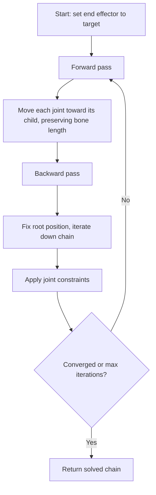

# Avatar IK Solver Design (task-005)

## Background

The `aether-avatar` crate currently provides data models for IK configuration, tracking sources, blend curves, LOD profiles, and viseme curves. However, it lacks the actual solver algorithms needed to drive avatar body pose from VR tracking inputs. This document describes the design for the IK solver system and supporting subsystems.

## Why

VR avatars need real-time inverse kinematics to translate sparse tracking data (headset + controllers, optionally hips and feet trackers) into full-body skeleton poses. Without a solver, the existing data models are inert structures with no runtime behavior.

## What

Implement the following subsystems in `aether-avatar`:

1. **FABRIK solver** -- Forward And Backward Reaching Inverse Kinematics for bone chain solving
2. **3-point IK** -- Head + 2 hands to full upper body estimate
3. **6-point IK** -- Head + 2 hands + hip + 2 feet to full body
4. **Joint angle constraints** -- Per-joint angular limits and twist constraints
5. **T-pose calibration** -- Calibrate skeleton proportions from a reference pose
6. **Procedural foot placement** -- Ground plane detection for foot IK
7. **Animation state machine** -- Evaluate blend trees and state transitions
8. **Viseme evaluation** -- Blend shape weights from lip-sync frames

## How

### Module layout

```
crates/aether-avatar/src/
  lib.rs            -- module declarations + re-exports
  fabrik.rs         -- FABRIK algorithm (~300 lines)
  ik.rs             -- 3-point / 6-point solver interface (~250 lines)
  constraints.rs    -- joint angle constraint types + enforcement (~200 lines)
  calibration.rs    -- T-pose calibration logic (~200 lines)
  foot_placement.rs -- procedural foot IK (~150 lines)
  state_machine.rs  -- animation state machine evaluator (~250 lines)
  viseme.rs         -- viseme/blend shape evaluation (~150 lines)
  skeleton.rs       -- shared Bone/Skeleton types (~150 lines)
```

### Core data types

```rust
// skeleton.rs
pub struct Bone {
    pub position: [f32; 3],
    pub rotation: [f32; 4],  // quaternion [x, y, z, w]
    pub length: f32,
    pub parent: Option<usize>,
}

pub struct Skeleton {
    pub bones: Vec<Bone>,
    pub bone_names: Vec<String>,
}

pub struct IkTarget {
    pub position: [f32; 3],
    pub rotation: Option<[f32; 4]>,
}
```

### FABRIK algorithm detail



**Forward pass**: Starting from the end effector, move it to the target position, then walk backward up the chain. For each parent joint, place it at `child_position + direction_to_parent * bone_length`.

**Backward pass**: Fix the root bone at its original position, then walk forward down the chain. For each child joint, place it at `parent_position + direction_to_child * bone_length`.

**Convergence**: Repeat until the end effector is within a tolerance of the target, or a maximum iteration count is reached.

### Joint constraints

```rust
// constraints.rs
pub struct JointConstraint {
    pub min_angle: [f32; 3],  // euler-angle lower bounds (radians)
    pub max_angle: [f32; 3],  // euler-angle upper bounds (radians)
    pub twist_limit: f32,     // max twist rotation (radians)
}

pub struct ConstraintSet {
    pub constraints: Vec<(usize, JointConstraint)>,  // (bone_index, constraint)
}
```

Constraints are applied after each FABRIK pass by clamping the computed angle to the allowed range per axis. Twist is separated and clamped independently.

### 3-point and 6-point IK

**3-point** (head + 2 hands):
- Spine direction estimated from head position and a default hip offset
- Shoulders estimated from head rotation and arm length
- Each arm solved as a 2-bone FABRIK chain (upper arm + forearm)
- Spine bones interpolated between estimated hip and head

**6-point** (head + 2 hands + hip + 2 feet):
- Hip position directly from tracker; spine solved between hip and head
- Arms solved same as 3-point
- Each leg solved as a 2-bone FABRIK chain (thigh + shin)

### T-pose calibration

Given a `TrackingFrame` captured while the user stands in T-pose:
- Compute arm span from left hand to right hand (via head)
- Compute height from head to estimated floor
- Scale bone lengths proportionally from a reference skeleton

### Procedural foot placement

- Given a ground plane height (y=0 by default), if a foot target is below ground, clamp it to ground level and apply a toe rotation offset.
- If no foot trackers, estimate foot positions from hip + locomotion state.

### Animation state machine

Evaluates `ProceduralStateMachine` transitions:
- Maintains current state + active blend transitions
- `update(dt, input)` advances time, evaluates active blend curves
- Produces a set of `(state, weight)` pairs for the animation mixer

### Viseme evaluation

- Takes a `LipSyncFrame` and produces blend-shape weights for each viseme
- Smooths transitions between consecutive visemes with configurable interpolation time

## Test design

All tests are pure math -- no hardware or GPU required.

| Module | Test cases |
|--------|-----------|
| fabrik | Straight chain reaches target, already-at-target is no-op, unreachable target gets as close as possible, multi-iteration convergence |
| constraints | Clamp within range, already-valid unchanged, twist limit enforcement |
| ik | 3-point produces valid skeleton, 6-point with full tracking, target out of reach |
| calibration | T-pose sets arm lengths, height scaling, proportional scaling |
| foot_placement | Foot above ground unchanged, below ground clamped, no-tracker estimation |
| state_machine | Transition completes, blend weights sum to 1.0, no-input stays idle |
| viseme | Single viseme weight=1, transition blending, rest state |

## API design

Public API added to `lib.rs`:

```rust
// Re-exports from new modules
pub use skeleton::{Bone, Skeleton, IkTarget};
pub use fabrik::{FabrikSolver, FabrikConfig};
pub use ik::{solve_three_point, solve_six_point, IkResult};
pub use constraints::{JointConstraint, ConstraintSet};
pub use calibration::{CalibrationData, calibrate_from_tpose};
pub use foot_placement::{FootPlacement, foot_ik};
pub use state_machine::{AnimationStateMachine, AnimationOutput};
pub use viseme::{VisemeEvaluator, VisemeWeights};
```
