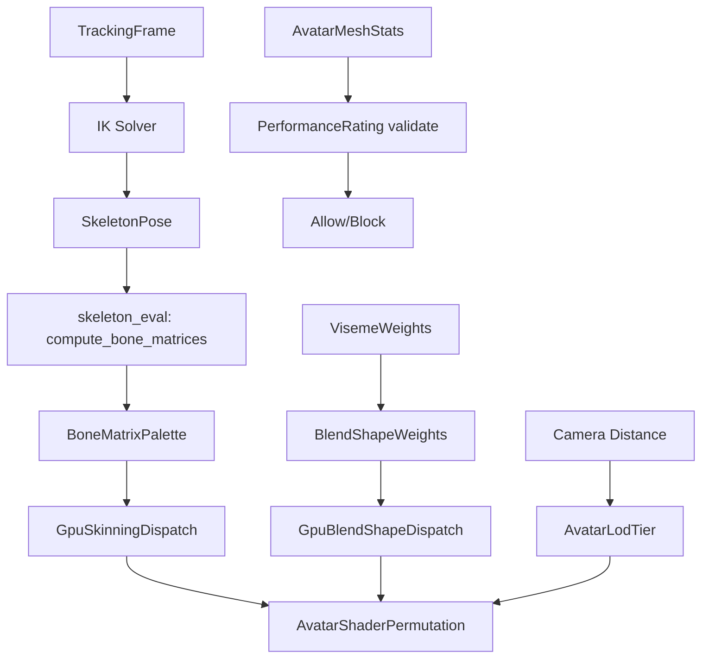

# Avatar Rendering Pipeline

## Background

The Aether VR engine requires avatar-specific GPU rendering types that describe how avatars are skinned, shaded, and LOD-managed on the GPU. The `aether-avatar` crate already contains IK solving, animation state machines, and basic LOD/rating types. This design adds the rendering pipeline description layer: GPU skinning, blend shapes, PBR shading with subsurface scattering, eye rendering, extended LOD tiers, skeleton evaluation, and performance budget enforcement.

## Why

Avatars are the most complex visual objects in a VR social platform. They require:
- GPU-accelerated skinning (compute shader) to handle hundreds of bones per frame
- Blend shape evaluation for facial expressions and visemes
- Specialized PBR shading with subsurface scattering for realistic skin at close range
- Eye rendering with refraction for the "window to the soul" effect
- Distance-based LOD to maintain frame budget when many avatars are visible
- Performance rating enforcement so user-created avatars do not destroy frame rates

## What

Add six new modules to `aether-avatar`:

| Module | Responsibility |
|---|---|
| `skinning.rs` | GPU skinning pipeline description: bone matrices, compute dispatch config |
| `blend_shapes.rs` | Blend shape target definitions, GPU evaluation parameters |
| `avatar_shader.rs` | PBR shading config with subsurface scattering and eye refraction |
| `avatar_lod.rs` | Extended LOD tiers (full mesh, simplified, billboard, dot) with transition config |
| `skeleton_eval.rs` | Skeleton evaluation: bone transform computation, matrix palette generation |
| `performance_rating.rs` | Performance budget enforcement: polygon limits per tier, validation |

## How

### GPU Skinning (`skinning.rs`)

```
SkinningMethod: enum { LinearBlend, DualQuaternion }
GpuSkinningConfig: workgroup size, max bones, max vertices, method
BoneMatrixPalette: Vec of 4x4 matrices for upload to GPU
SkinVertex: position, normal, bone indices (up to 4), bone weights
SkinningDispatch: vertex count, workgroup count, buffer bindings
```

### Blend Shapes (`blend_shapes.rs`)

```
BlendShapeTarget: name, vertex deltas (position + normal)
BlendShapeSet: collection of targets with max active count
GpuBlendShapeConfig: max targets, workgroup size
BlendShapeWeights: named weight map (0.0-1.0)
BlendShapeDispatch: target count, vertex count, buffer bindings
```

### Avatar Shader (`avatar_shader.rs`)

```
SubsurfaceScatteringConfig: scatter radius, profile (skin/wax/marble), color
EyeRefractionConfig: IOR, pupil size, iris texture layer, cornea roughness
AvatarMaterialConfig: base PBR + optional SSS + optional eye
AvatarShaderPermutation: feature flags -> shader variant selection
```

### Avatar LOD (`avatar_lod.rs`)

```
AvatarLodTier: FullMesh(<5m), Simplified(5-30m), Billboard(30-100m), Dot(100m+)
AvatarLodConfig: distance thresholds, hysteresis, transition duration
AvatarLodTransition: current tier, target tier, blend progress
select_lod_tier(): distance + previous tier -> new tier with hysteresis
```

### Skeleton Evaluation (`skeleton_eval.rs`)

```
BoneTransform: position, rotation (quat), scale
SkeletonPose: Vec of BoneTransform per bone
compute_bone_matrices(): pose + skeleton -> matrix palette
compute_world_transforms(): walk parent chain, produce world-space transforms
```

### Performance Rating (`performance_rating.rs`)

```
Polygon budgets per tier: S(10k), A(25k), B(50k), C(75k)
Material slot limits per tier
Bone count limits per tier
validate_avatar(): mesh stats -> rating + pass/fail against world minimum
PerformanceBudgetTable: configurable thresholds
```

## Test Design

Each module has comprehensive unit tests covering:
- Default construction and builder patterns
- Boundary conditions (max bones, zero vertices, out-of-range weights)
- LOD tier selection with hysteresis
- Performance validation pass/fail cases
- Matrix computation correctness (identity pose, single rotation)
- Blend shape weight clamping and normalization

## Module Interaction


