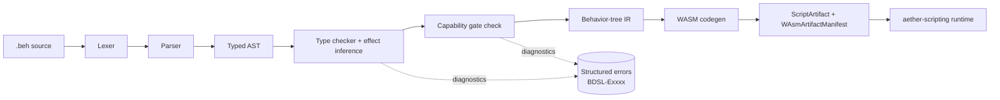

# Behavior DSL Specification (task-083)

**Project**: Aether — Agent-Native Engine
**Component**: Behavior DSL (`.beh` files)
**Version**: 0.1.0 (Draft)
**Status**: Language spec — authoritative reference
**Audience**: AI agents authoring behaviors; compiler authors (U07); engine integrators.

---

## Table of Contents

1. [Introduction](#1-introduction)
2. [Lexical structure](#2-lexical-structure)
3. [Grammar (EBNF)](#3-grammar-ebnf)
4. [Core types](#4-core-types)
5. [The 5-verb MVP](#5-the-5-verb-mvp)
6. [Behavior tree combinators](#6-behavior-tree-combinators)
7. [Typing rules](#7-typing-rules)
8. [Effect system](#8-effect-system)
9. [Capability tokens](#9-capability-tokens)
10. [Compilation pipeline](#10-compilation-pipeline)
11. [Worked examples](#11-worked-examples)
12. [Error-message catalogue](#12-error-message-catalogue)
13. [Non-goals](#13-non-goals)
14. [Versioning policy](#14-versioning-policy)

---

## 1. Introduction

### 1.1 Why a DSL

Aether is being repositioned as an **agent-native engine** — AI agents are first-class
authors of world content, not a bolted-on tooling layer. Agents need a language for
**behavior**: what an NPC does on tick, what a trigger fires, how a merchant haggles.

The obvious alternatives are rejected:

| Alternative | Why rejected |
|---|---|
| Raw WASM | Too large a surface; agents cannot audit their own safety; no effect tracking. |
| Rust (via `wasm32` target) | Full language means full abuse surface (closures, FFI, async). Compile times. |
| Lua / JS | Dynamic typing — agents cannot check their own programs before shipping. |
| YAML/JSON behavior trees | Not a language; every novel behavior needs a host-side extension. |

The Behavior DSL (`.beh`) is **narrow on purpose**:

- Typed: every expression has a type known at parse time.
- Effect-annotated: every call advertises what it touches (movement, network, …).
- Capability-gated: privileged effects require explicit opt-in in the module header.
- Single compile target: WASM module consumed by `aether-scripting`.

An agent who has read this document should be able to write a valid behavior in
**one shot**. The grammar fits on one screen. The verb set is five. The combinators
are six. The types are eight. There is no inheritance, no closures, no async.

### 1.2 Where it fits

```
agent author  ─►  .beh source  ─►  behc compiler  ─►  .wasm module  ─►  aether-scripting sandbox
                    (this spec)        (U07)              (artifact)       (existing runtime)
```

The sandbox (`crates/aether-scripting`) already enforces per-script caps on CPU,
memory, entity spawns per second, network RPCs per second, and storage writes per
second. The DSL's **capability tokens** map one-to-one onto those caps — a behavior
that does not declare `@caps(Network)` is compiled with the network host-import list
stubbed to a deny-trap, so the rate limiter never sees the call.

### 1.3 Design principles (non-negotiable)

1. **Tiny surface area.** Everything an agent can write must fit in one page of reference.
2. **Typed.** The compiler rejects shape errors before reaching WASM codegen.
3. **Effects annotated.** Each call carries a statically-known `Effect` set.
4. **Capabilities gate privilege.** `Network`, `Persistence`, `Economy` require tokens.
5. **Compiles to WASM.** One backend. No interpreter. No JIT-from-DSL.
6. **Structured errors.** Every diagnostic has a code, a source span, and a fix.

---

## 2. Lexical structure

### 2.1 Source file

A `.beh` source file is UTF-8 text. Line endings are LF or CRLF. Tabs are illegal
(the compiler rejects them with `BDSL-E0010`) — indentation is four spaces.

### 2.2 Tokens

| Token | Example |
|---|---|
| Identifier | `patrol_loop`, `target`, `waypoint_a` |
| Integer literal | `0`, `42`, `-7` |
| Float literal | `1.0`, `-3.14`, `0.5` |
| Bool literal | `true`, `false` |
| String literal | `"hello"`, `"quest.start"` — double-quoted, `\"` and `\\` escapes only |
| Vec3 literal | `vec3(1.0, 2.0, 3.0)` |
| Keyword | `behavior`, `on`, `let`, `if`, `else`, `return`, `sequence`, `selector`, `parallel`, `invert`, `retry`, `timeout`, `Success`, `Failure`, `Running` |
| Operator | `=`, `==`, `!=`, `<`, `<=`, `>`, `>=`, `+`, `-`, `*`, `/`, `&&`, `\|\|`, `!` |
| Punctuation | `(`, `)`, `{`, `}`, `,`, `:`, `->`, `@`, `.` |
| Comment | `# line comment` — no block comments |

Identifiers match `[a-z_][a-z0-9_]*`. Type names match `[A-Z][A-Za-z0-9]*`.
Identifiers are case-sensitive.

---

## 3. Grammar (EBNF)

The entire grammar fits on one screen. This is authoritative:

```ebnf
module        = module_header , { behavior_decl } ;

module_header = "@module" , "(" , string , ")" ,
                [ "@caps" , "(" , cap_list , ")" ] ,
                [ "@version" , "(" , string , ")" ] ;

cap_list      = cap , { "," , cap } ;
cap           = "Network" | "Persistence" | "Economy" ;

behavior_decl = "behavior" , ident , "{" , { tick_clause } , "}" ;

tick_clause   = "on" , "tick" , block
              | "on" , "event" , "(" , string , ")" , block ;

block         = "{" , { stmt } , tree_node , "}" ;

stmt          = let_stmt | expr_stmt ;
let_stmt      = "let" , ident , [ ":" , type ] , "=" , expr , ";" ;
expr_stmt     = expr , ";" ;

tree_node     = leaf_node | combinator ;

leaf_node     = call_expr | cond_expr | status_lit ;

combinator    = "sequence" , "{" , multi_body , "}"
              | "selector" , "{" , multi_body , "}"
              | "parallel" , "{" , multi_body , "}"
              | "invert"   , "{" , single_body , "}"
              | "retry"    , "(" , int , ")" , "{" , single_body , "}"
              | "timeout"  , "(" , int , ")" , "{" , single_body , "}" ;

(* Bodies may prefix zero or more let-statements (scoped to the body).
   multi_body has one or more tree children; single_body has exactly one. *)
multi_body    = { let_stmt } , tree_node , { tree_node } ;
single_body   = { let_stmt } , tree_node ;

cond_expr     = "if" , expr , "{" , tree_node , "}" ,
                [ "else" , "{" , tree_node , "}" ] ;

expr          = call_expr | bin_expr | lit | ident | field_access ;
call_expr     = ident , "(" , [ arg_list ] , ")" ;
arg_list      = expr , { "," , expr } ;
bin_expr      = expr , bin_op , expr ;
bin_op        = "==" | "!=" | "<" | "<=" | ">" | ">=" |
                "+"  | "-"  | "*"  | "/" | "&&" | "\|\|" ;
field_access  = ident , "." , ident ;

lit           = int | float | bool | string | vec3_lit | status_lit |
                record_lit ;
vec3_lit      = "vec3" , "(" , float , "," , float , "," , float , ")" ;
status_lit    = "Success" | "Failure" | "Running" ;
record_lit    = "{" , [ record_field , { "," , record_field } ] , "}" ;
record_field  = string , ":" , expr ;

type          = "Int" | "Float" | "Bool" | "String" | "EntityRef" |
                "Vec3" | "Timer" | "BehaviorStatus" ;

ident         = ? [a-z_][a-z0-9_]* ? ;
int           = ? -?[0-9]+ ? ;
float         = ? -?[0-9]+\.[0-9]+ ? ;
bool          = "true" | "false" ;
string        = ? "\"" { char } "\"" ? ;
```

Notes:
- A `behavior` must have **exactly one** `on tick` clause; it may have zero or more `on event` clauses.
- The **last statement of a block is the tree node** that the clause returns.
- Operator precedence: unary `!` `-` > `*` `/` > `+` `-` > comparison > `&&` > `||`.
- No parenthesised sub-trees — tree nesting is expressed only through combinators.
- A bare `Success`, `Failure`, or `Running` is a valid leaf tree node (useful as
  a default arm in `if/else` or as a terminal inside `selector`).
- `record_lit` and `list(...)` are the only container constructors. `record_lit`
  produces a value typed as `Map<String, Any>` (keys are `String`, values are any
  built-in type). `list(x_1, …, x_n)` (stdlib, §Appendix A) produces a
  homogeneous `List<T>`.

---

## 4. Core types

v1 has eight built-in types. No user-defined types.

| Type | Meaning | Literal form |
|---|---|---|
| `Int` | 64-bit signed integer | `42`, `-7` |
| `Float` | 64-bit IEEE 754 | `1.0`, `-3.14` |
| `Bool` | boolean | `true`, `false` |
| `String` | immutable UTF-8, bounded 4 KiB | `"hello"` |
| `EntityRef` | opaque handle to an engine entity | value produced by `spawn`, `self()`, `nearest_player()` |
| `Vec3` | 3-float world vector | `vec3(1.0, 0.0, 2.0)` |
| `Timer` | opaque monotonic clock handle | produced by `start_timer(ms)` |
| `BehaviorStatus` | tri-state result | `Success` / `Failure` / `Running` |

**Type rules in brief:**
- `Int` and `Float` do **not** implicitly convert. Use `to_float(x)` / `to_int(x)`.
- `String` is compared by byte equality. No concatenation in v1 (file a bug if needed).
- `EntityRef` and `Timer` are opaque — no arithmetic, no construction except through verbs.
- `Vec3` supports `+`, `-`, scalar `*` (only `Vec3 * Float` and `Float * Vec3`), `.x` `.y` `.z` field access.
- `BehaviorStatus` is the **only** type a tree node may yield. Leaves that return `()` are wrapped: `()` → `Success`.

---

## 5. The 5-verb MVP

These are the entire privileged verb set in v1. U07 ships these and only these.

### 5.1 `spawn`

```
spawn(prototype: String, position: Vec3) -> EntityRef
```

Creates a new entity from the named prototype at the given world position. Fails
with status `Failure` if the prototype is unknown or the world entity cap is hit.

- **Effect**: `{ Pure }` at the type level; runtime cap: entity-spawns-per-second.
- **Caps required**: none.

### 5.2 `move`

```
move(entity: EntityRef, to: Vec3, speed: Float) -> BehaviorStatus
```

Moves `entity` towards `to` at `speed` units per second, subject to physics. Returns
`Running` while the entity is in motion, `Success` on arrival, `Failure` if blocked
for longer than 2 s (pathfinding timeout).

- **Effect**: `{ Movement }`.
- **Caps required**: none.

### 5.3 `damage`

```
damage(target: EntityRef, amount: Int) -> BehaviorStatus
```

Applies `amount` damage to `target`. Returns `Success` if the target had a health
component and damage was applied; `Failure` if the target is dead or non-combatant.
`amount` must be `>= 0` (compile error otherwise if literal; runtime `Failure` if not).

- **Effect**: `{ Combat }`.
- **Caps required**: none.

### 5.4 `trigger`

```
trigger(event_name: String, data: Map<String, Any>) -> ()
```

Publishes a world event. `data` is a JSON-shaped record whose keys are `String` and
values are the built-in types. In source this is written as a bracketed record
literal: `{ "quest_id": "q7", "player": p }`.

- **Effect**: `{ Network }`.
- **Caps required**: `@caps(Network)`.

(A `trigger` that only fires to local ECS listeners still counts as `Network` —
it crosses the script/host boundary and is rate-limited by the same limiter.)

### 5.5 `dialogue`

```
dialogue(speaker: EntityRef, text: String, options: List<DialogueOption>) -> ChoiceId
```

Opens a dialogue panel on `speaker`, shows `text`, and offers the player the given
options. Blocks the behavior (returns `Running`) until the player chooses. Yields
a `ChoiceId` that can be compared against option ids.

A `DialogueOption` is a record literal with exactly two fields,
`"id": String` and `"label": String`, e.g. `{ "id": "buy", "label": "Buy sword" }`.

`ChoiceId` is a transparent alias for `String` — it can be compared against
string literals with `==` / `!=`. It is a distinct alias only so future versions
may add runtime tagging without changing source compatibility.

- **Effect**: `{ Pure }` at the type level. The UI open itself is a trusted op.
  A `dialogue` that gates a game-economy action must be followed by a call whose
  effect set includes `Economy` and therefore forces the module header to declare it.
- **Caps required**: none on `dialogue` itself.

---

## 6. Behavior tree combinators

All six combinators take children that yield `BehaviorStatus` and themselves yield
`BehaviorStatus`. The effect set of a combinator is the **union** of the effects of
its children (see §8).

| Combinator | Semantics |
|---|---|
| `sequence { a; b; c }` | Run `a`. If `Success`, run `b`. If `Success`, run `c`. Return `Running` while any child is `Running`. First `Failure` short-circuits to `Failure`. |
| `selector { a; b; c }` | Run `a`. If `Failure`, run `b`. If `Failure`, run `c`. First `Success` short-circuits to `Success`. |
| `parallel { a; b; c }` | Tick every child. Return `Success` when **all** children are `Success`. Any child `Failure` causes the parallel to return `Failure` and abort the remaining siblings on the next tick. |
| `invert { a }` | `Success` ↔ `Failure`. `Running` stays `Running`. |
| `retry(n) { a }` | On child `Failure`, retry up to `n` times (total `n+1` attempts). Returns `Failure` after the last attempt. `Success` and `Running` pass through. `n` must be a literal `Int` in `1..=32`. |
| `timeout(ms) { a }` | If child has not reached `Success` or `Failure` within `ms` milliseconds of first tick, abort and return `Failure`. `ms` must be a literal `Int` in `1..=600_000`. |

Combinators never reorder children. Children are evaluated left-to-right.

---

## 7. Typing rules

We use standard judgement form `Γ ⊢ e : τ ! E` where `τ` is the type and `E` is
the effect set. `Γ` is the type environment (let-bindings). `Σ` is the module-level
capability set (from `@caps(...)`).

Notation: `E ⊔ E'` denotes the combinator-style union defined in §8.1 —
identical to set union except that `{ Pure }` is absorbed by any non-pure set.

### 7.1 Literals

```
                                   ─────────────────────  (T-INT)
                                    Γ ⊢ n : Int ! {Pure}

                                   ───────────────────────  (T-FLOAT)
                                    Γ ⊢ f : Float ! {Pure}

                                   ──────────────────────  (T-BOOL)
                                    Γ ⊢ b : Bool ! {Pure}

                                   ────────────────────────  (T-STR)
                                    Γ ⊢ s : String ! {Pure}

                    Γ ⊢ x : Float ! E_x   Γ ⊢ y : Float ! E_y   Γ ⊢ z : Float ! E_z
                    ────────────────────────────────────────────────────  (T-VEC3)
                         Γ ⊢ vec3(x, y, z) : Vec3 ! E_x ⊔ E_y ⊔ E_z
```

### 7.2 Let-binding and variables

```
                   Γ ⊢ e : τ ! E          Γ(x) = τ
                ────────────────────      ─────────────────────  (T-VAR)
                  Γ, x:τ ⊢ … (T-LET)      Γ ⊢ x : τ ! {Pure}
```

Let is single-assignment. Re-binding is a compile error (`BDSL-E0006`).

### 7.3 The 5 verbs

```
                     Γ ⊢ p : String ! E_p    Γ ⊢ pos : Vec3 ! E_pos
                    ──────────────────────────────────────────────────  (T-SPAWN)
                       Γ ⊢ spawn(p, pos) : EntityRef ! E_p ⊔ E_pos

            Γ ⊢ e : EntityRef ! E_e   Γ ⊢ t : Vec3 ! E_t   Γ ⊢ s : Float ! E_s
           ────────────────────────────────────────────────────────────────────  (T-MOVE)
              Γ ⊢ move(e, t, s) : BehaviorStatus ! { Movement } ⊔ E_e ⊔ E_t ⊔ E_s

                     Γ ⊢ e : EntityRef ! E_e   Γ ⊢ a : Int ! E_a
                    ──────────────────────────────────────────────────  (T-DAMAGE)
                       Γ ⊢ damage(e, a) : BehaviorStatus ! { Combat } ⊔ E_e ⊔ E_a

          Γ ⊢ n : String ! E_n   Γ ⊢ d : Map<String, Any> ! E_d   Network ∈ Σ
         ───────────────────────────────────────────────────────────────────  (T-TRIGGER)
                      Γ ⊢ trigger(n, d) : () ! { Network } ⊔ E_n ⊔ E_d

     Γ ⊢ sp : EntityRef ! E_s   Γ ⊢ tx : String ! E_t   Γ ⊢ op : List<DialogueOption> ! E_o
    ──────────────────────────────────────────────────────────────────────────────────  (T-DIALOGUE)
                       Γ ⊢ dialogue(sp, tx, op) : ChoiceId ! E_s ⊔ E_t ⊔ E_o
```

The `Network ∈ Σ` premise on `T-TRIGGER` is the capability-gating rule. Likewise,
any future verb whose effect set intersects `{ Network, Persistence, Economy }`
carries a `cap ∈ Σ` premise. Failure raises `BDSL-E0004` (missing capability).

### 7.4 Combinators

```
              Γ ⊢ c_1 : BehaviorStatus ! E_1   …   Γ ⊢ c_n : BehaviorStatus ! E_n
              ───────────────────────────────────────────────────────────────  (T-SEQ)
                      Γ ⊢ sequence { c_1 … c_n } : BehaviorStatus ! E_1 ⊔ … ⊔ E_n
```

`selector`, `parallel` have identical rules to `sequence`.

```
                    Γ ⊢ c : BehaviorStatus ! E
                   ───────────────────────────────────  (T-INVERT)
                     Γ ⊢ invert { c } : BehaviorStatus ! E

           n : Int literal   1 ≤ n ≤ 32   Γ ⊢ c : BehaviorStatus ! E
          ──────────────────────────────────────────────────────────  (T-RETRY)
                 Γ ⊢ retry(n) { c } : BehaviorStatus ! E

          ms : Int literal   1 ≤ ms ≤ 600000   Γ ⊢ c : BehaviorStatus ! E
         ──────────────────────────────────────────────────────────────  (T-TIMEOUT)
                 Γ ⊢ timeout(ms) { c } : BehaviorStatus ! E
```

### 7.5 Conditionals

```
             Γ ⊢ g : Bool ! E_g    Γ ⊢ t : BehaviorStatus ! E_t    Γ ⊢ e : BehaviorStatus ! E_e
            ──────────────────────────────────────────────────────────────────────────────  (T-IF)
                  Γ ⊢ if g { t } else { e } : BehaviorStatus ! E_g ⊔ E_t ⊔ E_e
```

An `if` without `else` is sugar for `if g { t } else { Success }`.

### 7.6 Module well-formedness

A module `M` with header `@caps(C_1, …, C_k)` and behaviors `B_1 … B_m` is
well-formed iff, letting `Σ = { C_1, …, C_k }`:

- Every behavior type-checks under an environment with module caps `Σ`.
- For every tick/event body with effect set `E`, `E ∩ Privileged ⊆ Σ`. That is,
  no privileged effect is used whose capability is not declared. (See §8.3 for
  the `Privileged` set.)
- Any declared cap in `Σ` that is **not** used is a warning (`BDSL-W0001`) but
  not an error.

---

## 8. Effect system

### 8.1 The `Effect` enum

```
enum Effect {
    Pure,         // sentinel: used only to mean "no observable side effect"
    Movement,     // changes an entity's Transform
    Combat,       // mutates a Health / Damage component
    Network,      // publishes to the event bus or sends an RPC
    Persistence,  // writes to world-state storage
    Economy,      // mutates ledger balances / item ownership
}
```

Every call in the program has a statically-known **effect set** `E`.

- A pure call has `E = { Pure }`. Equivalently, `E \ { Pure } = ∅`.
- A combinator's effect set is `(⋃ E_child) \ { Pure }`, unless every child is
  pure in which case it is `{ Pure }`. (Pure never "taints" a non-pure union.)

This convention keeps the cap-gate check crisp: `Pure` is never in the privileged
set, so `Pure` alone never requires a capability.

### 8.2 Effect table for the 5 verbs

| Verb | Effects |
|---|---|
| `spawn` | `{ Pure }` (runtime-gated by entity-spawns-per-sec limiter, not by a cap) |
| `move` | `{ Movement }` |
| `damage` | `{ Combat }` |
| `trigger` | `{ Network }` |
| `dialogue` | `{ Pure }` (the UI panel open is a trusted op) |

### 8.3 Privileged vs. unprivileged effects

```
Unprivileged  = { Pure, Movement, Combat }        // no cap required
Privileged    = { Network, Persistence, Economy }  // must be in @caps(...)
```

If `E ∩ Privileged ≠ ∅` for any tick/event body and the corresponding capability
is not in `Σ`, the module does not compile. Error: `BDSL-E0004`.

### 8.4 Propagation through combinators

Combinator effects are strictly union. There is no effect polymorphism, no
effect masking, no `pure { ... }` escape hatch. A `parallel` whose children touch
`{ Movement, Combat }` has effect `{ Movement, Combat }` — even if one child never
fires at runtime due to an early `Failure`.

### 8.5 Future verbs

When U07+ adds a new verb it declares its effects in the same table. The compiler
enforces capability-gating uniformly — no per-verb special case.

---

## 9. Capability tokens

Capability tokens are declared once per module, at the top of the file:

```
@module("merchant_v1")
@caps(Economy)
@version("0.1.0")

behavior buy_sword {
    # …
}
```

Only three capabilities exist in v1:

| Capability | Gates effects | Runtime cap it maps to |
|---|---|---|
| `Network` | `Network` | `ScriptResourceLimits.network_rpcs_per_sec` |
| `Persistence` | `Persistence` | `ScriptResourceLimits.storage_writes_per_sec` |
| `Economy` | `Economy` (future verbs; see §9.1) | world-ledger write limiter |

### 9.1 Economy

`Economy` is reserved for verbs that mutate the world economy ledger: `give_item`,
`take_item`, `transfer_currency`. v1 ships none of these as MVP verbs — but the
DSL header accepts the token so that `merchant.beh` (see §11.2) declares the
shape it will need when the verb lands in U09.

A module may also **pre-declare** an economy intent even without a verb; the
compiler emits `BDSL-W0001` (unused capability) but does not fail. This lets
agents publish stable capability contracts before the verb set catches up.

### 9.2 How caps map to the existing sandbox

The `aether-scripting` crate (`crates/aether-scripting/src/config.rs`) exposes:

```
network_rpcs_per_sec    -> gated behind @caps(Network)
storage_writes_per_sec  -> gated behind @caps(Persistence)
(future ledger_writes)  -> gated behind @caps(Economy)
entity_spawns_per_sec   -> always enforced (no cap required for spawn)
cpu_per_tick            -> always enforced
memory_bytes            -> always enforced
```

A behavior without a given cap is compiled with the corresponding host imports
replaced by a deny-trap: if the WASM somehow calls them (it cannot, if it came
from `behc`), the runtime terminates the script and flags tampering.

---

## 10. Compilation pipeline



Phases, in order:

1. **Lex.** Produces a token stream. Rejects tabs, stray chars (`BDSL-E0010`).
2. **Parse.** Produces an untyped AST. Rejects grammar violations (`BDSL-E0011`).
3. **Type check.** Assigns each node a type and effect set. Rejects shape errors
   (`BDSL-E0002`, `BDSL-E0003`).
4. **Capability gate check.** Verifies every effect in every tick body is in `Σ`.
   Rejects with `BDSL-E0004`.
5. **IR lowering.** Flattens tree nodes into a `BehaviorTreeIR` (see U07 spec).
6. **WASM codegen.** Produces the canonical WASM module + manifest.

The first four phases are the concern of this spec; they must be deterministic
and produce identical diagnostics for identical input bytes.

---

## 11. Worked examples

Each example below is a complete, valid `.beh` source file that type-checks under
the rules in §7.

### 11.1 `patrol.beh`

NPC walks between two waypoints forever.

```
@module("patrol_v1")
@version("0.1.0")

behavior patrol {
    on tick {
        let me = self();
        let a = vec3(0.0, 0.0, 0.0);
        let b = vec3(10.0, 0.0, 0.0);

        sequence {
            move(me, a, 2.0);
            move(me, b, 2.0);
        }
    }
}
```

**Type / effect check:**
- `me : EntityRef`, `a, b : Vec3`.
- Each `move(...) : BehaviorStatus ! { Movement }`.
- `sequence { move; move } : BehaviorStatus ! { Movement }`.
- `{ Movement } ∩ Privileged = ∅`. No caps needed.

### 11.2 `merchant.beh`

NPC offers dialogue and fires a buy-request event. The `Economy` cap is
pre-declared so the module contract is stable when the ledger verb ships in U09.

```
@module("merchant_v1")
@caps(Network, Economy)
@version("0.1.0")

behavior greet_and_trade {
    on tick {
        let me = self();
        let p = nearest_player(me, 3.0);

        if is_valid(p) {
            sequence {
                let choice = dialogue(
                    me,
                    "Care to trade?",
                    list(
                        { "id": "buy", "label": "Buy sword (10g)" },
                        { "id": "pass", "label": "No thanks" }
                    )
                );
                if choice == "buy" {
                    trigger("shop.buy_request", { "item": "sword", "player": p });
                } else {
                    Success
                }
            }
        } else {
            Success
        }
    }
}
```

**Type / effect check:**
- `dialogue(...) : ChoiceId ! { Pure }`.
- `choice == "buy" : Bool` (ChoiceId is a String alias — §5.5).
- `trigger(...) : () ! { Network }`.
- Tick-body effect set: `{ Network }`. `Network ∈ Σ`. Compiles.
- `Economy` is declared but unused — emits warning `BDSL-W0001`.

### 11.3 `enemy.beh`

NPC attacks the nearest player in range.

```
@module("enemy_v1")
@version("0.1.0")

behavior aggro {
    on tick {
        let me = self();
        let target = nearest_player(me, 8.0);

        if is_valid(target) {
            selector {
                sequence {
                    move(me, entity_position(target), 4.0);
                    damage(target, 10);
                }
                Failure
            }
        } else {
            Success
        }
    }
}
```

**Type / effect check:**
- `move(...)` has effect `{ Movement }`.
- `damage(...)` has effect `{ Combat }`.
- `sequence { move; damage }` has effect `{ Movement, Combat }`.
- `selector { … ; Failure }` has effect `{ Movement, Combat }` (bare `Failure` is `{ Pure }` and absorbs into the non-pure union per §8.1).
- `{ Movement, Combat } ∩ Privileged = ∅`. No caps required.

### 11.4 `quest_trigger.beh`

Fire a quest event when a player enters a zone; persist the fact the quest fired.

```
@module("quest_trigger_v1")
@caps(Network, Persistence)
@version("0.1.0")

behavior zone_enter {
    on event("player.entered_zone") {
        let zone_id = event_field("zone_id");
        let player_id = event_field("player_id");

        if zone_id == "forest_clearing" {
            sequence {
                trigger("quest.start", { "quest_id": "q7", "player": player_id });
                persist_set("quest.q7.started_by", player_id);
            }
        } else {
            Success
        }
    }

    on tick {
        Success
    }
}
```

**Type / effect check:**
- `trigger(...)` has effect `{ Network }`.
- `persist_set(...)` has effect `{ Persistence }` (privileged stdlib verb —
  see Appendix A; ships with `behc` but still gated by `@caps(Persistence)`).
- `sequence { trigger; persist_set }` has effect `{ Network, Persistence } ⊆ Σ`.
  Compiles.
- The `on tick { Success }` body is `{ Pure }`. No caps needed for tick.

---

## 12. Error-message catalogue

All errors are emitted as structured records:

```
struct Diagnostic {
    code: String,          // e.g. "BDSL-E0001"
    severity: Severity,    // Error | Warning
    title: String,         // short headline
    span: SourceSpan,      // file, line, col, length
    message: String,       // one-line description
    suggestion: String,    // concrete fix the agent can apply
}
```

The human-readable form is:

```
error[BDSL-Exxxx]: <title>
  --> file.beh:LINE:COL
   |
LN |     offending source line
   |     ^^^^ message
   = help: <suggestion>
```

### 12.1 `BDSL-E0001` — Unknown verb

**Triggered when:** A call expression names an identifier that is not in the
verb table.

```
# offender
behavior x { on tick { fireball(self()); } }
```

```
error[BDSL-E0001]: unknown verb `fireball`
  --> x.beh:1:24
   |
 1 | behavior x { on tick { fireball(self()); } }
   |                        ^^^^^^^^ not a known verb
   = help: v1 verbs are: spawn, move, damage, trigger, dialogue. Did you mean `damage`?
```

### 12.2 `BDSL-E0002` — Wrong argument type

**Triggered when:** A call-site argument's inferred type does not match the verb
signature.

```
move(me, 3.0, 2.0);
```

```
error[BDSL-E0002]: argument 2 of `move` expects Vec3, got Float
  --> patrol.beh:5:18
   |
 5 |     move(me, 3.0, 2.0);
   |                  ^^^ expected Vec3, found Float
   = help: build a Vec3 literal: `vec3(3.0, 0.0, 0.0)`
```

### 12.3 `BDSL-E0003` — Wrong arity

**Triggered when:** A call has too few or too many arguments.

```
spawn("goblin");
```

```
error[BDSL-E0003]: `spawn` expects 2 arguments, got 1
  --> room.beh:3:5
   |
 3 |     spawn("goblin");
   |     ^^^^^^^^^^^^^^^ missing `position: Vec3`
   = help: `spawn(prototype: String, position: Vec3) -> EntityRef`
```

### 12.4 `BDSL-E0004` — Missing capability

**Triggered when:** A tick/event body's effect set contains a privileged effect
whose capability is not in the module header.

```
@module("m")
# @caps(Network) missing

behavior x {
    on tick {
        trigger("hello", {});
    }
}
```

```
error[BDSL-E0004]: `trigger` requires capability `Network`, not declared in @caps
  --> m.beh:6:9
   |
 6 |         trigger("hello", {});
   |         ^^^^^^^ needs @caps(Network)
   = help: add `@caps(Network)` to the module header:
       @module("m")
       @caps(Network)
```

### 12.5 `BDSL-E0005` — Effect mismatch in combinator child

**Triggered when:** A combinator child's effect set contains a privileged effect
and its parent body's module `Σ` does not cover it. (This is normally caught by
`BDSL-E0004`; this error fires in the rarer case where a sub-tree imported from
a future macro system carries an effect annotation not covered.)

```
parallel {
    move(me, p, 1.0);
    trigger("x", {});          # needs Network
}
```

```
error[BDSL-E0005]: combinator `parallel` child #2 uses effect `Network` not in module caps
  --> x.beh:8:9
   |
 8 |         trigger("x", {});
   |         ^^^^^^^ introduces effect `Network`
   = help: add `@caps(Network)` or remove this branch.
```

### 12.6 `BDSL-E0006` — Let rebinding

**Triggered when:** An identifier is re-bound in the same block.

```
let x = 1;
let x = 2;
```

```
error[BDSL-E0006]: `x` is already bound in this block
  --> x.beh:4:9
   |
 3 |     let x = 1;
   |         - first bound here
 4 |     let x = 2;
   |         ^ rebinding is not allowed
   = help: pick a new name, or use a plain assignment (not supported in v1).
```

### 12.7 `BDSL-E0007` — Unresolved entity ref

**Triggered when:** An `EntityRef`-typed value originates from a fallible verb
(e.g. `nearest_player`) and is used without being guarded by an `is_valid(...)`
check.

```
let p = nearest_player(me, 5.0);
damage(p, 10);        # p might be the null-entity
```

```
error[BDSL-E0007]: `p` may be the null EntityRef; guard with `is_valid(p)` first
  --> enemy.beh:4:12
   |
 3 |     let p = nearest_player(me, 5.0);
 4 |     damage(p, 10);
   |            ^ possibly-null EntityRef
   = help:
       if is_valid(p) {
           damage(p, 10);
       } else {
           Failure
       }
```

### 12.8 `BDSL-E0008` — Combinator empty

**Triggered when:** A `sequence`, `selector`, or `parallel` has zero children.

```
sequence { }
```

```
error[BDSL-E0008]: `sequence` requires at least one child
  --> x.beh:3:5
   |
 3 |     sequence { }
   |     ^^^^^^^^ empty
   = help: add at least one tree node, or write `Success`/`Failure` directly.
```

### 12.9 `BDSL-E0009` — Combinator literal out of range

**Triggered when:** `retry(n)` with `n < 1 or n > 32`; `timeout(ms)` with
`ms < 1 or ms > 600_000`.

```
retry(0) { move(me, a, 1.0); }
```

```
error[BDSL-E0009]: `retry(0)` out of range (1..=32)
  --> x.beh:3:11
   |
 3 |     retry(0) { move(me, a, 1.0); }
   |           ^ must be between 1 and 32
   = help: `retry(3)` is a reasonable default for flaky movement.
```

### 12.10 `BDSL-E0010` — Tab character in source

**Triggered when:** Any tab byte `0x09` appears in the source.

```
error[BDSL-E0010]: tab characters are not allowed
  --> x.beh:3:1
   |
 3 |<TAB>move(me, a, 1.0);
   |    ^ found tab
   = help: configure your editor to insert 4 spaces.
```

### 12.11 `BDSL-E0011` — Grammar violation

**Triggered when:** The parser cannot match the token stream against any
production.

```
behavior x { on tick { move me a 1.0 } }
```

```
error[BDSL-E0011]: expected `(` after verb `move`
  --> x.beh:1:28
   |
 1 | behavior x { on tick { move me a 1.0 } }
   |                            ^^ expected `(`
   = help: verb calls always take parenthesised arguments: `move(me, a, 1.0)`.
```

### 12.12 `BDSL-E0012` — Unknown module header tag

**Triggered when:** A line beginning with `@` names something other than
`@module`, `@caps`, or `@version`.

```
@require("foo")
```

```
error[BDSL-E0012]: unknown header tag `@require`
  --> x.beh:1:1
   |
 1 | @require("foo")
   | ^^^^^^^^ not a valid header tag
   = help: valid tags are `@module`, `@caps`, `@version`.
```

### 12.13 `BDSL-W0001` — Unused capability (warning)

**Triggered when:** A capability is declared in `@caps` but no verb in any
behavior body actually uses it.

```
warning[BDSL-W0001]: declared capability `Persistence` is unused
  --> x.beh:2:1
   |
 2 | @caps(Network, Persistence)
   |                ^^^^^^^^^^^ unused
   = help: remove it, or this module requests more privilege than it needs.
```

Warnings do not fail compilation but are surfaced in the manifest for operators.

---

## 13. Non-goals

The following are **explicit** non-goals for v1. If an agent wants any of them,
they must write Rust in a separate crate, expose a new privileged verb, and
update this document (see §14).

- **User-defined types.** No `type`, no `struct`, no `enum`. Use built-ins.
- **Traits / interfaces.** No polymorphism. Dispatch is by verb name only.
- **Closures / lambdas.** No anonymous function values.
- **Generics.** No type parameters. `List<T>` and `Map<K,V>` are compiler-built-in
  type constructors, not user-available.
- **Async / await.** Behavior trees already model "running over many ticks."
- **Threads.** A behavior is single-tasking. `parallel` is tree-parallel, not
  OS-parallel.
- **FFI.** No `extern` blocks, no C interop, no raw pointers. All host calls
  go through the declared verb set.
- **File I/O.** `open("/etc/passwd")` must not even parse.
- **Dynamic loading.** No `import("other.beh")`. A module is one file.
- **Reflection.** A behavior cannot introspect its own AST, cap set, or effects.
- **Arbitrary math libraries.** Only the operators in §3 and the built-in
  stdlib functions exist (`vec3`, `to_float`, `to_int`, `is_valid`, `self`,
  `nearest_player`, `entity_position`, `event_field`, `list`, `start_timer`,
  `elapsed_ms`, `persist_get`, `persist_set`).
- **String concatenation / format.** Pass structured data in `trigger` record
  literals instead.

---

## 14. Versioning policy

The Behavior DSL is versioned by the `@version(...)` header on each module and
by the compiler's own semantic version (`behc --version`).

### 14.1 Adding a new verb

To add a new verb to the privileged set:

1. Open a PR that updates this document with:
   - the verb signature under §5,
   - its row in the effect table under §8.2,
   - its capability requirement under §9 (if any),
   - a worked example under §11 if it exercises a path not already covered.
2. Bump the **minor** version of `behc` (e.g. `0.1.x` → `0.2.0`).
3. Add round-trip tests in U07's crate that:
   - parse a valid use of the verb,
   - reject a use without the required cap (must emit `BDSL-E0004`),
   - emit the expected host import in the WASM module.
4. Bump the module-level spec version string in §0 header of this file.

### 14.2 Changing an existing verb's signature

Prohibited on a minor bump. Requires a **major** version bump and a migration
note at the top of this document.

### 14.3 Adding a new capability

1. Update the capability table in §9.
2. Map it to a runtime cap in `crates/aether-scripting/src/config.rs` —
   the enforcement point is the sandbox, not the compiler.
3. Bump `behc` minor.
4. Existing modules continue to compile unchanged (new capabilities are
   opt-in).

### 14.4 Removing a verb or capability

Requires a deprecation cycle:

1. Emit `BDSL-W0002` on use for at least one minor release.
2. Remove in the next major.
3. Flag affected modules in the manifest so the engine can warn operators.

### 14.5 Spec status

This document is the authoritative reference. The parser and type-checker in
`behc` must agree with it verbatim; if they diverge, the **spec wins** and
the compiler is buggy. File a ticket against U07.

---

## Appendix A — stdlib verb reference (non-privileged)

These verbs ship with `behc` and have no capability requirement. They are
listed here for completeness, not to expand the MVP.

| Verb | Signature | Effect |
|---|---|---|
| `self` | `() -> EntityRef` | `{ Pure }` |
| `nearest_player` | `(from: EntityRef, radius: Float) -> EntityRef` | `{ Pure }` |
| `entity_position` | `(e: EntityRef) -> Vec3` | `{ Pure }` |
| `is_valid` | `(e: EntityRef) -> Bool` | `{ Pure }` |
| `to_float` | `(x: Int) -> Float` | `{ Pure }` |
| `to_int` | `(x: Float) -> Int` | `{ Pure }` |
| `start_timer` | `(ms: Int) -> Timer` | `{ Pure }` |
| `elapsed_ms` | `(t: Timer) -> Int` | `{ Pure }` |
| `event_field` | `(key: String) -> String` | `{ Pure }` (only valid inside `on event(...)`) |
| `list` | `(x_1, …, x_n) -> List<T>` | `{ Pure }` (varargs, homogeneous) |
| `persist_get` | `(key: String) -> String` | `{ Persistence }` |
| `persist_set` | `(key: String, value: String) -> ()` | `{ Persistence }` |

`persist_get` and `persist_set` are privileged stdlib verbs — using them
requires `@caps(Persistence)`. They share the `storage_writes_per_sec` and a
symmetric `storage_reads_per_sec` rate limiter.

---

**End of spec.** An agent reading this document cover to cover should be able
to hand-author any of the four examples in §11 without further reference.
