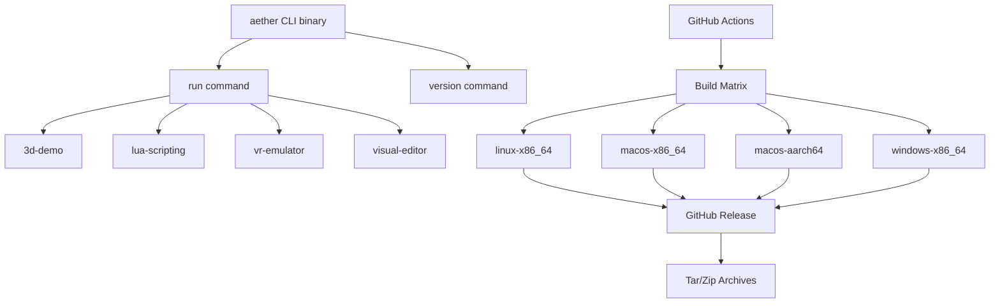

# Binary Distribution - Design Document

## Background

Aether is a modular VR engine built in Rust. Currently, running any example or using the engine requires the full Rust toolchain (`cargo build`). End-developers who want to create worlds with Lua/WASM scripting or use the creator tools shouldn't need to install Rust.

## Why

- End-developers (world creators, content designers) may not have a Rust environment
- Installing Rust + compiling from source is a steep barrier to entry for non-Rust developers
- Pre-built binaries are the standard distribution method for game engines (Godot, Unity, Unreal)
- Enables faster onboarding and reduces friction for the creator community

## What

1. **`aether` CLI binary** - A unified entry point that can run demos, launch the creator studio, and serve as the engine runtime
2. **GitHub Actions release pipeline** - Cross-platform CI that builds and publishes binaries for Linux (x86_64), macOS (x86_64 + aarch64), and Windows (x86_64)
3. **Install script** - A one-liner shell script for quick installation on Unix systems

## How

### Architecture



### CLI Design

The `aether` binary provides subcommands:

```
aether run <example>    Run a built-in example (3d-demo, lua-scripting, vr-emulator, visual-editor)
aether version          Print version information
aether help             Show help
```

### Binary Crate Structure

```
crates/aether-cli/
├── Cargo.toml
├── src/
│   ├── main.rs          # Entry point, argument parsing
│   ├── commands/
│   │   ├── mod.rs
│   │   ├── run.rs       # `aether run` subcommand
│   │   └── version.rs   # `aether version` subcommand
│   └── lib.rs           # Shared utilities
```

### GitHub Actions Release Pipeline

- **Trigger:** Push a tag matching `v*` (e.g., `v0.1.0`)
- **Matrix:** 4 targets (linux-x86_64-gnu, macos-x86_64, macos-aarch64, windows-x86_64-msvc)
- **Steps:** Checkout -> Install Rust -> Build release binary -> Package as tar.gz/zip -> Upload to GitHub Release
- **Naming convention:** `aether-{version}-{target}.tar.gz` (or `.zip` for Windows)

### Install Script

A `curl | sh` one-liner that detects OS/arch and downloads the correct binary:

```bash
curl -fsSL https://raw.githubusercontent.com/<org>/aether/main/install.sh | sh
```

### Test Design

- Unit tests for CLI argument parsing
- Integration test that verifies `aether version` outputs correct version
- Integration test that verifies `aether run --list` shows available examples
- CI smoke test that runs the built binary with `--help` on each platform
