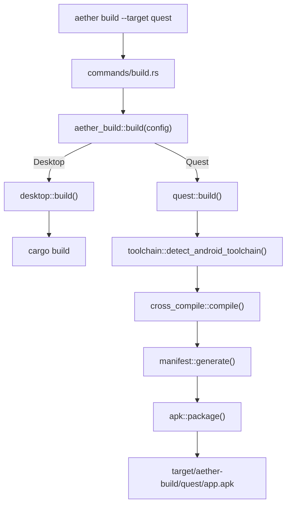
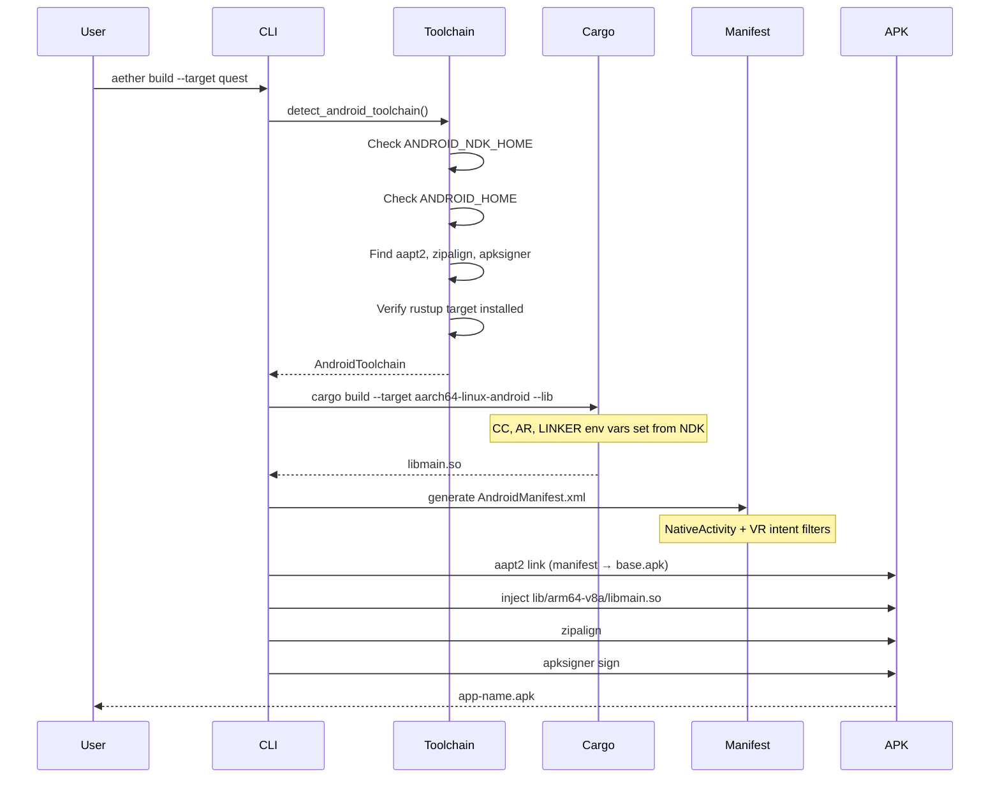

# Build Command & Quest APK Pipeline

## Background

The Aether VR engine CLI (`aether`) currently supports running demos, creating/validating worlds, and serving projects. There is no build command — users rely on raw `cargo build`. To deploy to Meta Quest 3 (standalone VR/MR headset), Rust code must be cross-compiled to Android and packaged as an APK with VR-specific manifest entries.

## Why

- Users with Quest 3 hardware need a single command to produce an installable APK
- Cross-compiling Rust for Android requires NDK toolchain setup, linker configuration, and environment variables — error-prone to do manually
- APK packaging requires Android SDK build tools (aapt2, zipalign, apksigner) — the CLI should automate this
- A unified `aether build` command abstracts platform differences and follows the pattern of other engine CLIs (Unity, Unreal, Bevy)

## What

Add `aether build` subcommand with multi-platform target support:

```
aether build                           # desktop debug (default)
aether build --release                 # desktop release
aether build --target quest            # Quest 3 APK debug
aether build --target quest --release  # Quest 3 APK release
aether build --target quest --install  # build + adb install to device
```

## How

New `aether-build` crate handles build orchestration. The CLI command parses args and delegates.

### Architecture



### Quest APK Build Pipeline



## Detail Design

### Constants

| Constant | Value | Purpose |
|----------|-------|---------|
| `QUEST_RUST_TARGET` | `aarch64-linux-android` | Cargo build target triple |
| `QUEST_ABI` | `arm64-v8a` | Android ABI directory name |
| `QUEST_MIN_SDK_VERSION` | `29` | Android 10 (minimum for Quest 2+) |
| `QUEST_TARGET_SDK_VERSION` | `32` | Android 12L |
| `BUILD_OUTPUT_DIR` | `target/aether-build` | Build artifacts root |

### Environment Variables

| Variable | Required | Purpose |
|----------|----------|---------|
| `ANDROID_NDK_HOME` | Quest builds | Path to Android NDK |
| `ANDROID_HOME` | Quest builds | Path to Android SDK |
| `AETHER_KEYSTORE_PATH` | Release signing | Custom keystore path |
| `AETHER_KEYSTORE_PASSWORD` | Release signing | Keystore password |

### Module Structure

```
crates/aether-build/src/
  lib.rs              — Public API: build(), BuildConfig, BuildError
  config.rs           — BuildTarget, BuildProfile, constants, validation
  toolchain.rs        — Android NDK/SDK detection and validation
  desktop.rs          — Desktop build (cargo wrapper)
  quest/
    mod.rs            — Quest build orchestration
    cross_compile.rs  — Cross-compilation via cargo + NDK
    manifest.rs       — AndroidManifest.xml generation
    apk.rs            — APK assembly (aapt2, zipalign, apksigner)
```

### AndroidManifest.xml

Key entries for Quest VR:
- `<uses-feature android:name="android.hardware.vr.headtracking" />`
- `<category android:name="com.oculus.intent.category.VR" />`
- `android:hasCode="false"` (NativeActivity, no Java)
- `<meta-data android:name="android.app.lib_name" android:value="main" />`

### Error Types

`BuildError` enum with variants: `ToolchainNotFound`, `RustTargetNotInstalled`, `CompilationFailed`, `ManifestGenerationFailed`, `ApkPackagingFailed`, `ProjectNotFound`, `InvalidTarget`, `IoError`.

### Build Output Structure

```
target/aether-build/quest/
  build/
    lib/arm64-v8a/libmain.so
    AndroidManifest.xml
  <app-name>-debug.apk
```

### Test Design

- **config.rs**: BuildTarget parsing (quest, desktop, case-insensitive, invalid), defaults, constant values
- **toolchain.rs**: Missing env vars produce clear errors, invalid paths detected, build-tools version selection
- **manifest.rs**: Generated XML contains VR category, headtracking feature, NativeActivity, correct SDK versions, app name substitution
- **apk.rs**: Output directory structure, .so placement path, APK naming (debug/release)
- **desktop.rs**: Cargo command construction, release flag handling
- **CLI build.rs**: Invalid target error, target parsing, default target
