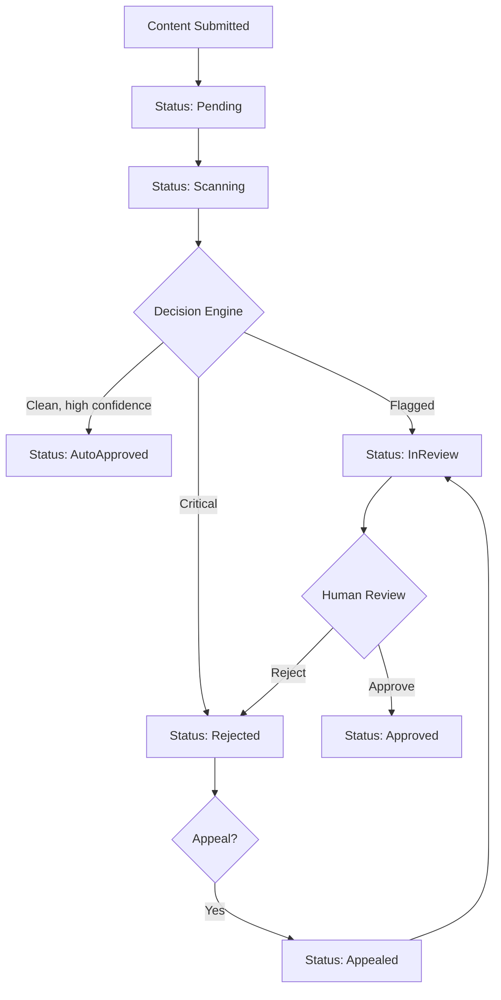

# Content Moderation Pipeline Design

## Background

The `aether-content-moderation` crate currently contains stub type definitions (MeshScanner, ReviewQueue, WasmWarden, etc.) with no actual moderation logic. User-generated content in a VR platform requires automated scanning, human review, and report handling to maintain a safe environment.

## Why

Without moderation logic, the VR platform cannot:
- Automatically detect harmful content (images, meshes, audio, WASM scripts)
- Route flagged content to human moderators
- Process user-submitted reports
- Enforce graduated consequences based on severity
- Track content through the moderation lifecycle

## What

Implement the full content moderation pipeline:
1. **Content scanner trait** - pluggable AI/ML scanning interface
2. **Decision engine** - rule-based auto-approve/auto-flag logic
3. **Review queue** - priority-ordered human review with approve/reject workflow
4. **Report system** - user reports with category classification and aggregation
5. **WASM static analysis** - pattern matching for malicious WASM bytecode
6. **Status state machine** - lifecycle tracking with valid transitions
7. **Severity classification** - graduated severity with enforcement actions

## How

### Architecture



### Module Design

#### `scanner.rs` - Content Scanner Trait

```rust
pub trait ContentScanner: Send + Sync {
    fn scan(&self, content: &ContentItem) -> ScanResult;
    fn scanner_name(&self) -> &str;
}
```

- `ContentItem` wraps content bytes with type metadata (Image, Mesh, Audio, Wasm)
- `ScanResult` returns severity, flags, confidence score, and optional auto-decision
- Mock scanners provided for testing

#### `decision.rs` - Decision Engine

- `DecisionEngine` holds configurable thresholds and rules
- `DecisionRule` maps content flags to severity/actions
- Auto-approve threshold: confidence >= configured value AND severity == Clean
- Auto-reject threshold: severity >= Critical
- Everything else goes to human review

#### `queue.rs` - Review Queue (enhanced)

- Priority queue sorted by severity then submission time
- `submit()`, `claim()`, `decide()` workflow
- Items track assigned moderator, timestamps, decision history

#### `report.rs` - Report System (enhanced)

- `ReportCategory` enum: Harassment, Violence, Nudity, Spam, Copyright, Other
- `Report` with reporter, content reference, category, description
- `ReportAggregator` groups reports by content, escalates at threshold

#### `wasm_scan.rs` - WASM Analysis (enhanced)

- Pattern-based detection for banned imports, syscalls, infinite loops
- `WasmPattern` struct with pattern bytes and severity
- Returns list of violations with location info

#### `status.rs` - State Machine

- `ModerationStatus` enum with all states
- `transition()` validates legal state transitions
- Returns error on invalid transitions

#### `severity.rs` - Severity Classification

- `ContentSeverity`: Clean, Low, Medium, High, Critical
- `EnforcementAction`: None, Warning, ContentRemoval, TemporaryBan, PermanentBan
- Mapping function from severity to recommended enforcement

### Database Design

Not applicable at crate level - this crate provides in-memory data structures and traits. Persistence will be handled by the `aether-persistence` crate.

### API Design

All public types are exported from `lib.rs`. Key entry points:
- `ContentScanner::scan()` - scan content
- `DecisionEngine::evaluate()` - make moderation decision
- `ReviewQueue::submit()` / `claim()` / `decide()` - human review workflow
- `ReportAggregator::submit_report()` / `check_threshold()` - report handling
- `ModerationStatus::transition()` - state transitions
- `WasmAnalyzer::analyze()` - WASM scanning

### Test Design

Tests written before implementation covering:
- State machine: all valid transitions succeed, invalid transitions fail
- Decision engine: auto-approve for clean content, auto-reject for critical, review for middle
- Review queue: priority ordering, claim/decide workflow, empty queue handling
- Report system: submission, aggregation, threshold escalation
- Severity: correct enforcement action mapping
- WASM analysis: detection of banned patterns, clean code passes
- Scanner: mock scanner integration, multiple scanner aggregation

### Dependencies

```toml
uuid = { version = "1", features = ["v4"] }
```

No async runtime needed - all operations are synchronous for simplicity and testability.
