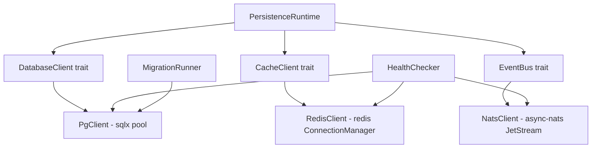

# Database & Message Bus Integration

## Background

The `aether-persistence` crate currently provides WAL, snapshot recorder, and pod topology types but has no actual database or message bus connections. All state coordination is in-memory. To move toward production, the crate needs real connections to PostgreSQL (durable state), Redis (sessions, presence, cache), and NATS JetStream (inter-service events).

## Why

- World state (economy, inventory, script state) must survive pod restarts and be queryable by other services.
- Session presence and ephemeral cache require a low-latency store (Redis).
- Services need a decoupled event bus (NATS JetStream) for pub/sub without direct RPC coupling.
- Without trait abstractions, all persistence code becomes untestable without running real databases.

## What

Add PostgreSQL, Redis, and NATS JetStream client wrappers to `aether-persistence` behind async trait abstractions, with connection pooling, health checks, and a migration framework.

## How

### Architecture



### Module layout

| File | Responsibility |
|------|---------------|
| `postgres.rs` | `DatabaseClient` trait + `PgClient` implementation via `sqlx::PgPool` |
| `redis_client.rs` | `CacheClient` trait + `RedisClient` implementation via `redis::aio::ConnectionManager` |
| `nats.rs` | `EventBus` trait + `NatsClient` implementation via `async_nats::jetstream` |
| `pool.rs` | `ConnectionConfig` parsing from env vars, `ConnectionPool` aggregate |
| `migration.rs` | `Migration` struct, ordering, SQL execution |
| `health.rs` | `HealthStatus`, `HealthChecker` that pings all backends |

### Database design

Initial migration creates the tables used by the persistence layer:

```sql
CREATE TABLE IF NOT EXISTS world_snapshots (
    id          BIGSERIAL PRIMARY KEY,
    world_id    TEXT NOT NULL,
    tick        BIGINT NOT NULL,
    captured_at TIMESTAMPTZ NOT NULL DEFAULT NOW(),
    kind        TEXT NOT NULL,
    actor_count INTEGER NOT NULL,
    data        BYTEA
);

CREATE TABLE IF NOT EXISTS wal_entries (
    sequence    BIGSERIAL PRIMARY KEY,
    world_id    TEXT NOT NULL,
    key         TEXT NOT NULL,
    payload_crc32 BIGINT NOT NULL,
    timestamp_ms BIGINT NOT NULL,
    durability  TEXT NOT NULL
);

CREATE TABLE IF NOT EXISTS script_state (
    world_id    TEXT NOT NULL,
    script_name TEXT NOT NULL,
    payload     BYTEA NOT NULL,
    updated_at  TIMESTAMPTZ NOT NULL DEFAULT NOW(),
    PRIMARY KEY (world_id, script_name)
);

CREATE TABLE IF NOT EXISTS migrations (
    version     INTEGER PRIMARY KEY,
    name        TEXT NOT NULL,
    applied_at  TIMESTAMPTZ NOT NULL DEFAULT NOW()
);
```

### API design

#### Traits (in each module)

```rust
#[async_trait]
pub trait DatabaseClient: Send + Sync {
    async fn execute(&self, query: &str, params: &[&str]) -> Result<u64, PersistenceError>;
    async fn fetch_optional(&self, query: &str, params: &[&str]) -> Result<Option<Vec<u8>>, PersistenceError>;
    async fn is_healthy(&self) -> bool;
}

#[async_trait]
pub trait CacheClient: Send + Sync {
    async fn get(&self, key: &str) -> Result<Option<String>, PersistenceError>;
    async fn set(&self, key: &str, value: &str, ttl: Option<Duration>) -> Result<(), PersistenceError>;
    async fn del(&self, key: &str) -> Result<bool, PersistenceError>;
    async fn is_healthy(&self) -> bool;
}

#[async_trait]
pub trait EventBus: Send + Sync {
    async fn publish(&self, subject: &str, payload: &[u8]) -> Result<(), PersistenceError>;
    async fn subscribe(&self, subject: &str) -> Result<Box<dyn EventSubscription>, PersistenceError>;
    async fn is_healthy(&self) -> bool;
}
```

### Environment variables

| Variable | Default | Purpose |
|----------|---------|---------|
| `DATABASE_URL` | `postgres://localhost/aether` | PostgreSQL connection string |
| `REDIS_URL` | `redis://localhost:6379` | Redis connection string |
| `NATS_URL` | `nats://localhost:4222` | NATS server URL |
| `DB_POOL_SIZE` | `10` | Max connections in the pool |
| `DB_CONNECT_TIMEOUT_SECS` | `5` | Connection timeout |

### Test design

- All unit tests use mock implementations of the traits (no real DB required).
- `MockDatabaseClient`, `MockCacheClient`, `MockEventBus` provided in each module.
- Integration tests (marked `#[ignore]`) connect to real services.
- Tests cover: config parsing, health check logic, migration ordering, pub/sub message flow, cache TTL semantics.

### Error handling

A unified `PersistenceError` enum covers all backend errors:

```rust
pub enum PersistenceError {
    ConnectionFailed(String),
    QueryFailed(String),
    Timeout,
    SerializationError(String),
    MigrationError(String),
    NotConnected,
}
```
