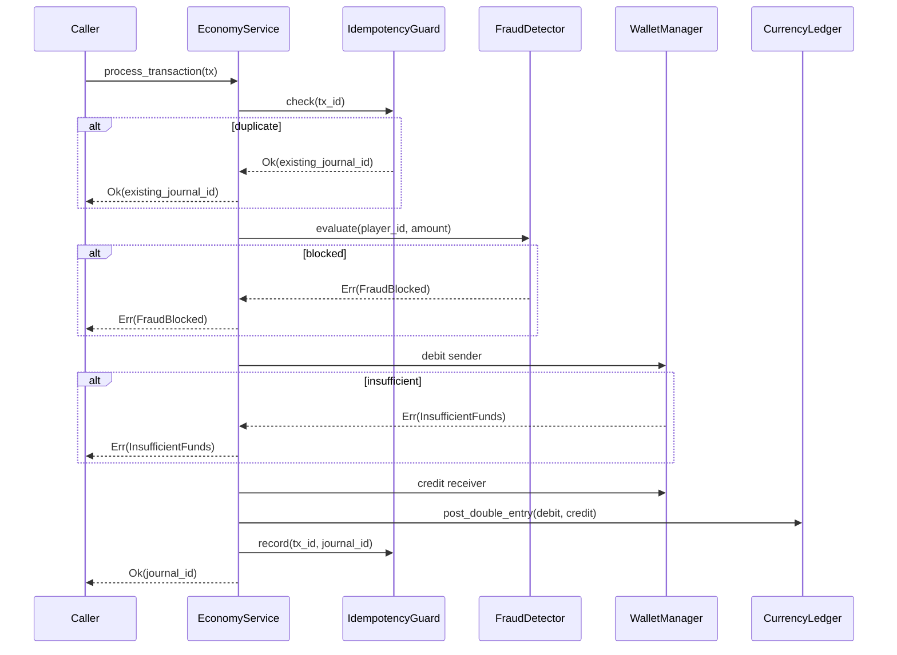

# Economy Service Transaction Logic (task-010)

## Background

The `aether-economy` crate currently defines type scaffolding (Wallet, LedgerEntry,
TransactionState, FraudSignal, PayoutRecord) but contains no actual transaction logic.
Wallets can be created, but there is no way to atomically transfer funds between them,
enforce overdraft prevention across the ledger, detect fraud, or process settlements.

## Why

Without transaction logic the economy crate is inert. Players cannot purchase items,
creators cannot receive tips, and there is no fraud protection. This task fills the gap
so the engine can support a functioning in-world economy.

## What

Implement the following capabilities on top of the existing types:

1. **Double-entry ledger** - Every mutation posts a debit entry and a matching credit
   entry atomically; the sum across all entries is always zero.
2. **Wallet management** - Create, query, freeze, and unfreeze wallets. A frozen wallet
   rejects all operations.
3. **Transaction processing** - Purchase, trade, tip, and reward operations routed
   through a single `EconomyService` facade.
4. **Idempotency** - Duplicate idempotency keys are harmless no-ops returning the
   original result.
5. **Overdraft prevention** - Balance is checked before debit; insufficient funds
   returns an error without mutating state.
6. **Fraud detection** - Velocity checks (configurable max transactions per minute)
   and large-amount anomaly detection.
7. **Settlement** - Async payout processing that moves PayoutRecords through
   Queued -> InFlight -> Completed/Failed states.

## How

### Architecture

```
EconomyService (facade)
  |
  +-- WalletManager       (create / query / freeze wallets)
  +-- CurrencyLedger       (append-only double-entry journal)
  +-- IdempotencyGuard     (dedup by tx_id)
  +-- FraudDetector        (velocity + anomaly checks)
  +-- SettlementProcessor  (payout lifecycle)
```

All components live in-process and share data through the `EconomyService` struct.
Storage is in-memory (HashMap/Vec) for testability; a trait-based abstraction is
unnecessary at this stage because the crate will be wrapped by a persistence layer
in a future task.

### Currency model

- Currency unit: **AEC** (Aether Credits).
- Internal representation: `i128` minor units (no floating point).
- Negative balances are never permitted for player/creator wallets.

### Module layout

| File | Responsibility | Approx lines |
|------|----------------|--------------|
| `wallet.rs` | WalletAccount, WalletManager, freeze/unfreeze | ~200 |
| `ledger.rs` | LedgerEntry, CurrencyLedger with balance tracking | ~200 |
| `transaction.rs` | EconomyTransaction types, TransactionCoordinator | ~150 |
| `fraud.rs` | FraudDetector with velocity window and anomaly scoring | ~200 |
| `settlement.rs` | SettlementProcessor payout lifecycle | ~150 |
| `service.rs` | EconomyService facade tying everything together | ~300 |
| `lib.rs` | Module declarations and re-exports | ~30 |

### Key flows

#### Purchase flow



### Database / storage design

In-memory for this implementation:
- `HashMap<String, WalletAccount>` keyed by wallet_id
- `Vec<LedgerRecord>` append-only journal
- `HashMap<String, u64>` idempotency key -> journal_id
- `HashMap<u64, VelocityWindow>` player_id -> recent tx tracking

### API design (public methods on EconomyService)

```rust
fn create_wallet(&mut self, owner: u64, wallet_id: &str) -> Result<(), ServiceError>
fn get_wallet(&self, wallet_id: &str) -> Option<&WalletAccount>
fn freeze_wallet(&mut self, wallet_id: &str) -> Result<(), ServiceError>
fn unfreeze_wallet(&mut self, wallet_id: &str) -> Result<(), ServiceError>
fn process_transaction(&mut self, tx: TransactionRequest) -> Result<u64, ServiceError>
fn get_balance(&self, wallet_id: &str) -> Result<i128, ServiceError>
fn enqueue_payout(&mut self, payout: PayoutRecord) -> Result<(), ServiceError>
fn process_next_payout(&mut self) -> Option<PayoutRecord>
```

### Configuration via environment variables

| Variable | Default | Description |
|----------|---------|-------------|
| `AETHER_ECONOMY_MAX_TX_PER_MINUTE` | 60 | Velocity fraud check threshold |
| `AETHER_ECONOMY_ANOMALY_AMOUNT_THRESHOLD` | 1_000_000 | Amount threshold for anomaly flag |
| `AETHER_ECONOMY_FRAUD_SCORE_BLOCK_THRESHOLD` | 0.8 | Score above which tx is blocked |
| `AETHER_ECONOMY_IDEMPOTENCY_TTL_DAYS` | 30 | Days to retain idempotency keys |
| `AETHER_ECONOMY_PLATFORM_FEE_BPS` | 250 | Platform fee in basis points (2.5%) |

### Test design

Tests are written first and cover:

1. **Ledger invariants** - debit + credit sum to zero for every record
2. **Wallet lifecycle** - create, deposit, query balance, freeze, unfreeze
3. **Overdraft prevention** - withdraw more than balance returns error
4. **Idempotency** - same tx_id processed twice returns same journal_id
5. **Fraud velocity** - exceeding max tx/minute triggers block
6. **Fraud anomaly** - large amount triggers anomaly signal
7. **Settlement lifecycle** - payout moves through Queued -> InFlight -> Completed
8. **Frozen wallet** - operations on frozen wallet fail
9. **End-to-end purchase** - full flow through EconomyService
10. **End-to-end tip** - tip from player to creator

All tests use in-memory storage with no external dependencies.
