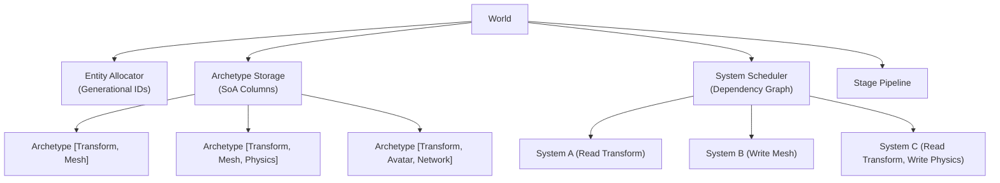
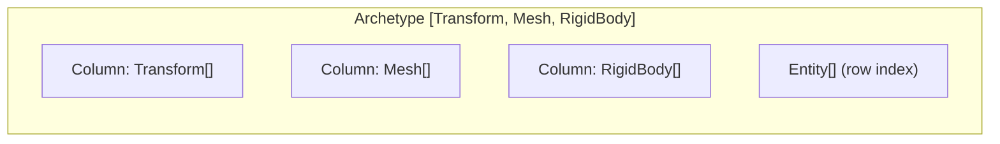
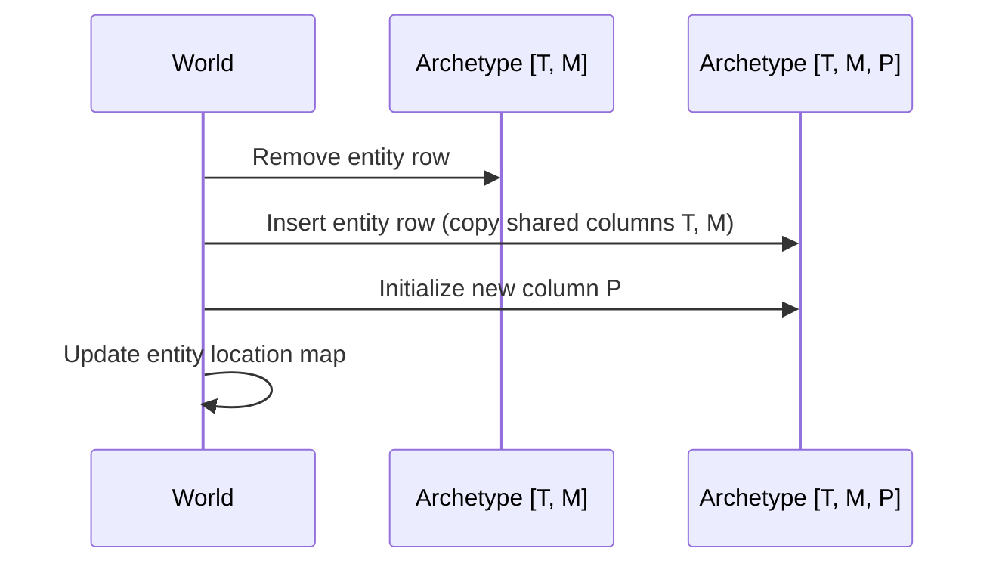

# ECS Core Architecture Design Document

## Background

The Aether engine requires a high-performance Entity Component System (ECS) as its backbone. All game objects — avatars, props, terrain, particles, UI elements — are entities composed of data components processed by systems. This is the foundational subsystem upon which all other engine features depend.

## Why

- VR demands < 20ms motion-to-photon latency; cache-friendly data layouts are critical
- Massive concurrency requires parallelizable data processing
- Network replication needs component-level awareness of what to sync
- The ECS pattern separates data (components) from logic (systems), enabling modular engine design

## What

Implement an archetype-based ECS library (`aether-ecs`) in Rust with:
1. Generational entity IDs
2. Archetype-based column storage (SoA layout)
3. Parallel system scheduling with dependency graphs
4. Stage-based pipeline
5. Network-aware component markers

## How

### Architecture Overview



### Detail Design

#### Entity (Generational Index)

```rust
struct Entity {
    index: u32,      // slot index
    generation: u32, // prevents ABA problem
}
```

- Free list for recycled indices
- Generation incremented on despawn
- O(1) alive check

#### Component Storage

- Components implement `Component` trait (requires `'static + Send + Sync`)
- `ComponentId` derived from `TypeId`
- `ReplicationMode` enum: `Replicated` / `ServerOnly`

#### Archetype Storage

Each unique set of component types defines an archetype. Entities with the same components share an archetype.



- Column-based SoA (Struct of Arrays) for cache efficiency
- Each column is a `Vec<u8>` with typed access via `ComponentId`
- Entity-to-archetype mapping via `HashMap<Entity, ArchetypeLocation>`
- Adding/removing components triggers archetype migration (move entity between archetypes)

#### Archetype Migration



#### Query System

Queries declare read/write access to component types:
- `Query<(&Transform, &mut Mesh)>` — read Transform, write Mesh
- Queries iterate over all archetypes that contain the requested components
- Access tracking enables parallel scheduling (readers can run concurrently, writers are exclusive)

#### System Scheduling

Systems are functions that operate on queries. The scheduler:
1. Collects all system access declarations (read/write per ComponentId)
2. Builds a dependency graph (write conflicts create dependencies)
3. Within each stage, runs non-conflicting systems in parallel via `rayon`

#### Stage Pipeline

```
Input → PrePhysics → Physics → PostPhysics → Animation → PreRender → Render → NetworkSync
```

Each stage runs its systems to completion before the next stage begins. Within a stage, systems run in parallel where access patterns allow.

#### Network-Aware Components

```rust
enum ReplicationMode {
    Replicated,  // Synced to clients
    ServerOnly,  // Server simulation only
}
```

Components carry replication metadata. The NetworkSync stage uses this to determine what to serialize and send.

### File Structure

```
crates/aether-ecs/
├── Cargo.toml
├── src/
│   ├── lib.rs          # Module exports, re-exports
│   ├── entity.rs       # Entity, EntityAllocator
│   ├── component.rs    # Component trait, ComponentId, ReplicationMode
│   ├── archetype.rs    # Archetype, ArchetypeStorage, columns
│   ├── query.rs        # Query trait, access tracking
│   ├── system.rs       # System trait, SystemDescriptor
│   ├── schedule.rs     # Scheduler, dependency graph, parallel execution
│   ├── stage.rs        # Stage enum, stage pipeline
│   ├── world.rs        # World struct tying it all together
│   └── network.rs      # NetworkIdentity, replication markers
└── tests/
    ├── entity_tests.rs
    ├── archetype_tests.rs
    ├── query_tests.rs
    ├── system_tests.rs
    └── integration_tests.rs
```

### Test Design

Tests cover all acceptance criteria:

1. **Archetype storage tests**: Create entities with various component sets, verify correct archetype assignment, column storage layout, archetype migration on add/remove
2. **Parallel scheduling tests**: Register systems with conflicting/non-conflicting access, verify dependency graph correctness, verify parallel execution
3. **Stage pipeline tests**: Register systems in different stages, verify execution order (Input before Physics before Render, etc.)
4. **Network component tests**: Mark components as Replicated/ServerOnly, query only replicated components, verify NetworkIdentity functionality
