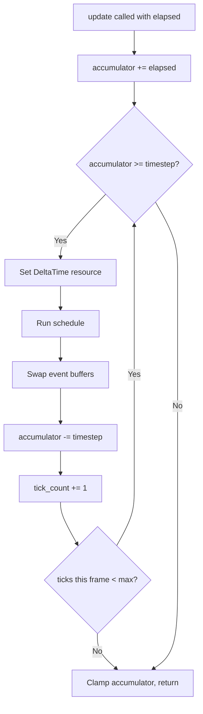

# ECS Runtime & Stage Scheduler

## Background

The Aether ECS crate (`aether-ecs`) has a working archetype-based ECS with entity management, column storage, stage-based scheduling with parallel execution via rayon, and metrics/observability. However, it lacks a complete runtime layer: there is no typed resource container, no inter-system event communication, and no game-loop tick runner with fixed timestep support.

## Why

A game engine ECS needs more than entity/component storage and system scheduling:

1. **Resources** - Systems need access to global shared state (e.g., delta time, input state, configuration) that isn't per-entity. Without a Resources container, systems have no way to share non-entity state.
2. **Events** - Systems need to communicate without tight coupling. A physics system detecting a collision should emit an event that a sound system can consume, without either knowing about the other.
3. **Tick Runner** - A deterministic game loop that drives the schedule at a fixed timestep is essential for physics simulation stability and network synchronization.

## What

Three new modules added to `aether-ecs`:

1. **`resource.rs`** - A typed resource container (`Resources`) that stores `Any + Send + Sync` values keyed by `TypeId`.
2. **`event.rs`** - Double-buffered event channels (`Events<T>`) for fire-and-forget inter-system messaging.
3. **`tick.rs`** - A tick runner (`TickRunner`) with fixed-timestep accumulator pattern and a built-in `DeltaTime` resource.

## How

### Resources (`resource.rs`)

```
Resources {
    data: HashMap<TypeId, Box<dyn Any + Send + Sync>>
}
```

- `insert<T>(value)` - Insert or replace a resource.
- `get<T>() -> Option<&T>` - Borrow a resource immutably.
- `get_mut<T>() -> Option<&mut T>` - Borrow a resource mutably.
- `remove<T>() -> Option<T>` - Remove and return a resource.
- `contains<T>() -> bool` - Check if a resource exists.

Resources are integrated into `World` so systems can access them via `world.resource::<T>()`.

### Events (`event.rs`)

Double-buffered event queue pattern:

```
Events<T> {
    buffers: [Vec<T>; 2],
    current: usize,  // index of write buffer
}
```

- `send(event: T)` - Push an event into the current write buffer.
- `read() -> &[T]` - Read events from the previous tick's buffer (read buffer).
- `swap()` - Swap buffers and clear the new write buffer. Called automatically by the tick runner between ticks.

`Events<T>` is stored as a resource in the World. The `EventQueue` trait provides type-erased `swap_buffers()` for the tick runner.

### Tick Runner (`tick.rs`)

Fixed-timestep accumulator pattern:

```
TickRunner {
    timestep: Duration,       // fixed dt (default 1/60s)
    accumulator: Duration,    // leftover time
    tick_count: u64,          // total ticks executed
    max_ticks_per_frame: u32, // spiral-of-death guard (default 5)
}
```

- `TickRunner::new(timestep)` - Create with configurable timestep.
- `update(elapsed, world)` - Advance the simulation: accumulate elapsed time, run schedule N times at fixed dt, swap event buffers after each tick.
- Built-in `DeltaTime` resource is updated each tick.
- `Time` resource tracks wall-clock elapsed and tick count.



### World Integration

- `World` gains a `resources: Resources` field.
- `world.insert_resource<T>(value)`, `world.resource<T>()`, `world.resource_mut<T>()` convenience methods.
- `world.send_event<T>(event)` and `world.read_events<T>()` convenience methods.
- `world.insert_events<T>()` registers an event channel.

### Database Design

N/A - this is an in-memory runtime system with no persistence layer.

### API Design

See method signatures above. All public APIs follow existing `World` conventions.

### Test Design

#### Resource Tests
- Insert and retrieve a resource by type
- Get returns None for missing resource
- Overwrite existing resource
- Remove resource
- Multiple distinct resource types coexist
- Contains check
- get_mut allows modification

#### Event Tests
- Send and read events within same tick yields empty read (double-buffer)
- After swap, previously sent events are readable
- Multiple events accumulate in buffer
- Swap clears write buffer for next tick
- Multiple event types are independent
- Empty event reads return empty slice
- Events cleared after two swaps (old read buffer gets cleared on swap)

#### Tick Runner Tests
- Single tick fires when accumulator exceeds timestep
- Multiple ticks fire for large elapsed
- Spiral-of-death guard caps ticks per frame
- DeltaTime resource is set correctly
- Time resource tracks total elapsed and tick count
- Zero elapsed produces no ticks
- Sub-timestep elapsed accumulates correctly
- Configurable timestep
- Systems execute during tick
- Event buffers are swapped each tick

#### Integration Tests
- World resource convenience methods work end-to-end
- Systems can read resources from World
- Event send/read through World
- Full tick cycle: insert resources, add systems, run tick, verify state
