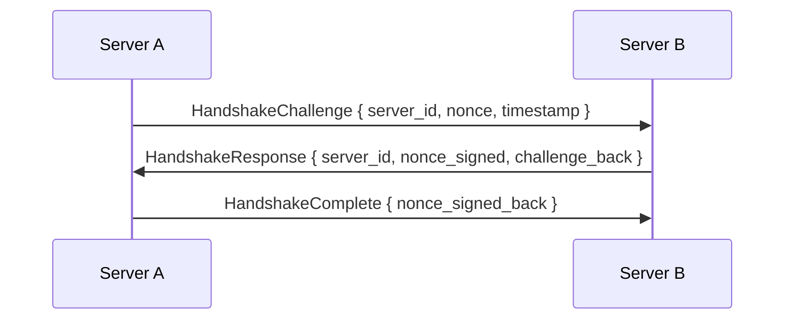
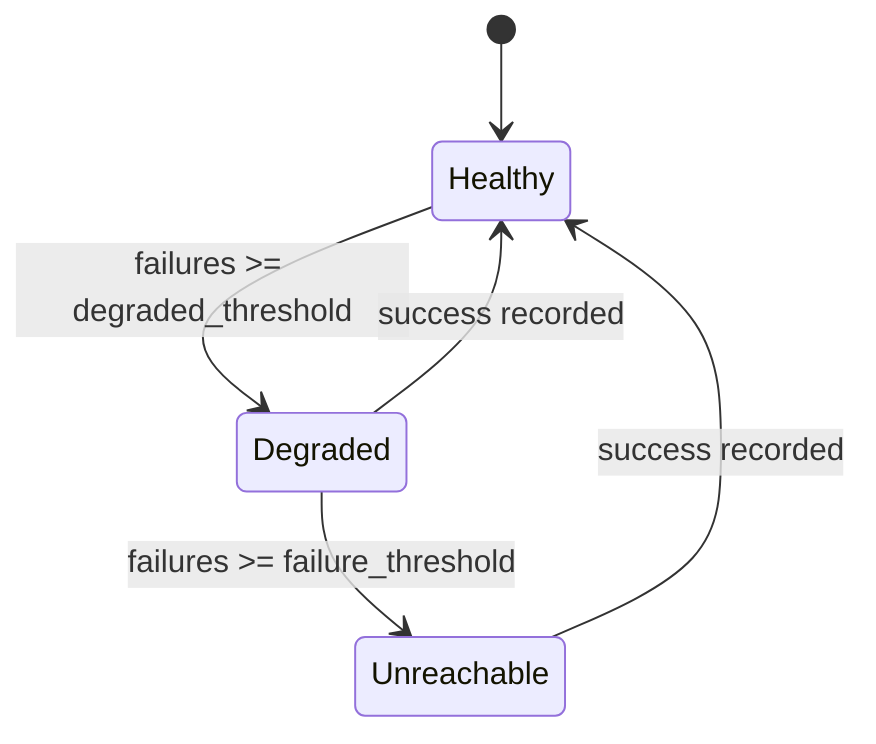

# Federation Protocol Implementation (task-020)

## Background

The `aether-federation` crate currently defines foundational types for self-hosted world
registration, asset integrity policies, auth request/result contracts, and a runtime
that processes batches of federation events. However, it lacks the operational protocol
layer: how servers discover each other, verify assets by content hash, negotiate trust
through handshakes, monitor health, and route portal traversals across server boundaries.

## Why

Self-hosted world servers need a well-defined protocol to participate in the Aether
platform. Without it, there is no way for independent servers to:
- Register with the central platform in a verifiable manner
- Prove asset integrity through content-addressed hashing
- Establish mutual trust via cryptographic handshakes
- Report and monitor availability
- Route players through cross-server portals

## What

Add five new modules to `aether-federation`:

| Module | Responsibility |
|--------|---------------|
| `server_registry` | Manage `FederatedServer` lifecycle (register, deregister, lookup) |
| `verification` | SHA-256 content-addressed asset verification |
| `handshake` | Challenge-response mutual authentication between servers |
| `health` | Health monitoring with status transitions and heartbeat tracking |
| `routing` | Cross-server portal routing table |

## How

All modules are in-memory-only and dependency-free (aside from `sha2` for hashing).
They expose pure data structures and synchronous APIs so they can be embedded in any
async runtime without coupling.

### Detail Design

#### 1. Server Registry (`server_registry.rs`)

```
FederatedServer {
    id: String,
    name: String,
    endpoint: String,
    public_key: Vec<u8>,
    registered_at_ms: u64,
    last_heartbeat_ms: u64,
    status: ServerStatus,
}

ServerStatus: Online | Degraded | Offline | Suspended

ServerRegistry {
    servers: HashMap<String, FederatedServer>
}
```

Operations: `register`, `deregister`, `get`, `list`, `update_status`.

#### 2. Asset Verification (`verification.rs`)

```
AssetVerification {
    content_hash: String,   // hex-encoded SHA-256
    size_bytes: u64,
    verified: bool,
}
```

Functions:
- `compute_hash(data: &[u8]) -> String` -- SHA-256 hex digest
- `verify_asset(data: &[u8], expected: &AssetVerification) -> VerificationResult`

#### 3. Federation Handshake (`handshake.rs`)

Challenge-response protocol:



In-memory representation (no real crypto, but slots for keys):
- `HandshakeChallenge`, `HandshakeResponse`, `HandshakeComplete`
- `HandshakeState` enum: `Initiated | ChallengeReceived | Completed | Failed`
- `HandshakeManager` tracks in-progress and completed handshakes

#### 4. Health Monitoring (`health.rs`)

```
HealthStatus: Healthy | Degraded | Unreachable

HealthRecord {
    server_id: String,
    status: HealthStatus,
    last_check_ms: u64,
    consecutive_failures: u32,
}

HealthMonitor {
    records: HashMap<String, HealthRecord>,
    failure_threshold: u32,
    degraded_threshold: u32,
}
```

Operations: `record_success`, `record_failure`, `get_status`, `get_all`.

State machine:


#### 5. Portal Routing (`routing.rs`)

```
PortalRoute {
    portal_id: String,
    source_server: String,
    destination_server: String,
    destination_world: String,
    active: bool,
}

RoutingTable {
    routes: HashMap<String, PortalRoute>,
}
```

Operations: `add_route`, `remove_route`, `lookup`, `list_by_server`,
`set_active`, `resolve_destination`.

### Test Design

All tests are in-memory unit tests within each module:

- **server_registry**: register/deregister, duplicate detection, status updates, list filtering
- **verification**: correct hash computation, size mismatch, hash mismatch, empty data
- **handshake**: full lifecycle, timeout, duplicate challenge, state transitions
- **health**: threshold transitions, consecutive failure counting, recovery
- **routing**: add/remove routes, lookup by portal, list by server, activate/deactivate

### API Design

No HTTP or network APIs. All types are synchronous, in-process structs. They will be
consumed by the existing `FederationRuntime` or future network layers.

### Database Design

No database. All state is in-memory via `HashMap`. Persistence can be added later
by serializing the registry and routing tables.
