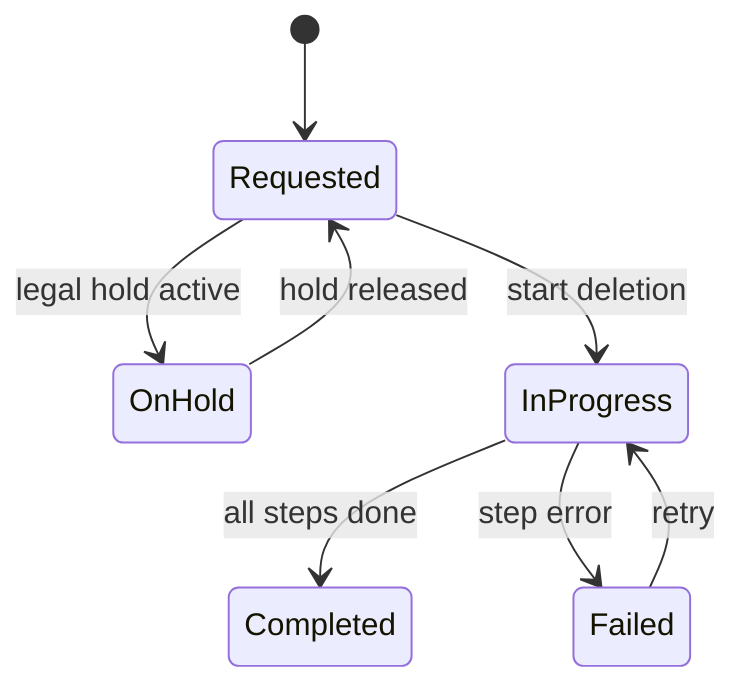

# GDPR Compliance & Account Deletion

## Background

The `aether-compliance` crate currently defines type stubs for deletion requests, export bundles, compliance keystore, and retention windows. There is no actual compliance logic. GDPR (General Data Protection Regulation) requires that platforms support:

- **Right to erasure** (Article 17) - Users can request deletion of personal data.
- **Right to data portability** (Article 20) - Users can export their data in a machine-readable format.
- **Pseudonymization** - Personal identifiers in ledger/audit data must be replaced with irreversible tokens.
- **Retention limits** - Data must not be kept longer than necessary.

This design adds the compliance logic to satisfy these requirements.

## Why

Without GDPR compliance logic, the Aether platform cannot legally operate in jurisdictions that enforce GDPR (EU/EEA). Account deletion, data export, legal hold, and retention scheduling are mandatory capabilities.

## What

Implement six modules of compliance logic:

1. **`deletion.rs`** - Account deletion pipeline with step-based state machine
2. **`export.rs`** - Data export bundle generation (GDPR Article 20)
3. **`keystore.rs`** - Encrypted salt storage with dual-approval
4. **`legal_hold.rs`** - Legal hold management that defers deletion
5. **`retention.rs`** - 7-year retention schedule with auto-expiry
6. **`pseudonymize.rs`** - SHA-256 hashing of user_id + salt for ledger rows

## How

### Pseudonymization

```
pseudonym = SHA-256(user_id || deletion_salt)
```

- The deletion salt is a random 32-byte value generated per deletion request.
- The salt is stored encrypted in the compliance keystore.
- The pseudonym replaces the user_id in all ledger/audit rows.
- This is a one-way operation; the original user_id cannot be recovered without the salt.

### Deletion Pipeline

State machine flow:



Deletion steps execute in order:
1. `ExportUserData` - Generate final data export before deletion
2. `PseudonymizeLedger` - Replace user_id with pseudonym in ledger rows
3. `DeleteProfile` - Remove profile/personal data
4. `DeleteSocialData` - Remove social graph data (friends, blocks)
5. `DeleteSessionData` - Remove session/telemetry data
6. `ArchiveDeletionSalt` - Store encrypted salt in keystore for audit

### Legal Hold

- A legal hold prevents deletion from proceeding.
- Holds are identified by a case_id and reason.
- When a hold is placed, the deletion transitions to `OnHold`.
- When all holds are released, deletion can resume.

### Retention Schedule

- Pseudonymized ledger data is retained for 7 years (financial regulation).
- After 7 years, pseudonymized data is purged automatically.
- Legal holds override retention expiry (data is kept until hold is released).
- Retention records track per-row expiry timestamps.

### Data Export

- Generates a JSON manifest listing all user data categories.
- Each category (profile, social, economy, sessions) is included as a section.
- The bundle is hashed (SHA-256) for integrity verification.

### Compliance Keystore

- Stores deletion salts encrypted with a master key (XOR-based for in-memory demo).
- Each entry has a purpose, approver list, and timestamp.
- Dual-approval: entries require at least 2 approver IDs.
- Lookup by key_id for salt retrieval during audit.

## Database Design

All types are in-memory structs for now (no database dependency). Future integration will persist to a compliance-specific database.

## API Design

### Public Functions

| Module | Function | Description |
|--------|----------|-------------|
| `pseudonymize` | `pseudonymize_id(user_id, salt) -> String` | SHA-256 hash of user_id + salt |
| `pseudonymize` | `generate_salt() -> Vec<u8>` | Random 32-byte salt |
| `deletion` | `DeletionPipeline::new(request) -> Self` | Create pipeline from request |
| `deletion` | `DeletionPipeline::advance() -> DeletionStatus` | Execute next step |
| `deletion` | `DeletionPipeline::place_hold(hold)` | Pause for legal hold |
| `deletion` | `DeletionPipeline::release_hold(case_id)` | Resume after hold |
| `export` | `DataExporter::new(user_id) -> Self` | Create exporter |
| `export` | `DataExporter::add_section(name, data)` | Add data section |
| `export` | `DataExporter::finalize() -> ExportBundle` | Generate bundle with hash |
| `keystore` | `ComplianceKeystore::store(entry)` | Store encrypted entry |
| `keystore` | `ComplianceKeystore::lookup(key_id) -> Option` | Retrieve entry |
| `legal_hold` | `HoldManager::place_hold(...)` | Create legal hold |
| `legal_hold` | `HoldManager::release_hold(case_id)` | Release hold |
| `legal_hold` | `HoldManager::has_active_holds(user_id) -> bool` | Check holds |
| `retention` | `RetentionSchedule::new(years) -> Self` | Create schedule |
| `retention` | `RetentionSchedule::add_record(record)` | Track a record |
| `retention` | `RetentionSchedule::collect_expired(now) -> Vec` | Get expired records |

## Test Design

- **Pseudonymization**: deterministic output, different salts produce different pseudonyms
- **Deletion pipeline**: state transitions (Requested -> InProgress -> Completed), hold pausing, failure handling
- **Legal hold**: place/release/query holds, multiple holds per user
- **Retention**: expiry calculation, legal hold override, state transitions
- **Data export**: section accumulation, hash integrity, empty export
- **Keystore**: store/lookup, dual-approval validation, missing key returns None
