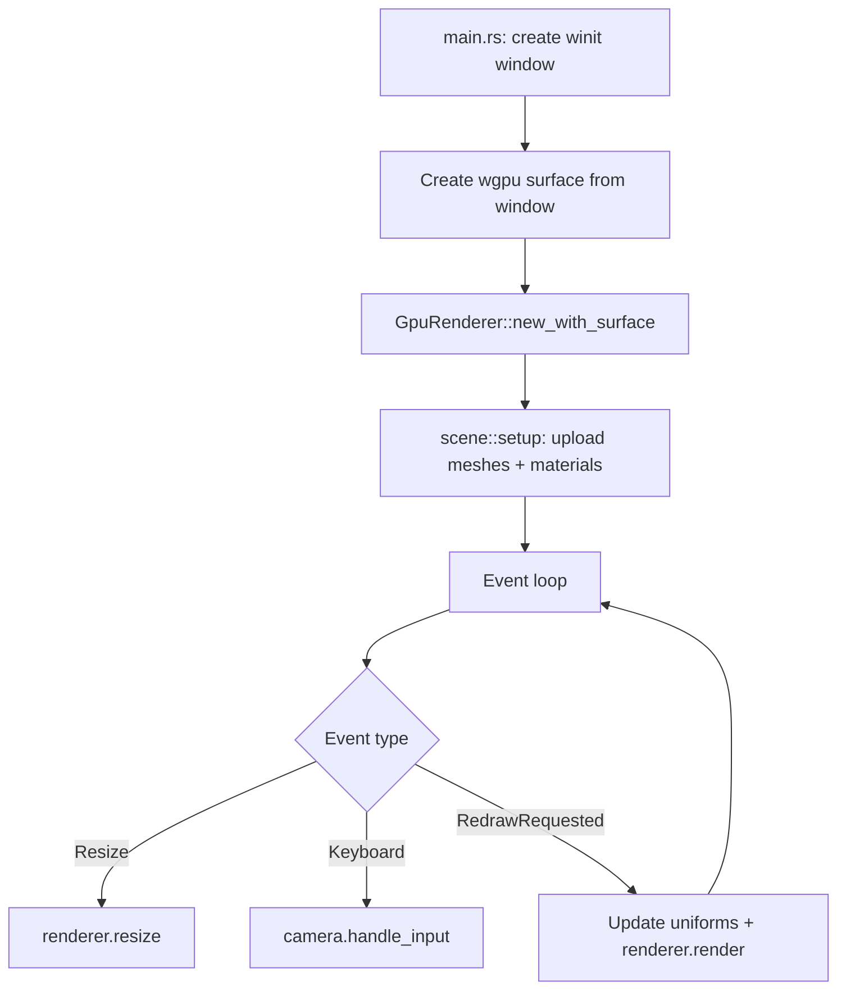

# GPU-Accelerated Rendering Demo

## Background

The Aether VR engine has a full GPU rendering subsystem (`aether-renderer/src/gpu/`) built on wgpu, including a GpuRenderer with PBR forward pipeline, cascaded shadow maps, MSAA, and material/mesh/texture managers. However, the existing `examples/3d-demo` uses a software rasterizer. There is no example demonstrating the GPU renderer in a real window.

## Why

- Validate that the GPU rendering pipeline works end-to-end with a real wgpu surface
- Provide a reference example for developers building on the engine
- Check the "GPU-accelerated rendering" milestone in the project roadmap

## What

A new example (`examples/gpu-demo/`) that opens a native window and renders a 3D PBR scene using the wgpu-based GpuRenderer, featuring:

- Procedurally generated meshes (floor plane, cube, sphere)
- PBR materials with varying metallic/roughness
- Directional light with cascaded shadow maps
- MSAA anti-aliasing
- FPS camera with WASD + arrow key controls
- Proper frame timing and resize handling

## How

### Architecture

```
examples/gpu-demo/src/
  main.rs       -- Entry point: winit event loop, renderer init, frame loop
  camera.rs     -- FPS camera with view/projection matrix math
  geometry.rs   -- Procedural mesh generation (plane, cube, UV sphere)
  scene.rs      -- Scene setup: creates meshes, materials, draw commands
```

### Key Flow



### Mesh Generation

- **Plane**: Grid of quads with configurable subdivisions, normals pointing up
- **Cube**: 24 vertices (4 per face for proper normals), 36 indices
- **Sphere**: UV sphere with configurable stacks/sectors

### Camera

Simple FPS camera storing position + yaw + pitch. Computes view matrix via look-at. Projection is perspective with configurable FOV, read from `AETHER_CAMERA_FOV` env var (default 60 degrees).

### Environment Variables

| Variable | Default | Description |
|----------|---------|-------------|
| `AETHER_GPU_BACKEND` | all | wgpu backend selection |
| `AETHER_MSAA_SAMPLES` | 4 | MSAA sample count |
| `AETHER_SHADOW_MAP_SIZE` | 2048 | Shadow map resolution |
| `AETHER_CAMERA_FOV` | 60.0 | Camera field of view (degrees) |
| `AETHER_WINDOW_WIDTH` | 1280 | Window width |
| `AETHER_WINDOW_HEIGHT` | 720 | Window height |

### Test Design

All tests run without a GPU:

- **geometry tests**: Verify vertex counts, index counts, normal directions, UV ranges for each mesh type
- **camera tests**: Verify view matrix computation, projection matrix, input handling, edge cases (pitch clamping)
- **scene tests**: Verify scene object count, material properties

GPU-dependent integration tests gated behind `#[ignore]` or `#[cfg(feature = "gpu-tests")]`.
