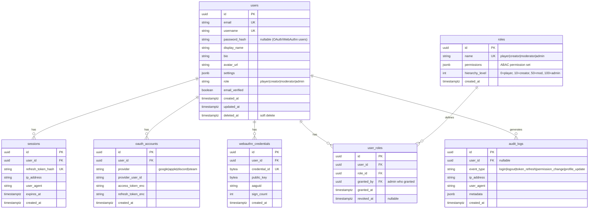
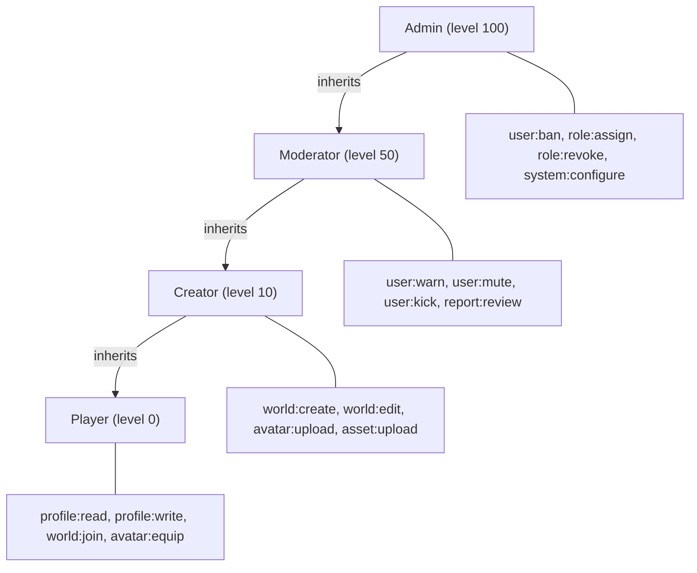
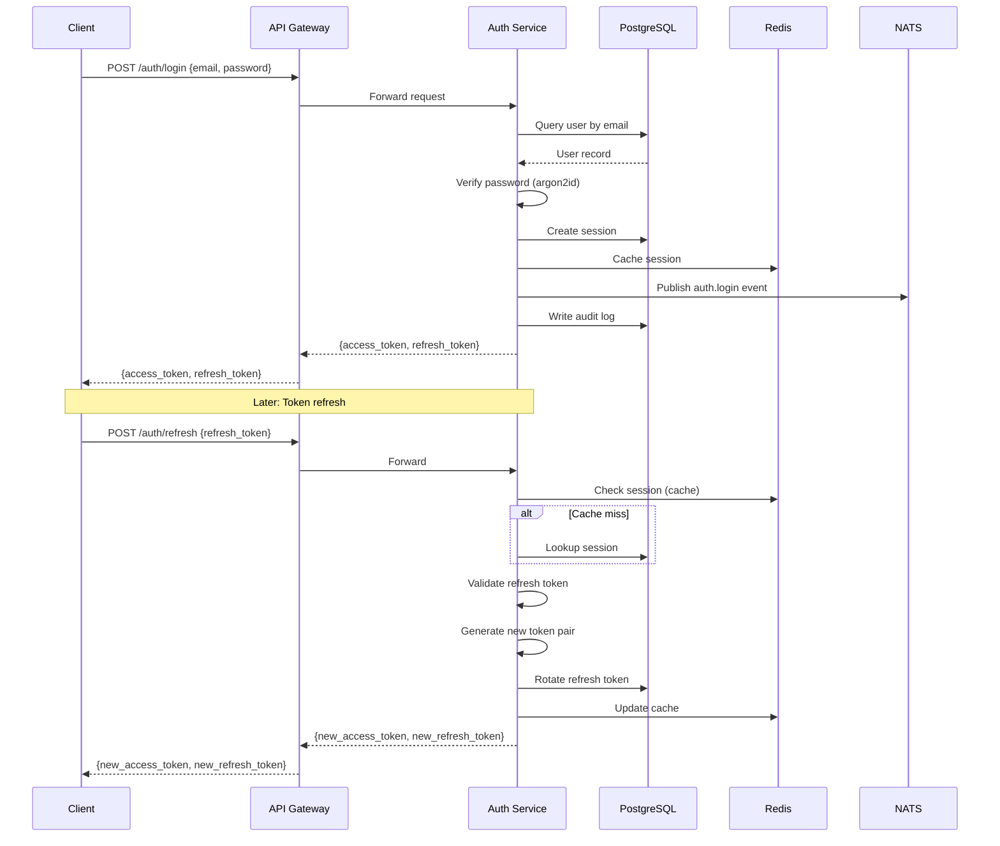
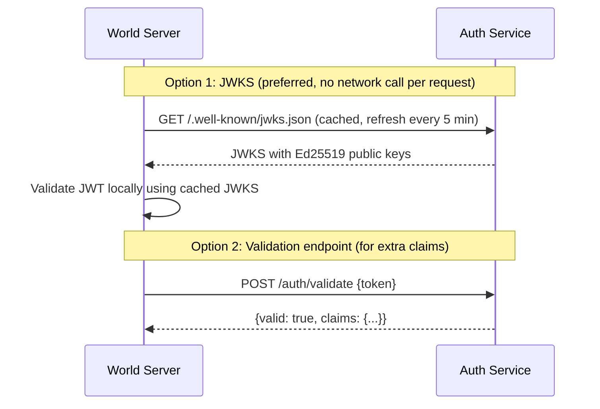

# Identity & Auth Service Design Document

**Task**: task-011
**Date**: 2026-03-07
**Status**: Design Phase
**Assignee**: @claude-005

---

## Background

The Aether platform requires a centralized identity and authentication service that handles player authentication, session management, profile management, and authorization. As per the DESIGN.md (Section 4.1, 6.1), identity is centralized — self-hosted world servers verify player tokens against this central auth service.

## Why

- All backend services and world servers need a trusted identity provider
- Players need secure authentication with modern methods (OAuth2, WebAuthn)
- Self-hosted (federated) worlds need a token validation endpoint
- Authorization (RBAC/ABAC) must be enforced consistently across the platform
- Audit logging is required for security and compliance

## What

Implement a Go-based Identity & Auth microservice with:
1. JWT-based authentication with Ed25519 signing
2. OAuth2 social login (Google, Apple, Discord, Steam)
3. Session management with refresh tokens
4. Player profile CRUD
5. Token validation endpoint for world servers
6. RBAC/ABAC permission model
7. WebAuthn/passkey support
8. Audit logging

## How

### Technology Stack

| Component | Technology | Rationale |
|---|---|---|
| Language | Go | Per DESIGN.md Section 8.2 |
| HTTP Framework | net/http + chi router | Lightweight, stdlib-compatible |
| Database | PostgreSQL 16 | ACID, JSONB for settings |
| Cache | Redis 7 | Session storage, token blacklist |
| Message Bus | NATS JetStream | Auth event publishing |
| JWT | go-jose/v4 | Ed25519/RSA signing |
| WebAuthn | go-webauthn | FIDO2/passkey support |
| Migration | golang-migrate | DB schema versioning |

### Project Structure

```
services/identity/
  cmd/
    server/
      main.go              # Entry point
  internal/
    config/
      config.go            # Environment-based configuration
    handler/
      auth.go              # Login, register, refresh, logout
      profile.go           # Profile CRUD
      oauth.go             # OAuth2 callbacks
      webauthn.go          # WebAuthn registration/auth
      token.go             # Token validation (for world servers)
      middleware.go         # Auth middleware, rate limiting
    model/
      user.go              # User, Session, Role models
      audit.go             # Audit log model
    repository/
      user.go              # User DB operations
      session.go           # Session DB operations
      audit.go             # Audit log DB operations
    service/
      auth.go              # Auth business logic
      profile.go           # Profile business logic
      oauth.go             # OAuth2 flow logic
      webauthn.go          # WebAuthn logic
      permission.go        # RBAC/ABAC logic
    migration/
      000001_init.up.sql
      000001_init.down.sql
  go.mod
  go.sum
  Dockerfile
```

### Database Design



### API Design

#### Authentication

| Method | Endpoint | Description |
|---|---|---|
| POST | /api/v1/auth/register | Register with email/password |
| POST | /api/v1/auth/login | Login with email/password |
| POST | /api/v1/auth/refresh | Refresh access token |
| POST | /api/v1/auth/logout | Revoke session |
| GET | /api/v1/auth/oauth/{provider} | Initiate OAuth2 flow |
| GET | /api/v1/auth/oauth/{provider}/callback | OAuth2 callback |
| POST | /api/v1/auth/webauthn/register/begin | Begin WebAuthn registration |
| POST | /api/v1/auth/webauthn/register/finish | Complete WebAuthn registration |
| POST | /api/v1/auth/webauthn/login/begin | Begin WebAuthn login |
| POST | /api/v1/auth/webauthn/login/finish | Complete WebAuthn login |

#### Token Validation (for world servers)

| Method | Endpoint | Description |
|---|---|---|
| POST | /api/v1/auth/validate | Validate JWT, return claims |
| GET | /api/v1/auth/.well-known/jwks.json | Public JWKS endpoint |

#### Profile

| Method | Endpoint | Description |
|---|---|---|
| GET | /api/v1/profiles/me | Get current user profile |
| PUT | /api/v1/profiles/me | Update current user profile |
| GET | /api/v1/profiles/{id} | Get user profile by ID |
| GET | /api/v1/profiles | Search profiles |

#### Permissions

| Method | Endpoint | Description |
|---|---|---|
| GET | /api/v1/permissions/me | Get own permissions |
| POST | /api/v1/admin/roles/{user_id} | Assign role (admin only) |
| DELETE | /api/v1/admin/roles/{user_id}/{role} | Revoke role (admin only) |

### JWT Token Design

**Access Token** (short-lived, 15 minutes):
```json
{
  "sub": "user-uuid",
  "iss": "aether-identity",
  "aud": ["aether-api", "aether-world"],
  "exp": 1709890800,
  "iat": 1709889900,
  "jti": "unique-token-id",
  "role": "creator",
  "permissions": ["world:create", "avatar:upload"]
}
```

**Refresh Token** (long-lived, 30 days):
- Stored as SHA-256 hash in `sessions` table
- Rotated on each refresh (old token invalidated)
- Bound to IP/user-agent for anomaly detection

**Signing**: Ed25519 (fast, small signatures, quantum-resistant compared to RSA)

### RBAC/ABAC Permission Model



Roles are hierarchical: higher-level roles inherit all permissions from lower levels.

### Auth Flow



### World Server Token Validation Flow



### Test Design

| Category | Tests |
|---|---|
| Unit: Auth | Password hashing, JWT creation/validation, token rotation |
| Unit: RBAC | Permission inheritance, role hierarchy, ABAC evaluation |
| Unit: Profile | CRUD validation, sanitization |
| Integration: Auth | Full login/register/refresh/logout flow |
| Integration: OAuth | OAuth2 flow with mocked providers |
| Integration: WebAuthn | Passkey registration/authentication flow |
| Integration: Validation | World server token validation via JWKS |
| Integration: Audit | Event logging for all auth operations |
| Repository | User CRUD, session management, audit log writes |

### Configuration (Environment Variables)

| Variable | Description | Default |
|---|---|---|
| `IDENTITY_PORT` | HTTP listen port | `8080` |
| `IDENTITY_DB_URL` | PostgreSQL connection string | required |
| `IDENTITY_REDIS_URL` | Redis connection string | required |
| `IDENTITY_NATS_URL` | NATS connection string | required |
| `IDENTITY_JWT_PRIVATE_KEY` | Ed25519 private key (PEM) | required |
| `IDENTITY_JWT_ACCESS_TTL` | Access token TTL | `15m` |
| `IDENTITY_JWT_REFRESH_TTL` | Refresh token TTL | `720h` |
| `IDENTITY_OAUTH_GOOGLE_ID` | Google OAuth client ID | optional |
| `IDENTITY_OAUTH_GOOGLE_SECRET` | Google OAuth client secret | optional |
| `IDENTITY_OAUTH_APPLE_ID` | Apple OAuth client ID | optional |
| `IDENTITY_OAUTH_DISCORD_ID` | Discord OAuth client ID | optional |
| `IDENTITY_OAUTH_STEAM_KEY` | Steam API key | optional |
| `IDENTITY_ARGON2_MEMORY` | Argon2id memory (KB) | `65536` |
| `IDENTITY_ARGON2_ITERATIONS` | Argon2id iterations | `3` |
| `IDENTITY_ARGON2_PARALLELISM` | Argon2id parallelism | `2` |
| `IDENTITY_RATE_LIMIT_LOGIN` | Login rate limit (per min) | `10` |
| `IDENTITY_RATE_LIMIT_REGISTER` | Register rate limit (per min) | `5` |
