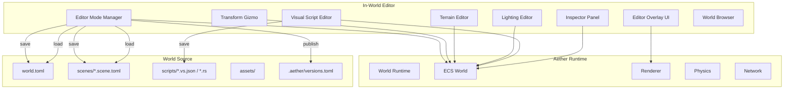
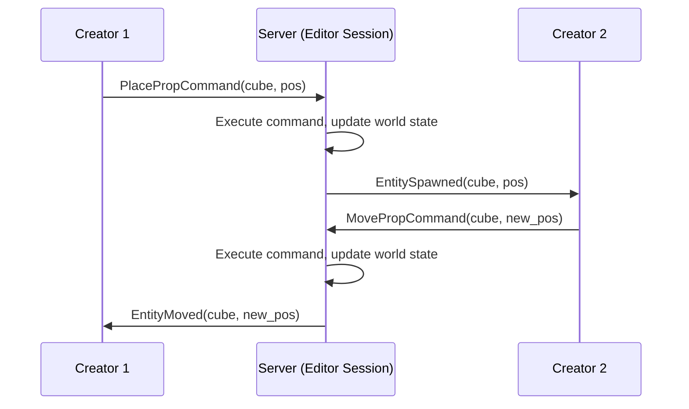
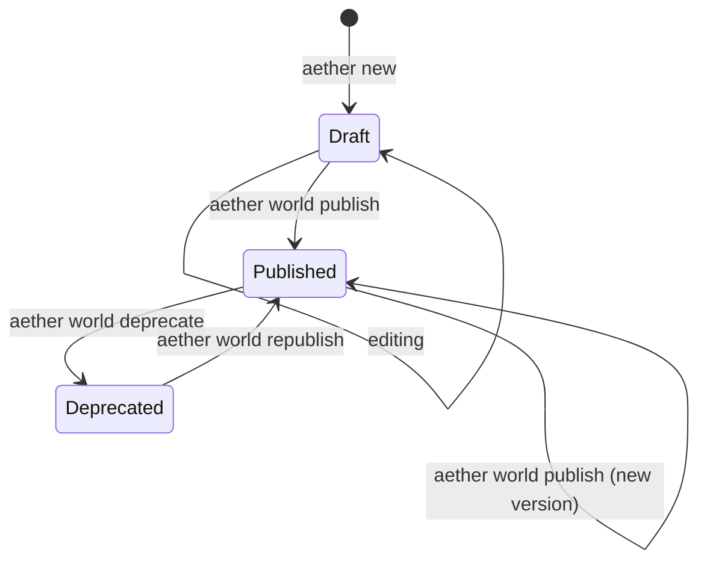

# In-World Editor

## Background

Aether currently has a standalone visual editor (`aether-visual-editor`) built with egui that runs as a separate desktop application. This approach separates the editing experience from the actual world, creating a disconnect between what creators build and what players experience. The `visual-editor-demo` example was removed because it was a poor demonstration of this flawed approach.

## Why

- **"What you edit is what you play"** — Creators should see exactly what players will see while editing. No separate tool, no context switching.
- **Lower barrier to entry** — One application to learn, not two. Launch a world, toggle editor mode, start creating.
- **Live collaboration** — Multiple creators can edit the same world simultaneously using the existing multiplayer infrastructure.
- **Maintainability** — World source files should be human-readable, diffable, and version-controllable with standard tools (git).
- **Rust-only scripting** — All world logic is authored either through visual scripts (compiled to WASM IR) or Rust (compiled to WASM). No Lua or other interpreted languages in the editing workflow.

## What

An in-world editor system where:

1. Creators choose a **world dimension** at creation time — **2D** or **3D** (default: 3D). The editor UI, physics, rendering, and tooling adapt accordingly.
2. Creators launch a world in **Editor Mode** and edit everything in-place — objects, terrain, lighting, physics, scripts, audio, UI.
3. Players join the same world in **Play Mode** and experience what was created.
4. The world source is stored as a human-readable, git-friendly project directory.
5. Worlds have semantic versioning with publish/draft/rollback lifecycle.

## How

### Architecture Overview



### World Dimension (2D vs 3D)

Worlds are created with a dimension that determines the entire editing and runtime experience:

```rust
/// Chosen at world creation time. Immutable after creation.
pub enum WorldDimension {
    /// 2D world — orthographic camera, 2D physics, sprite-based rendering.
    TwoD,
    /// 3D world — perspective camera, 3D physics, mesh-based rendering.
    ThreeD,
}
```

The dimension affects every layer of the system:

| Aspect | 2D World | 3D World |
|--------|----------|----------|
| **Camera** | Orthographic, top-down or side-view | Perspective, free-look |
| **Physics** | 2D rigid bodies + 2D colliders (box, circle, polygon) | 3D rigid bodies + 3D colliders (box, sphere, capsule, mesh) |
| **Renderer** | Sprite renderer with z-ordering and layers | Mesh renderer with PBR materials and lighting |
| **Transform** | Position (x, y), Rotation (angle), Scale (x, y) | Position (x, y, z), Rotation (quaternion), Scale (x, y, z) |
| **Gizmo** | 2-axis translate/scale, rotation dial | 3-axis translate/rotate/scale |
| **Terrain** | Tilemap editor (tile palette, auto-tiling) | Heightmap sculpting (raise/lower/smooth/flatten) |
| **Lighting** | 2D lights (point, spot, global ambient) | 3D lights (directional, point, spot, probes, ambient) |
| **Assets** | Sprites (.png), sprite sheets, tile sets | Meshes (.glb), textures, materials |
| **Viewport** | 2D canvas with pan/zoom | 3D scene with orbit/fly camera |
| **Grid** | Pixel or tile grid | Metric grid (meters) |
| **Visual Script Nodes** | 2D-specific: SetPosition2D, ApplyForce2D, Raycast2D | 3D-specific: SetPosition, ApplyForce, Raycast |

### Mode System

The world runtime gains a mode concept:

```rust
pub enum WorldMode {
    /// Full editing capabilities. Editor overlay visible.
    Editor,
    /// Play-testing within the editor. Can toggle back to Editor.
    PlayTest,
    /// Published world. No editing. Players join here.
    Play,
}
```

- **Editor** — Full access to all editing tools. Physics can be paused/stepped. Gizmos visible.
- **PlayTest** — Simulates Play mode from within the editor session. Creators test their world without publishing. Press Escape to return to Editor.
- **Play** — The published world as players experience it. No editor UI, no gizmos.

### Editor Overlay UI

Rendered as an in-world overlay (not a separate window), using the existing `aether-renderer` with a 2D UI pass on top of the scene. The layout adapts to the world dimension.

**3D World Editor (Immersive VR/MR):**

The 3D editor is NOT a 2D overlay on a 3D viewport. It is a fully immersive 3D editing experience. The creator IS inside the world, using VR controllers, MR passthrough, or desktop 3D controls to manipulate objects directly.

```
┌───────────────────────────────────────────────────────────────┐
│                     THE WORLD (YOU ARE IN IT)                 │
│                                                               │
│   ┌─────────┐                                                 │
│   │Inspector│  ← Floating 3D panel, grabbable, pinnable      │
│   │ Panel   │                                                 │
│   └─────────┘                                                 │
│                         ╭───╮                                 │
│                    ←──  │ ◆ │  ──→   3D transform gizmo      │
│                         │   │        on selected object       │
│                         ╰───╯                                 │
│                           ↓                                   │
│                                                               │
│   ┌──────────┐                              ┌──────────┐     │
│   │ Tool     │  ← Wrist menu or             │ Asset    │     │
│   │ Palette  │    radial menu               │ Browser  │     │
│   └──────────┘    (VR controllers)          └──────────┘     │
│                                                               │
│   [Scene objects are real — grab, move, rotate with hands]    │
│   [Point controller to place, laser-select distant objects]   │
│   [Pinch to scale, two-hand rotate for precision]             │
└───────────────────────────────────────────────────────────────┘
```

**3D Editor Input Modes:**

| Mode | Input | Description |
|------|-------|-------------|
| **VR** | VR headset + controllers | Full immersive editing. Grab objects with hands, floating UI panels, wrist menus. Best for spatial layout. |
| **MR (Mixed Reality)** | AR passthrough + controllers | Edit the virtual world overlaid on your real room. Great for scale reference. |
| **Desktop 3D** | Mouse + keyboard | WASD fly camera, mouse click to select, keyboard shortcuts. Fallback for creators without VR hardware. |

**3D Editor UI Elements (all rendered in 3D space):**

| Element | Behavior |
|---------|----------|
| **Floating Panels** | Inspector, hierarchy, console — 3D panels that float in world space. Grabbable, pinnable to world positions, resizable. Follow the creator or stay anchored. |
| **Transform Gizmo** | 3D arrows/rings/boxes on selected entity. Grab an axis to constrain movement. |
| **Radial Menu** | VR controller trigger opens radial tool selector (Select, Place, Sculpt, Paint, Script, Delete) |
| **Wrist Menu** | Flip wrist to see quick-access menu (Save, Undo, Redo, Play Test, Settings) |
| **Laser Pointer** | Point controller at distant objects to select/interact. Works for both world objects and UI panels. |
| **Minimap** | Optional floating top-down minimap for spatial orientation |
| **Grid Overlay** | 3D grid rendered on the ground plane, toggleable |

**2D World Editor:**

```
+--------------------------------------------------------------+
| [File] [Edit] [View] [World] [Scripts] [Play]  | v0.3.2     |
+--------------------------------------------------------------+
|                                                  |            |
|                                                  | Inspector  |
|  Tile/Sprite|                                    |            |
|  Palette    |   2D Canvas (Orthographic)         | [Name    ] |
|  __________ |                                    | [Position] |
|  |__|__|__| |   2-axis gizmos, layer             | [Rotation] |
|  |__|__|__| |   outlines, z-order indicators     | [Scale   ] |
|  |__|__|__| |                                    | [Layer   ] |
|             |                                    | [Physics ] |
|             |                                    | [Scripts ] |
+--------------------------------------------------------------+
| [Layer Stack]  |  [Asset Browser]  | [Console / Output]      |
+--------------------------------------------------------------+
```

**Shared editor features (both 2D and 3D):**

| Feature | Purpose |
|---------|---------|
| **Inspector** | Properties of selected entity — transform, components, attached scripts, physics settings |
| **Scene Hierarchy** | Tree view of all entities, parent-child relationships |
| **Asset Browser** | Browse/import assets from the `assets/` directory |
| **Visual Script Editor** | Node-graph editor for entity logic (reuses `aether-creator-studio::visual_script`) |
| **Console** | Script output, validation warnings, errors |
| **World Settings** | Global settings — physics, lighting, spawn points, max players |
| **Undo/Redo** | Full command history |

**3D-specific (immersive):**

| Feature | Purpose |
|---------|---------|
| **Terrain Tools** | Sculpt brushes in-world — point controller at ground, trigger to sculpt |
| **Hand Grab** | Grab and throw objects naturally with VR controllers |
| **Scale Mode** | Shrink yourself to see the whole world, or grow to giant scale for macro editing |
| **Teleport** | Point-and-click teleportation for fast navigation in large worlds |

**2D-specific (desktop overlay):**

| Panel | Purpose |
|-------|---------|
| **Tile Palette** | Tile/sprite picker for tilemap painting |
| **Layer Stack** | Z-order layer management (background, midground, foreground, UI) with visibility toggles |
| **Sprite Sheet Editor** | Define animation frames, slice sprite sheets |
| **Toolbar** | Mode switch, save, undo/redo, tool selection |

### Editable Systems

#### 1. Scene Objects

**3D:** Props, Lights, Spawn Points
- **Place**: Click asset in browser, click in world to place
- **Select**: Click entity in viewport or hierarchy
- **Transform**: 3-axis gizmo for translate/rotate/scale (reuses `prop_editor.rs` commands)
- **Delete**: Delete key or context menu
- **Duplicate**: Ctrl+D
- **Group/Parent**: Drag in hierarchy to parent entities
- **Grid Snap**: Configurable metric grid snapping (reuses `snap_to_grid`)

**2D:** Sprites, Tilemaps, Lights, Spawn Points
- **Place**: Click sprite in asset browser, click on canvas to place
- **Select**: Click entity on canvas or in layer stack
- **Transform**: 2-axis gizmo for translate/scale, rotation dial for angle
- **Z-Order**: Drag entities between layers, adjust draw order within a layer
- **Tilemap Painting**: Select tile from palette, paint on grid (brush, fill, erase)
- **Auto-Tiling**: Rule-based tile selection for seamless terrain edges
- **Sprite Animation**: Assign animation clips from sprite sheets
- **Grid Snap**: Pixel or tile grid snapping

#### 2. Terrain / Tilemap

**3D — Terrain:**
- **Sculpt Brushes**: Raise, Lower, Smooth, Flatten with adjustable radius/strength (reuses `terrain_editor.rs`)
- **Paint Layers**: Multi-layer texture painting with blend weights
- **Vegetation**: Scatter placement with density/randomization controls

**2D — Tilemap:**
- **Tile Palette**: Visual tile picker with categories
- **Brush Modes**: Single tile, rectangle fill, bucket fill, eraser
- **Auto-Tile Rules**: Define adjacency rules for automatic tile variant selection
- **Multi-Layer Tilemaps**: Ground, decoration, collision layers painted independently
- **Collision Tiles**: Mark tiles as solid, platform, slope, trigger

#### 3. Lighting

**3D:**
- **Ambient**: Global color and intensity
- **Directional Light**: Sun/moon with direction and shadow casting
- **Light Probes**: Place/remove with radius and intensity (reuses `lighting_editor.rs`)
- **Preview**: Real-time lighting preview in editor

**2D:**
- **Global Ambient**: Background color and brightness
- **2D Point Lights**: Radial lights with color, intensity, radius, falloff
- **2D Spot Lights**: Cone-shaped lights with angle and direction
- **Shadow Casters**: Mark sprites/tiles as shadow casting or receiving
- **Day/Night Cycle**: Configurable global light color over time

#### 4. Physics

**3D:**
- **Per-Entity**: Add/configure 3D RigidBody and Collider (Box, Sphere, Capsule, Mesh) via Inspector
- **World Settings**: Gravity vector `[x, y, z]`, tick rate
- **Debug Visualization**: Collider wireframes, velocity vectors, contact points

**2D:**
- **Per-Entity**: Add/configure 2D RigidBody and Collider (Box, Circle, Polygon, Edge) via Inspector
- **World Settings**: Gravity `[x, y]` (typically `[0, -9.81]` for side-view or `[0, 0]` for top-down)
- **Debug Visualization**: Collider outlines, velocity arrows, contact normals
- **One-Way Platforms**: Colliders that only block from one direction

#### 5. Logic (Visual Scripts)

Shared across 2D and 3D — the node-graph system is dimension-agnostic. Dimension-specific nodes provide the right primitives:

- **Per-Entity Scripts**: Attach visual scripts to entities via Inspector
- **Visual Script Editor Panel**: Full node-graph editor rendered in the overlay
  - Reuses `aether-creator-studio::visual_script` (graph, nodes, compiler, validation)
  - Compile and validate in real-time
  - Hot-reload scripts without restarting the world
- **Rust Scripts**: Reference `.rs` files in `scripts/` that compile to WASM
  - Edit externally (IDE), hot-reload on file change
  - Listed in Inspector, attachable to entities

**3D-specific nodes:** SetPosition(Vec3), ApplyForce(Vec3), Raycast3D, LookAt, SetRotation(Quat)

**2D-specific nodes:** SetPosition2D(Vec2), ApplyForce2D(Vec2), Raycast2D, SetAngle(f32), FlipSprite, PlayAnimation

**Shared nodes:** OnStart, OnTick, OnInteract, OnCollision, Branch, ForLoop, Sequence, Delay, Log, GetProperty, SetProperty, math/comparison ops

#### 6. Audio

**3D:**
- **Spatial Audio**: 3D-positioned audio emitters with distance attenuation
- **Ambient Audio**: World-level background audio settings
- **Preview**: Play/stop sounds from Inspector

**2D:**
- **Positional Audio**: 2D-positioned audio with left/right panning and distance falloff
- **Ambient Audio**: Background music and ambient loops
- **Preview**: Play/stop from Inspector

#### 7. World Settings

- **World Manifest**: Name, description, version, max players, **dimension (2D/3D, read-only after creation)**
- **Physics**: Gravity (2D vector or 3D vector depending on dimension), tick rate
- **Spawn Points**: Place and configure player spawn locations
- **Environment (3D)**: Skybox, fog, post-processing settings
- **Environment (2D)**: Background color/image, parallax layers, camera bounds

### Undo/Redo

All editor operations go through the existing `UndoStack` + `EditorCommand` trait from `aether-creator-studio::undo`. Every action (place, move, delete, terrain stroke, script edit, setting change) is a command that can be undone/redone.

### Collaborative Editing

Multiple creators can edit simultaneously using the existing multiplayer infrastructure:



- Editor commands are sent to the server, which applies them authoritatively
- State changes replicated to all connected editors
- Conflict resolution: last-write-wins for transforms, merge for non-conflicting changes
- Each creator's undo stack is local (you only undo your own actions)

---

## World Source Format

### Directory Structure

**3D World:**

```
my-world-3d/
├── world.toml                    # World manifest (dimension = "3D")
├── scenes/
│   ├── main.scene.toml           # Default scene
│   └── dungeon.scene.toml        # Additional scene
├── scripts/
│   ├── door_logic.vs.json        # Visual script (JSON, git-diffable)
│   ├── npc_patrol.vs.json        # Visual script
│   └── game_manager.rs           # Rust script (compiled to WASM)
├── assets/
│   ├── meshes/
│   │   ├── tree.glb
│   │   └── rock.glb
│   ├── textures/
│   │   ├── grass.png
│   │   └── stone.png
│   └── audio/
│       └── ambient.ogg
├── terrain/
│   ├── heightmap.toml            # Terrain metadata
│   └── heightmap.raw             # Raw heightmap data
└── .aether/
    └── versions.toml             # Version history
```

**2D World:**

```
my-world-2d/
├── world.toml                    # World manifest (dimension = "2D")
├── scenes/
│   ├── main.scene.toml           # Default scene
│   └── level2.scene.toml         # Additional scene/level
├── scripts/
│   ├── player_controller.vs.json # Visual script
│   └── enemy_ai.vs.json          # Visual script
├── assets/
│   ├── sprites/
│   │   ├── player.png
│   │   ├── player.sheet.toml     # Sprite sheet definition (frames, animations)
│   │   └── enemies.png
│   ├── tilesets/
│   │   ├── grass_tiles.png
│   │   └── grass_tiles.tileset.toml  # Tile definitions + auto-tile rules
│   └── audio/
│       └── bgm.ogg
├── tilemaps/
│   ├── main_ground.tilemap.toml  # Tilemap layer data
│   └── main_collision.tilemap.toml
└── .aether/
    └── versions.toml             # Version history
```

### world.toml

**3D World:**

```toml
[world]
name = "My Adventure World"
version = "0.3.2"
dimension = "3D"                  # "2D" or "3D", default "3D", immutable after creation
description = "An exploration adventure with puzzles and combat"

[physics]
gravity = [0.0, -9.81, 0.0]      # 3D gravity vector
tick_rate_hz = 60

[players]
max_players = 32
spawn_scene = "main"

[scenes]
default = "main"
list = ["main", "dungeon"]

[environment]
skybox = "assets/textures/sky.hdr"
fog_density = 0.01
```

**2D World:**

```toml
[world]
name = "My Platformer"
version = "0.1.0"
dimension = "2D"
description = "A side-scrolling platformer"

[physics]
gravity = [0.0, -9.81]           # 2D gravity vector (side-view)
tick_rate_hz = 60

[camera]
mode = "SideView"                # "SideView" or "TopDown"
pixels_per_unit = 32             # How many pixels = 1 world unit
bounds = { min = [0, 0], max = [1920, 1080] }

[players]
max_players = 4
spawn_scene = "main"

[scenes]
default = "main"
list = ["main", "level2"]

[environment]
background_color = [0.4, 0.6, 0.9]
parallax_layers = [
    { image = "assets/sprites/bg_far.png", speed = 0.2 },
    { image = "assets/sprites/bg_near.png", speed = 0.5 },
]
```

### Scene File — 3D (scenes/main.scene.toml)

```toml
[scene]
name = "Main World"
description = "The overworld"

[[entities]]
id = "floor-001"
kind = "Prop"
template = "meshes/stone_floor.glb"

[entities.transform]
position = [0.0, 0.0, 0.0]
rotation = [0.0, 0.0, 0.0, 1.0]
scale = [10.0, 1.0, 10.0]

[entities.physics]
body_type = "Static"
collider = { shape = "Box", half_extents = [5.0, 0.5, 5.0] }

[[entities]]
id = "door-001"
kind = "Prop"
template = "meshes/door.glb"
scripts = ["door_logic"]

[entities.transform]
position = [3.0, 1.0, 0.0]
rotation = [0.0, 0.0, 0.0, 1.0]
scale = [1.0, 1.0, 1.0]

[entities.physics]
body_type = "Kinematic"
collider = { shape = "Box", half_extents = [0.5, 1.0, 0.1] }

[[entities]]
id = "spawn-main"
kind = "SpawnPoint"

[entities.transform]
position = [0.0, 2.0, 5.0]
rotation = [0.0, 0.0, 0.0, 1.0]

[[lights]]
id = "sun-001"
kind = "Directional"
color = [1.0, 0.95, 0.9]
intensity = 1.0
direction = [-0.5, -1.0, -0.3]

[[lights]]
id = "probe-001"
kind = "Probe"
position = [0.0, 3.0, 0.0]
radius = 15.0
intensity = 0.8
```

### Scene File — 2D (scenes/main.scene.toml)

```toml
[scene]
name = "Level 1"
description = "The first level"

[tilemaps]
ground = "tilemaps/main_ground.tilemap.toml"
collision = "tilemaps/main_collision.tilemap.toml"

[[entities]]
id = "player-spawn"
kind = "SpawnPoint"

[entities.transform]
position = [3.0, 5.0]
angle = 0.0

[[entities]]
id = "enemy-001"
kind = "Sprite"
sprite = "sprites/enemies.png"
animation = "walk"
scripts = ["enemy_ai"]
layer = "midground"
z_order = 10

[entities.transform]
position = [12.0, 5.0]
angle = 0.0
scale = [1.0, 1.0]
flip_x = false

[entities.physics]
body_type = "Dynamic"
collider = { shape = "Box", half_extents = [0.4, 0.5] }
fixed_rotation = true

[[entities]]
id = "coin-001"
kind = "Sprite"
sprite = "sprites/coin.png"
animation = "spin"
scripts = ["collectible"]
layer = "midground"
z_order = 5

[entities.transform]
position = [8.0, 7.0]
angle = 0.0
scale = [0.5, 0.5]

[entities.physics]
body_type = "Static"
collider = { shape = "Circle", radius = 0.3 }
is_sensor = true

[[lights]]
id = "torch-001"
kind = "Point2D"
position = [10.0, 6.0]
color = [1.0, 0.8, 0.4]
intensity = 1.5
radius = 8.0
falloff = "Quadratic"
```

### Tilemap File (tilemaps/main_ground.tilemap.toml)

```toml
[tilemap]
tileset = "assets/tilesets/grass_tiles.png"
tile_size = [16, 16]
width = 120
height = 34
layer = "ground"

# Row-major tile indices. 0 = empty, 1+ = tile ID from tileset.
data = [
    0, 0, 0, 0, 0, 0, 0, 0,
    0, 0, 0, 0, 0, 0, 0, 0,
    # ... (full level data)
    1, 1, 1, 1, 2, 1, 1, 1,
    3, 3, 3, 3, 3, 3, 3, 3,
]

[auto_tile]
enabled = true
rules = "assets/tilesets/grass_tiles.tileset.toml"
```

### Sprite Sheet Definition (assets/sprites/player.sheet.toml)

```toml
[sheet]
image = "player.png"
frame_width = 32
frame_height = 32

[[animations]]
name = "idle"
frames = [0, 1, 2, 3]
fps = 8
looping = true

[[animations]]
name = "run"
frames = [4, 5, 6, 7, 8, 9]
fps = 12
looping = true

[[animations]]
name = "jump"
frames = [10, 11, 12]
fps = 10
looping = false
```

### Visual Script (scripts/door_logic.vs.json)

```json
{
  "id": "door_logic",
  "name": "Door Logic",
  "description": "Opens door when player interacts",
  "nodes": [
    { "id": 1, "kind": "OnInteract", "position": [0, 0] },
    { "id": 2, "kind": "Branch", "position": [300, 0] },
    { "id": 3, "kind": "GetProperty", "position": [100, 150], "params": { "property": "is_open" } },
    { "id": 4, "kind": "SetPosition", "position": [600, -50], "params": { "offset": [0, 2, 0] } },
    { "id": 5, "kind": "SetPosition", "position": [600, 100], "params": { "offset": [0, 0, 0] } },
    { "id": 6, "kind": "SetProperty", "position": [900, -50], "params": { "property": "is_open", "value": false } },
    { "id": 7, "kind": "SetProperty", "position": [900, 100], "params": { "property": "is_open", "value": true } }
  ],
  "connections": [
    { "from_node": 1, "from_port": "exec", "to_node": 2, "to_port": "exec" },
    { "from_node": 3, "from_port": "result", "to_node": 2, "to_port": "condition" },
    { "from_node": 2, "from_port": "true", "to_node": 4, "to_port": "exec" },
    { "from_node": 2, "from_port": "false", "to_node": 5, "to_port": "exec" },
    { "from_node": 4, "from_port": "exec", "to_node": 6, "to_port": "exec" },
    { "from_node": 5, "from_port": "exec", "to_node": 7, "to_port": "exec" }
  ]
}
```

### Why TOML + JSON

| Format | Used For | Reason |
|--------|----------|--------|
| TOML | world.toml, scenes, terrain metadata | Human-readable, great for config, clean diffs |
| JSON | Visual scripts (.vs.json) | Structured data, tooling support, node graphs map naturally |
| Raw binary | Heightmaps, compiled WASM | Performance, not meant to be hand-edited |

All text formats are git-diffable. A scene change shows exactly which entity moved where.

---

## Version Management

### Semantic Versioning

Worlds use semver in `world.toml`:

```
MAJOR.MINOR.PATCH

- MAJOR: Breaking changes (scene restructure, incompatible script API changes)
- MINOR: New content (new scenes, entities, scripts)
- PATCH: Fixes (position tweaks, script bug fixes)
```

### Version Lifecycle



### Version History (.aether/versions.toml)

```toml
[[versions]]
version = "0.3.2"
published_at = "2026-03-19T10:30:00Z"
changelog = "Fixed door interaction bug, added dungeon scene"
checksum = "sha256:abc123..."

[[versions]]
version = "0.3.1"
published_at = "2026-03-18T14:00:00Z"
changelog = "Added NPC patrol scripts"
checksum = "sha256:def456..."

[[versions]]
version = "0.3.0"
published_at = "2026-03-15T09:00:00Z"
changelog = "New lighting system, terrain rework"
checksum = "sha256:789abc..."
```

### CLI Commands

```bash
# Create a new 3D world project (default)
aether world new my-world

# Create a new 2D world project
aether world new my-platformer --2d

# Explicit dimension flags
aether world new my-world --3d       # Same as default
aether world new my-world --2d       # 2D world

# Open world in editor mode (launches the runtime with editor overlay)
# Automatically detects dimension from world.toml
aether world edit [path]

# Publish a version (bumps version, records in history, builds assets)
aether world publish [--major|--minor|--patch] [--changelog "message"]

# List version history
aether world versions

# Rollback to a previous version
aether world rollback <version>

# Validate world project
aether world check

# Run world in play mode locally
aether world play [path]

# Serve world for multiplayer
aether world serve [path] [--port 3000]
```

The `--2d` / `--3d` flag only applies to `aether world new`. All other commands read the `dimension` field from `world.toml` and adapt automatically.

### Git Integration

The world source format is designed for git:

```bash
cd my-world
git init
git add .
git commit -m "Initial world"

# After editing in the in-world editor...
git diff scenes/main.scene.toml
# Shows exactly which entities changed

git commit -am "Moved spawn point, added door script"
```

---

## Crate Changes

### New: `aether-world-editor`

The core in-world editor crate, replacing `aether-visual-editor` (egui standalone).

**Responsibilities:**
- Editor mode manager (Editor/PlayTest/Play switching)
- **3D Editor**: Immersive VR/MR editing with floating 3D panels, hand interaction, radial menus, laser pointers
- **2D Editor**: Desktop overlay UI with tile palette, layer stack, 2D canvas tools
- **Desktop 3D fallback**: Mouse+keyboard 3D editing for creators without VR hardware
- Input routing (editor vs. world input, VR controller vs. keyboard/mouse)
- Scene serialization/deserialization (TOML ↔ ECS)
- Visual script panel (embeds visual_script graph editing — rendered as floating 3D panel in VR, or overlay in 2D)
- Asset browser
- Inspector panel
- World source file management (load/save)

**Dependencies:**
- `aether-ecs` — entity/component manipulation
- `aether-renderer` — 3D panel rendering, gizmo rendering, 2D overlay rendering
- `aether-physics` — debug visualization, collider editing
- `aether-creator-studio` — terrain, props, lighting, selection, undo, visual scripts
- `aether-scripting` — script hot-reload
- `aether-input` — VR controller input, keyboard/mouse input, editor input routing

### Modified: `aether-creator-studio`

- Keep all existing modules (scene, terrain, props, lighting, selection, undo, visual_script)
- Add scene serialization: `scene_serde` module for TOML ↔ EditorScene conversion
- Add world project I/O: `project` module for loading/saving world source directories
- Visual script serialization to `.vs.json`

### Modified: `aether-cli`

- Add `aether world` subcommand group (new, edit, publish, versions, rollback, check, play, serve)
- Existing `aether new` becomes alias for `aether world new`
- Existing `aether serve` becomes alias for `aether world serve`
- Existing `aether check` becomes alias for `aether world check`

### Remove: `aether-visual-editor`

The egui-based standalone editor is replaced by the in-world editor overlay.

### Remove: `aether-lua`

Lua scripting is removed. All logic is either visual scripts or Rust WASM.

---

## Implementation Phases

### Phase 1: Foundation — World Project & CLI
1. World dimension type system (`WorldDimension::TwoD` / `ThreeD`)
2. `aether world new` with `--2d` / `--3d` flags, scaffolding both project types
3. World source format: `world.toml` parsing with dimension field
4. Scene TOML serialization/deserialization (2D and 3D variants)
5. `aether world check` validates dimension-aware project structure
6. Create `aether-world-editor` crate with mode manager (Editor/PlayTest/Play)
7. Undo/redo integration

### Phase 2: 2D Editor (Desktop Overlay)
1. 2D canvas viewport with pan/zoom (orthographic camera)
2. 2D entity selection + 2-axis transform gizmo
3. Tile palette and tilemap painting (brush, fill, erase)
4. Sprite placement and z-order layer management
5. 2D lighting editor (point lights, ambient)
6. 2D physics component editing (Box, Circle, Polygon colliders)
7. Inspector panel, scene hierarchy, asset browser
8. Debug visualization (2D collider outlines)
9. Basic save/load: 2D scene ↔ TOML

### Phase 3: 3D Editor — Desktop Fallback
1. 3D fly camera (WASD + mouse look) for desktop editing
2. 3D entity selection + 3-axis transform gizmo (mouse click + drag)
3. 3D prop placement from asset browser
4. Terrain sculpting/painting tools
5. 3D lighting editor (directional, probes, ambient)
6. 3D physics component editing (Box, Sphere, Capsule, Mesh colliders)
7. Inspector as floating 3D panel or side overlay
8. Debug visualization (3D collider wireframes, velocity vectors)
9. Grid snapping and alignment tools

### Phase 4: 3D Editor — Immersive VR/MR
1. VR controller input mapping (grab, trigger, menu, thumbstick)
2. Hand-based object manipulation (grab, move, rotate, throw)
3. Laser pointer for distant object selection and UI interaction
4. Floating 3D UI panels (inspector, hierarchy, console) — grabbable, pinnable
5. Radial tool menu (trigger to open: Select, Place, Sculpt, Paint, Script, Delete)
6. Wrist menu (flip wrist: Save, Undo, Redo, PlayTest, Settings)
7. Scale-self mode (shrink/grow creator for macro/micro editing)
8. Teleport navigation for large worlds
9. MR passthrough mode for mixed-reality editing

### Phase 5: Logic Editing (shared 2D/3D)
1. Visual script editor panel (floating 3D panel in VR, overlay in 2D desktop)
2. Dimension-aware node types (2D nodes for 2D worlds, 3D nodes for 3D worlds)
3. Script attachment to entities via Inspector
4. Compile + hot-reload visual scripts
5. Rust script file watching + hot-reload
6. Console panel for script output/errors
7. PlayTest mode (simulate play within editor, Escape to return)

### Phase 6: World Management
1. `aether world publish` with version bumping and changelog
2. Version history tracking in `.aether/versions.toml`
3. Rollback support (`aether world rollback <version>`)
4. `aether world edit` command (launch runtime in editor mode, auto-detect dimension)
5. `aether world play` for local play testing
6. Asset import pipeline integration

### Phase 7: Collaborative Editing
1. Editor command replication via multiplayer (both 2D and 3D)
2. Multi-creator session management
3. Conflict resolution (last-write-wins for transforms, merge for non-conflicting)
4. Per-creator undo stacks
5. Creator presence (show who's editing what — avatar in 3D, cursor in 2D)

---

## Test Design

### Unit Tests
- Scene serialization round-trip: 3D scene (TOML ↔ EditorScene)
- Scene serialization round-trip: 2D scene (TOML ↔ EditorScene with sprites, layers, tilemaps)
- Tilemap serialization round-trip (TOML ↔ TilemapData)
- Sprite sheet definition parsing
- Visual script serialization round-trip (JSON ↔ NodeGraph)
- World manifest validation (2D and 3D variants)
- Dimension field immutability (reject changes after creation)
- Version management (bump, rollback, history)
- Editor command execution and undo/redo (2D and 3D commands)
- Mode transitions (Editor ↔ PlayTest ↔ Play)
- `aether world new --2d` generates correct project structure
- `aether world new --3d` generates correct project structure (default)

### Integration Tests
- Load 3D world project → spawn ECS entities → verify 3D transforms match scene file
- Load 2D world project → spawn ECS entities → verify 2D transforms, layers, tilemaps
- Edit entity in editor → save → reload → verify persistence (both 2D and 3D)
- Tilemap paint → save → reload → verify tile data preserved
- Visual script compile → attach to entity → trigger event → verify behavior
- 2D-specific visual script nodes (SetPosition2D, ApplyForce2D) execute correctly
- Hot-reload: modify script file → detect change → reload → verify new behavior
- Publish flow: edit → publish → load published version → verify
- VR input: controller grab → entity moves → verify transform updated

### E2E Tests
- Full 3D workflow: `aether world new` → VR edit → publish → play
- Full 2D workflow: `aether world new --2d` → desktop edit → publish → play
- Collaborative 3D: two VR editors connect → one grabs and moves prop → other sees it
- Collaborative 2D: two editors connect → one paints tilemap → other sees it
- Version rollback: publish v2 → rollback to v1 → verify v1 state restored
- Dimension mismatch: attempt to open 2D world with 3D editor tools → verify correct UI loaded
