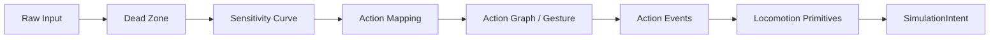
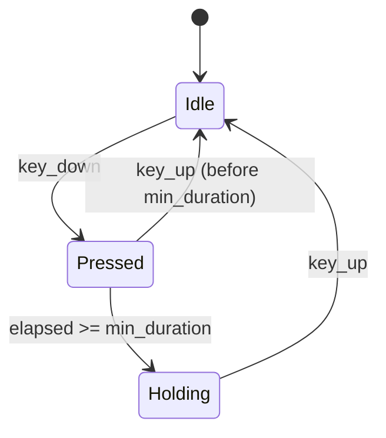
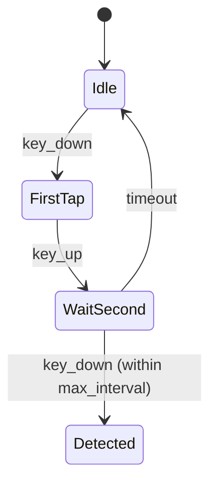

# Input & Locomotion Integration (task-027)

## Background

The `aether-input` crate has type-level abstractions for VR input (RuntimeAdapter, OpenXrAdapter, Pose3, HapticRequest, LocomotionProfile, InteractionEvent) but lacks actual input processing logic. There is no desktop input support, no configurable action mapping, no gesture detection (hold/double-tap/combo), no dead zone handling, and no sensitivity curve processing. The locomotion system defines modes (Smooth, Teleport, SnapTurn, SmoothTurn) but has no movement computation logic.

## Why

Without input processing, the engine cannot:
- Accept keyboard/mouse input for desktop VR development and flat-screen testing
- Map arbitrary physical inputs to semantic actions
- Detect complex gestures (hold, double-tap, combos)
- Compute actual locomotion vectors from input
- Handle thumbstick dead zones and sensitivity curves

## What

Implement six modules that form a complete raw-input-to-action-event pipeline:

1. **Desktop adapter** - Keyboard/mouse RuntimeAdapter implementation
2. **Action mapping** - Configurable input-to-action binding system
3. **Action graph** - Gesture detection (press, hold, double-tap, combo)
4. **Locomotion movement** - Smooth movement, teleport, snap turn, smooth turn computation
5. **Input processing pipeline** - Orchestrates mapping -> dead zone -> sensitivity -> gesture -> action
6. **Dead zone & sensitivity** - Thumbstick dead zone and response curve processing

## How

### Architecture



### Module Design

#### 1. Desktop Adapter (`desktop.rs`)

A `DesktopAdapter` implementing `RuntimeAdapter` that translates keyboard/mouse state into `InputFrame` events. Maintains a set of currently pressed keys and mouse state.

Key types:
- `KeyCode` - Enum of keyboard keys (WASD, arrows, space, shift, etc.)
- `MouseAxis` - X/Y mouse movement axes
- `DesktopInputState` - Current key/mouse state snapshot
- `DesktopAdapter` - Implements `RuntimeAdapter`

#### 2. Action Mapping (`mapping.rs`)

Configurable binding from physical inputs to named actions. Supports multiple bindings per action and multiple input source types.

Key types:
- `InputSource` - Physical input identifier (keyboard key, mouse button/axis, gamepad button/axis)
- `ActionBinding` - Maps an InputSource + InputGesture to a named action
- `ActionMap` - Collection of bindings with lookup methods

#### 3. Action Graph (`graph.rs`)

Detects complex gestures by tracking input timing and state. Each gesture type is a state machine.

Key types:
- `InputGesture` - Press, Release, Hold (with duration), DoubleTap (with interval), Combo (multi-key)
- `GestureState` - Internal tracking state per gesture
- `GestureDetector` - Processes raw input events against gesture definitions
- `ActionEvent` - Output: named action + phase + value

State machine for Hold gesture:


State machine for DoubleTap gesture:


#### 4. Locomotion Movement (`movement.rs`)

Pure-function locomotion computations. Takes direction vectors and config, outputs position/rotation deltas.

Key functions:
- `compute_smooth_move` - Direction + speed + dt -> position delta [f32; 3]
- `compute_teleport` - Origin + target + validation -> TeleportResult
- `compute_snap_turn` - Current yaw + step_deg -> new yaw
- `compute_smooth_turn` - Current yaw + speed + dt -> new yaw

#### 5. Input Processing Pipeline (`processing.rs`)

Orchestrates the full pipeline from raw input through dead zone, sensitivity, mapping, gesture detection, to final action events.

Key types:
- `InputPipeline` - Holds references to ActionMap, DeadZoneConfig, SensitivityCurve, GestureDetector
- `InputPipeline::process` - Takes raw input state + timestamp, returns Vec<ActionEvent>

#### 6. Dead Zone & Sensitivity (`deadzone.rs`)

Processes raw axis values through dead zone filtering and sensitivity curve shaping.

Key types:
- `DeadZoneConfig` - inner_radius, outer_radius, shape (Circular/Square)
- `DeadZoneShape` - Circular or Square
- `SensitivityCurve` - Linear, Quadratic, Cubic, SCurve, Custom(Vec<(f32, f32)>)
- `apply_dead_zone` - Remaps axis value through dead zone
- `apply_sensitivity` - Remaps value through curve

Dead zone formula (circular):
```
if magnitude <= inner_radius: output = 0
if magnitude >= outer_radius: output = 1
else: output = (magnitude - inner) / (outer - inner)
```

### Database Design
N/A - Pure in-memory input processing, no persistence needed.

### API Design

Public API additions to `aether-input`:
- `DesktopAdapter::new(config) -> DesktopAdapter`
- `DesktopAdapter::update_key(key, pressed)`
- `DesktopAdapter::update_mouse(dx, dy)`
- `ActionMap::new() -> ActionMap`
- `ActionMap::bind(action_name, source, gesture)`
- `ActionMap::resolve(source) -> Vec<&ActionBinding>`
- `GestureDetector::new() -> GestureDetector`
- `GestureDetector::update(source, pressed, now_ms) -> Vec<ActionEvent>`
- `InputPipeline::new(map, deadzone, sensitivity) -> InputPipeline`
- `InputPipeline::process(state, now_ms) -> Vec<ActionEvent>`
- `apply_dead_zone(x, y, config) -> (f32, f32)`
- `apply_sensitivity(value, curve) -> f32`
- `compute_smooth_move(direction, speed, acceleration, max_speed, dt) -> [f32; 3]`
- `compute_teleport(origin, target, max_distance) -> TeleportResult`
- `compute_snap_turn(yaw, step_deg) -> f32`
- `compute_smooth_turn(yaw, speed, dt) -> f32`

### Test Design

All tests are pure logic (no hardware dependencies):

1. **Dead zone tests**: inside inner (output 0), outside outer (output 1), linear interpolation in between, circular vs square shape, edge cases (0,0 input; 1,1 input)
2. **Sensitivity curve tests**: linear (identity), quadratic, cubic, S-curve, custom curve interpolation
3. **Action mapping tests**: single binding lookup, multiple bindings per action, unbound source returns empty
4. **Gesture detection tests**: press fires on key_down, release fires on key_up, hold fires after duration, hold cancels on early release, double-tap fires on second tap within interval, double-tap times out
5. **Locomotion tests**: smooth move direction calculation, teleport within/beyond max distance, snap turn wraps at 360, smooth turn with dt
6. **Pipeline integration tests**: full raw-input-to-action flow
7. **Desktop adapter tests**: key press/release generates events, mouse movement generates axis values
