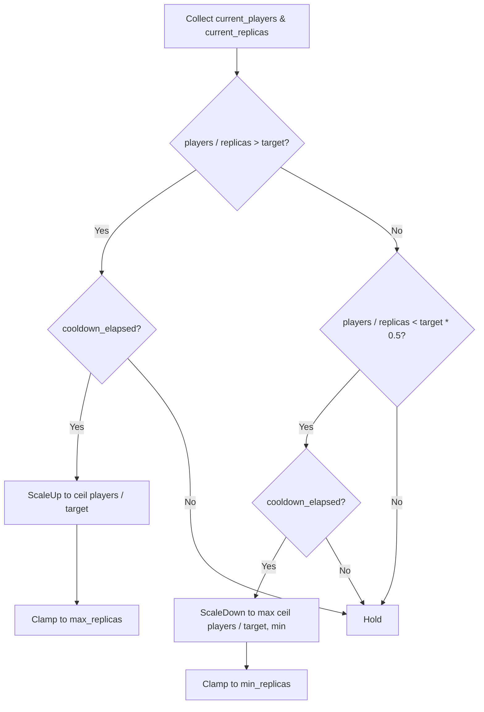

# Kubernetes Deployment & Auto-Scaling

## Background

Aether VR engine runs world-server pods on Kubernetes. The existing `aether-deploy` crate provides basic topology primitives (`Region`, `Datacenter`, `HpaProfile`, `WorldServerRuntime`) but lacks concrete manifest generation, custom metric-based scaling, zone-aware scheduling, health probes, PVC management, and multi-region routing.

## Why

Production VR workloads need:

- **Deterministic manifest generation** so CI/CD can produce reproducible YAML without hand-editing.
- **Player-count-based scaling** because CPU utilisation is a poor proxy for VR-world capacity; a world with 100 idle players uses little CPU but still needs memory and bandwidth headroom.
- **Zone-aware scheduling** to co-locate players in the same availability zone and reduce cross-zone latency/cost.
- **Health probes** that distinguish between "process alive" (liveness) and "ready to accept players" (readiness).
- **Persistent storage** for the Write-Ahead Log (WAL), so world state survives pod restarts.
- **Multi-region routing** to direct players to the closest healthy region.

## What

Add five new modules to `aether-deploy`:

| Module | Responsibility |
|---|---|
| `manifest` | Generate K8s `StatefulSet` / `Deployment` YAML |
| `scaling` | Custom HPA metric definitions & scaling decision logic |
| `topology` | Zone-aware pod affinity / anti-affinity rules |
| `probes` | Liveness, readiness, and startup probe configuration |
| `region` | Multi-region routing and failover decisions |

## How

All modules produce in-memory structs that serialise to YAML via `serde` + `serde_yaml`. No K8s client SDK dependency -- manifests are generated as plain YAML strings for consumption by `kubectl apply` or a GitOps pipeline.

### Module Design

#### manifest.rs

```rust
pub struct DeploymentConfig { .. }   // top-level config
pub struct ResourceRequirements { .. }
pub struct PvcConfig { .. }
pub enum WorkloadKind { StatefulSet, Deployment }
```

`DeploymentConfig::render_yaml()` produces a complete K8s manifest string.

- `StatefulSet` is used when `pvc` is `Some` (durable worlds needing WAL).
- `Deployment` is used for stateless gateway / matchmaking pods.

#### scaling.rs

```rust
pub struct ScalingConfig { .. }
pub struct ScalingDecision { .. }
pub struct CustomMetric { .. }
```

`ScalingConfig::compute_desired_replicas(current_players, current_replicas)` returns a `ScalingDecision` indicating scale-up, scale-down, or hold, respecting cooldown periods and the configured `target_players_per_pod`.

Custom HPA metrics are rendered as annotation/metadata on the generated manifest.

#### topology.rs

```rust
pub struct TopologyConfig { .. }
pub struct AffinityRule { .. }
```

Generates pod affinity/anti-affinity YAML fragments for:
- Spreading pods across zones (`topologyKey: topology.kubernetes.io/zone`).
- Optional preferred co-location with related services.

#### probes.rs

```rust
pub struct ProbeConfig { .. }
pub struct Probe { .. }
```

Generates liveness and readiness HTTP-GET probe specs with configurable paths, ports, delays, and thresholds.

#### region.rs

```rust
pub struct RegionRoutingConfig { .. }
pub struct RoutingDecision { .. }
```

Given a player's region code and the set of healthy regions, selects the best target region (lowest latency, with failover to next-closest).

### Database Design

N/A -- this feature produces configuration artifacts, not persistent state.

### API Design

All public via Rust crate API. No HTTP endpoints added.

### Test Design

All tests are in-memory unit tests within each module (`#[cfg(test)] mod tests`).

- **manifest**: round-trip YAML generation, verify required fields present, verify StatefulSet vs Deployment selection.
- **scaling**: scale-up when over target, scale-down when under, respect cooldowns, clamp to min/max.
- **topology**: verify affinity YAML contains correct topology keys.
- **probes**: verify generated probe structs have correct paths/ports.
- **region**: routing to closest region, failover when primary unhealthy.

### Scaling Decision Workflow


