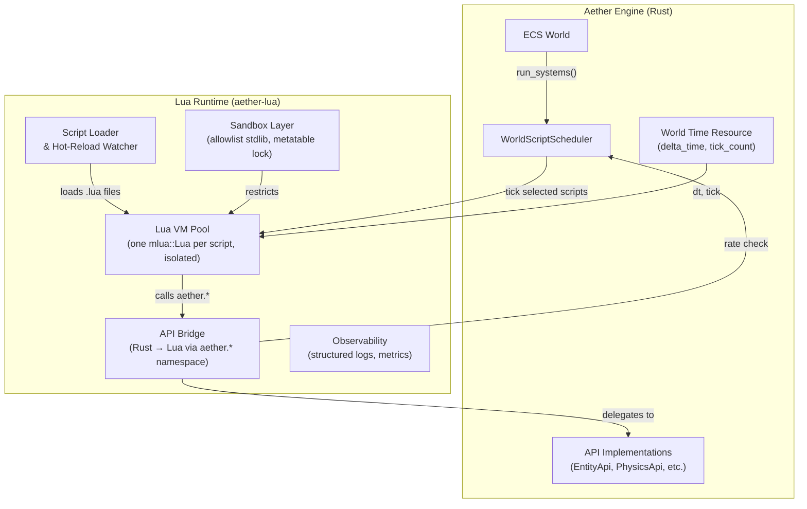
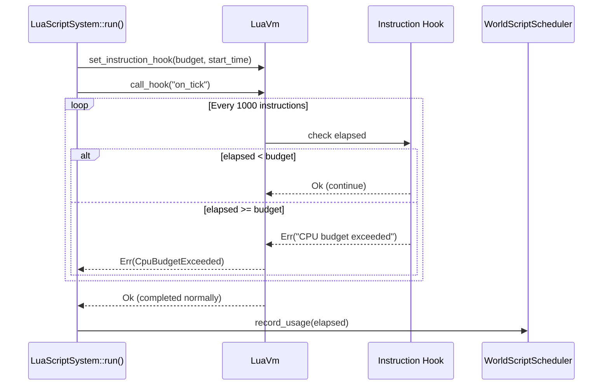
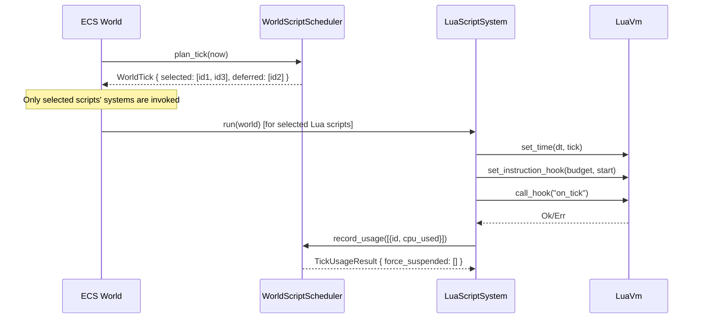
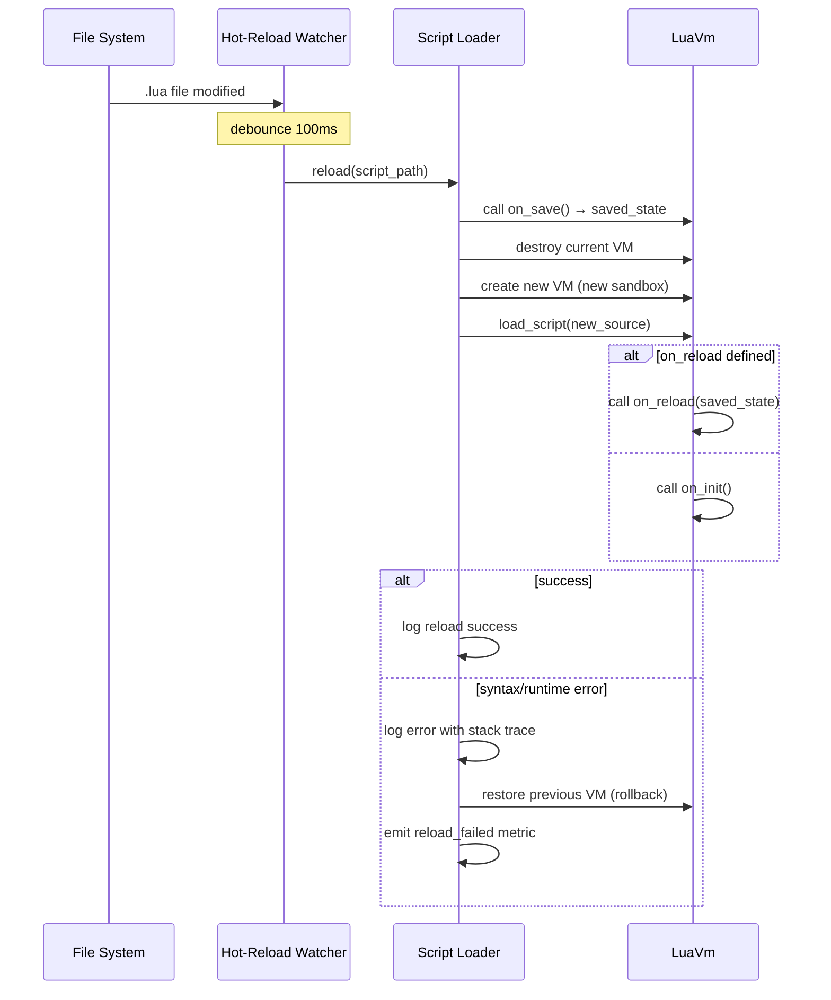
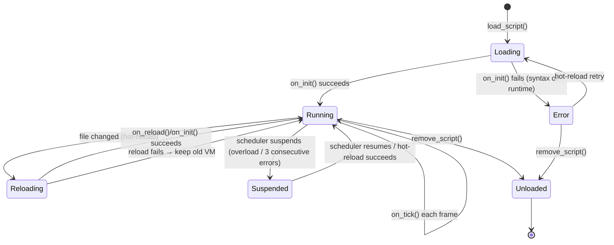

# Lua Scripting Runtime Design Document

## Background

Aether currently uses a WASM-based scripting pipeline where developers write scripts in Rust, AssemblyScript, C/C++, or TinyGo, compile them to WASM artifacts, and run them via a JIT/AOT runtime. While this approach offers high performance and platform portability, it imposes a significant barrier to entry: developers must learn a systems-level language, set up a compilation toolchain, and wait for compile cycles before seeing results.

Game engines like Roblox (Luau), World of Warcraft, and Garry's Mod have demonstrated that **Lua** is an ideal scripting language for user-generated content and rapid gameplay prototyping. Its minimal syntax, fast embedding, and battle-tested sandbox model make it a natural fit for Aether's VR world scripting.

## Why

1. **Lower barrier to entry** - Lua is one of the simplest languages to learn. Creators who are not professional developers can pick it up in hours, dramatically expanding the pool of people who can build Aether worlds.
2. **Instant iteration** - No compilation step. Developers edit a `.lua` file, and the engine hot-reloads it. This shortens the edit-test loop from minutes (WASM compile) to milliseconds.
3. **Battle-tested in game engines** - Lua has 30+ years of proven use in game scripting (Roblox/Luau, WoW, LOVE2D, Defold, CryEngine, Garry's Mod). The ecosystem and community knowledge are mature.
4. **Lightweight embedding** - The full Lua 5.4 interpreter is ~250KB. `mlua` (the Rust-Lua bridge crate) provides safe, ergonomic FFI with async support and sandboxing.
5. **Sandboxable** - Lua's `setfenv`/debug library can be stripped; `mlua` provides `Scope` and `Sandbox` modes that prevent scripts from accessing the filesystem, network, or OS APIs directly.
6. **Complement, not replace** - Lua handles high-level gameplay logic (event handlers, UI flows, NPC behaviors). Performance-critical code (physics, rendering, networking) remains in Rust. The existing WASM pipeline coexists for advanced users who need native-speed scripts.

## What

Implement a Lua scripting runtime for Aether that:

1. Embeds a Lua VM (via `mlua` crate) into the engine, one isolated VM instance per script per world
2. Exposes the existing `aether-scripting` API surface (EntityApi, PhysicsApi, UIApi, AudioApi, NetworkApi, StorageApi) as namespaced Lua-callable functions under the `aether` module
3. Integrates with the existing `WorldScriptScheduler` for resource limiting (CPU, memory, entity spawns, RPC rate, storage writes)
4. Supports hot-reloading of Lua scripts without restarting the world
5. Provides a comprehensive sandboxed execution environment with allowlist-based stdlib access, metatable protection, and per-script isolation
6. Registers Lua scripts as ECS systems that participate in the stage pipeline with explicit stage-to-hook mapping

## How

### Architecture Overview



### Detail Design

#### 1. Crate Structure

A new workspace crate `crates/aether-lua` will house the Lua runtime integration.

```
crates/aether-lua/
├── Cargo.toml
├── src/
│   ├── lib.rs              # Module exports
│   ├── vm.rs               # LuaVm wrapper around mlua::Lua
│   ├── sandbox.rs          # Sandbox: allowlist stdlib, lock metatables, block escapes
│   ├── bridge.rs           # Registers engine API into aether.* Lua namespace
│   ├── script.rs           # LuaScript descriptor, lifecycle (load, reload, unload)
│   ├── system.rs           # ECS System impl that ticks Lua scripts (Send+Sync via Mutex)
│   ├── hot_reload.rs       # File watcher for .lua changes, triggers reload
│   ├── error.rs            # Structured error types, stack trace formatting
│   └── metrics.rs          # Observability: counters, log events, correlation IDs
└── tests/
    ├── vm_tests.rs
    ├── sandbox_tests.rs
    ├── bridge_tests.rs
    ├── script_tests.rs
    ├── system_tests.rs
    ├── hot_reload_tests.rs
    └── integration_tests.rs
```

#### 2. Lua VM Wrapper (`vm.rs`)

Each Lua script gets its own isolated `mlua::Lua` instance. This guarantees per-script isolation — one script cannot observe or mutate another script's global state, registry, or metatables.

```rust
use mlua::prelude::*;
use std::sync::Mutex;
use std::time::Instant;

pub struct LuaVm {
    lua: Mutex<Lua>,  // Mutex makes LuaVm Send + Sync
    script_id: ScriptId,
    script_name: String,
    memory_limit: usize,
}

impl LuaVm {
    pub fn new(script_id: ScriptId, name: &str, memory_limit: usize) -> Result<Self> {
        let lua = Lua::new();
        lua.set_memory_limit(memory_limit);
        sandbox::apply(&lua)?;
        Ok(Self {
            lua: Mutex::new(lua),
            script_id,
            script_name: name.to_string(),
            memory_limit,
        })
    }

    pub fn load_script(&self, source: &str) -> Result<()> {
        let lua = self.lua.lock().unwrap();
        lua.load(source).set_name(&self.script_name).exec()?;
        Ok(())
    }

    /// Call a lifecycle hook. Delta time is read from aether.time.dt (set by the system
    /// runner before each tick), not passed as an argument to System::run.
    pub fn call_hook(&self, hook_name: &str) -> Result<()> {
        let lua = self.lua.lock().unwrap();
        let globals = lua.globals();
        if let Ok(func) = globals.get::<LuaFunction>(hook_name) {
            func.call::<()>(())?;
        }
        Ok(())
    }

    /// Set the time resource into the Lua aether.time table before each tick.
    pub fn set_time(&self, dt: f32, tick: u64) -> Result<()> {
        let lua = self.lua.lock().unwrap();
        let aether: LuaTable = lua.globals().get("aether")?;
        let time: LuaTable = aether.get("time")?;
        time.set("dt", dt)?;
        time.set("tick", tick)?;
        Ok(())
    }

    pub fn script_name(&self) -> &str { &self.script_name }
    pub fn script_id(&self) -> ScriptId { self.script_id }
    pub fn memory_used(&self) -> usize {
        let lua = self.lua.lock().unwrap();
        lua.used_memory()
    }
}
```

**Thread safety**: `mlua::Lua` is `!Send` by default. We wrap it in a `Mutex<Lua>` so that `LuaVm` implements `Send + Sync`, satisfying the `System: Send + Sync` trait bound required by `aether-ecs`. Lua scripts never run in parallel with themselves (each script's system access declares broad writes to prevent batching with itself). Multiple Lua scripts CAN run in parallel since each has its own VM instance behind its own Mutex.

**Delta time**: The ECS `System::run(&self, world: &World)` signature does not include `dt`. Instead, the `LuaScriptSystem` reads `delta_time` from the `World`'s time resource (stored as a component on a singleton entity or via a world resource API) and injects it into `aether.time.dt` before calling `on_tick()`. Scripts access time via `aether.time.dt` rather than a function parameter.

#### 3. Sandbox Layer (`sandbox.rs`)

The sandbox uses an **allowlist** approach — only explicitly permitted globals and modules are retained.

```rust
/// Allowed stdlib modules and globals.
const ALLOWED_GLOBALS: &[&str] = &[
    "assert", "error", "ipairs", "next", "pairs", "pcall", "print",
    "rawequal", "rawget", "rawlen", "rawset", "select", "tonumber",
    "tostring", "type", "unpack", "xpcall",
];

const ALLOWED_MODULES: &[&str] = &["math", "string", "table", "utf8", "coroutine"];

/// Globals explicitly DENIED (removed even if present).
const DENIED_GLOBALS: &[&str] = &[
    "os", "io", "debug", "loadfile", "dofile", "require",
    "load", "collectgarbage", "newproxy", "setfenv", "getfenv",
    "setmetatable",  // replaced with safe_setmetatable (see below)
];

pub fn apply(lua: &Lua) -> Result<()> {
    let globals = lua.globals();

    // Remove all denied globals
    for name in DENIED_GLOBALS {
        globals.set(*name, mlua::Value::Nil)?;
    }

    // Remove the debug library entirely (prevents metatable escape via debug.getmetatable)
    globals.set("debug", mlua::Value::Nil)?;

    // Replace setmetatable with a safe version that prevents setting __gc or __metatable
    let safe_setmetatable = lua.create_function(|lua, (table, mt): (LuaTable, Option<LuaTable>)| {
        if let Some(ref mt) = mt {
            // Block __gc (prevent arbitrary GC finalizer execution)
            if mt.contains_key("__gc")? {
                return Err(mlua::Error::runtime("__gc metamethod is not allowed"));
            }
            // Block __metatable (prevent hiding metatables from inspection)
            if mt.contains_key("__metatable")? {
                return Err(mlua::Error::runtime("__metatable is not allowed"));
            }
        }
        // Delegate to the real setmetatable
        lua.globals().get::<LuaFunction>("rawset")?;
        // Actually set the metatable
        Ok(table)
    })?;
    globals.set("setmetatable", safe_setmetatable)?;

    // Lock the string metatable to prevent prototype pollution
    // (e.g., string.rep = evil_function)
    lua.load("do local mt = getmetatable(''); if mt then mt.__newindex = function() error('cannot modify string metatable') end end").exec()?;

    Ok(())
}
```

**Security allowlist matrix:**

| Category | Allowed | Denied | Reason |
|----------|---------|--------|--------|
| Core | `pairs`, `ipairs`, `next`, `pcall`, `xpcall`, `type`, `tostring`, `tonumber`, `select`, `unpack`, `assert`, `error`, `rawequal`, `rawget`, `rawlen`, `rawset` | | Essential Lua idioms |
| Modules | `math`, `string`, `table`, `utf8`, `coroutine` | `os`, `io`, `debug` | `os`/`io` = filesystem/process access; `debug` = metatable escape |
| Loading | | `require`, `load`, `loadfile`, `dofile` | Prevents arbitrary code loading outside engine control |
| GC | | `collectgarbage` | Prevents GC manipulation that could affect engine performance |
| Metatables | `safe_setmetatable` (no `__gc`, no `__metatable`) | `setmetatable` (raw), `getfenv`, `setfenv` | Prevents GC finalizer attacks and metatable hiding |
| String | String metatable locked (read-only) | | Prevents prototype pollution |

**Per-script isolation guarantee**: Each script runs in its own `mlua::Lua` instance. There is no shared state between scripts. A malicious script cannot:
- Read/write another script's globals or registry
- Modify shared metatables
- Access the host filesystem, network, or OS
- Execute arbitrary native code

#### 4. API Bridge (`bridge.rs`) — Namespaced under `aether.*`

All engine APIs are exposed under the `aether` namespace to prevent global collisions and enable versioning.

```rust
pub fn register_all(lua: &Lua, ctx: ScriptContext) -> Result<()> {
    let aether = lua.create_table()?;

    // aether.time = { dt = 0.0, tick = 0 }
    let time = lua.create_table()?;
    time.set("dt", 0.0f32)?;
    time.set("tick", 0u64)?;
    aether.set("time", time)?;

    // aether.entity.*
    register_entity_api(lua, &aether, ctx.entity_api.clone(), ctx.scheduler.clone())?;
    // aether.physics.*
    register_physics_api(lua, &aether, ctx.physics_api.clone())?;
    // aether.ui.*
    register_ui_api(lua, &aether, ctx.ui_api.clone())?;
    // aether.audio.*
    register_audio_api(lua, &aether, ctx.audio_api.clone())?;
    // aether.network.*
    register_network_api(lua, &aether, ctx.network_api.clone(), ctx.scheduler.clone())?;
    // aether.storage.*
    register_storage_api(lua, &aether, ctx.storage_api.clone(), ctx.scheduler.clone())?;

    lua.globals().set("aether", aether)?;
    Ok(())
}

fn register_entity_api(
    lua: &Lua,
    aether: &LuaTable,
    api: Arc<Mutex<dyn EntityApi>>,
    scheduler: Arc<Mutex<WorldScriptScheduler>>,
) -> Result<()> {
    let entity = lua.create_table()?;

    let script_id = /* captured from context */;
    let api_clone = api.clone();
    let sched_clone = scheduler.clone();
    let spawn = lua.create_function(move |lua, template: String| {
        // Rate limit check via scheduler
        let now = std::time::Instant::now();
        sched_clone.lock().unwrap()
            .try_spawn_entities(now, script_id, 1)
            .map_err(|e| mlua::Error::runtime(format!("rate limit: {:?}", e)))?;

        let mut api = api_clone.lock().unwrap();
        let id = api.spawn_entity(&template)
            .map_err(|e| mlua::Error::runtime(format!("{:?}", e)))?;
        Ok(id)
    })?;
    entity.set("spawn", spawn)?;

    let api_clone = api.clone();
    let despawn = lua.create_function(move |_, id: u64| {
        api_clone.lock().unwrap()
            .despawn_entity(id)
            .map_err(|e| mlua::Error::runtime(format!("{:?}", e)))?;
        Ok(())
    })?;
    entity.set("despawn", despawn)?;

    let api_clone = api.clone();
    let set_pos = lua.create_function(move |_, (id, x, y, z): (u64, f32, f32, f32)| {
        api_clone.lock().unwrap()
            .set_entity_position(id, Vec3 { x, y, z })
            .map_err(|e| mlua::Error::runtime(format!("{:?}", e)))?;
        Ok(())
    })?;
    entity.set("set_position", set_pos)?;

    let api_clone = api.clone();
    let get_pos = lua.create_function(move |lua, id: u64| {
        let pos = api_clone.lock().unwrap()
            .entity_position(id)
            .map_err(|e| mlua::Error::runtime(format!("{:?}", e)))?;
        let t = lua.create_table()?;
        t.set("x", pos.x)?;
        t.set("y", pos.y)?;
        t.set("z", pos.z)?;
        Ok(t)
    })?;
    entity.set("position", get_pos)?;

    aether.set("entity", entity)?;
    Ok(())
}
```

**Lua-side developer experience (namespaced):**

```lua
-- on_init is called once when the script loads
function on_init()
    local npc = aether.entity.spawn("npc_villager")
    aether.entity.set_position(npc, 10.0, 0.0, 5.0)
end

-- on_tick is called every frame; read dt from aether.time.dt
function on_tick()
    local dt = aether.time.dt
    local pos = aether.entity.position(player_id)
    if pos.y < -10 then
        aether.entity.set_position(player_id, 0, 10, 0)
        aether.audio.play("respawn", 0.8, 0, 10, 0)
    end
end

-- on_trigger is called when an entity enters a trigger zone
function on_trigger(entity_id, zone_id)
    aether.network.emit("zone_enter", '{"entity":' .. entity_id .. '}')
end
```

**Full API surface (versioned v1):**

| Namespace | Functions | Argument Types | Returns | Errors |
|-----------|-----------|---------------|---------|--------|
| `aether.entity` | `spawn(template: string)` | string | number (entity_id) | `PermissionDenied`, `InvalidArgument`, rate limit |
| | `despawn(id: number)` | number | nil | `NotFound` |
| | `set_position(id: number, x: number, y: number, z: number)` | number, number, number, number | nil | `NotFound` |
| | `position(id: number)` | number | table `{x,y,z}` | `NotFound` |
| `aether.physics` | `apply_force(id: number, fx: number, fy: number, fz: number)` | number x4 | nil | `NotFound` |
| | `raycast(ox,oy,oz, dx,dy,dz, max_dist: number)` | number x7 | boolean | `InvalidArgument` |
| `aether.ui` | `open_panel(id: number, title: string)` | number, string | nil | `NotFound` |
| | `close_panel(id: number)` | number | nil | `NotFound` |
| `aether.audio` | `play(asset: string, vol: number, x,y,z: number)` | string, number x4 | number (handle) | `NotFound` |
| | `stop(handle: number)` | number | nil | `NotFound` |
| `aether.network` | `emit(topic: string, json: string)` | string x2 | nil | rate limit |
| | `rpc(target: string, method: string, json: string)` | string x3 | nil | rate limit |
| `aether.storage` | `get(key: string)` | string | string or nil | rate limit |
| | `set(key: string, value: string)` | string x2 | nil | rate limit |
| `aether.time` | `.dt` (field) | - | number (seconds) | - |
| | `.tick` (field) | - | number (tick count) | - |

All errors are raised as Lua errors (catchable via `pcall`). Error messages follow the format: `"[aether.<module>.<fn>] <error_type>: <detail>"`.

#### 5. ECS System Integration (`system.rs`)

**Thread safety design**: `LuaScriptSystem` wraps a `LuaVm` (which uses `Mutex<Lua>` internally). This satisfies `System: Send + Sync`. Each Lua script system declares broad write access to a synthetic `LuaScriptComponent` to prevent the ECS scheduler from batching it with other Lua scripts that might contend on shared API state. Multiple Lua scripts in different stages run sequentially (stages are sequential). Within a stage, the scheduler respects the declared access conflicts.

```rust
use std::sync::Arc;
use std::time::Instant;

pub struct LuaScriptSystem {
    vm: Arc<LuaVm>,
    stage: Stage,
    access: AccessDescriptor,
    scheduler: Arc<Mutex<WorldScriptScheduler>>,
}

impl System for LuaScriptSystem {
    fn name(&self) -> &str { self.vm.script_name() }
    fn stage(&self) -> Stage { self.stage }
    fn access(&self) -> AccessDescriptor { self.access.clone() }

    fn run(&self, world: &World) {
        // 1. Read delta_time from World time resource
        let dt = world.time_resource().delta_seconds();
        let tick = world.time_resource().tick_count();

        // 2. Inject time into aether.time.dt and aether.time.tick
        if let Err(e) = self.vm.set_time(dt, tick) {
            log::error!(script_id = self.vm.script_id(), error = %e; "failed to set time");
            return;
        }

        // 3. Set up CPU budget instruction hook
        let budget = self.scheduler.lock().unwrap()
            .script_cpu_budget(self.vm.script_id());
        let start = Instant::now();
        self.vm.set_instruction_hook(budget, start);

        // 4. Execute on_tick()
        let result = self.vm.call_hook("on_tick");

        // 5. Record CPU usage with scheduler
        let elapsed = start.elapsed();
        let usage = ScriptExecutionUsage {
            script_id: self.vm.script_id(),
            cpu_used: elapsed,
        };
        self.scheduler.lock().unwrap()
            .record_usage(Instant::now(), &[usage]);

        // 6. Handle errors
        if let Err(e) = result {
            let error_event = LuaScriptError {
                script_id: self.vm.script_id(),
                script_name: self.vm.script_name().to_string(),
                error: format_lua_error(&e),
                stack_trace: extract_stack_trace(&e),
                stage: self.stage,
            };
            log::warn!(
                script_id = error_event.script_id,
                script_name = %error_event.script_name,
                stage = ?error_event.stage,
                error = %error_event.error;
                "lua script error"
            );
            metrics::lua_script_errors.inc();
        }
    }
}
```

**Stage-to-hook mapping:**

Scripts declare which ECS stage they run in via a metadata header. The mapping is:

| ECS Stage | Lua Hook Called | Typical Use |
|-----------|----------------|-------------|
| `Input` | `on_input()` | Process player input, UI interactions |
| `PrePhysics` | `on_tick()` (default) | General gameplay logic, NPC AI, timers |
| `PostPhysics` | `on_post_physics()` | React to physics results, trigger zones |
| `Animation` | `on_animate()` | Procedural animation, blend tree control |
| `PreRender` | `on_pre_render()` | Camera control, visual effects |
| `NetworkSync` | `on_network_sync()` | Custom replication logic |

**Default stage is `PrePhysics`** if no `@stage` annotation is provided. Scripts MUST NOT be assigned to the `Physics` or `Render` stages — these are reserved for engine-native systems.

```lua
-- @stage: PostPhysics
-- @reads: Transform, RigidBody
-- @writes: Velocity

function on_post_physics()
    -- React to physics simulation results
    local dt = aether.time.dt
end
```

**Access descriptor parsing**: The loader parses `@reads` and `@writes` annotations into `ComponentId` values by looking up component names in the `ComponentRegistry`. Unknown component names produce a load error. This ensures the ECS scheduler can correctly batch/sequence Lua scripts alongside native Rust systems.

#### 6. CPU Limiting via Instruction Counting



```rust
const INSTRUCTION_CHECK_INTERVAL: u32 = 1000;

impl LuaVm {
    pub fn set_instruction_hook(&self, budget: Duration, start: Instant) {
        let lua = self.lua.lock().unwrap();
        lua.set_hook(
            HookTriggers::every_nth_instruction(INSTRUCTION_CHECK_INTERVAL),
            move |_lua, _debug| {
                let elapsed = start.elapsed();
                if elapsed > budget {
                    Err(mlua::Error::runtime(format!(
                        "CPU budget exceeded: used {:?}, budget {:?}",
                        elapsed, budget
                    )))
                } else {
                    Ok(())
                }
            },
        );
    }
}
```

**Cancellation in host callbacks**: Every bridge function (e.g., `aether.entity.spawn`) acquires a lock on the scheduler and checks the script's remaining CPU budget before executing. If the budget is exhausted, the bridge function returns `Err` immediately without performing the operation. This prevents a script from consuming unbounded time inside host callbacks (which are not covered by instruction hooks since they execute native code).

```rust
fn check_cpu_budget(scheduler: &WorldScriptScheduler, script_id: ScriptId, start: Instant) -> Result<(), mlua::Error> {
    let budget = scheduler.script_cpu_budget(script_id);
    if start.elapsed() > budget {
        Err(mlua::Error::runtime("CPU budget exceeded during host call"))
    } else {
        Ok(())
    }
}
```

#### 7. Integration with WorldScriptScheduler

The existing `WorldScriptScheduler` manages priorities, CPU budgets, memory caps, and rate limits. Lua scripts plug in identically to WASM scripts.

**Changes to `aether-scripting` crate:**

```rust
// New enum in scheduler.rs
#[derive(Debug, Clone, Copy, PartialEq, Eq)]
pub enum ScriptRuntime {
    Wasm,
    Lua,
}

impl Default for ScriptRuntime {
    fn default() -> Self { ScriptRuntime::Wasm }
}

// Updated ScriptDescriptor (backward-compatible: defaults to Wasm)
#[derive(Debug, Clone, PartialEq, Eq)]
pub struct ScriptDescriptor {
    pub id: ScriptId,
    pub name: String,
    pub priority: u8,
    pub cpu_budget_per_tick: Duration,
    pub memory_bytes: u64,
    pub initial_entities: u32,
    pub runtime: ScriptRuntime,  // NEW - defaults to Wasm
}
```

**Integration flow per tick:**



**Memory enforcement**: `mlua::Lua::set_memory_limit(bytes)` enforces a hard cap on the Lua VM allocator. When the limit is hit, any Lua allocation fails with an error, and the script's `on_tick` returns `Err`. The scheduler tracks `memory_bytes` per script; the VM's `used_memory()` is periodically sampled and reported. If a script's memory exceeds its declared `memory_bytes`, the scheduler marks it as suspended.

#### 8. Hot-Reload (`hot_reload.rs`)



**Failure policies:**

| Scenario | Behavior |
|----------|----------|
| Syntax error on initial load | Script enters `Error` state; scheduler skips it; structured error logged with line number |
| Runtime error in `on_init()` | Script enters `Error` state; scheduler skips it; error + stack trace logged |
| Syntax error on hot-reload | Previous VM is retained; error logged; script continues running old code |
| Runtime error in `on_reload()` | Previous VM is retained; error logged; script continues running old code |
| `on_tick()` runtime error | Error logged with correlation ID; script continues to be ticked next frame (transient errors are tolerated) |
| 3 consecutive `on_tick()` errors | Script auto-suspended; requires manual re-enable or hot-reload to resume |

#### 9. Script Lifecycle



**Lifecycle hook call ordering guarantee:**

1. `on_init()` — called exactly once when script first loads (or after full reload). Always runs in the `PrePhysics` stage context.
2. `on_tick()` / `on_post_physics()` / etc. — called once per ECS tick, in the declared stage. Never called before `on_init()` completes successfully.
3. `on_save()` — called before hot-reload to capture state. Returns a Lua table that is passed to `on_reload()`.
4. `on_reload(state)` — called after hot-reload with the saved state table. If not defined, `on_init()` is called instead.
5. `on_destroy()` — called when script is unloaded. Best-effort (not guaranteed if engine crashes).

**Re-entrancy guarantee**: Hooks are never called concurrently for the same script. The `Mutex<Lua>` ensures exclusive access. A hook that triggers an API call that would re-enter the same script's hook is blocked.

#### 10. Observability (`metrics.rs`)

Structured logging and metrics for all Lua runtime events.

**Metrics (counters/gauges):**

| Metric | Type | Labels | Description |
|--------|------|--------|-------------|
| `aether_lua_scripts_active` | Gauge | `world_id` | Number of running Lua scripts |
| `aether_lua_tick_duration_seconds` | Histogram | `script_id`, `stage` | Per-script tick execution time |
| `aether_lua_errors_total` | Counter | `script_id`, `error_type` | Script errors by type |
| `aether_lua_memory_bytes` | Gauge | `script_id` | Per-script VM memory usage |
| `aether_lua_reloads_total` | Counter | `script_id`, `result` | Hot-reload attempts (success/fail) |
| `aether_lua_cpu_budget_exceeded_total` | Counter | `script_id` | CPU budget overruns |
| `aether_lua_rate_limit_rejected_total` | Counter | `script_id`, `operation` | Rate-limited API calls rejected |

**Structured log events:**

```rust
#[derive(Debug)]
pub struct LuaScriptError {
    pub script_id: ScriptId,
    pub script_name: String,
    pub error: String,
    pub stack_trace: Option<String>,
    pub stage: Stage,
    pub correlation_id: u64,  // Links error to specific tick
}

// Log format (structured):
// {"level":"WARN","script_id":42,"script_name":"npc_ai.lua","stage":"PrePhysics",
//  "error":"attempt to index a nil value (global 'player')","stack_trace":"npc_ai.lua:15: in function 'on_tick'",
//  "correlation_id":98765,"msg":"lua script error"}
```

**Stack trace formatting**: `mlua` error types include source file name, line number, and call stack. The `error.rs` module formats these into human-readable traces:

```
Error in npc_ai.lua:
  line 15: attempt to index a nil value (global 'player')

  Stack trace:
    npc_ai.lua:15: in function 'on_tick'
    [engine]: in ECS stage PrePhysics
```

### Dual-Runtime Migration Strategy

#### Phase 1: Coexistence (Current)

Lua and WASM runtimes coexist. Each script declares its runtime via manifest metadata.

```
world_manifest.toml:
  [[scripts]]
  name = "npc_ai"
  path = "scripts/npc_ai.lua"
  runtime = "lua"
  priority = 100

  [[scripts]]
  name = "physics_ext"
  path = "scripts/physics_ext.wasm"
  runtime = "wasm"
  priority = 200
```

The `WorldScriptScheduler` treats both runtimes uniformly — the `ScriptRuntime` enum is metadata only; scheduling, CPU budgets, memory limits, and rate limits apply identically.

#### Phase 2: Lua as Default (Future)

Once the Lua runtime is stable, new worlds default to Lua. WASM remains available for performance-critical scripts.

#### Phase 3: Evaluate WASM Deprecation (Far Future)

Based on adoption metrics, evaluate whether WASM can be deprecated. No timeline commitment.

### Changes to Adjacent Crates

#### `aether-ugc` — Add `.lua` file type

```rust
// In crates/aether-ugc/src/validation.rs
pub enum FileType {
    Png, Glb, Gltf, Wav, Mp3, Wasm, Lua, Txt, Unknown,
    //                                  ^^^ NEW
}

// In crates/aether-ugc/src/runtime.rs — update artifact type detection
(_, name) if name.ends_with(".lua") => ArtifactType::WorldScript,
```

Lua scripts are validated for:
- Maximum file size (default 1MB)
- UTF-8 encoding
- No binary content
- Syntax check via `mlua::Lua::load(source).into_function()` (parse without executing)

#### `aether-platform` — Add Lua execution mode

```rust
// In crates/aether-platform/src/builds.rs
pub enum ScriptExecutionMode {
    WasmClientJit,
    WasmClientAot,
    WasmServerAot,
    LuaInterpreted,  // NEW
}
```

Lua is always interpreted (no AOT/JIT distinction). Platform policy: Lua scripts run on all platforms that support the embedded Lua 5.4 interpreter (all current targets).

#### `aether-security` — Runtime-agnostic sandbox capabilities

```rust
// In crates/aether-security/src/sandbox.rs (rename from wasm.rs)
pub enum SandboxCapability {
    EntitySpawn,
    EntityDespawn,
    PhysicsForce,
    NetworkEmit,
    NetworkRpc,
    StorageRead,
    StorageWrite,
    AudioPlay,
    UiOpen,
}

pub struct ScriptSandboxPolicy {
    pub allowed: Vec<SandboxCapability>,
    pub denied: Vec<SandboxCapability>,
    pub runtime: ScriptRuntime,  // Wasm or Lua
}
```

This replaces the WASM-specific `WasmSandboxCapability` with a runtime-agnostic model. Both WASM and Lua scripts are governed by the same capability set.

#### `aether-creator-studio` — Manifest runtime field

```rust
// In crates/aether-creator-studio/src/manifest.rs
pub struct WorldManifest {
    pub scripts: Vec<ScriptEntry>,  // Changed from Vec<String>
}

pub struct ScriptEntry {
    pub name: String,
    pub path: String,
    pub runtime: ScriptRuntime,  // "lua" or "wasm"
    pub priority: u8,
}
```

### Schema Evolution

**Backward compatibility**: Existing world snapshots and manifests that lack a `runtime` field default to `ScriptRuntime::Wasm`. No migration is needed for existing worlds.

**Forward compatibility**: Worlds using Lua scripts produce manifests with `runtime = "lua"`. Older engine versions that don't understand Lua will fail to load these scripts gracefully (unknown runtime error) without crashing.

### Database Design

No database schema changes required. Lua scripts are stored as `.lua` files in the world's asset directory alongside `.wasm` artifacts. Content hashing (SHA256) and the existing `aether-persistence` crate handle storage and versioning.

### API Design

No new HTTP/RPC APIs. The Lua API surface is the engine-script bridge described above.

### Configuration

New environment variables for the Lua runtime:

| Variable | Default | Description |
|----------|---------|-------------|
| `AETHER_LUA_MEMORY_LIMIT_MB` | `64` | Per-script Lua VM memory limit |
| `AETHER_LUA_INSTRUCTION_CHECK_INTERVAL` | `1000` | Instructions between CPU budget checks |
| `AETHER_LUA_HOT_RELOAD_ENABLED` | `true` | Enable file watching for hot-reload |
| `AETHER_LUA_HOT_RELOAD_DEBOUNCE_MS` | `100` | Debounce window for file changes |
| `AETHER_LUA_MAX_CONSECUTIVE_ERRORS` | `3` | Consecutive tick errors before auto-suspend |

### Dependencies

| Crate | Version | Purpose |
|-------|---------|---------|
| `mlua` | `0.10` | Safe Rust-Lua bridge (Lua 5.4, vendored) with `send` feature |
| `notify` | `7.0` | Cross-platform file system watcher |

`mlua` feature flags: `lua54`, `vendored`, `send` (enables `Send` on `Lua` — alternative to manual `Mutex` wrapping).

### Test Design

Tests cover all layers of the Lua runtime:

1. **VM tests** (`vm_tests.rs`)
   - Create VM, load and execute Lua source
   - Call named hooks (`on_init`, `on_tick`)
   - Verify memory limit enforcement (allocation exceeding limit returns error)
   - Verify script errors propagate correctly with source file and line number
   - Verify `set_time` injects correct `dt` and `tick` values
   - Verify Mutex-wrapped VM satisfies Send + Sync (compile-time check)

2. **Sandbox tests** (`sandbox_tests.rs`)
   - Verify `os`, `io`, `debug`, `loadfile`, `dofile`, `require`, `load`, `collectgarbage` are nil
   - Verify safe builtins (`math`, `string`, `table`, `pairs`, `ipairs`, `tostring`, `tonumber`, `pcall`, `xpcall`, `coroutine`) are available
   - Verify `setmetatable` rejects `__gc` and `__metatable` keys
   - Verify string metatable is read-only (cannot assign `string.rep = evil`)
   - Verify instruction count hook terminates infinite loops
   - Verify separate VMs have fully isolated globals (write in VM1, not visible in VM2)
   - Verify `getfenv`/`setfenv` are nil

3. **Bridge tests** (`bridge_tests.rs`)
   - Register mock EntityApi, call `aether.entity.spawn` from Lua, verify entity created
   - Call `aether.entity.position`, verify returned table has correct x/y/z fields
   - Call `aether.physics.apply_force` with invalid entity, verify error includes `[aether.physics.apply_force] NotFound`
   - Verify all 6 API modules register correctly under `aether.*` namespace
   - Verify rate-limited operations (`spawn`, `rpc`, `storage.set`) respect scheduler limits
   - Verify CPU budget check in host callbacks rejects calls when budget exhausted

4. **Script tests** (`script_tests.rs`)
   - Load a script with `on_init` and `on_tick`, verify both are called in correct order
   - Load a script with `@stage: PostPhysics` annotation, verify stage parsed to `Stage::PostPhysics`
   - Load a script with `@reads: Transform` and `@writes: Velocity`, verify AccessDescriptor correct
   - Test script reload preserves scheduler state and calls `on_reload` with saved state
   - Test script reload with syntax error keeps old VM running
   - Test script with syntax errors returns structured error with line number
   - Test unknown component name in `@reads` produces clear load error

5. **System tests** (`system_tests.rs`)
   - Register `LuaScriptSystem` in ECS world, run tick, verify `on_tick` called
   - Verify system respects stage ordering (Lua script in PostPhysics runs after Physics)
   - Verify access descriptors from Lua annotations prevent scheduling conflicts with Rust systems
   - Verify `dt` is correctly read from World time resource and available as `aether.time.dt`
   - Verify CPU budget exceeded triggers error log and metric increment

6. **Hot-reload tests** (`hot_reload_tests.rs`)
   - Modify `.lua` file, verify reload triggered within debounce window
   - Verify `on_reload(state)` called with saved state from `on_save()`
   - Verify reload failure (syntax error) keeps old VM, logs error
   - Verify rapid edits are debounced to single reload
   - Verify reload resets instruction hook and CPU budget

7. **Integration tests** (`integration_tests.rs`)
   - End-to-end: load Lua script that spawns entity, moves it each tick, verify ECS world state
   - CPU budget: script with infinite loop terminated by instruction hook within budget + 10ms tolerance
   - Rate limiting: script exceeding spawn rate gets Lua error from scheduler
   - Multiple scripts: verify priority scheduling works with mix of Lua scripts
   - Memory limit: script allocating large tables hits memory cap and returns error
   - Mixed runtime: Lua script and WASM script descriptor coexist in same WorldScriptScheduler
   - Observability: verify error metrics increment and structured log contains correlation ID
