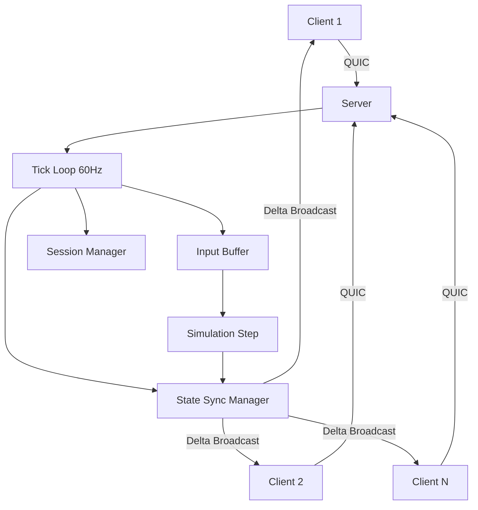

# Multiplayer Prototype Integration

## Background

The Aether VR engine has two key crates built in isolation:
- **aether-network**: QUIC transport via `quinn` (server, client, connection, TLS, config, handshake)
- **aether-world-runtime**: Multiplayer runtime primitives (tick scheduler, input buffer, prediction/interpolation, state sync, RPC, session manager, event dispatcher)

These modules are tested independently but have never been wired together into a functioning multiplayer system.

## Why

To validate the engine's networked multiplayer architecture before building higher-level features (world streaming, zone handoff, etc.), we need a working single-server prototype that proves:
1. QUIC transport can carry game state reliably
2. Fixed-rate tick loop drives consistent simulation
3. Input collection, state sync, and session management compose correctly
4. Avatar state (VR head + hands) synchronizes at acceptable latency

## What

A new `aether-multiplayer` crate that integrates the two existing crates into a working multiplayer prototype:
- Server accepts QUIC connections, manages player sessions, runs tick loop, broadcasts state
- Clients connect, send avatar inputs, receive world state updates
- Up to 20 concurrent players (configurable)
- Avatar state: head position/rotation + left/right hand position/rotation

## How

### Architecture



### Module Layout

```
crates/aether-multiplayer/
  src/
    lib.rs           - Public API, re-exports
    config.rs        - Environment-based configuration
    protocol.rs      - Network message types (serde serialized)
    avatar.rs        - Avatar state (head + hands)
    server.rs        - Server integration (accept loop, tick loop, broadcast)
    client.rs        - Client integration (connect, send input, receive state)
    simulation.rs    - Server-side simulation step (validate inputs, update state)
  Cargo.toml
```

### Detail Design

#### Configuration (config.rs)
- `AETHER_SERVER_PORT` (default: 7777)
- `AETHER_TICK_RATE` (default: 60)
- `AETHER_MAX_PLAYERS` (default: 20)
- All loaded from environment variables at startup.

#### Protocol Messages (protocol.rs)
```rust
enum ClientMessage {
    InputUpdate { tick: u64, avatar: AvatarState },
    Ping { client_time_ms: u64 },
}

enum ServerMessage {
    WorldState { tick: u64, avatars: Vec<(PlayerId, AvatarState)> },
    PlayerJoined { player_id: PlayerId },
    PlayerLeft { player_id: PlayerId },
    Pong { client_time_ms: u64, server_time_ms: u64 },
    FullSync { tick: u64, avatars: Vec<(PlayerId, AvatarState)> },
}
```

#### Avatar State (avatar.rs)
```rust
struct AvatarState {
    head_position: [f32; 3],
    head_rotation: [f32; 4],
    left_hand_position: [f32; 3],
    left_hand_rotation: [f32; 4],
    right_hand_position: [f32; 3],
    right_hand_rotation: [f32; 4],
}
```

#### Server (server.rs)
1. Bind QUIC server on configured port
2. Spawn accept loop: on new connection, register session via `SessionManager`, add to `StateSyncManager`
3. Spawn per-client recv task: deserialize `ClientMessage`, submit to `InputBuffer`
4. Main tick loop (driven by `TickScheduler`):
   a. Drain inputs from `InputBuffer` for current tick
   b. Validate and apply inputs (simulation.rs)
   c. Update entity states in `StateSyncManager`
   d. Generate sync messages, serialize, broadcast via QUIC

#### Client (client.rs)
1. Connect via `QuicClient` to server
2. Send `InputUpdate` messages each local frame
3. Receive `ServerMessage`, update local interpolation buffers

#### Simulation (simulation.rs)
- Server-authoritative: clamp movement speed, validate rotations
- Apply validated inputs to update `EntityState` in `StateSyncManager`

### Database Design
N/A - This prototype is stateless (in-memory only).

### API Design
The crate exposes:
- `MultiplayerServer::new(config) -> Self`
- `MultiplayerServer::run() -> Result<()>` (async, runs until shutdown)
- `MultiplayerClient::connect(addr) -> Result<Self>`
- `MultiplayerClient::send_input(avatar: AvatarState) -> Result<()>`
- `MultiplayerClient::poll_state() -> Option<ServerMessage>`

### Test Design
1. **Unit tests** per module:
   - `config.rs`: env var parsing, defaults
   - `protocol.rs`: serialization roundtrip for all message types
   - `avatar.rs`: default state, validation, interpolation
   - `simulation.rs`: input validation (speed clamping, rotation normalization)
2. **Integration tests**:
   - Server starts, client connects, sends input, receives state back
   - Multiple clients see each other's avatar state
   - Client disconnect triggers session event
   - Server rejects connections at max capacity
