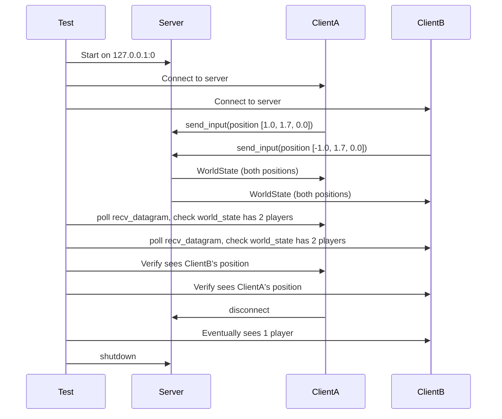

# Multiplayer Server Input Reading Fix

## Background

The Aether multiplayer system uses QUIC datagrams for real-time avatar state updates between clients and server. The server has an accept loop (handles new connections) and a tick loop (processes game state and broadcasts updates). Clients send `AvatarState` via `send_input()` which encodes a `ClientMessage::InputUpdate` and sends it as a QUIC datagram.

## Why

The server never reads incoming client datagrams. The `accept_loop` receives an `_input_tx: mpsc::Sender<IncomingInput>` parameter (note the `_` prefix indicating it is unused). As a result:

- Clients connect successfully and receive the initial `FullSync`
- The server broadcasts default avatar positions every tick
- Client position updates sent via datagrams are silently dropped
- All players appear stuck at default position `[0.0, 1.7, 0.0]`

## What

1. Add `recv_datagrams()` method to `QuicServer` to poll all connected clients for incoming datagrams
2. Fix the server `tick_loop` to read and decode client datagrams before processing each tick
3. Add a `recv_datagram` method on `MultiplayerClient` so clients can receive world state datagrams from the server
4. Write an integration test proving two clients can exchange position updates through the server

## How

### Step 1: QuicServer - Add recv_datagrams

Add a method to `QuicServer` that iterates all connections and calls `try_recv_datagram()` on each, returning `Vec<(client_id, data)>`.

### Step 2: QuicClient - Add connection_mut accessor

The `QuicConnection::try_recv_datagram()` requires `&mut self`, but `QuicClient::connection()` only returns `&QuicConnection`. Add a `connection_mut()` method to enable the client to poll for incoming datagrams.

### Step 3: MultiplayerClient - Add recv_datagram

Add a method to `MultiplayerClient` that polls the QUIC connection for incoming datagrams, decodes `ServerMessage`, and applies it to local state.

### Step 4: Server tick_loop - Read client inputs

In the tick loop, before draining the `input_rx` channel, call `shared.quic.recv_datagrams()` to poll for incoming client datagrams. Decode each as `ClientMessage::InputUpdate`, look up the `player_id` from the `connection_map`, and push `IncomingInput` entries into `pending_inputs`.

### Step 5: Integration test



### API Design

**QuicServer::recv_datagrams**
```rust
pub async fn recv_datagrams(&self) -> Vec<(u64, Vec<u8>)>
```

**QuicClient::connection_mut**
```rust
pub fn connection_mut(&mut self) -> Option<&mut QuicConnection>
```

**MultiplayerClient::recv_datagram**
```rust
pub fn recv_datagram(&mut self) -> Result<Option<ServerMessage>, ClientError>
```

### Test Design

- Use `tokio::test` with multi-thread runtime
- Bind server to `127.0.0.1:0` for random port
- Expose server local address via `MultiplayerServer::run_with_addr_tx` or a oneshot channel
- Use `tokio::time::sleep` for synchronization
- Assert avatar positions match within floating-point tolerance
- Verify player count changes after disconnect + timeout sweep
