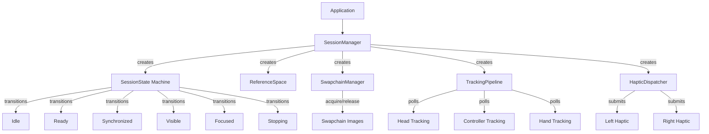
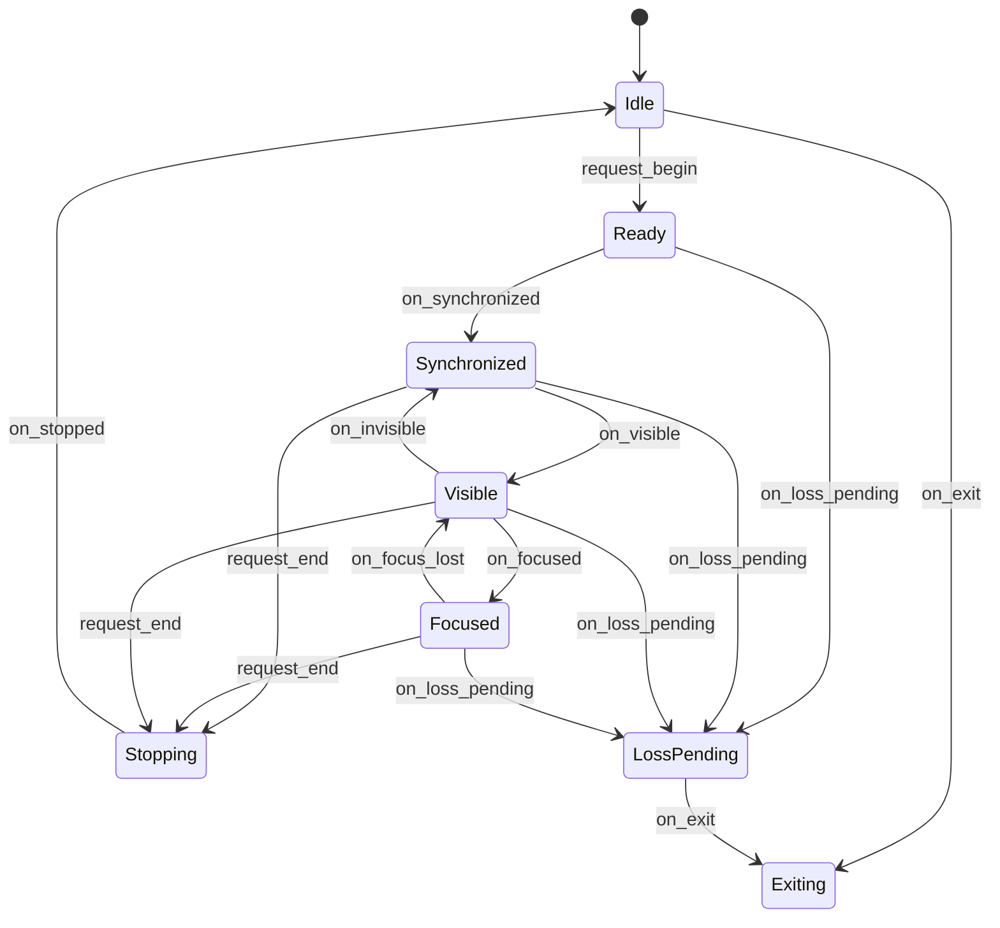

# OpenXR VR Integration (task-002)

## Background

The `aether-input` crate has a basic `OpenXrAdapter` stub and type-level abstractions (`RuntimeAdapter`, `Pose3`, `HapticRequest`, `LocomotionProfile`, `InteractionEvent`) but lacks concrete OpenXR session lifecycle management, head/controller tracking pipelines, haptic output dispatch, swapchain management types, and reference space handling. The existing `OpenXrAdapter` only returns empty frames and does not model the OpenXR state machine.

## Why

Without a proper OpenXR integration layer, the engine cannot:
- Manage OpenXR session lifecycle (create, begin, focus, end, destroy)
- Track head-mounted display position and rotation
- Read controller input (buttons, triggers, thumbsticks) from OpenXR action sets
- Optionally use hand tracking extensions
- Send haptic feedback to controllers via OpenXR
- Manage VR swapchain image acquisition for rendering
- Support multiple reference spaces (local, stage, view)

## What

Implement an OpenXR abstraction layer within `aether-input` that provides:

1. **Session lifecycle state machine** (`openxr_session.rs`) - Models the OpenXR session states (Idle, Ready, Synchronized, Visible, Focused, Stopping, LossPending, Exiting) and valid transitions.
2. **Head and controller tracking** (`openxr_tracking.rs`) - Tracking data pipeline for HMD and controllers with prediction timestamps and tracking confidence.
3. **Haptic output dispatch** (`openxr_haptics.rs`) - Haptic action submission to controllers via OpenXR, supporting pulse, sine, and ramp waveforms.
4. **Swapchain management types** (`openxr_swapchain.rs`) - Swapchain configuration and image acquisition/release lifecycle for wgpu integration.
5. **Reference spaces** (within `openxr_session.rs`) - Support for LOCAL, STAGE, and VIEW reference spaces.

Since the real `openxr` crate requires a native SDK, all types are designed as abstractions with mock/stub backends for testing.

## How

### Architecture



### Session Lifecycle State Machine

Models the OpenXR session state graph per the specification:



### Tracking Pipeline

- `TrackingSnapshot` holds per-frame tracking data for HMD, left/right controllers, and optional hand joints.
- `TrackingConfidence` indicates tracking quality (None, Low, High).
- `ControllerState` captures button values, trigger/grip analog values, and thumbstick axes.
- `HandJointSet` models the 26-joint hand skeleton per the OpenXR hand tracking extension.

### Haptic Dispatch

- `HapticDispatcher` converts `HapticRequest` into OpenXR-compatible haptic actions.
- Supports cooldown enforcement, amplitude clamping, and per-hand dispatch.
- Uses the existing `HapticEffect`, `HapticWave`, and `HapticChannel` types.

### Swapchain Management

- `SwapchainConfig` specifies format, resolution, sample count, and usage flags.
- `SwapchainState` tracks the acquire/wait/release lifecycle.
- `SwapchainImageIndex` wraps the acquired image index for rendering.

### Reference Spaces

- `ReferenceSpaceType` enum: Local, Stage, View.
- `ReferenceSpace` holds the space type and a configurable offset pose.

## Detail Design

### Constants

| Name | Value | Description |
|------|-------|-------------|
| `MAX_HAND_JOINTS` | 26 | XR_HAND_JOINT_COUNT per OpenXR spec |
| `DEFAULT_HAPTIC_DURATION_MS` | 100 | Default haptic pulse duration |
| `DEFAULT_HAPTIC_AMPLITUDE` | 0.5 | Default haptic amplitude [0..1] |
| `MAX_SWAPCHAIN_IMAGES` | 4 | Maximum swapchain image count |
| `DEFAULT_PREDICTION_OFFSET_NS` | 11_111_111 | ~11ms prediction for 90Hz |
| `MIN_HAPTIC_AMPLITUDE` | 0.0 | Minimum allowed haptic amplitude |
| `MAX_HAPTIC_AMPLITUDE` | 1.0 | Maximum allowed haptic amplitude |

### Test Design

Each module has comprehensive unit tests:

- **Session**: State transition validity, invalid transition rejection, full lifecycle walkthrough, loss pending recovery.
- **Tracking**: Snapshot construction, confidence levels, controller state mapping, hand joint count validation, prediction timestamp handling.
- **Haptics**: Effect-to-action conversion, cooldown enforcement, amplitude clamping, per-channel dispatch.
- **Swapchain**: Config validation, acquire/wait/release lifecycle, state machine invariants, double-acquire prevention.

### File Structure

```
crates/aether-input/src/
  openxr.rs              -- existing OpenXrAdapter (updated to use session)
  openxr_session.rs      -- session lifecycle state machine + reference spaces
  openxr_tracking.rs     -- tracking pipeline, snapshots, controller/hand state
  openxr_haptics.rs      -- haptic dispatch and cooldown management
  openxr_swapchain.rs    -- swapchain config, state machine, image lifecycle
  lib.rs                 -- updated module declarations and re-exports
```
