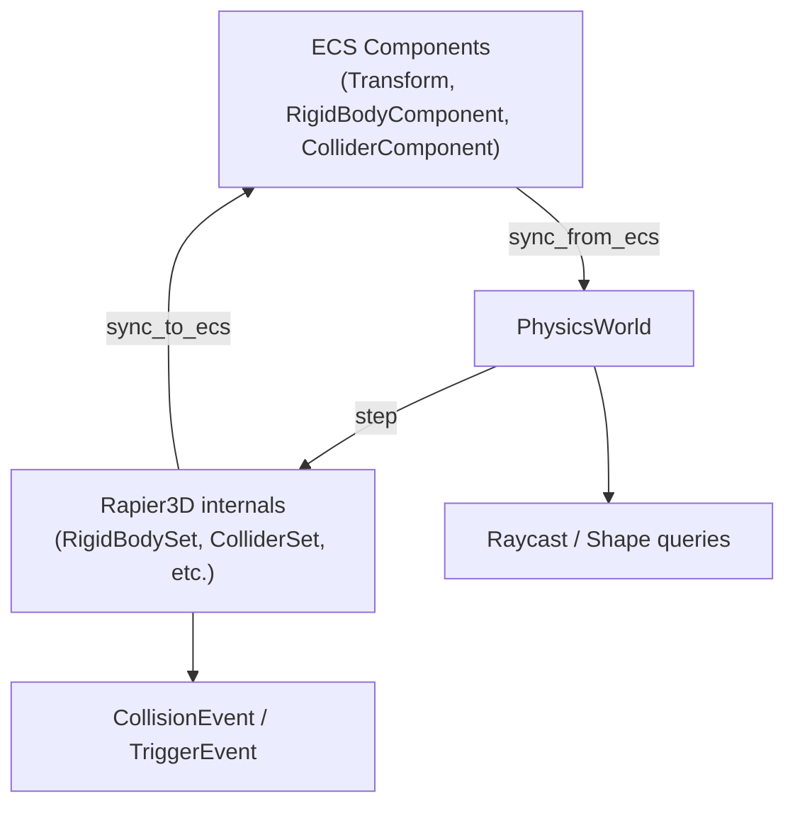

# Physics Core Simulation Pipeline Design Document

## Background

The `aether-physics` crate currently has ECS component definitions (`RigidBodyComponent`, `ColliderComponent`, `Transform`, `Velocity`), collision layer filtering (`CollisionLayers`), physics configuration (`WorldPhysicsConfig`), and trigger event queuing (`TriggerEventQueue`). However, there is no actual physics simulation. These are data-only types with no Rapier3D world management, stepping, or synchronization.

## Why

- VR interactions require a working physics backend to simulate rigid body dynamics, collisions, and raycasts.
- The existing component and config types were designed to integrate with Rapier3D but the integration layer is missing.
- Without a simulation pipeline, rigid bodies do not move, colliders do not detect contacts, and raycasts return nothing.

## What

Implement the core Rapier3D simulation pipeline:

1. `PhysicsWorld` -- wrapper that owns all Rapier3D state and maps ECS entities to Rapier handles.
2. Rigid body creation/destruction synced with ECS entities.
3. Collider creation for all supported shapes with material properties and sensor support.
4. Fixed-timestep simulation stepping with collision event collection.
5. Write-back of Rapier results (position, rotation, velocity) to ECS-compatible data.
6. Ray and point queries against the physics world.
7. Joint/constraint support (fixed, revolute, prismatic).
8. Per-world configuration (gravity, timestep, solver iterations, CCD).

## How

### Architecture



### File Structure

| File | Responsibility | Approx lines |
|------|---------------|------|
| `world.rs` | `PhysicsWorld` struct, construction, stepping, event drain | ~300 |
| `bodies.rs` | Rigid body add/remove, body-type conversion, force/impulse API | ~200 |
| `colliders.rs` | Collider add/remove, shape conversion, material properties | ~200 |
| `joints.rs` | Joint types enum, add/remove joints | ~200 |
| `query.rs` | Raycast, shape-cast, point queries, result types | ~150 |
| `sync.rs` | `sync_from_ecs` and `sync_to_ecs` logic | ~150 |
| `events.rs` | `PhysicsCollisionEvent` type, event collection from Rapier channels | ~100 |

### Detail Design

#### PhysicsWorld (world.rs)

Central struct that owns all Rapier3D state:

```rust
pub struct PhysicsWorld {
    // Rapier pipeline components
    pipeline: PhysicsPipeline,
    rigid_body_set: RigidBodySet,
    collider_set: ColliderSet,
    impulse_joint_set: ImpulseJointSet,
    multibody_joint_set: MultibodyJointSet,
    island_manager: IslandManager,
    broad_phase: DefaultBroadPhase,
    narrow_phase: NarrowPhase,
    ccd_solver: CCDSolver,
    query_pipeline: QueryPipeline,
    gravity: Vector<f32>,
    integration_parameters: IntegrationParameters,

    // Entity mapping
    entity_to_body: HashMap<Entity, RigidBodyHandle>,
    body_to_entity: HashMap<RigidBodyHandle, Entity>,
    entity_to_collider: HashMap<Entity, Vec<ColliderHandle>>,
    collider_to_entity: HashMap<ColliderHandle, Entity>,

    // Event channels
    collision_recv: Receiver<RapierCollisionEvent>,
    contact_force_recv: Receiver<ContactForceEvent>,
    event_collector: ChannelEventCollector,
    pending_collision_events: Vec<PhysicsCollisionEvent>,
}
```

Construction reads `WorldPhysicsConfig` to set gravity, timestep, and solver iterations.

#### Body Management (bodies.rs)

- `add_rigid_body(entity, body_type, position, rotation)` -- creates a Rapier `RigidBody` from the `BodyType` enum and registers the entity-handle mapping.
- `remove_body(entity)` -- removes the body and all attached colliders, cleaning up all maps.
- `apply_force(entity, force)`, `apply_impulse(entity, impulse)` -- physics force API.
- `set_linear_velocity(entity, vel)`, `set_angular_velocity(entity, vel)`.

#### Collider Management (colliders.rs)

- `add_collider(entity, shape, is_sensor, friction, restitution, density, layers)` -- converts `ColliderShape` to Rapier `SharedShape`, sets collision groups from `CollisionLayers`, attaches to parent body.
- `remove_colliders(entity)` -- removes all colliders for an entity.

Collision groups encoding: membership in bits 16..31, filter in bits 0..15 of a u32 `InteractionGroups`.

#### Joint System (joints.rs)

```rust
pub enum JointType {
    Fixed { anchor1: [f32; 3], anchor2: [f32; 3] },
    Revolute { axis: [f32; 3], anchor1: [f32; 3], anchor2: [f32; 3] },
    Prismatic { axis: [f32; 3], anchor1: [f32; 3], anchor2: [f32; 3], limits: Option<[f32; 2]> },
}
```

- `add_joint(entity1, entity2, joint_type) -> Option<ImpulseJointHandle>`
- `remove_joint(handle)`

#### Query System (query.rs)

```rust
pub struct RaycastHit {
    pub entity: Entity,
    pub point: [f32; 3],
    pub normal: [f32; 3],
    pub distance: f32,
}
```

- `raycast(origin, direction, max_dist, filter) -> Option<RaycastHit>`
- `raycast_all(origin, direction, max_dist, filter) -> Vec<RaycastHit>`

#### Sync Logic (sync.rs)

- `sync_from_ecs(updates: &[(Entity, Transform)])` -- for kinematic bodies, updates Rapier positions to match ECS.
- `sync_to_ecs() -> Vec<(Entity, Transform, Velocity)>` -- reads all dynamic body positions/velocities from Rapier.

#### Events (events.rs)

```rust
pub enum PhysicsCollisionEvent {
    Started { entity1: Entity, entity2: Entity, is_sensor: bool },
    Stopped { entity1: Entity, entity2: Entity, is_sensor: bool },
}
```

Events are collected via Rapier's `ChannelEventCollector` during `step()`, then translated from collider handles to entities.

### Test Design

1. **World creation** -- verify default and custom configs produce correct gravity/timestep.
2. **Body lifecycle** -- add dynamic/kinematic/static bodies, verify handles, remove and verify cleanup.
3. **Collider shapes** -- add sphere/box/capsule/cylinder colliders, verify they attach to bodies.
4. **Gravity simulation** -- drop a ball, step N times, verify Y position decreases.
5. **Collision events** -- two spheres collide, verify Started event. Separate them, verify Stopped.
6. **Raycast** -- place a body, cast a ray at it, verify hit point and distance.
7. **Joints** -- connect two bodies with fixed/revolute/prismatic joints, verify handles.
8. **Config variations** -- zero gravity, custom timestep, different solver iterations.
9. **Sync round-trip** -- sync_from_ecs for kinematic bodies, sync_to_ecs for dynamic bodies.
10. **Sensor colliders** -- sensor colliders generate events but no physical response.
