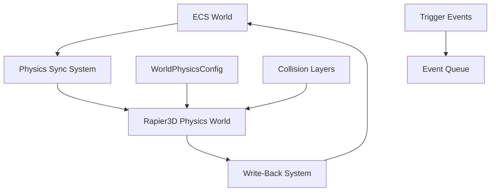

# Physics Engine Integration Design Document

## Background

The Aether engine needs a physics subsystem for server-authoritative simulation. All physics objects — rigid bodies, colliders, triggers, character controllers — must integrate with the ECS and support per-world configuration.

## Why

- VR interactions (grabbing, throwing, locomotion) require responsive physics
- Server-authoritative simulation prevents cheating at scale
- Per-world physics profiles enable diverse experiences (earth-like, space, underwater)
- Physics layers and triggers enable gameplay scripting

## What

Integrate Rapier3D as the physics backend with:
1. ECS components for rigid bodies, colliders, and triggers
2. A physics world wrapper that syncs with the ECS
3. Collision layers for interaction filtering
4. Trigger zones for scripted events
5. Server-authoritative physics with client prediction support
6. Character controller with VR locomotion modes

## How

### Architecture Overview



### Detail Design

#### ECS Components

| Component | Fields | Replication |
|-----------|--------|-------------|
| `RigidBodyHandle` | rapier handle, body type (dynamic/kinematic/static) | ServerOnly |
| `ColliderHandle` | rapier handle, shape type, sensor flag | ServerOnly |
| `PhysicsLayer` | membership bits, filter bits | ServerOnly |
| `TriggerZone` | sensor flag, enter/exit event queue | ServerOnly |
| `Velocity` | linear, angular | Replicated |
| `CharacterController` | grounded flag, locomotion mode, step height | ServerOnly |

#### WorldPhysicsConfig

```rust
struct WorldPhysicsConfig {
    gravity: [f32; 3],        // Default: [0.0, -9.81, 0.0]
    time_step: f32,           // Default: 1.0/60.0
    max_velocity: f32,        // Default: 100.0
    enable_ccd: bool,         // Default: false
    solver_iterations: u8,    // Default: 4
}
```

#### Physics Sync Pipeline

Each tick:
1. **Pre-Physics**: Read ECS Transform/Velocity → update Rapier bodies
2. **Physics Step**: Rapier steps the simulation
3. **Post-Physics**: Read Rapier results → write back to ECS Transform/Velocity
4. **Event Processing**: Collect collision/trigger events

#### Collision Layers

16-bit membership + 16-bit filter bitmask system:
- Layer 0: Default
- Layer 1: Players
- Layer 2: Props
- Layer 3: Terrain
- Layer 4: Triggers
- Layers 5-15: User-defined

A collider with membership M collides with another with membership M' only if `(M & filter') != 0 && (M' & filter) != 0`.

#### Trigger Zones

Sensor colliders that generate enter/exit events without physical response. Events are queued per-tick for the script system.

#### Character Controller

Kinematic body with:
- Ground detection via short raycast
- Step climbing (configurable max step height)
- Slope limiting (configurable max slope angle)
- Locomotion modes: teleport target validation, smooth movement, climbing surface detection

#### Server-Authoritative Model

- Server runs the authoritative physics simulation
- Client predicts locally with same Rapier config
- On server state receipt, client reconciles (snap or interpolate)
- `PhysicsAuthority` component marks who controls the body

### File Structure

```
crates/aether-physics/
├── Cargo.toml
├── src/
│   ├── lib.rs
│   ├── config.rs         # WorldPhysicsConfig
│   ├── components.rs     # ECS physics components
│   ├── layers.rs         # Collision layers
│   ├── physics_world.rs  # Rapier wrapper + step logic
│   ├── sync.rs           # ECS ↔ Rapier sync systems
│   ├── trigger.rs        # Trigger zone events
│   ├── character.rs      # Character controller
│   └── authority.rs      # Server/client authority model
```

### Test Design

1. **Config tests**: Default config, custom gravity, time step
2. **Rigid body tests**: Spawn dynamic/static/kinematic bodies, verify gravity applies
3. **Collider tests**: Sphere/box/capsule shapes, collision detection
4. **Layer tests**: Verify filtering works (same layer collides, different layers don't)
5. **Trigger tests**: Sensor enters/exits generate correct events
6. **Character controller tests**: Grounded detection, step climbing, slope limiting
7. **Authority tests**: Server vs client authority marking
8. **Integration tests**: Full ECS + physics pipeline tick
