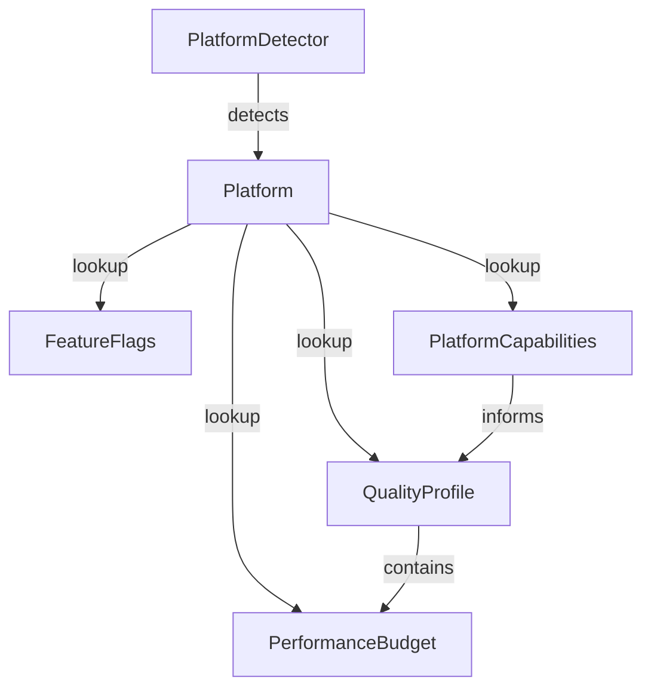

# Platform Support: Detection, Quality Profiles, Features, and Budgets

## Background

The `aether-platform` crate already provides basic platform kind enumeration (`PlatformKind`), quality class (`QualityClass`), and runtime session management. However, it lacks concrete platform detection logic, per-platform rendering budgets, feature toggle queries, and quality profile presets. Without these, each consuming crate must independently decide rendering budgets and feature availability, leading to inconsistency and fragile platform support.

## Why

- **Consistency**: All engine subsystems need a single source of truth for what the current platform can do and how much rendering budget it has.
- **Quest standalone**: Meta Quest has strict polygon, texture memory, and draw call limits. Without centralized budgets, developers will exceed these limits and cause frame drops.
- **Feature gates**: Some features (hand tracking, eye tracking, WASM client scripting) are only available on certain platforms. A centralized feature query avoids scattered `#[cfg]` checks and runtime panics.
- **Quality presets**: Pre-tuned quality profiles per platform let the engine auto-configure rendering without manual tuning per device.

## What

Add five new modules to `aether-platform`:

1. **`detection`** -- Runtime platform identification based on environment variables and OS signals.
2. **`profiles`** -- Per-platform quality profile presets (polygon budgets, shadow resolution, MSAA, etc.).
3. **`features`** -- Feature toggle system: query whether a platform supports a given feature.
4. **`budgets`** -- Performance budget structs and validation (are we within budget?).
5. **`capabilities`** (extend existing) -- GPU tier and hardware capability reporting.

## How

### Architecture

### Module Details

#### detection.rs

- `Platform` enum: `PcVr`, `QuestStandalone`, `Desktop`, `WebBrowser`
- `detect_platform()` function: reads `AETHER_PLATFORM` env var, falls back to OS detection.
- `Platform::from_str()` for explicit construction.

#### profiles.rs

- `QualityProfile` struct with fields: `max_polygons_per_eye`, `max_draw_calls`, `max_texture_memory_mb`, `msaa_samples`, `shadow_resolution`, `max_avatars_rendered`.
- `QualityProfile::for_platform(platform)` returns the default profile.
- Predefined constants:
  - PC VR: 2M poly/eye, 2000 draw calls, 4096 MB tex, MSAA 4x, 4096 shadow, 32 avatars
  - Quest: 500K poly/eye, 500 draw calls, 1024 MB tex, MSAA 2x, 1024 shadow, 8 avatars
  - Desktop: 1M poly/eye, 1500 draw calls, 2048 MB tex, MSAA 4x, 2048 shadow, 24 avatars
  - Web: 300K poly/eye, 300 draw calls, 512 MB tex, MSAA 0x, 512 shadow, 4 avatars

#### features.rs

- `Feature` enum: `HandTracking`, `EyeTracking`, `Haptics`, `WasmClientScripting`, `SpatialAudio`, `PassthroughMr`, `HighResTextures`, `RayTracing`
- `FeatureFlags` struct wrapping a `HashSet<Feature>`.
- `FeatureFlags::for_platform(platform)` returns default features per platform.
- `FeatureFlags::supports(feature) -> bool` query method.

#### budgets.rs

- `PerformanceBudget` struct: `max_polygons_per_eye`, `max_draw_calls`, `max_texture_memory_mb`, `frame_time_budget_ms`.
- `BudgetUsage` struct: current usage values.
- `PerformanceBudget::check(usage) -> BudgetReport` with per-field pass/fail.
- `BudgetReport` struct with `is_within_budget()` helper.

#### capabilities.rs (extend existing)

- Add `GpuTier` enum: `Low`, `Medium`, `High`, `Ultra`.
- Add `PlatformCapabilities` struct: `supports_vr`, `supports_hand_tracking`, `supports_eye_tracking`, `supports_wasm_client`, `max_memory_mb`, `gpu_tier`.
- `PlatformCapabilities::for_platform(platform)` returns defaults.

### Database Design

N/A -- all in-memory, no persistence.

### API Design

All public types are `pub` with `Debug`, `Clone`, `PartialEq` derives. Serde `Serialize`/`Deserialize` for configuration serialization.

### Test Design

- **detection tests**: verify env-var-based detection, OS fallback, explicit `from_str`.
- **profile tests**: verify each platform gets correct preset values, custom override.
- **feature tests**: verify per-platform feature sets, query support/unsupported.
- **budget tests**: verify budget check pass/fail, edge cases (exactly at limit, over, under).
- **capability tests**: verify per-platform capability defaults, GPU tier mapping.
- **integration**: detect platform -> get profile -> check budget -> query features, all in one flow.

All tests are unit tests, in-memory, no external dependencies.
