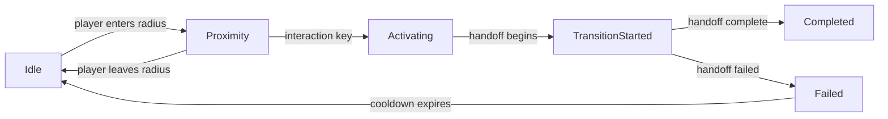

# Portal System Design

## Background

Aether is a VR metaverse engine with spatial zoning that partitions game worlds across multiple server processes. The `aether-zoning` crate already handles zone partitioning, ghost entities at boundaries, entity handoff between zones, and authority transfer. However, all current transitions are *intra-world* -- moving an entity from one zone to another within the same world topology.

Players need to travel between entirely different worlds (separate world instances hosted on different servers). This requires a portal system that handles cross-world teleportation with URL-based addressing, visual preview of destination worlds, coordinated session handoff, asset prefetching, and loading screen state management.

## Why

- Players must be able to discover and travel to other worlds seamlessly.
- World creators need a standard mechanism to link worlds together (portals).
- The transition must feel smooth: preview the destination, prefetch assets, show a loading screen, and hand off the session to the target world server without dropping the player.

## What

Add a cross-world portal/teleportation system to `aether-zoning` with five new modules:

| Module | Responsibility |
|---|---|
| `aether_url` | Parse and resolve `aether://` URLs that address worlds, zones, and spawn points |
| `portal` | Portal entity type with activation trigger (proximity + interaction), source/destination references |
| `portal_renderer` | Rendering state machine for portal visual (idle, preview, activating, transition) |
| `session_handoff` | Cross-world session transfer protocol types (token, player state, session envelope) |
| `prefetch` | Asset prefetch hint types and priority queue for target world assets |

## How

### aether:// URL Scheme

```
aether://<host>/<world_id>[/<zone_id>][?spawn=<x,y,z>][&instance=<id>]
```

- `host` -- server authority (e.g., `worlds.aether.io`)
- `world_id` -- unique world identifier
- `zone_id` -- optional target zone within the world
- `spawn` -- optional spawn coordinates
- `instance` -- optional specific instance id

Parsing produces an `AetherUrl` struct. Invalid URLs produce typed errors.

### Portal Entity

A portal has:
- Unique `portal_id` (u64)
- Source and destination `AetherUrl`
- Physical shape (position, radius for proximity detection)
- Visual style enum (circular, rectangular, custom mesh ref)
- Activation mode: proximity-only, interaction-required, or both (proximity + confirm)
- Active/inactive state

Portal activation flow:


### Portal Renderer State

State machine for the portal visual on the client side:
- `Idle` -- default visual, no player nearby
- `Previewing` -- player is in proximity; show preview texture of destination world
- `Activating` -- transition initiated; animate the portal opening
- `TransitionFade` -- full-screen fade/loading screen
- `Arrived` -- player has arrived at destination; fade in

Each state carries metadata (elapsed time, progress percentage, preview texture handle).

### Session Handoff Protocol

Builds on top of the existing `HandoffCoordinator` but for cross-world transfers:
- `SessionToken` -- opaque credential authorizing the player on the target server
- `PlayerStateSnapshot` -- serialized player state (inventory, avatar, position)
- `SessionHandoffEnvelope` -- contains token, snapshot, source/destination URLs, sequence, timeout

The envelope is validated and then forwarded to the target world server.

### Asset Prefetch

When a player approaches a portal:
1. The portal emits `PrefetchHint` items (asset URL + priority + estimated size).
2. A `PrefetchQueue` collects hints, deduplicates, and orders by priority.
3. The client runtime can drain the queue to begin downloading assets before the transition.

### Test Design

Each module has comprehensive unit tests covering:
- URL parsing: valid URLs, missing components, malformed input, query parameter extraction
- Portal: activation state machine transitions (valid and invalid), proximity detection, cooldown
- Portal renderer: state machine transitions, elapsed time tracking
- Session handoff: envelope creation, validation, timeout, token format
- Prefetch: hint insertion, deduplication, priority ordering, queue drain

### Constants

All configurable values are defined as constants at the top of each file:
- `DEFAULT_PORTAL_RADIUS` (proximity detection)
- `DEFAULT_PORTAL_COOLDOWN_MS` (after failure)
- `DEFAULT_TRANSITION_TIMEOUT_MS`
- `DEFAULT_PREFETCH_QUEUE_CAPACITY`
- `DEFAULT_SESSION_TOKEN_LENGTH`
- `DEFAULT_AETHER_PORT`
