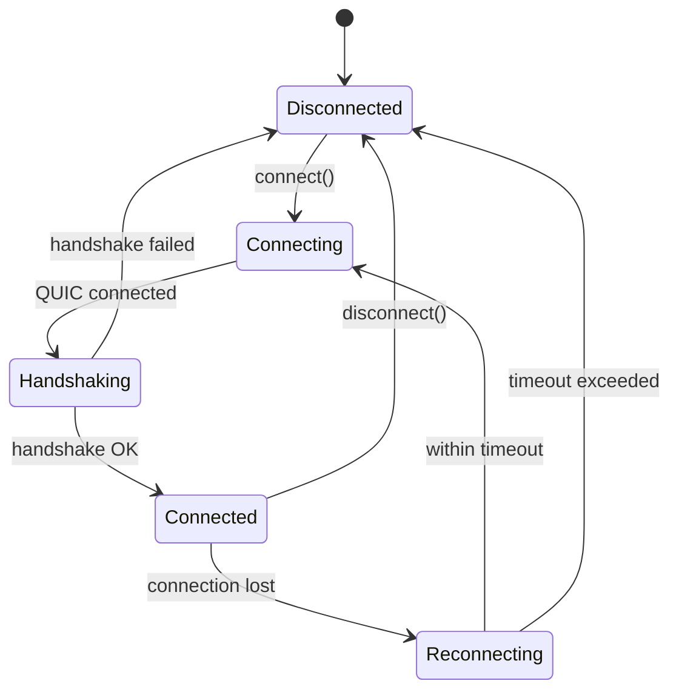

# QUIC Transport Backend Design (task-003)

## Background

The `aether-network` crate contains policy abstractions for networking: interest management, delta coding, client prediction, voice jitter buffers, and a `RuntimeTransport` trait. However, no actual socket I/O exists. The `InMemoryTransport` is the only `RuntimeTransport` implementation and is used exclusively for tests.

## Why

A VR engine requires low-latency, encrypted network transport. QUIC (via the `quinn` crate) provides:
- Multiplexed streams (reliable ordered) and datagrams (unreliable) in a single connection
- Built-in TLS 1.3 encryption
- Connection migration and 0-RTT reconnection
- Congestion control suitable for real-time applications

## What

Implement a QUIC transport backend that:
1. Provides a Quinn-based QUIC server that accepts client connections
2. Provides a Quinn-based QUIC client that connects to a server
3. Implements the existing `RuntimeTransport` trait so the rest of the engine works unchanged
4. Supports reliable ordered streams (RPCs, events) and unreliable datagrams (state sync, voice)
5. Handles TLS 1.3 with self-signed certificates for development
6. Manages connection lifecycle (connect, disconnect, reconnect)
7. Implements a basic handshake protocol for client authentication

## How

### Architecture

```
QuicTransport (implements RuntimeTransport)
    |
    +-- QuicConfig (bind addr, cert paths, timeouts)
    |
    +-- QuicServer (quinn::Endpoint in server mode)
    |       +-- accepts connections
    |       +-- manages HashMap<client_id, QuicConnection>
    |
    +-- QuicClient (quinn::Endpoint in client mode)
    |       +-- connects to server
    |       +-- holds single QuicConnection
    |
    +-- QuicConnection (wraps quinn::Connection)
    |       +-- send_reliable(bytes) via bi-directional stream
    |       +-- send_datagram(bytes) via QUIC datagram
    |       +-- recv() collects from streams + datagrams
    |
    +-- TLS (certificate generation and loading)
            +-- generate_self_signed() for dev
            +-- load_from_files() for production
```

### Module layout

- `quic/mod.rs` - Module root, re-exports
- `quic/config.rs` - `QuicConfig` with env-var defaults
- `quic/tls.rs` - TLS certificate generation and loading
- `quic/connection.rs` - `QuicConnection` wrapper around quinn::Connection
- `quic/server.rs` - `QuicServer` accepting connections
- `quic/client.rs` - `QuicClient` connecting to server
- `quic/transport.rs` - `QuicTransport` implementing `RuntimeTransport`

### Configuration (Environment Variables)

| Variable | Default | Description |
|---|---|---|
| `AETHER_NET_BIND_ADDR` | `0.0.0.0:4433` | Server bind address |
| `AETHER_NET_SERVER_ADDR` | `127.0.0.1:4433` | Client connect address |
| `AETHER_NET_CERT_PATH` | (none, use self-signed) | TLS certificate PEM path |
| `AETHER_NET_KEY_PATH` | (none, use self-signed) | TLS private key PEM path |
| `AETHER_NET_CONNECT_TIMEOUT_SECS` | `10` | Connection timeout |
| `AETHER_NET_IDLE_TIMEOUT_SECS` | `30` | Idle connection timeout |
| `AETHER_NET_RECONNECT_TIMEOUT_SECS` | `30` | Reconnect window |

### Constants

```rust
const MAX_DATAGRAM_SIZE: usize = 1200;
const MAX_STREAM_CHUNK_SIZE: usize = 65536;
const DEFAULT_BIND_ADDR: &str = "0.0.0.0:4433";
const DEFAULT_SERVER_ADDR: &str = "127.0.0.1:4433";
const DEFAULT_CONNECT_TIMEOUT_SECS: u64 = 10;
const DEFAULT_IDLE_TIMEOUT_SECS: u64 = 30;
const DEFAULT_RECONNECT_TIMEOUT_SECS: u64 = 30;
const HANDSHAKE_MAGIC: &[u8; 4] = b"AETH";
const HANDSHAKE_VERSION: u8 = 1;
const MAX_CONCURRENT_BI_STREAMS: u32 = 64;
```

### Handshake Protocol

```
Client -> Server: [MAGIC(4)] [VERSION(1)] [CLIENT_ID(8)] [TOKEN_LEN(2)] [TOKEN(N)]
Server -> Client: [MAGIC(4)] [VERSION(1)] [STATUS(1)] [SERVER_TICK(8)]

STATUS: 0 = OK, 1 = Rejected, 2 = Version Mismatch
```

### Connection Lifecycle



### Data Flow

Reliable messages (RPCs, events):
1. `QuicTransport::send()` with `Reliability::ReliableOrdered`
2. Opens or reuses a bi-directional QUIC stream
3. Writes length-prefixed message to the stream
4. Receiver reads length prefix, then message bytes

Unreliable messages (state sync, voice):
1. `QuicTransport::send()` with `Reliability::UnreliableDatagram`
2. Sends via QUIC datagram extension
3. If datagram too large or datagrams not supported, falls back to unreliable stream

### Dependencies

```toml
quinn = "0.11"
rustls = { version = "0.23", features = ["ring"] }
rcgen = "0.13"
tokio = { version = "1", features = ["rt-multi-thread", "net", "sync", "macros", "time"] }
```

## Test Design

### Unit Tests
- `config.rs`: config loads defaults, config reads env vars
- `tls.rs`: self-signed cert generation produces valid cert chain

### Integration Tests
- Server binds and accepts a client connection
- Client connects to server and completes handshake
- Reliable message roundtrip (client -> server -> client)
- Unreliable datagram roundtrip
- Connection disconnect and cleanup
- QuicTransport implements RuntimeTransport correctly

All integration tests use `#[tokio::test]` with localhost and self-signed certs.
