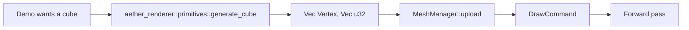

# Engine-Level Primitive Mesh Module

## Background

The Aether renderer crate owns the GPU pipeline, but every demo that wants a
plane, cube, or sphere has been writing its own mesh generator. Today two
near-identical copies live in `examples/gpu-demo/src/geometry.rs` and
`examples/single-world-demo/src/engine.rs`. The `aether-renderer` crate itself
has no shared primitive API.

## Why

Duplicated primitive code has led to the same class of bug being shipped twice
and fixed twice:

- `f50b88c` — cube +Y/-Y face winding fix in `single-world-demo`
- `b6ba882` — the identical fix re-applied in `gpu-demo`

Investigation for this change surfaced a third occurrence: `generate_sphere`
in both demos winds its triangles inward (cross product points opposite the
outward normal). With wgpu's default `FrontFace::Ccw` + `Face::Back` culling,
the renderer silently drops these triangles, so every sphere in the scene
reads as invisible — the viewer sees through it to whatever's behind. A
regression test added to `gpu-demo` reproduces the failure on the current
sphere generator.

The same bug pattern will keep recurring as long as primitive generation is
boilerplate that every project rewrites. The fix is to own these primitives
once, in the engine, with a winding invariant enforced by a shared test.

## What

A new module, `aether_renderer::primitives`, that exposes three functions and
no other API surface:

```rust
pub fn generate_plane(size: f32, subdivisions: u32) -> (Vec<Vertex>, Vec<u32>);
pub fn generate_cube(size: f32)                    -> (Vec<Vertex>, Vec<u32>);
pub fn generate_sphere(radius: f32, stacks: u32, sectors: u32)
                                                   -> (Vec<Vertex>, Vec<u32>);
```

All three return CCW-wound triangles such that `(v1 - v0) × (v2 - v0)` points
in the same hemisphere as the surface normal. Vertex layout matches the
existing `aether_renderer::gpu::mesh::Vertex` (`position`, `normal`, `uv`).

The two demos stop defining their own generators and call the engine module
instead.

## How

### File layout

```
crates/aether-renderer/src/
  primitives.rs         -- new module, <400 lines
  lib.rs                -- re-exports `pub mod primitives;`
```

No changes to `gpu::mesh::Vertex` — the primitives emit it directly.

### Tests first

`primitives.rs` ships with these tests before the generators are written:

| Test                                  | What it guards                                         |
|---------------------------------------|--------------------------------------------------------|
| `plane_triangles_wind_outward`        | plane faces survive back-face culling from +Y          |
| `cube_triangles_wind_outward`         | promoted from existing `gpu-demo` regression test      |
| `sphere_triangles_wind_outward`       | currently fails in both demos; this is the new invariant |
| `*_normals_are_unit_vectors`          | one per primitive                                      |
| `*_indices_in_bounds`                 | one per primitive                                      |
| `*_uvs_in_range`                      | one per primitive                                      |

The winding test is the same cross-product-vs-normal check for all three
primitives, so it's implemented once as a helper and applied to each.

### Demo migration

- `examples/gpu-demo/src/geometry.rs` — delete, replace call sites in
  `scene.rs` with `use aether_renderer::primitives::*`.
- `examples/single-world-demo/src/engine.rs` — delete the three
  `generate_*_vertices` functions and their unit tests; update the scene
  setup to call the engine module.

Both demos lose ~200 lines of duplicated code plus their duplicated unit tests.

### Non-goals

- No tangent generation, no indexed normal smoothing — the current demos
  don't need either, and adding them now would bloat the first cut.
- No voxel/soft-renderer primitives — `aether-renderer-soft::voxel_draw`
  solves a different problem (screen-AABB block fill) and is out of scope.
- No `PrimitiveBuilder` / builder pattern — three free functions match the
  existing demo API and keep the diff small.

## Workflow


