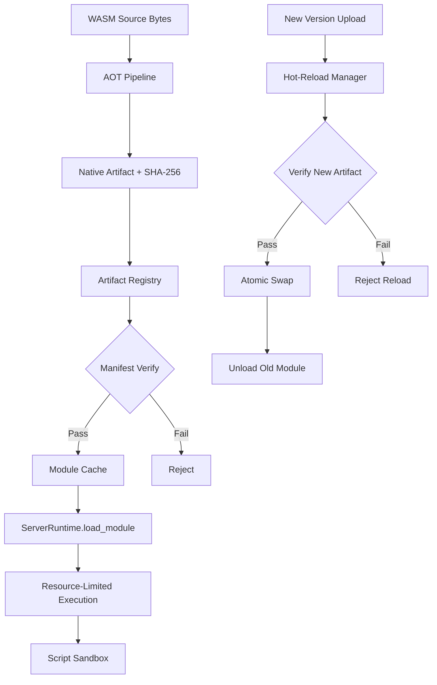

# Server-Side WASM Runtime & AOT Artifacts

**Project**: Aether Engine
**Crate**: `aether-scripting`
**Date**: 2026-03-08
**Status**: Implementation

---

## Background

The Aether platform already provides a client-side WASM runtime (in `wasm/`) with JIT compilation, SHA-256 integrity verification, fuel metering, and host API bindings. However, server-side world instances need a distinct execution pipeline optimized for:

- **AOT compilation** to native code for deterministic, low-latency execution on Linux servers
- **Artifact registry** with SHA-256 manifest-based verification for pre-built native artifacts
- **World-level resource enforcement** (CPU time budgets, memory caps, syscall restrictions)
- **Hot-reload** of script modules without restarting the world

The existing `wasm/` module handles client-side concerns. The new `server_runtime/` module addresses server-side concerns as a separate, composable layer.

## Why

Server-authoritative worlds execute hundreds of scripts per tick. Each tick has a strict CPU budget (typically 8ms). Client-side JIT compilation introduces cold-start latency and non-deterministic performance. The server pipeline must:

1. Pre-compile WASM to native artifacts ahead of time (AOT)
2. Verify artifact integrity before loading
3. Enforce per-script and world-level resource caps
4. Support zero-downtime script updates via hot-reload

## What

A new `server_runtime` module in `crates/aether-scripting/src/` providing:

| Component | File | Responsibility |
|---|---|---|
| AOT pipeline | `aot.rs` | Compile WASM bytes to native artifacts, manage compilation targets |
| Artifact registry | `artifact_registry.rs` | Store, retrieve, and verify AOT artifacts by SHA-256 manifest |
| Resource limits | `resource_limits.rs` | Server-specific resource enforcement (CPU metering, memory caps, syscall policy) |
| Hot-reload | `hot_reload.rs` | Versioned module management, atomic swap, lifecycle tracking |
| Module orchestrator | `mod.rs` | Top-level `ServerRuntime` that composes the above |

## How

### Architecture



### Module Design

#### AOT Pipeline (`aot.rs`)

Types:
- `AotTarget` - enum of supported compilation targets (LinuxX64, LinuxAArch64)
- `AotCompilationRequest` - input WASM bytes + target + optimization level
- `AotArtifact` - compiled native bytes + SHA-256 hash + target metadata
- `AotCompiler` - orchestrates compilation via Wasmtime's AOT path

Flow: `WASM bytes -> sha256 hash -> wasmtime Engine::precompile_module -> AotArtifact`

#### Artifact Registry (`artifact_registry.rs`)

Types:
- `ArtifactManifest` - SHA-256 of source WASM + SHA-256 of native artifact + version + target
- `ArtifactRegistry` - in-memory registry mapping `(script_id, version)` to manifests
- `ManifestVerificationError` - hash mismatch, missing artifact, version conflict

The registry stores manifests and verifies that loaded artifacts match their expected hashes.

#### Resource Limits (`resource_limits.rs`)

Types:
- `ServerResourcePolicy` - per-script CPU time limit, memory cap, fuel budget, syscall restrictions
- `SyscallPolicy` - enum of allowed/denied syscall categories (filesystem, network, clock)
- `ResourceMeter` - tracks cumulative CPU and memory usage per script instance
- `MeteringOutcome` - whether execution completed within budget or was terminated

#### Hot-Reload (`hot_reload.rs`)

Types:
- `ModuleVersion` - version number + artifact hash
- `ModuleSlot` - holds the current active version and optionally a pending version
- `HotReloadManager` - manages module slots, performs atomic version swaps
- `ReloadOutcome` - success/failure/rollback status

Flow:
1. Upload new artifact version
2. Verify artifact integrity
3. Prepare new `ModuleSlot` with pending version
4. Atomic swap: mark new as active, old as draining
5. After all in-flight executions complete on old version, unload it

### API Design

```rust
// Top-level server runtime
pub struct ServerRuntime { ... }

impl ServerRuntime {
    pub fn new(config: ServerRuntimeConfig) -> Result<Self, ServerRuntimeError>;
    pub fn compile_aot(&self, wasm_bytes: &[u8], target: AotTarget) -> Result<AotArtifact, ServerRuntimeError>;
    pub fn register_artifact(&mut self, script_id: u64, artifact: AotArtifact) -> Result<(), ServerRuntimeError>;
    pub fn load_module(&self, script_id: u64, version: u32) -> Result<LoadedModule, ServerRuntimeError>;
    pub fn execute(&self, module: &LoadedModule, policy: &ServerResourcePolicy) -> Result<ExecutionResult, ServerRuntimeError>;
    pub fn hot_reload(&mut self, script_id: u64, new_artifact: AotArtifact) -> Result<ReloadOutcome, ServerRuntimeError>;
    pub fn unload_module(&mut self, script_id: u64) -> Result<(), ServerRuntimeError>;
}
```

### Configuration (Environment Variables)

| Variable | Default | Description |
|---|---|---|
| `AETHER_SERVER_AOT_CACHE_DIR` | `/tmp/aether/aot_cache` | Directory for AOT artifact storage |
| `AETHER_SERVER_MAX_MODULES` | `256` | Maximum number of loaded modules per world |
| `AETHER_SERVER_DEFAULT_FUEL` | `1000000` | Default fuel budget per script execution |
| `AETHER_SERVER_DEFAULT_MEMORY_MB` | `64` | Default memory cap per script in MB |

### Test Design

Tests are co-located in each module file under `#[cfg(test)]`:

1. **AOT tests**: Compile valid WASM, verify artifact hash, reject invalid WASM, test target selection
2. **Registry tests**: Register/lookup artifacts, verify manifest integrity, reject tampered artifacts, version conflicts
3. **Resource tests**: Policy creation from env vars, meter budget tracking, budget exceeded detection, syscall policy enforcement
4. **Hot-reload tests**: Version swap lifecycle, concurrent version tracking, rollback on failure, unload after drain
5. **Integration tests**: Full pipeline from WASM source through AOT compilation, registry, load, execute, hot-reload

### Database Design

N/A - This module is purely in-memory with filesystem-backed artifact caching. Persistence is delegated to the world runtime's persistence layer.
