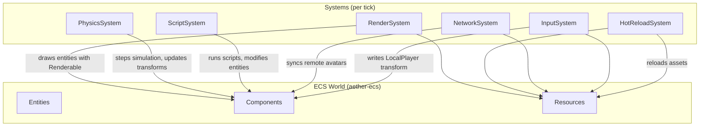

# Single-World Demo Integration Design

## Background

Phase 1 delivered 4 features — GPU rendering, networked multiplayer, visual script runtime, and asset hot-reloading — as isolated modules. Each works in isolation but none connect to each other or to the core engine (ECS, physics, input). The Phase 1 milestone ("single-world VR demo") requires a unified demo that wires them all together.

## Why

Without integration, the 4 features are unusable as a coherent engine. A user cannot render multiplayer avatars, run scripts that move entities, or hot-reload assets into a live scene. This demo proves the engine works end-to-end.

## What

Create `examples/single-world-demo/` — a runnable application that:

1. Uses `aether-ecs` as the central World managing all entities and systems
2. Renders entities via `aether-renderer` GPU backend (wgpu + winit window)
3. Simulates physics via `aether-physics` (rigid bodies, colliders, gravity)
4. Captures input via `aether-input` (desktop adapter with action map)
5. Connects to a multiplayer server via `aether-multiplayer` (QUIC)
6. Runs visual scripts via `aether-creator-studio` runtime (EngineApi impl)
7. Hot-reloads assets via `aether-asset-pipeline` watcher

## How

### Architecture



### Module Structure

```
examples/single-world-demo/
  Cargo.toml
  src/
    main.rs           -- entry point, winit event loop, orchestration
    components.rs     -- ECS component types shared across all systems
    engine.rs         -- GameEngine: holds all subsystems, runs tick
    systems/
      mod.rs          -- re-exports
      render.rs       -- RenderSystem: queries Renderable + Transform, draws via GpuRenderer
      physics.rs      -- PhysicsSystem: syncs PhysicsWorld <-> Transform components
      input.rs        -- InputSystem: polls desktop input, updates LocalPlayer transform
      network.rs      -- NetworkSystem: sends/receives multiplayer state, manages avatar entities
      scripting.rs    -- ScriptSystem: executes visual scripts with concrete EngineApi
      hot_reload.rs   -- HotReloadSystem: polls watcher, triggers asset re-upload
```

### Shared Components (`components.rs`)

| Component | Fields | Purpose |
|-----------|--------|---------|
| `Transform` | `position: [f32; 3]`, `rotation: [f32; 4]`, `scale: [f32; 3]` | Entity position/rotation/scale |
| `Renderable` | `mesh_id: MeshId`, `material_id: MaterialId`, `model_index: usize` | GPU mesh + material reference |
| `PhysicsBody` | `body_type: BodyType`, `shape: ColliderShape` | Physics rigid body marker |
| `LocalPlayer` | (unit struct) | Marks the locally-controlled entity |
| `NetworkAvatar` | `player_id: PlayerId` | Marks a remote player's avatar entity |
| `ScriptAttached` | `script_id: usize` | Entity has a visual script attached |
| `StaticObject` | (unit struct) | Marks non-moving environment objects |

### Shared Resources (stored in ECS World resources)

| Resource | Type | Purpose |
|----------|------|---------|
| `GpuRenderer` | `aether-renderer` | GPU rendering backend |
| `PhysicsWorld` | `aether-physics` | Physics simulation |
| `InputState` | local struct | Current frame input |
| `NetworkResource` | `MultiplayerClient` wrapper | Network client connection |
| `ScriptManager` | holds `ScriptVm` instances | Script execution |
| `AssetWatcher` | `HotReloadWatcher` wrapper | Asset change detection |
| `DeltaTime` | `f32` | Frame delta time |

### System Execution Order

1. **InputSystem** (Stage::Input) — poll input, update local player transform
2. **NetworkSystem** (Stage::PrePhysics) — receive remote state, spawn/update avatar entities, send local state
3. **ScriptSystem** (Stage::PrePhysics) — execute scripts that may modify transforms
4. **PhysicsSystem** (Stage::Physics) — step simulation, write back transforms
5. **HotReloadSystem** (Stage::PreRender) — check for asset changes, re-upload to GPU
6. **RenderSystem** (Stage::Render) — query all Renderable+Transform entities, submit draw commands

### Game Loop (main.rs)

```
1. Init: create window, GpuRenderer, PhysicsWorld, InputAdapter, MultiplayerClient, HotReloadWatcher
2. Setup: spawn scene entities (floor, cubes, spheres with physics), local player, attach scripts
3. Loop:
   a. Poll winit events → update InputState resource
   b. Call engine.tick() → runs all ECS systems in order
   c. Present frame
4. Cleanup: disconnect client, stop watcher
```

### Test Design

- **Components**: construction, default values, trait impls (Send+Sync)
- **Systems**: each system tested with a mock ECS World
  - RenderSystem: generates correct DrawCommands from Renderable+Transform
  - PhysicsSystem: transforms update after physics step
  - InputSystem: input events modify LocalPlayer transform
  - NetworkSystem: remote avatars spawn/despawn correctly
  - ScriptSystem: EngineApi calls modify entity state
  - HotReloadSystem: reload events trigger asset re-upload
- **Engine**: full tick cycle with all systems
- **Integration**: multi-frame scenarios

### Environment Variables

| Variable | Default | Purpose |
|----------|---------|---------|
| `AETHER_SERVER_ADDR` | `127.0.0.1:7777` | Multiplayer server address |
| `AETHER_OFFLINE_MODE` | `false` | Run without network |
| `AETHER_WINDOW_WIDTH` | `1280` | Window width |
| `AETHER_WINDOW_HEIGHT` | `720` | Window height |

### Dependencies

```toml
aether-ecs, aether-physics, aether-input, aether-renderer,
aether-multiplayer, aether-creator-studio, aether-asset-pipeline,
winit, wgpu, pollster, tokio, log, env_logger, uuid
```
