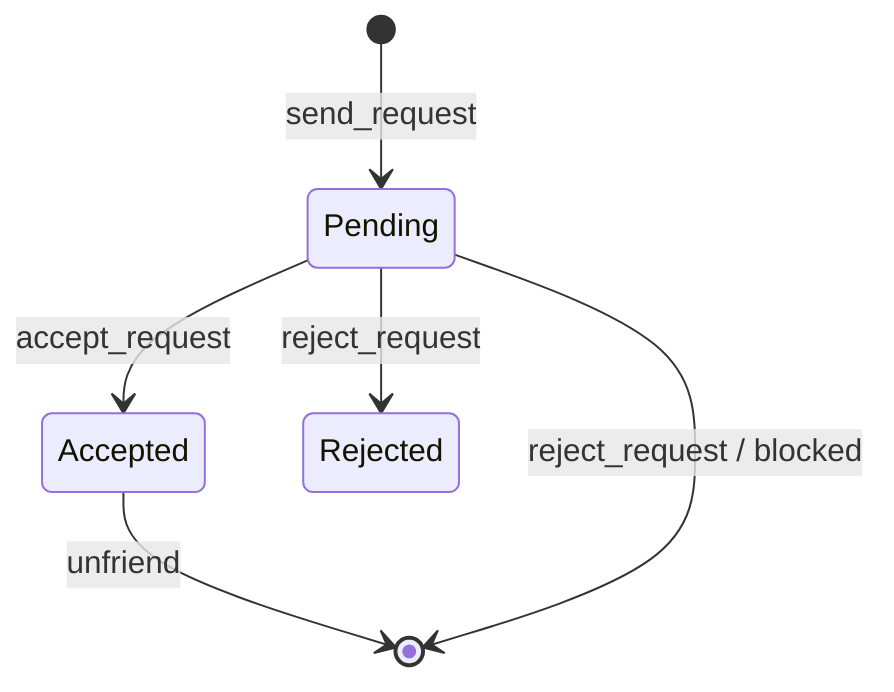

# Social Service Implementation (task-011)

## Background

The `aether-social` crate currently contains only type definitions for friend requests,
chat channels, group invites, and presence states. There is no business logic, no
storage abstraction, and no enforcement of social rules (e.g., blocked users cannot
send friend requests). This document covers the design for implementing full social
service logic.

## Why

Social interactions are a core pillar of any VR platform. Users need to:
- Find and manage friends
- Form groups for shared activities
- Communicate through text chat
- See who is online and what they are doing
- Block disruptive users with mutual invisibility

Without logic behind the existing types, the social crate is inert.

## What

Implement five subsystems with in-memory storage, full test coverage, and clean
module separation:

1. **Friend system** - Send/accept/reject requests, unfriend, block
2. **Group management** - Create, invite, join, leave, disband groups
3. **Chat system** - Channels, message sending, history retrieval
4. **Presence tracking** - Online/offline/in-world status transitions
5. **User blocking** - Mutual invisibility, prevents friend requests and chat

## How

### Architecture

```
SocialService (facade)
  |-- FriendManager    (friend.rs)
  |-- GroupManager     (group.rs)
  |-- ChatManager      (chat.rs)
  |-- PresenceTracker  (presence.rs)
  |-- BlockList        (blocking.rs)
```

Each manager uses `HashMap`-based in-memory storage. The `SocialService` facade
composes them and enforces cross-cutting concerns (e.g., checking block-list before
allowing friend requests or chat messages).

### Module Design

#### blocking.rs - BlockList

```
BlockList {
    blocked: HashMap<u64, HashSet<u64>>
}

Methods:
  block(user_id, target_id) -> Result<()>
  unblock(user_id, target_id) -> Result<()>
  is_blocked(user_id, target_id) -> bool
  is_blocked_either(a, b) -> bool   // mutual check
  blocked_by(user_id) -> Vec<u64>
```

Rules:
- Blocking is directional in storage but checked bidirectionally for visibility
- Blocking auto-removes any existing friendship
- Blocked users cannot send friend requests or chat messages to each other

#### friend.rs - FriendManager

```
FriendManager {
    friendships: HashMap<u64, HashMap<u64, FriendState>>,
}

Methods:
  send_request(from, to) -> Result<()>
  accept_request(from, to) -> Result<()>
  reject_request(from, to) -> Result<()>
  unfriend(user_a, user_b) -> Result<()>
  get_friends(user_id) -> Vec<u64>
  get_pending_requests(user_id) -> Vec<u64>
  are_friends(a, b) -> bool
```

State machine:


Rules:
- Cannot send request to self
- Cannot send request if already friends
- Cannot send request if blocked (checked via BlockList)
- Duplicate pending request returns error
- Only the recipient can accept/reject

#### group.rs - GroupManager

```
GroupManager {
    groups: HashMap<String, Group>,
    invites: HashMap<String, HashMap<u64, GroupInvite>>,
    user_groups: HashMap<u64, HashSet<String>>,
}

Methods:
  create_group(owner_id, config) -> Result<String>
  invite_user(group_id, inviter, invitee) -> Result<()>
  accept_invite(group_id, user_id) -> Result<()>
  decline_invite(group_id, user_id) -> Result<()>
  join_group(group_id, user_id) -> Result<()>    // for public groups
  leave_group(group_id, user_id) -> Result<()>
  disband_group(group_id, requester) -> Result<()>
  get_group(group_id) -> Option<&Group>
  get_user_groups(user_id) -> Vec<String>
```

Rules:
- Only owner can disband
- Only members can invite (for invite-only groups)
- Max members enforced
- Owner leaving disbands group
- Blocked users cannot be invited

#### chat.rs - ChatManager

```
ChatManager {
    channels: HashMap<String, ChatChannel>,
    messages: HashMap<String, Vec<ChatMessage>>,
    next_msg_id: u64,
}

Methods:
  create_channel(kind, members) -> String
  send_message(channel_id, from_user, kind) -> Result<ChatMessage>
  get_messages(channel_id, limit) -> Vec<ChatMessage>
  get_channel(channel_id) -> Option<&ChatChannel>
  add_member(channel_id, user_id) -> Result<()>
  remove_member(channel_id, user_id) -> Result<()>
```

Rules:
- Only members can send messages to a channel
- Blocked users cannot send messages to channels containing the blocker
- DM channels have exactly 2 members

#### presence.rs - PresenceTracker

```
PresenceTracker {
    states: HashMap<u64, PresenceState>,
}

Methods:
  set_online(user_id) -> PresenceState
  set_offline(user_id) -> PresenceState
  enter_world(user_id, location) -> PresenceState
  leave_world(user_id) -> PresenceState
  set_visibility(user_id, visibility) -> Result<()>
  get_presence(user_id) -> Option<&PresenceState>
  get_visible_presence(user_id, viewer_id) -> Option<PresenceState>
```

Rules:
- If viewer is blocked by user, presence returns None (invisible)
- Default state is Offline with Visible visibility

#### service.rs - SocialService (facade)

Composes all managers together and enforces cross-cutting block-list checks.

### Error Design

```rust
pub enum SocialError {
    UserBlocked,
    AlreadyFriends,
    NotFriends,
    RequestNotFound,
    SelfAction,
    GroupNotFound,
    NotGroupMember,
    NotGroupOwner,
    GroupFull,
    ChannelNotFound,
    NotChannelMember,
    AlreadyPending,
    AlreadyBlocked,
    NotBlocked,
    AlreadyInGroup,
    InviteNotFound,
}
```

### Test Design

All tests use in-memory stores, no external dependencies.

Test suites per module:
- **blocking_tests**: block/unblock, mutual check, double-block idempotency
- **friend_tests**: send/accept/reject, unfriend, blocked-user rejection,
  self-request rejection, duplicate request
- **group_tests**: create, invite, accept/decline, join public, leave,
  owner disband, max members, blocked invite rejection
- **chat_tests**: create channel, send message, get history, blocked sender,
  non-member rejection
- **presence_tests**: online/offline transitions, enter/leave world,
  visibility settings, blocked-user invisibility
- **service_tests**: cross-module integration (block removes friend,
  block prevents chat, etc.)

### Dependencies

```toml
[dependencies]
# None needed - pure Rust with std collections

[dev-dependencies]
# None needed - all tests use in-memory state
```

The existing types use `u64` for user IDs and `String` for entity IDs, keeping
the crate zero-dependency. The implementation follows this convention.
