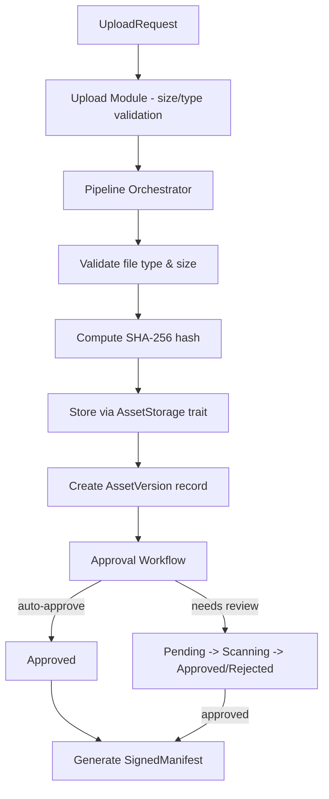

# UGC Service API & Upload Orchestration (task-033)

## Background

The `aether-ugc` crate currently contains type stubs for upload sessions, validation, moderation, and artifact lifecycle, but lacks actual upload/versioning logic, storage integration, and orchestration pipelines. The crate compiles with errors and has no executable business logic for receiving user content, validating it, hashing it, storing it, or approving it.

## Why

User-Generated Content is central to the Aether VR engine. Creators must be able to upload assets (3D models, textures, audio, scripts) with proper validation, content-addressed storage, version tracking, and approval workflows. Without this, the platform cannot safely accept, store, or distribute creator content.

## What

Implement the following capabilities in `aether-ugc`:

1. **Upload API** -- Multipart upload handling with configurable size limits per file type
2. **Asset Versioning** -- Track version history for assets with parent-version linking
3. **Validation Pipeline** -- Orchestrate: receive -> validate type/size -> compute SHA-256 hash -> approve/reject
4. **Signed Manifests** -- Content-addressed manifests containing asset metadata and SHA-256 signatures
5. **Storage Trait** -- Async trait-based storage abstraction with an in-memory implementation for testing
6. **Approval Workflow** -- State machine for Pending -> Scanning -> Approved/Rejected transitions with auto-approve support

## How

### Architecture



### Module Design

#### `upload.rs` -- Upload Handling

- `UploadRequest`: creator_id (UUID), asset_name, file_type, data (bytes), optional parent_version
- `UploadConfig`: max sizes per file type, global max size
- `validate_upload()`: checks size limits, file type allowlists
- `UploadError`: enum for size exceeded, unsupported type, empty data, invalid name

#### `version.rs` -- Asset Versioning

- `AssetVersion`: id (UUID), asset_id, version number, content_hash, size, status, timestamps
- `VersionHistory`: ordered collection of versions for an asset
- `VersionHistory::add_version()`: auto-increments version, validates parent linkage

#### `pipeline.rs` (extend existing)

- `ValidationPipeline`: orchestrates the full receive->validate->hash->store->approve flow
- `PipelineStage` enum: Received, Validated, Hashed, Stored, Approved/Rejected
- `PipelineResult`: outcome of running an upload through the pipeline

#### `manifest.rs` -- Signed Manifests

- `ManifestEntry`: asset_id, version, content_hash, size, file_type
- `SignedManifest`: entries + overall SHA-256 digest of concatenated entry hashes
- `ManifestBuilder`: fluent builder for constructing manifests

#### `storage.rs` -- Storage Abstraction

- `AssetStorage` async trait: store, retrieve, delete, exists
- `InMemoryStorage`: HashMap-backed impl for testing
- `StorageError`: enum for not-found, write-failed, etc.

#### `approval.rs` -- Approval Workflow

- `ApprovalStatus`: Pending, Scanning, Approved, Rejected{reason}
- `ApprovalPolicy`: auto-approve thresholds (e.g., trusted creators, small files)
- `ApprovalWorkflow`: state machine with valid transitions
- `evaluate_approval()`: applies policy to determine auto-approve vs manual review

### Database Design

No external database in this crate -- all state is in-memory for the domain layer. Persistence is handled by the `aether-persistence` crate. Key data structures:

- `AssetVersion` records keyed by `(asset_id, version_number)`
- `ApprovalStatus` per version
- Content-addressed blobs keyed by SHA-256 hash

### API Design

All public APIs are Rust functions/methods (no HTTP layer in this crate):

- `UploadConfig::validate(&self, request: &UploadRequest) -> Result<(), UploadError>`
- `VersionHistory::add_version(hash, size, status) -> AssetVersion`
- `ValidationPipeline::process(request, storage, policy) -> PipelineResult`
- `ManifestBuilder::add_entry().build() -> SignedManifest`
- `ApprovalWorkflow::transition(status) -> Result<ApprovalStatus, ApprovalError>`
- `AssetStorage::store/retrieve/delete/exists` (async trait)

### Test Design

Tests written before implementation, covering:

1. **Upload validation**: size limits per file type, empty data rejection, invalid names, valid uploads pass
2. **Versioning**: first version is v1, sequential increment, parent version validation
3. **Pipeline**: full happy path, rejection at each stage, hash computation correctness
4. **Manifests**: single-entry manifest, multi-entry manifest, digest correctness
5. **Storage**: store-then-retrieve round-trip, delete removes, exists checks, retrieve missing returns error
6. **Approval**: valid state transitions, invalid transitions rejected, auto-approve policy, rejection with reason

### Dependencies Added

```toml
sha2 = "0.10"
serde = { version = "1", features = ["derive"] }
uuid = { version = "1", features = ["v4"] }
chrono = { version = "0.4", features = ["serde"] }
async-trait = "0.1"
tokio = { version = "1", features = ["rt", "macros"] }
```

### File Size Budget

Each new module targets under 300 lines. The existing `runtime.rs` (410 lines) is left as-is since it is pre-existing code.
