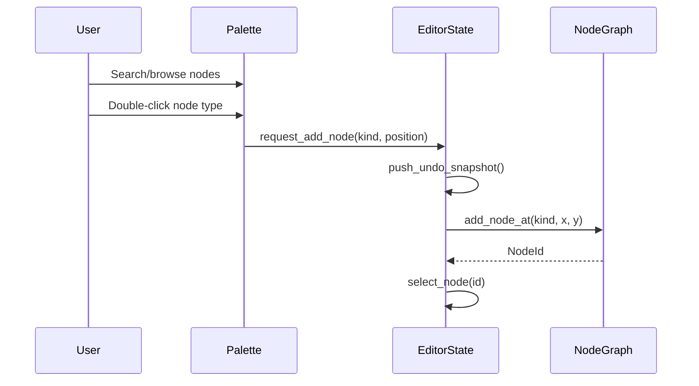
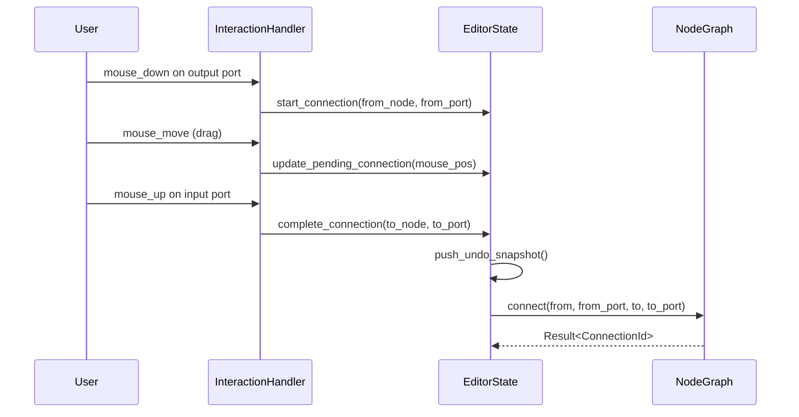
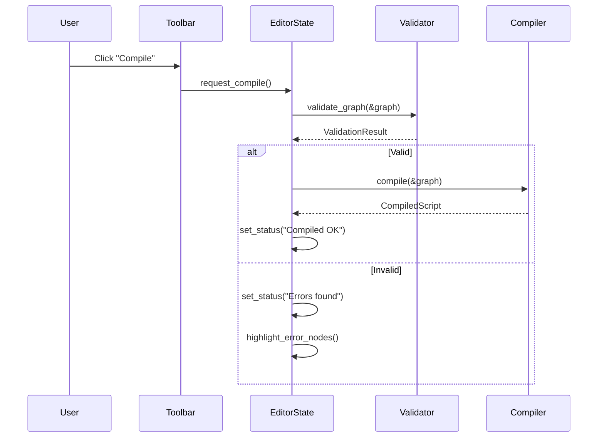

# Visual Script Editor GUI

## Background

The Aether VR Engine includes a visual scripting backend (`aether-creator-studio/visual_script/`) that provides node graph data structures, type system, validation, compilation to WASM bytecode, automatic layout, and pre-built templates. However, there is no graphical user interface for interacting with this system. Users must construct graphs programmatically, which limits adoption by non-programmers.

## Why

- Enable non-programmers (game designers, artists, educators) to create VR game logic visually
- Provide immediate visual feedback when building and debugging game logic
- Lower the barrier to entry for VR content creation within Aether
- Complete the creator-studio toolchain: backend exists, GUI is the missing layer

## What

An interactive node-based visual programming editor (`aether-visual-editor` crate) that renders and manipulates `NodeGraph` from `aether-creator-studio`. The editor includes:

- Infinite pannable/zoomable canvas with grid background
- Node rendering with color-coded categories and typed ports
- Bezier curve connections between ports
- Node palette sidebar with search and templates
- Property panel for editing selected node values
- Toolbar with compile, validate, auto-layout, undo/redo, save/load
- Mini-map for graph overview navigation
- Full interaction model: selection, dragging, connecting, context menus, keyboard shortcuts

## How

### Architecture

Built with `eframe`/`egui` (immediate-mode GUI), the editor follows a Model-View-Controller pattern:

- **Model**: `EditorState` wraps `NodeGraph` and adds selection, undo/redo history, clipboard, view transform
- **View**: Rendering modules (`node_renderer`, `connection_renderer`, `canvas`, `minimap`, `palette`, `properties`, `toolbar`)
- **Controller**: `InteractionHandler` processes input events and mutates state

### Technology Choice

`eframe`/`egui` (v0.31) is chosen because:
- Pure Rust, no system dependencies
- Cross-platform (desktop + web via WASM)
- Immediate-mode simplifies state management
- Custom painting API for canvas, bezier curves, grid

### Module Decomposition

```
aether-visual-editor/
  src/
    lib.rs          - Public API
    app.rs          - Main eframe::App implementation
    state.rs        - EditorState, undo/redo, clipboard
    canvas.rs       - ViewTransform, coordinate transforms, grid
    node_renderer.rs - Node box rendering
    connection_renderer.rs - Bezier curve connections
    palette.rs      - Node palette sidebar
    properties.rs   - Property panel for selected node
    interaction.rs  - Input handling, selection, dragging, connecting
    toolbar.rs      - Top toolbar buttons
    minimap.rs      - Mini-map overlay
```

### Detailed Design

#### Coordinate System

```
Screen Space (pixels) <-> Canvas Space (world units)
  screen_pos = (canvas_pos - pan_offset) * zoom
  canvas_pos = screen_pos / zoom + pan_offset
```

#### Node Layout

Each node is a rectangle at its `position` in canvas space:
- Title bar: 24px height, colored by category
- Each port row: 20px height
- Width: 180px minimum, expands for long labels
- Input ports on left edge, output ports on right edge

#### Port Color Scheme

| DataType | Color |
|----------|-------|
| Flow     | White |
| Bool     | Red   |
| Int      | Cyan  |
| Float    | Green |
| String   | Magenta |
| Vec3     | Yellow |
| Entity   | Orange |
| Any      | Gray  |

#### Node Category Colors (title bar)

| Category   | Color  |
|-----------|--------|
| Events    | Red    |
| Flow      | Orange |
| Actions   | Blue   |
| Variables | Green  |
| Math      | Purple |
| Conditions| Yellow |

#### Editor Workflow: Add Node



#### Editor Workflow: Connect Ports



#### Editor Workflow: Compile



### API Design

```rust
// Main entry point
pub struct VisualEditorApp { ... }

impl VisualEditorApp {
    pub fn new(cc: &eframe::CreationContext) -> Self;
    pub fn with_graph(cc: &eframe::CreationContext, graph: NodeGraph) -> Self;
}

impl eframe::App for VisualEditorApp {
    fn update(&mut self, ctx: &egui::Context, frame: &mut eframe::Frame);
}

// State
pub struct EditorState {
    pub graph: NodeGraph,
    pub view: ViewTransform,
    pub selection: Selection,
    // ...
}

// Coordinate transform
pub struct ViewTransform {
    pub pan: egui::Vec2,
    pub zoom: f32,
}

impl ViewTransform {
    pub fn screen_to_canvas(&self, screen_pos: egui::Pos2) -> egui::Pos2;
    pub fn canvas_to_screen(&self, canvas_pos: egui::Pos2) -> egui::Pos2;
}
```

### Test Design

- **canvas.rs**: ViewTransform round-trip, zoom boundaries, grid snapping
- **node_renderer.rs**: Node bounds calculation, port position calculation, hit testing
- **connection_renderer.rs**: Type compatibility checks
- **interaction.rs**: Selection operations, multi-select, deselect
- **state.rs**: Undo/redo push/pop, clipboard operations, editor mode transitions
- **palette.rs**: Search/filter by name, category filtering
- **minimap.rs**: Viewport rect calculation, bounds computation
