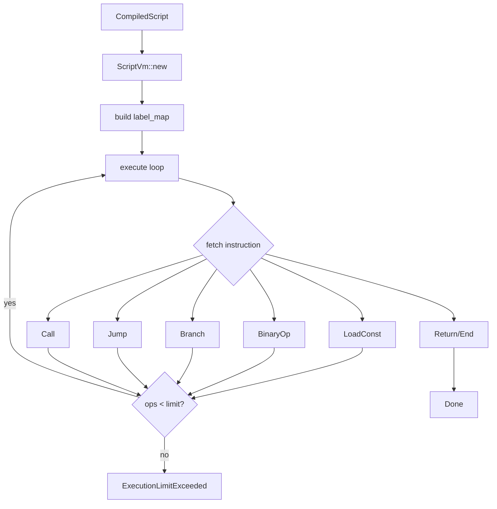

# Visual Script Runtime Execution

## Background

The `aether-creator-studio` crate contains a visual scripting editor with a node graph, type system, validation layer, and an IR compiler that translates visual node graphs into `IrInstruction` sequences. However, there is no runtime to actually execute these IR instructions. Without a runtime, compiled visual scripts are inert data.

## Why

Creators need their visual scripts to run inside the VR engine. The runtime is the bridge between the compiled IR and the live game world -- it interprets instructions, manages state (variables, registers), enforces sandboxing limits, and dispatches engine API calls through a well-defined interface.

## What

Build a register-based virtual machine (VM) that executes `IrInstruction` sequences produced by the existing IR compiler. The VM must:

1. Execute all existing IR instruction types (LoadConst, BinaryOp, Not, Branch, Jump, Label, Call, Nop, Return)
2. Manage a register file and variable storage (local + global)
3. Support control flow (conditional branches, unconditional jumps, labels)
4. Enforce execution limits (max ops per tick, max stack depth, max variables)
5. Dispatch engine API calls through a trait interface (no direct engine coupling)
6. Support hot-reloading (swap compiled scripts without restarting the VM)
7. Be deterministic (same inputs produce same outputs)

## How

### Architecture

```
CompiledScript --> ScriptVm --> EngineApi (trait)
                      |
                 VmState (registers, variables, PC)
```

### Module Structure

```
visual_script/
  runtime/
    mod.rs          -- module exports
    vm.rs           -- VM struct, execution loop, state
    engine_api.rs   -- EngineApi trait + NoOpApi default
    error.rs        -- RuntimeError enum
```

### Detail Design

#### VM State (`VmState`)
- `registers: Vec<Value>` -- register file, sized to `CompiledScript::register_count`
- `variables: HashMap<String, Value>` -- local script variables
- `pc: usize` -- program counter (current instruction index)
- `ops_executed: u64` -- counter for sandboxing
- `label_map: HashMap<LabelId, usize>` -- pre-computed label-to-instruction-index mapping

#### Execution Loop
1. Pre-scan instructions to build `label_map`
2. Loop: fetch instruction at `pc`, increment `ops_executed`, check limits
3. Match on instruction variant, execute, advance `pc`
4. Stop on `Return`, reaching end of instructions, or hitting a limit

#### Instruction Execution
- `LoadConst(reg, val)` -- store val in registers[reg]
- `BinaryOp { op, dest, lhs, rhs }` -- compute and store result
- `Not { dest, src }` -- boolean negation
- `Branch { condition, true_label, false_label }` -- jump based on truthiness
- `Jump(label)` -- unconditional jump
- `Label(id)` -- no-op (used only for label_map building)
- `Call { function, args, result }` -- dispatch to EngineApi trait
- `Nop` -- no-op
- `Return` -- halt execution

#### EngineApi Trait
```rust
pub trait EngineApi {
    fn call(&mut self, function: &str, args: &[Value]) -> Result<Value, RuntimeError>;
}
```

Built-in functions (clamp, lerp, etc.) are handled by the VM directly. Unknown functions are dispatched to the EngineApi trait.

#### Configuration (Environment Variables)
| Variable | Default | Purpose |
|---|---|---|
| AETHER_SCRIPT_MAX_OPS | 10000 | Max instructions per execution |
| AETHER_SCRIPT_MAX_STACK | 256 | Max register file size |
| AETHER_SCRIPT_MAX_VARS | 1024 | Max variables per script |

#### Error Types
- `RegisterOutOfBounds` -- invalid register index
- `LabelNotFound` -- jump to undefined label
- `ExecutionLimitExceeded` -- hit max ops
- `StackOverflow` -- register count exceeds limit
- `VariableLimitExceeded` -- too many variables
- `DivisionByZero` -- divide by zero
- `TypeError` -- operand type mismatch
- `UnknownFunction` -- API call to unregistered function
- `ApiError` -- error from EngineApi

### Test Design

Tests are organized by concern:
1. **Instruction tests** -- each instruction type in isolation
2. **Control flow tests** -- branches, jumps, labels, loops
3. **Variable tests** -- get/set variables, scoping, limits
4. **Arithmetic tests** -- all binary ops with different value types, edge cases (div by zero)
5. **Execution limit tests** -- max ops, max registers, max variables
6. **EngineApi tests** -- mock API calls, error propagation
7. **Hot-reload tests** -- swap script mid-execution
8. **Integration tests** -- compile a graph then execute the resulting IR


