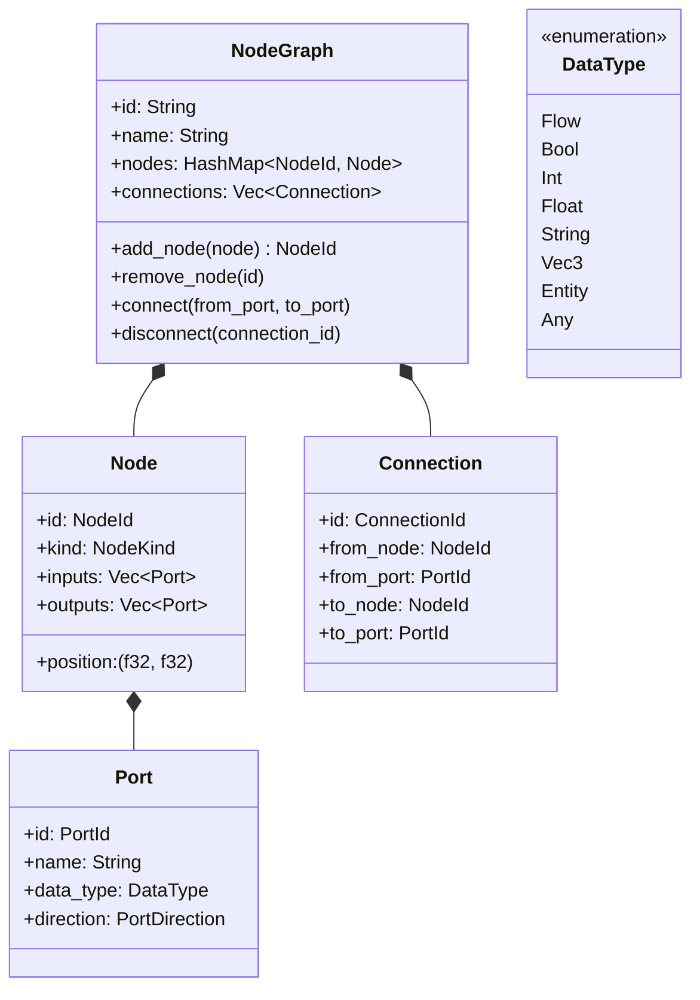
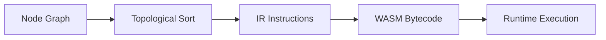

# Visual Scripting Editor

## Background

The Aether Creator Studio provides world-editing primitives (terrain, props, lighting, manifests) with an undo/redo command pattern. The `tools.rs` module already defines a `ScriptMode::Visual` variant, and the manifest module has a `ScriptEdit::VisualNode` variant, indicating that visual scripting was planned from the start. This design doc covers the node-based visual scripting editor types that allow creators to build game logic without writing code.

## Why

- Creators need a no-code way to add interactivity to their VR worlds (on-interact, timers, conditionals, etc.)
- A node graph is the industry-standard approach for visual scripting (Unreal Blueprints, Unity Visual Scripting, Godot VisualScript)
- The compilation pipeline (graph -> IR -> WASM bytecode) enables efficient runtime execution via the existing `aether-scripting` WASM runtime

## What

A node-based visual scripting system comprising:
1. **Node graph data model** - nodes, ports, connections, type system
2. **Node types** - event triggers, conditions, actions, variables, math, flow control
3. **Layout engine** - automatic node positioning using a layered graph layout algorithm
4. **Compilation pipeline** - node graph -> intermediate representation (IR) -> WASM bytecode
5. **Validation** - type checking on connections, cycle detection in execution flow
6. **Serialization** - JSON-based save/load of node graphs
7. **Templates** - common game logic patterns (on-interact, on-enter, timer, etc.)

## How

### Module Structure

```
visual_script/
  mod.rs          -- module declarations and re-exports
  types.rs        -- core type system (DataType, Value)
  node.rs         -- Node, Port, NodeKind definitions
  graph.rs        -- NodeGraph container, connection management
  compiler.rs     -- IR generation and WASM bytecode compilation
  validation.rs   -- type checking, cycle detection
  layout.rs       -- automatic node positioning
  templates.rs    -- pre-built game logic templates
```

### Data Model



### Node Kinds

- **Event**: OnInteract, OnEnter, OnExit, OnTimer, OnStart, OnCollision
- **Flow**: Branch, ForLoop, Sequence, Delay
- **Action**: SetPosition, SetRotation, PlayAnimation, PlaySound, SpawnEntity, DestroyEntity, SendMessage, Log
- **Variable**: GetVariable, SetVariable
- **Math**: Add, Subtract, Multiply, Divide, Clamp, Lerp, RandomRange
- **Condition**: Equal, NotEqual, Greater, Less, And, Or, Not

### Compilation Pipeline



The IR is a flat list of instructions:
- `LoadConst(register, value)` -- load a constant into a register
- `BinaryOp(op, dest, lhs, rhs)` -- arithmetic operations
- `Branch(condition_reg, true_label, false_label)` -- conditional flow
- `Call(function_name, args, result_reg)` -- call a built-in action
- `Jump(label)` -- unconditional jump
- `Return` -- end execution
- `Label(name)` -- jump target

WASM bytecode output is a `Vec<u8>` representing a minimal WASM module with the compiled logic.

### Validation Rules

1. **Type compatibility**: Connection source data_type must match or be coercible to destination data_type. `Any` type matches everything.
2. **Direction check**: Connections must go from Output to Input ports.
3. **Single input**: Each input port may have at most one incoming connection.
4. **Cycle detection**: Execution flow (Flow-typed connections) must form a DAG. Data connections may have cycles (lazy evaluation).
5. **Connected events**: At least one Event node must exist and be connected.

### Layout Algorithm

Uses a simplified Sugiyama-style layered layout:
1. Assign layers via topological order (BFS from event nodes)
2. Position nodes within layers to minimize edge crossings (barycenter heuristic)
3. Apply spacing constants for readability

### Test Design

- **types.rs**: DataType compatibility, value conversions
- **node.rs**: Node creation, port enumeration by kind
- **graph.rs**: Add/remove nodes, connect/disconnect, serialization round-trip
- **validation.rs**: Type mismatch detection, cycle detection, single-input enforcement, direction checks
- **compiler.rs**: IR generation from simple graphs, instruction ordering
- **layout.rs**: Layer assignment, position spacing
- **templates.rs**: Template instantiation produces valid graphs

### Constants

- `DEFAULT_NODE_SPACING_X: f32 = 250.0`
- `DEFAULT_NODE_SPACING_Y: f32 = 100.0`
- `MAX_NODES_PER_GRAPH: usize = 1000`
- `MAX_CONNECTIONS_PER_GRAPH: usize = 5000`
