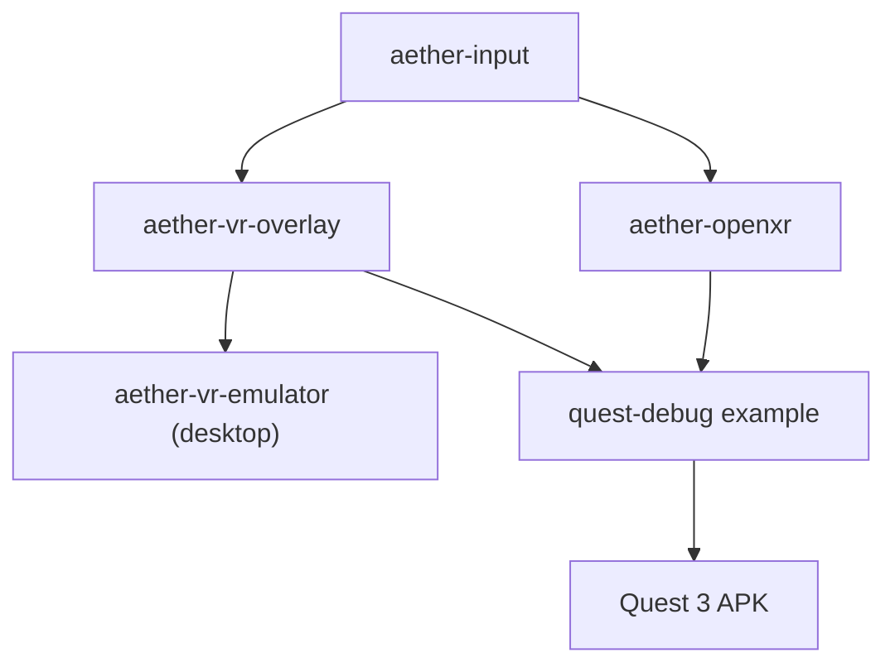
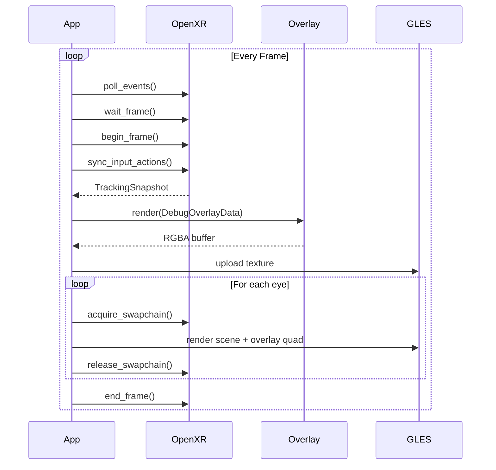

# VR Debug Overlay

## Background

The Aether VR engine has a PC-based VR emulator with a debug overlay showing FPS, head tracking, and controller data. This overlay is tightly coupled to the emulator's `minifb` window and only works on desktop. To test on Meta Quest 3, developers need the same debug information rendered inside VR as a floating panel.

## Why

- Developers need real-time visibility into performance and tracking while wearing the headset
- The existing overlay is desktop-only (pixel-level rendering on `minifb` framebuffer)
- Testing on Quest 3 without debug info makes it impossible to diagnose tracking, performance, or input issues
- A shared overlay system avoids duplicating rendering code between desktop and Quest

## What

1. **`aether-vr-overlay`** — Platform-agnostic crate that renders debug text to RGBA pixel buffers
2. **`aether-openxr`** — Real OpenXR runtime bindings for Quest session/swapchain/input
3. **`quest-debug` example** — Quest 3 app that renders a reference scene + debug overlay in VR

## How

### Architecture

### Debug Panel

The overlay renders as a 512x256 RGBA texture containing:
- Line 1: FPS, frame time (ms), session state, frame count
- Line 2: Head position (x,y,z), yaw, pitch
- Line 3: Left/right controller positions
- Line 4: Tracking confidence, trigger/grip values

Rendered with a 5x7 bitmap font at 2x scale (10x14 pixels per character), green text on semi-transparent dark background.

### VR Display

On Quest 3, the panel renders as a textured quad:
- Positioned 1.5m in front of the user, slightly below eye level
- Billboards to face the user (world-locked, not head-locked)
- Toggled via menu button on left controller
- Size: 0.8m x 0.4m in world space

### Frame Loop (Quest)

## Detail Design

### Constants

| Constant | Value | Location |
|----------|-------|----------|
| `DEFAULT_PANEL_WIDTH` | 512 | overlay/panel.rs |
| `DEFAULT_PANEL_HEIGHT` | 256 | overlay/panel.rs |
| `DEFAULT_TEXT_SCALE` | 2 | overlay/panel.rs |
| `GLYPH_WIDTH` | 5 | overlay/font.rs |
| `GLYPH_HEIGHT` | 7 | overlay/font.rs |
| `OVERLAY_DISTANCE_M` | 1.5 | quest-debug/overlay_quad.rs |
| `OVERLAY_QUAD_WIDTH_M` | 0.8 | quest-debug/gles_renderer.rs |
| `OVERLAY_QUAD_HEIGHT_M` | 0.4 | quest-debug/gles_renderer.rs |

### Environment Variables

| Variable | Default | Purpose |
|----------|---------|---------|
| `AETHER_OVERLAY_WIDTH` | 512 | Panel texture width |
| `AETHER_OVERLAY_HEIGHT` | 256 | Panel texture height |
| `AETHER_OVERLAY_TEXT_SCALE` | 2 | Text scale multiplier |
| `AETHER_OVERLAY_VISIBLE` | true | Initial visibility |

### Test Design

- **font.rs**: Glyph bitmap validity, RGBA rendering to buffer, text measurement, out-of-bounds safety
- **layout.rs**: Line formatting, `from_snapshot` conversion, edge values (NaN, infinity)
- **panel.rs**: Buffer dimensions, render produces non-zero pixels, visibility toggle
- **openxr error.rs**: Display formatting for all variants
- **overlay_quad.rs**: Model matrix computation, billboard math
