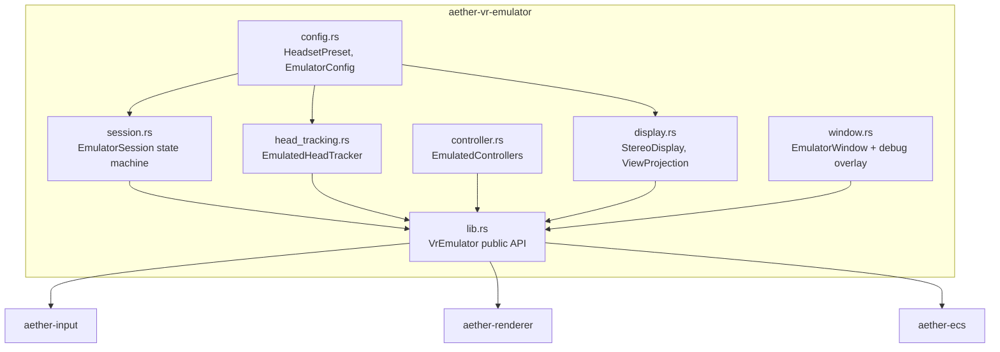
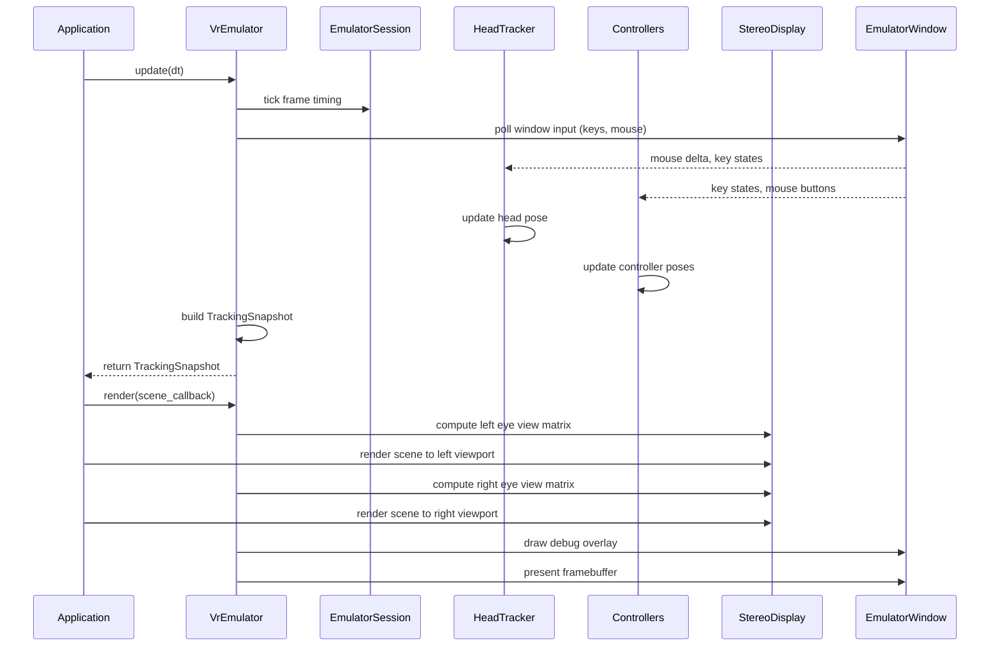

# VR Emulator - PC Development Environment

## Background

The Aether VR Engine currently requires either a physical VR headset (via OpenXR) or falls back to a basic desktop adapter that only maps keyboard/mouse to XR button events. There is no middle ground: developers cannot preview stereo VR rendering, emulated controller positions, or head tracking behavior without physical hardware.

## Why

- **Faster iteration**: Compiling, deploying, and testing on a VR headset adds significant overhead to the development loop. A PC-based emulator allows instant preview.
- **Accessibility**: Not all developers have VR hardware. An emulator lets anyone on the team work on VR features.
- **CI/testing**: Automated tests can verify VR rendering logic, controller positioning, and session management without hardware.
- **Debugging**: A desktop window provides better debugging tools (overlays, logging) than an HMD display.

## What

A new crate `aether-vr-emulator` that provides:

1. **Emulated VR display** - Stereo (side-by-side) and mono preview in a desktop window using `minifb`.
2. **Controller emulation** - Keyboard/mouse mapped to 6-DOF VR controller positions and button states.
3. **Head tracking emulation** - Mouse-look and keyboard-driven head position changes.
4. **Emulator session** - A session state machine mirroring OpenXR lifecycle but running locally.
5. **Headset configuration presets** - Quest 2, Quest 3, Valve Index, etc. with correct resolution/FOV/IPD/refresh rate.
6. **Debug overlay** - FPS, controller positions, session state, tracking info rendered on the preview window.

## How

### Architecture



### Frame Loop



### Detailed Design

#### Configuration (`config.rs`)

Headset presets define: resolution per eye, horizontal/vertical FOV, IPD, refresh rate.

| Preset      | Per-Eye Resolution | H-FOV  | V-FOV  | IPD (mm) | Refresh (Hz) |
|-------------|-------------------|--------|--------|----------|---------------|
| Quest 2     | 1832x1920         | 97     | 93     | 63       | 90            |
| Quest 3     | 2064x2208         | 110    | 96     | 63       | 120           |
| Valve Index | 1440x1600         | 130    | 120    | 63.5     | 144           |
| Pico 4      | 2160x2160         | 105    | 105    | 62       | 90            |
| Custom      | user-defined      | user   | user   | user     | user          |

The emulator window resolution is independent - it scales down the logical VR resolution to fit the desktop window.

#### Session (`session.rs`)

States: `Idle -> Ready -> Running -> Paused -> Running -> Stopping -> Idle`.
Simplified compared to full OpenXR but covers the essential lifecycle.
Frame timing emulates the target refresh rate with nanosecond timestamps.

#### Head Tracking (`head_tracking.rs`)

- Yaw/pitch from mouse delta (with sensitivity multiplier)
- Position from keyboard: WASD moves head in the horizontal plane, R/F for up/down
- Preset positions (standing at 1.7m, seated at 1.2m, room corners)
- Quaternion output matching `Pose3` format from `aether-input`

#### Controller Emulation (`controller.rs`)

- Left controller: WASD for thumbstick, Q/E for grip rotation, Shift for grip button
- Right controller: mouse position maps to aim direction, left-click for trigger, right-click for grip
- Number keys 1-5 map to face buttons (A, B, X, Y, Menu)
- Controller positions are computed relative to head pose (natural hand positions)

#### Display (`display.rs`)

- Stereo mode: splits the framebuffer into left/right halves
- Mono mode: single full-width view from the left eye
- Each eye gets its own view matrix offset by half IPD
- FOV-correct perspective projection matching headset specs

#### Window (`window.rs`)

- Uses `minifb` for window creation and pixel buffer display
- Polls keyboard/mouse state each frame
- Renders debug overlay: FPS, head position, controller positions, session state

### API Design

```rust
// Create and run emulator
let config = EmulatorConfig::from_preset(HeadsetPreset::Quest3);
let mut emulator = VrEmulator::new(config)?;

// Main loop
while emulator.is_running() {
    let dt = /* frame delta */;
    let snapshot = emulator.update(dt);
    // Use snapshot.head_pose, snapshot.left_controller, etc.

    emulator.begin_frame();
    // Render left eye
    let left_view = emulator.left_eye_view();
    render_scene(&left_view);
    // Render right eye
    let right_view = emulator.right_eye_view();
    render_scene(&right_view);
    emulator.end_frame(&framebuffer);
}
```

### Test Design

Each module has `#[cfg(test)]` tests covering:

- **config.rs**: Preset values are correct, custom configs validate, serialization round-trips
- **session.rs**: State transitions (valid and invalid), frame timing accuracy, pause/resume
- **head_tracking.rs**: Mouse delta to rotation, keyboard to position, quaternion normalization, preset positions, boundary clamping
- **controller.rs**: Key-to-button mapping completeness, controller position relative to head, thumbstick axis mapping
- **display.rs**: Stereo viewport calculation, mono viewport, IPD offset, FOV projection matrix values
- **lib.rs**: Integration tests for full update cycle
