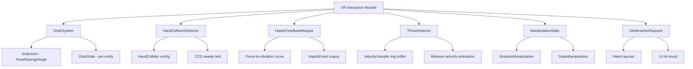

# VR Interaction Physics - Design Document

## Background

The Aether VR engine's physics crate (`aether-physics`) currently provides Rapier3D integration with rigid bodies, colliders, joints, raycasting, and collision events. However, it lacks VR-specific interaction primitives -- grabbing objects, hand collision detection with CCD, haptic feedback from physics events, throw detection, object manipulation while held, and UI interaction via hand raycasts.

## Why

VR applications require natural hand-object interaction that goes beyond standard rigid body simulation. Users expect to grab, rotate, scale, and throw objects intuitively. The physics system must map collision forces to haptic feedback, detect fast hand movements via CCD, and support UI interaction through hand raycasts. Without these primitives, every VR application built on Aether would need to reimplement this complex logic.

## What

Implement five new modules in `crates/aether-physics/src/vr/`:

1. **grab.rs** - Joint-based grab system (fixed, spring, hinge joint types)
2. **hand_collision.rs** - Hand collider with CCD for fast hand movements
3. **haptic.rs** - Haptic feedback mapping from physics events
4. **throw_detection.rs** - Velocity tracking over last N frames for natural throwing
5. **manipulation.rs** - Object manipulation (rotate, scale while held)

Plus a **mod.rs** to tie them together and a **ui_interaction.rs** for hand raycast UI interaction.

## How

### Architecture

All new types are abstraction-level types that model VR interaction physics logic. They do not directly depend on Rapier3D internals but use the existing crate types (`Transform`, `Velocity`, `JointType`, `ColliderShape`, `RaycastHit`, `CollisionLayers`, `Entity`).

### Module Design

#### 1. Grab System (`grab.rs`)

**Types:**
- `GrabJointKind` - enum: Fixed, Spring { stiffness, damping }, Hinge { axis }
- `GrabConstraint` - holds joint kind, anchor offsets, break force threshold
- `GrabState` - enum: Idle, Grabbing { target, constraint, grab_point }
- `GrabSystem` - manages active grabs per hand entity, processes grab/release

**Key logic:**
- `try_grab(hand, target, contact_point)` - creates a grab constraint
- `release(hand)` - releases current grab, returns release velocity for throw
- `update(dt)` - updates spring joints, checks break force thresholds
- Configurable via constants: `DEFAULT_SPRING_STIFFNESS`, `DEFAULT_BREAK_FORCE`

#### 2. Hand Collision (`hand_collision.rs`)

**Types:**
- `HandColliderConfig` - shape, CCD settings, collision layers
- `HandCollisionDetector` - tracks hand positions, performs swept-sphere CCD
- `HandCollisionResult` - contact point, normal, penetration depth, entity hit

**Key logic:**
- `swept_sphere_test(prev_pos, curr_pos, radius)` - CCD linear sweep
- Configurable CCD substeps via `DEFAULT_CCD_SUBSTEPS`

#### 3. Haptic Feedback (`haptic.rs`)

**Types:**
- `HapticFeedbackConfig` - mapping curves, min/max thresholds
- `HapticEvent` - { hand, intensity: f32 [0..1], duration_secs: f32 }
- `HapticFeedbackMapper` - converts collision forces to haptic events

**Key logic:**
- `map_collision_force(force_magnitude) -> HapticEvent` - force-to-vibration mapping
- Configurable curve: linear, quadratic, or custom via `HapticCurve` enum

#### 4. Throw Detection (`throw_detection.rs`)

**Types:**
- `VelocitySample` - { velocity: [f32; 3], angular_velocity: [f32; 3], timestamp: f32 }
- `ThrowDetector` - ring buffer of last N velocity samples per hand
- `ThrowResult` - estimated release linear + angular velocity

**Key logic:**
- `record_sample(hand_velocity, angular_velocity, timestamp)` - pushes to ring buffer
- `estimate_release_velocity()` - weighted average of recent samples
- Configurable: `DEFAULT_SAMPLE_COUNT`, `DEFAULT_VELOCITY_WEIGHT_DECAY`

#### 5. Object Manipulation (`manipulation.rs`)

**Types:**
- `ManipulationMode` - enum: None, Rotate, Scale, RotateAndScale
- `ManipulationState` - tracks two-hand manipulation state
- `ManipulationResult` - delta rotation quaternion + scale factor

**Key logic:**
- Single hand: rotation via hand rotation delta
- Two hands: scale from inter-hand distance change, rotation from midpoint
- `update_one_hand(hand_transform)` -> rotation delta
- `update_two_hands(left_transform, right_transform)` -> rotation + scale delta

#### 6. UI Interaction (`ui_interaction.rs`)

**Types:**
- `UiRaycastConfig` - max distance, layer filter, hand offset
- `UiHitResult` - { point, normal, distance, entity, uv: Option<[f32; 2]> }
- `UiInteractionState` - tracks hover/press per hand

**Key logic:**
- `cast_ray(hand_transform)` -> Option<UiHitResult>
- `update_state(hit, trigger_pressed)` - manages hover/press/release transitions

### Constants

All tunable values defined as constants at file tops:
- `DEFAULT_SPRING_STIFFNESS: f32 = 5000.0`
- `DEFAULT_SPRING_DAMPING: f32 = 100.0`
- `DEFAULT_BREAK_FORCE: f32 = 1000.0`
- `DEFAULT_CCD_SUBSTEPS: u32 = 4`
- `DEFAULT_HAND_COLLIDER_RADIUS: f32 = 0.05`
- `DEFAULT_HAPTIC_MIN_FORCE: f32 = 0.1`
- `DEFAULT_HAPTIC_MAX_FORCE: f32 = 50.0`
- `DEFAULT_HAPTIC_DURATION: f32 = 0.05`
- `DEFAULT_THROW_SAMPLE_COUNT: usize = 10`
- `DEFAULT_VELOCITY_WEIGHT_DECAY: f32 = 0.8`
- `DEFAULT_UI_RAYCAST_MAX_DISTANCE: f32 = 10.0`
- `DEFAULT_SCALE_MIN: f32 = 0.1`
- `DEFAULT_SCALE_MAX: f32 = 10.0`

### Test Design

Each module has comprehensive unit tests covering:
- Construction and default values
- State transitions (idle -> grabbing -> released)
- Edge cases (zero velocity, NaN handling, empty buffers)
- Mathematical correctness (quaternion operations, velocity estimation)
- Configuration validation
- Break force thresholds
- CCD sweep detection
- Haptic curve mapping accuracy
- Ring buffer wraparound
- Two-hand manipulation geometry
