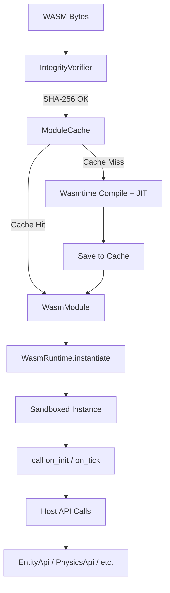

# WASM Client-Side Runtime Design (task-024)

## Background

The Aether VR engine supports user-created scripts that run inside world instances. The existing `aether-scripting` crate provides policy primitives (resource limits, scheduling, API traits) but has no concrete WASM execution engine. The `aether-lua` crate provides a Lua-based scripting runtime. This task adds a Wasmtime-based WASM runtime for client-side script execution, complementing the Lua path with a high-performance, sandboxed alternative.

## Why

- **Performance**: WASM modules compiled via Wasmtime JIT run at near-native speed, critical for VR frame budgets.
- **Language diversity**: Creators can author scripts in Rust, C/C++, AssemblyScript, or Go (via TinyGo) and compile to WASM.
- **Security**: WASM provides strong sandboxing by default. Combined with Wasmtime fuel metering and memory limits, untrusted user scripts cannot escape their sandbox or starve the host.
- **Integrity**: SHA-256 verification of WASM modules ensures only approved, reviewed scripts execute on clients.

## What

Add a `wasm` submodule to `aether-scripting` that provides:

1. `WasmRuntime` - engine wrapper with JIT compilation and module caching
2. `WasmModule` - a loaded, verified WASM module
3. `ModuleCache` - filesystem-backed cache of precompiled Wasmtime modules
4. `IntegrityVerifier` - SHA-256 hash verification against an approved manifest
5. `SandboxConfig` - resource limits (memory, fuel, execution time)
6. `HostApi` - host function bindings exposed to WASM scripts

## How

### Architecture



### Module Layout

```
crates/aether-scripting/src/wasm/
  mod.rs        - public re-exports
  runtime.rs    - WasmRuntime: engine, compile, instantiate, call hooks
  cache.rs      - ModuleCache: filesystem-based precompiled module cache
  verify.rs     - IntegrityVerifier: SHA-256 verification
  sandbox.rs    - SandboxConfig and fuel/memory limit enforcement
  host_api.rs   - Host function bindings (linker setup)
```

### Key Types

```rust
pub struct WasmRuntime {
    engine: wasmtime::Engine,
    linker: wasmtime::Linker<ScriptState>,
    cache: ModuleCache,
}

pub struct WasmModule {
    module: wasmtime::Module,
    content_hash: [u8; 32],
}

pub struct SandboxConfig {
    pub max_memory_bytes: u64,     // Default: 16 MB
    pub fuel_limit: u64,           // Default: 1_000_000
    pub max_execution_time_ms: u64, // Default: 16 ms
}

pub struct ModuleCache {
    cache_dir: PathBuf,
}

pub struct IntegrityVerifier {
    approved_hashes: HashSet<[u8; 32]>,
}

pub struct ScriptState {
    pub fuel_consumed: u64,
}
```

### Sandbox Enforcement

- **Memory**: Wasmtime `StoreLimitsBuilder` caps linear memory growth.
- **CPU/Fuel**: Wasmtime fuel metering. Each WASM instruction consumes fuel; when fuel runs out, execution traps.
- **Time**: The fuel limit acts as a proxy for wall-clock time. One fuel unit ~= one WASM instruction.

### Host API Bindings

The host exposes a minimal set of functions to WASM modules via the Wasmtime linker:

- `host_log(ptr, len)` - log a message from the script
- `host_entity_spawn(ptr, len) -> u64` - spawn an entity from a template name
- `host_entity_despawn(entity_id)` - despawn an entity
- `host_entity_set_position(entity_id, x, y, z)` - set entity position
- `host_get_time_delta() -> f32` - get frame delta time

These map to the existing `EntityApi` and related traits in `aether-scripting::api`.

### Integrity Verification

Before a WASM module is compiled or loaded from cache, its raw bytes are hashed with SHA-256. The hash is checked against the `IntegrityVerifier`'s set of approved hashes. If the hash is not approved, loading is rejected.

### Module Caching

Compiled Wasmtime modules are serialized to disk under `cache_dir/<hex_hash>.cwasm`. On subsequent loads, the precompiled module is deserialized directly, skipping JIT compilation.

### Test Design

All tests use WAT (WebAssembly Text Format) compiled to WASM bytes via `wasmtime::wat`.

- **runtime_tests**: load a trivial module, call exported functions
- **verify_tests**: matching hash passes, mismatched hash rejects
- **sandbox_tests**: fuel exhaustion traps, memory limit enforcement
- **cache_tests**: compile -> cache -> reload from cache
- **host_api_tests**: WASM calls host functions, verifies side effects

### Dependencies

```toml
wasmtime = "29"  # or latest compatible
sha2 = "0.10"
hex = "0.4"
```
