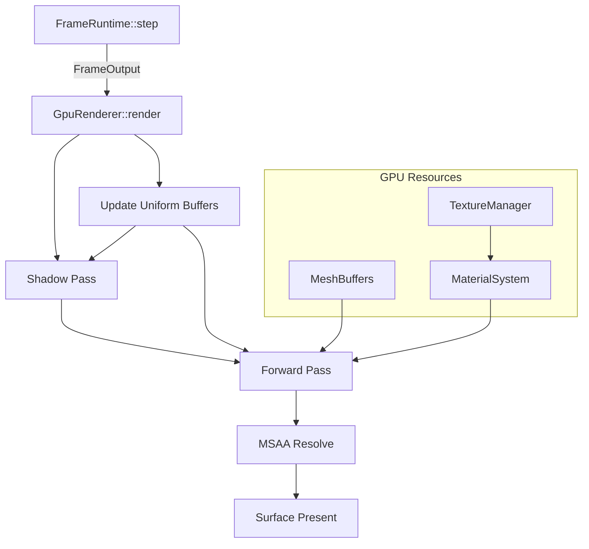

# wgpu Rendering Backend Design

## Background

The `aether-renderer` crate currently implements scheduling, LOD, foveation config, batch keys, and progressive mesh streaming -- but produces zero GPU output. All policy decisions (frame mode, cascade budgets, batch hints) feed into a `FrameRuntime::step()` that returns a `FrameOutput` with no actual draw calls.

## Why

To render anything on screen the engine needs a concrete GPU backend. wgpu is the cross-platform choice: it targets Vulkan, Metal, DX12, and WebGPU from a single Rust API, which aligns with the engine's multi-platform VR goals.

## What

Add a `gpu` submodule to `aether-renderer` that:

1. Initialises wgpu (Instance, Adapter, Device, Queue, Surface).
2. Compiles WGSL PBR shaders (vertex + fragment).
3. Creates render pipelines (forward pass with depth + MSAA 4x, shadow pass).
4. Manages GPU mesh buffers (vertex + index).
5. Manages textures (upload, bind groups).
6. Implements a PBR material system (metallic-roughness).
7. Implements single-directional-light cascaded shadow maps.
8. Submits draw calls with instanced batching.

## How

### Module structure

```
crates/aether-renderer/src/gpu/
  mod.rs        -- re-exports, GpuRenderer orchestrator
  context.rs    -- GpuContext: Instance, Adapter, Device, Queue, Surface
  pipeline.rs   -- render pipeline construction
  shader.rs     -- WGSL source constants and ShaderModules
  mesh.rs       -- MeshBuffers: vertex/index GPU buffers
  texture.rs    -- TextureManager: upload, bind group layout
  material.rs   -- PBR material bind groups
  pass.rs       -- render pass management (forward, depth, MSAA resolve)
  shadow.rs     -- cascaded shadow map pass
```

### Key types

```
GpuContext {
    instance: wgpu::Instance,
    adapter: wgpu::Adapter,
    device: wgpu::Device,
    queue: wgpu::Queue,
    surface: Option<wgpu::Surface>,      // None in headless / CI
    surface_config: Option<wgpu::SurfaceConfiguration>,
}
```

```
#[repr(C)]
#[derive(Copy, Clone, Pod, Zeroable)]
Vertex {
    position: [f32; 3],
    normal:   [f32; 3],
    uv:       [f32; 2],
}
```

### Vertex format

32 bytes per vertex: 3 floats position, 3 floats normal, 2 floats UV.

### PBR shader overview

Vertex shader:
- Transform vertex by model * view * projection matrices.
- Pass world-space normal and UV to fragment.

Fragment shader:
- Metallic-roughness PBR with a single directional light.
- Shadow map sampling (percentage-closer filtering on cascade).
- Albedo from texture or uniform color.

### Shadow mapping

- Single directional light with up to 4 cascades.
- Each cascade rendered to a depth-only texture.
- Shadow pass uses a separate simpler pipeline (vertex-only, no fragment output).
- Cascade splits derived from existing `ShadowCascadeConfig`.

### MSAA

- 4x MSAA on the forward pass.
- Resolve to the final surface texture.
- Depth buffer at matching MSAA sample count.

### Uniform buffer layout

Camera uniforms (bind group 0):
- view: mat4x4<f32>
- projection: mat4x4<f32>
- view_position: vec3<f32>

Model uniforms (bind group 1, per-instance via dynamic offset):
- model: mat4x4<f32>
- normal_matrix: mat4x4<f32>

Material uniforms (bind group 2):
- albedo: vec4<f32>
- metallic: f32
- roughness: f32
- emissive: vec3<f32>

Light + shadow uniforms (bind group 3):
- direction: vec3<f32>
- color: vec3<f32>
- cascade_matrices: array<mat4x4<f32>, 4>
- cascade_splits: vec4<f32>

### Graceful degradation

`GpuContext::new()` is async and may fail if no GPU adapter is available. The constructor returns `Result<GpuContext, GpuError>` so callers (including tests) can handle the headless case.

### Environment variables

| Variable | Default | Purpose |
|---|---|---|
| `AETHER_GPU_BACKEND` | `"auto"` | Force wgpu backend (vulkan/metal/dx12/gl) |
| `AETHER_MSAA_SAMPLES` | `4` | MSAA sample count |
| `AETHER_SHADOW_MAP_SIZE` | `2048` | Base shadow map resolution |
| `AETHER_MAX_TEXTURE_SIZE` | `4096` | Max texture dimension |

### Testing strategy

- All GPU-requiring tests are gated behind `#[cfg(feature = "gpu-tests")]` or marked `#[ignore]`.
- Unit tests that verify data layouts, shader source constants, vertex descriptors, and material defaults run without a GPU.
- Integration tests (pipeline creation, buffer upload, draw) require the `gpu-tests` feature.

### Dependencies

```toml
wgpu = "24"
bytemuck = { version = "1", features = ["derive"] }
```

## Workflow


