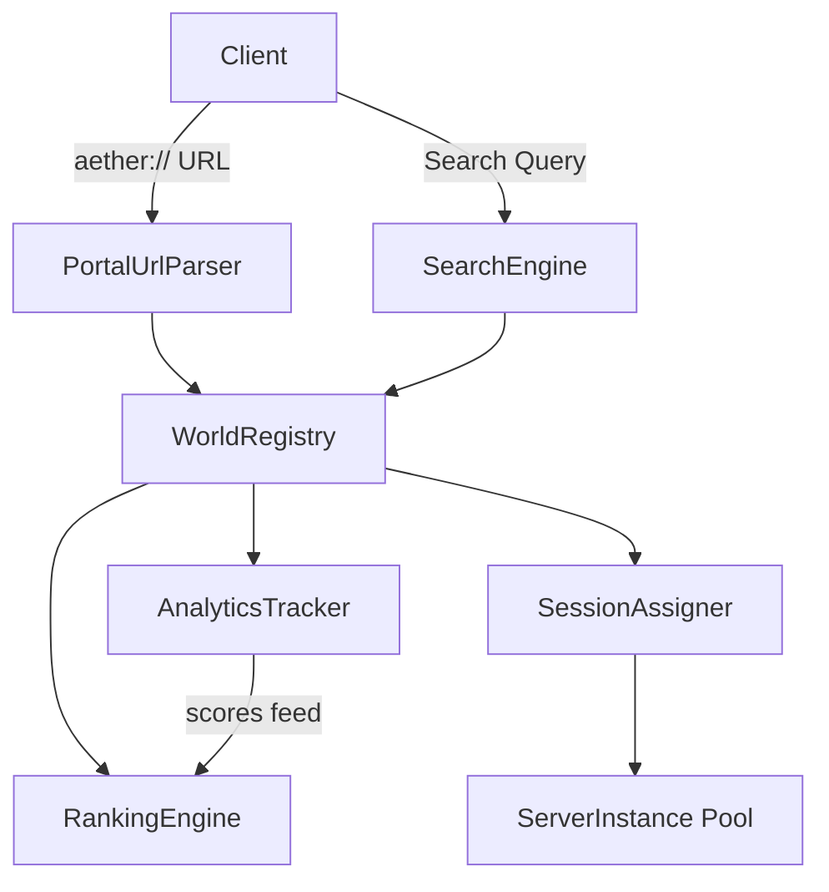

# World Registry & Discovery Design Document

**Task**: task-015
**Date**: 2026-03-08
**Status**: Implementation
**Depends on**: task-009 (Auth) - auth integrated as trait boundary

---

## Background

The `aether-registry` crate already has type shells for `WorldManifest`, `DiscoveryFilter`, `MatchCriteria`, `PortalRouting`, and `SessionManager` but lacks actual business logic for world lifecycle management, search, ranking, analytics, and full portal URL resolution.

## Why

- World creators need to register, update, and manage their worlds through a registry
- Players need to discover worlds via search, filtering, category browsing, and trending lists
- The platform needs a ranking algorithm to surface popular and trending worlds
- Session management must assign players to the least-loaded server instance
- Portal URLs (`aether://`) must resolve to concrete world instances with spawn points
- Analytics (visit counts, concurrent players, ratings) drive the ranking system

## What

Implement the complete world registry and discovery engine:

1. **WorldRegistry** - In-memory registry with CRUD for world entries
2. **SearchEngine** - Multi-criteria search with text, category, tag, player count, and rating filters
3. **RankingEngine** - Trending/featured scoring algorithm using visit velocity, rating, and recency
4. **SessionAssigner** - Enhanced session manager with capacity checks, cross-region failover
5. **PortalUrlParser** - Full `aether://` URL parsing with world ID, spawn point, instance hint
6. **AnalyticsTracker** - Visit tracking, concurrent player counts, rating aggregation

## How

### Architecture



### Module Design

#### 1. `registry.rs` - World Registry (CRUD)

Core storage and lifecycle management for world entries.

**Key types:**
- `WorldEntry` - Full world record with metadata, stats, timestamps
- `WorldCategory` - Enum: Social, Game, Education, Commerce, Art, Music, Other
- `RegistryError` - Error types for duplicate, not-found, validation failures
- `AuthContext` trait - Boundary for auth integration (creator ownership checks)

**Operations:**
- `register_world(entry) -> Result<Uuid>`
- `update_world(id, update) -> Result<()>`
- `get_world(id) -> Option<WorldEntry>`
- `delete_world(id) -> Result<()>`
- `list_by_creator(creator_id) -> Vec<WorldEntry>`

**Storage:** `HashMap<Uuid, WorldEntry>` (in-memory, backend-agnostic via trait)

#### 2. `search.rs` - Search & Filter Engine

Multi-criteria filtering with pagination.

**Key types:**
- `SearchQuery` - Text, category, tags, player range, rating threshold, sort, pagination
- `SortField` - Relevance, Rating, PlayerCount, Newest, Trending
- `SearchResult` - Paginated results with total count

**Algorithm:**
1. Filter by category (exact match)
2. Filter by tags (any-match)
3. Filter by player count range
4. Filter by minimum rating
5. Text search on name + description (case-insensitive substring)
6. Sort by selected field
7. Apply pagination (offset + limit)

#### 3. `ranking.rs` - Trending/Featured Ranking

Scoring algorithm for world discovery.

**Trending Score Formula:**
```
score = (visit_velocity * W_VELOCITY)
      + (rating * W_RATING)
      + (concurrent_ratio * W_CONCURRENT)
      + (recency_bonus * W_RECENCY)
      - (age_penalty)
```

**Constants (configurable):**
- `VELOCITY_WEIGHT = 0.4`
- `RATING_WEIGHT = 0.3`
- `CONCURRENT_WEIGHT = 0.2`
- `RECENCY_WEIGHT = 0.1`
- `TRENDING_WINDOW_HOURS = 24`
- `MAX_TRENDING_RESULTS = 50`

#### 4. `session.rs` - Session Assignment (enhanced)

Extends existing `SessionManager` with capacity-aware assignment.

**Enhancements:**
- Capacity check before assignment (reject if all instances full)
- Cross-region failover when preferred region has no capacity
- Instance health tracking via `SessionState`
- `assign_player(player_id, region_policy) -> MatchOutcome`

#### 5. `portal.rs` - Portal URL Resolution (enhanced)

Full `aether://` URL parsing.

**URL format:** `aether://<world_id>[/<spawn_point>][?instance=<hint>]`

**Key types:**
- `PortalUrl` - Parsed URL with world_id, spawn_point, instance_hint
- `PortalError` - Parse errors

#### 6. `analytics.rs` - World Analytics

Visit and engagement tracking.

**Key types:**
- `WorldAnalytics` - Per-world stats: visit_count, peak_concurrent, total_ratings, rating_sum
- `AnalyticsEvent` - Visit, Leave, Rate

**Operations:**
- `record_visit(world_id)`
- `record_leave(world_id)`
- `record_rating(world_id, score)`
- `get_analytics(world_id) -> WorldAnalytics`

### Data Model

```
WorldEntry {
    id: Uuid,
    name: String,
    description: String,
    creator_id: Uuid,
    tags: Vec<String>,
    category: WorldCategory,
    max_players: u32,
    current_players: u32,
    rating: f32,
    total_ratings: u32,
    visit_count: u64,
    featured: bool,
    status: WorldStatus,
    created_at: i64,   // Unix timestamp (no chrono dep needed)
    updated_at: i64,
}
```

### Test Design

All tests use in-memory `HashMap`-based stores. No external dependencies.

| Module | Test Cases |
|--------|-----------|
| registry | register, get, update, delete, duplicate name, not found, list by creator |
| search | by category, by tags, by player range, by rating, text search, multi-criteria, pagination, empty results |
| ranking | trending score calculation, score ordering, featured boost, recency decay |
| session | assign to least loaded, capacity full rejection, cross-region failover, no instances |
| portal | parse valid aether://, parse with spawn point, parse with instance hint, invalid scheme, malformed URL |
| analytics | record visit, record leave, record rating, average calculation, concurrent tracking |

### Constants

All tunable values defined as constants at file top:
- `DEFAULT_PAGE_SIZE: usize = 20`
- `MAX_PAGE_SIZE: usize = 100`
- `MAX_TAGS_PER_WORLD: usize = 20`
- `MAX_NAME_LENGTH: usize = 128`
- `MAX_DESCRIPTION_LENGTH: usize = 4096`
- `MIN_RATING: f32 = 0.0`
- `MAX_RATING: f32 = 5.0`

### Dependencies

Only stdlib + workspace-compatible crates:
- `uuid` (v1, features = ["v4"]) - World and creator IDs
- `serde` (v1, features = ["derive"]) - Serialization

No `chrono` needed - use `i64` Unix timestamps to keep dependencies minimal.
